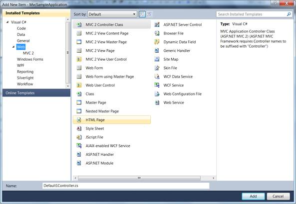
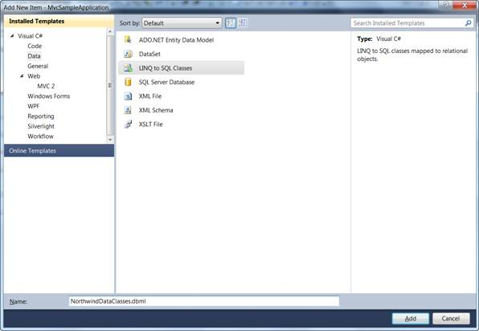
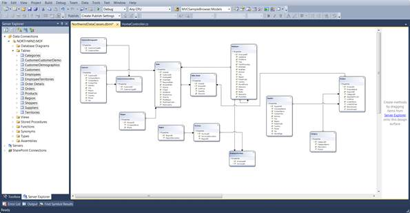

::: {style="DISPLAY: none"}
{#d2h_url_template}{#d2h_package_url style="WIDTH: 0px; DISPLAY: none; HEIGHT: 0px"}
:::

::::: {#nsbanner .d2h_main_nsbanner style="BORDER-BOTTOM: #999999 1px solid; POSITION: relative; PADDING-BOTTOM: 0px; BACKGROUND-COLOR: transparent; PADDING-LEFT: 0px; PADDING-RIGHT: 0px; DISPLAY: none; BORDER-TOP: #999999 1px solid; PADDING-TOP: 0px; LEFT: 0px"}
:::: {#TitleRow .d2h_main_titlerow style="PADDING-BOTTOM: 4px; BACKGROUND-COLOR: transparent; PADDING-LEFT: 22px; WIDTH: 100%; PADDING-RIGHT: 10px; DISPLAY: none; PADDING-TOP: 4px"}
::: {#ienav .d2h_main_ienav style="DISPLAY: none"}
{#D2HPrevious .D2HPreviousEnabled}  {#D2HNext .D2HNextEnabled}
:::
::::
:::::

::::: {#nstext .d2h_main_nstext style="PADDING-BOTTOM: 10px; BACKGROUND-COLOR: transparent; PADDING-LEFT: 22px; PADDING-RIGHT: 10px; HEIGHT: 100%; OVERFLOW: auto; PADDING-TOP: 5px" hasuserbackground="true" valign="bottom"}
::: {#d2h_breadcrumbs .d2h_breadcrumbs}
[Essential Studio User Guide Documentation](ms-xhelp:///?Id=12457748-09e3-4d74-a240-8e049cedf030){.d2h_breadcrumbsNormal}[ \> ]{.d2h_breadcrumbsLinkSeparator}[User Interface Edition](ms-xhelp:///?Id=c29296b7-531c-413b-a0ec-488ca1f7f669){.d2h_breadcrumbsNormal}[ \> ]{.d2h_breadcrumbsLinkSeparator}[Essential ASP.NET MVC](ms-xhelp:///?Id=4b14e7d1-65c4-4f67-b1aa-2c37709905a5){.d2h_breadcrumbsNormal}[ \> ]{.d2h_breadcrumbsLinkSeparator}[Essential Chart]{.d2h_breadcrumbsContentsOnly}[ \> ]{.d2h_breadcrumbsLinkSeparator}[Getting Started](ms-xhelp:///?Id=30fbb064-4c5c-425c-8c35-28b16d94c58d){.d2h_breadcrumbsNormal}
:::

## Adding a Model to the Application {#adding-a-model-to-the-application style="tab-stops: 0pt"}

After an MVC application is created, a model has to be added. A model is a place from where the data can be fetched by the controller (Refer to Understanding ASP.NET MVC). This section guides you with the step-by-step procedure on adding a model.[]{style="FONT-FAMILY: 'Calibri','sans-serif'"}

The steps to add a Model are as follows:

1.   On the **Solution Explorer**, right-click the **Models** folder. A **ContextMenu** is displayed.

[]{style="FONT-FAMILY: 'Times New Roman','serif'; FONT-SIZE: 12pt"} 

{border="0"}

Figure 35: Context Menu displayed on clicking the Models folder

2.   On the context menu, point to **Add**, and click **New Item**. The **Add New Item** (Application Name) dialog box is displayed. The **Categories** pane displays the components available under the Visual C# program. The **Templates** pane displays the templates under the selected elements.

[]{style="FONT-FAMILY: 'Times New Roman','serif'; FONT-SIZE: 12pt"}[]{style="FONT-FAMILY: 'Times New Roman','serif'; FONT-SIZE: 12pt"} 

{border="0"}

Figure 36: Add New Item dialog box

3.   Under Visual C#, click **Data**. The Visual Studio installed templates are displayed in the **Templates** pane.

[]{style="FONT-FAMILY: 'Times New Roman','serif'; FONT-SIZE: 12pt"} 

{border="0"}

Figure 37: Connecting a database to the application

::: {style="BORDER-BOTTOM: windowtext 1pt solid; BORDER-LEFT: medium none; PADDING-BOTTOM: 1pt; MARGIN-TOP: 9pt; PADDING-LEFT: 0pt; PADDING-RIGHT: 0pt; MARGIN-BOTTOM: 9pt; BORDER-TOP: windowtext 1pt solid; BORDER-RIGHT: medium none; PADDING-TOP: 1pt"}
{border="0"}Note: This step is optional and should be performed only when you want to attach a database with the model. For details, see:  [[http://weblogs.asp.net/scottgu/archive/2007/05/29/linq-to-sql-part-2-defining-our-data-model-classes.aspx]{.UGHyperlink}](http://weblogs.asp.net/scottgu/archive/2007/05/29/linq-to-sql-part-2-defining-our-data-model-classes.aspx).
:::

4.   In the **Name** box, enter **NorthwindDataClasses**.

5.   In the **Templates** pane, select **Linq to SQL Classes**.

6.   Click **Add**.

The data classes are added under the Model folder.

7.   In the **Name** box, enter **NorthwindDataClasses.dbml**, and click the **Add** button. Now northwind linq to sql classes are created in your application and the **Object Relational Designer** appears.****

 

8.   Drag and drop the **Tables** from the **Server Explorer** window onto the **Object Relational Designer**, to create LINQ to SQL classes that represent particular database tables. You need to add all the northwind database tables onto the **Object Relational Designer**.

 

The output is shown in the screenshot displayed below:

{border="0"}

Figure 38: NorthwindDataContext.dbml

**[]{style="FONT-FAMILY: 'Calibri','sans-serif'"}** 

[]{#related-topics}
:::::
