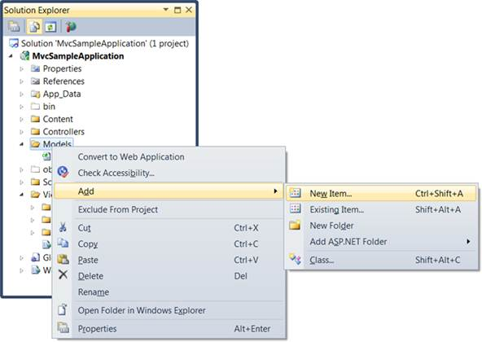
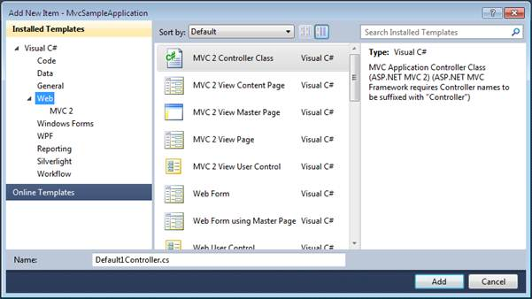
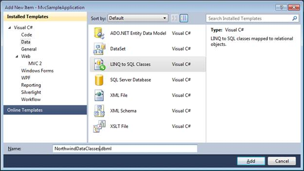
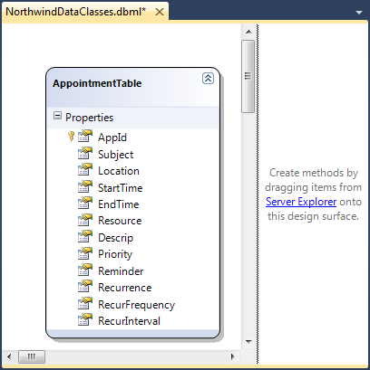

::: {style="DISPLAY: none"}
{#d2h_url_template}{#d2h_package_url style="WIDTH: 0px; DISPLAY: none; HEIGHT: 0px"}
:::

::::: {#nsbanner .d2h_main_nsbanner style="BORDER-BOTTOM: #999999 1px solid; POSITION: relative; PADDING-BOTTOM: 0px; BACKGROUND-COLOR: transparent; PADDING-LEFT: 0px; PADDING-RIGHT: 0px; DISPLAY: none; BORDER-TOP: #999999 1px solid; PADDING-TOP: 0px; LEFT: 0px"}
:::: {#TitleRow .d2h_main_titlerow style="PADDING-BOTTOM: 4px; BACKGROUND-COLOR: transparent; PADDING-LEFT: 22px; WIDTH: 100%; PADDING-RIGHT: 10px; DISPLAY: none; PADDING-TOP: 4px"}
::: {#ienav .d2h_main_ienav style="DISPLAY: none"}
{#D2HPrevious .D2HPreviousEnabled}  {#D2HNext .D2HNextEnabled}
:::
::::
:::::

::::::::: {#nstext .d2h_main_nstext style="PADDING-BOTTOM: 10px; BACKGROUND-COLOR: transparent; PADDING-LEFT: 22px; PADDING-RIGHT: 10px; HEIGHT: 100%; OVERFLOW: auto; PADDING-TOP: 5px" hasuserbackground="true" valign="bottom"}
::: {#d2h_breadcrumbs .d2h_breadcrumbs}
[Essential Studio User Guide Documentation](ms-xhelp:///?Id=12457748-09e3-4d74-a240-8e049cedf030){.d2h_breadcrumbsNormal}[ \> ]{.d2h_breadcrumbsLinkSeparator}[User Interface Edition](ms-xhelp:///?Id=c29296b7-531c-413b-a0ec-488ca1f7f669){.d2h_breadcrumbsNormal}[ \> ]{.d2h_breadcrumbsLinkSeparator}[Essential ASP.NET MVC](ms-xhelp:///?Id=4b14e7d1-65c4-4f67-b1aa-2c37709905a5){.d2h_breadcrumbsNormal}[ \> ]{.d2h_breadcrumbsLinkSeparator}[Essential Diagram]{.d2h_breadcrumbsContentsOnly}[ \> ]{.d2h_breadcrumbsLinkSeparator}[Getting Started](ms-xhelp:///?Id=06ba3073-04aa-4a41-a98d-d08c4c1b04fc){.d2h_breadcrumbsNormal}[ \> ]{.d2h_breadcrumbsLinkSeparator}[Examining the MVC Project](ms-xhelp:///?Id=5b4e5772-60df-40cb-bcfc-0585f45776a0){.d2h_breadcrumbsNormal}
:::

### Adding a Model to the Application {#adding-a-model-to-the-application style="tab-stops: 0pt"}

After an MVC application is created, a model has to be added. The model is a place from where the data can be fetched by the controller (Refer to Understanding ASP.NET MVC). This section guides you with the step-by-step procedure on adding a model.

[]{style="FONT-FAMILY: 'Calibri','sans-serif'"} 

1.   On the **Solution Explorer**, right-click the **Models** folder.

::: {style="BORDER-BOTTOM: windowtext 1pt solid; BORDER-LEFT: medium none; PADDING-BOTTOM: 1pt; MARGIN-TOP: 9pt; PADDING-LEFT: 0pt; PADDING-RIGHT: 0pt; MARGIN-BOTTOM: 9pt; BORDER-TOP: windowtext 1pt solid; BORDER-RIGHT: medium none; PADDING-TOP: 1pt"}
 {border="0"}Note: A context menu will be displayed.
:::

[]{style="FONT-FAMILY: 'Calibri','sans-serif'"} 

{border="0"}

Figure 11: Context Menu Displayed on Clicking the Models Folder

[]{style="FONT-FAMILY: 'Calibri','sans-serif'"} 

[]{style="FONT-FAMILY: 'Calibri','sans-serif'"} 

2.   On the context menu, point to **Add** and click **New Item**.

 

::: {style="BORDER-BOTTOM: windowtext 1pt solid; BORDER-LEFT: medium none; PADDING-BOTTOM: 1pt; MARGIN-TOP: 9pt; PADDING-LEFT: 0pt; PADDING-RIGHT: 0pt; MARGIN-BOTTOM: 9pt; BORDER-TOP: windowtext 1pt solid; BORDER-RIGHT: medium none; PADDING-TOP: 1pt"}
 {border="0"}Note: The Add New Item {Application Name} is displayed. The Categories window displays the components available under Visual C# program. The Templates window displays the templates under the selected elements.
:::

[]{style="FONT-FAMILY: 'Calibri','sans-serif'"} 

{border="0"}

Figure 12: Add New Item Dialog Box

[]{style="FONT-FAMILY: 'Calibri','sans-serif'"} 

[]{style="FONT-FAMILY: 'Calibri','sans-serif'"} 

3.   Click **Data** under Visual C#.

 

::: {style="BORDER-BOTTOM: windowtext 1pt solid; BORDER-LEFT: medium none; PADDING-BOTTOM: 1pt; MARGIN-TOP: 9pt; PADDING-LEFT: 0pt; PADDING-RIGHT: 0pt; MARGIN-BOTTOM: 9pt; BORDER-TOP: windowtext 1pt solid; BORDER-RIGHT: medium none; PADDING-TOP: 1pt"}
{border="0"}Note: The Visual Studio installed templates are displayed in the Templates window.
:::

[]{style="FONT-FAMILY: 'Calibri','sans-serif'"} 

{border="0"}

Figure 13: Connecting a Database to the Application

[]{style="FONT-FAMILY: 'Calibri','sans-serif'"} 

::: {style="BORDER-BOTTOM: windowtext 1pt solid; BORDER-LEFT: medium none; PADDING-BOTTOM: 1pt; MARGIN-TOP: 9pt; PADDING-LEFT: 0pt; PADDING-RIGHT: 0pt; MARGIN-BOTTOM: 9pt; BORDER-TOP: windowtext 1pt solid; BORDER-RIGHT: medium none; PADDING-TOP: 1pt"}
{border="0"}Note: This step is optional and should be performed only when you want to attach a database with the model. For details, see[[ http://weblogs.asp.net/scottgu/archive/2007/05/29/linq-to-sql-part-2-defining-our-data-model-classes.aspx]{style="COLOR: windowtext; TEXT-DECORATION: none; text-underline: none"}](http://weblogs.asp.net/scottgu/archive/2007/05/29/linq-to-sql-part-2-defining-our-data-model-classes.aspx).

 
:::

4.   In the **Name** box, enter **NorthwindDataClasses***.*

5.   Click **Linq to SQL Classes** under **Templates**.

6.   Finally, click **Add**.

[]{style="FONT-FAMILY: 'Calibri','sans-serif'"} 

::: {style="BORDER-BOTTOM: windowtext 1pt solid; BORDER-LEFT: medium none; PADDING-BOTTOM: 1pt; MARGIN-TOP: 9pt; PADDING-LEFT: 0pt; PADDING-RIGHT: 0pt; MARGIN-BOTTOM: 9pt; BORDER-TOP: windowtext 1pt solid; BORDER-RIGHT: medium none; PADDING-TOP: 1pt"}
{border="0"}Note: The data classes are added under the Model folder.

 
:::

7.   In the **Name** box, enter **NorthwindDataClasses.dbml** and click **Add**.

8.   Now Northwind LINQ to SQL classes are created in your application and the **Object Relational Designer** appears.

9.   Drag and drop the tables from the server explorer window onto the Object Relational Designer to create LINQ to SQL classes that represent particular database tables. All the Northwind database tables should be added to the **Object Relational Designer**.

[]{style="FONT-FAMILY: 'Calibri','sans-serif'"} 

When you\'re done, you should have something like this:

[]{style="FONT-FAMILY: 'Calibri','sans-serif'"} 

{border="0"}

Figure 14: NorthwindDataContext.dbml**[]{style="FONT-FAMILY: 'Calibri','sans-serif'"}**

[]{style="FONT-FAMILY: 'Calibri','sans-serif'"} 

[]{#related-topics}
:::::::::
