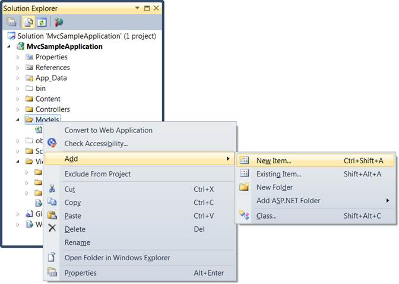
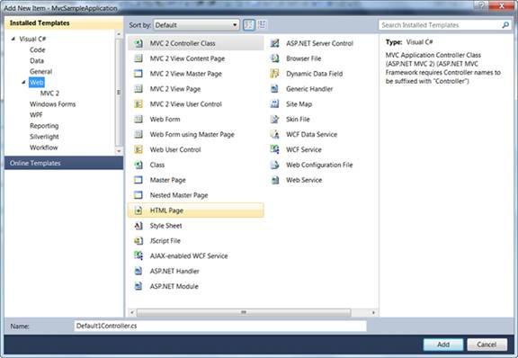
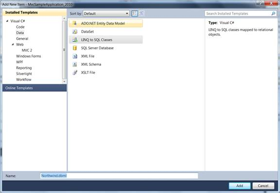
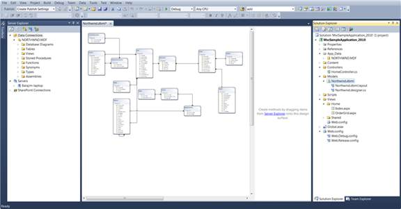

::: {style="DISPLAY: none"}
{#d2h_url_template}{#d2h_package_url style="WIDTH: 0px; DISPLAY: none; HEIGHT: 0px"}
:::

::::: {#nsbanner .d2h_main_nsbanner style="BORDER-BOTTOM: #999999 1px solid; POSITION: relative; PADDING-BOTTOM: 0px; BACKGROUND-COLOR: transparent; PADDING-LEFT: 0px; PADDING-RIGHT: 0px; DISPLAY: none; BORDER-TOP: #999999 1px solid; PADDING-TOP: 0px; LEFT: 0px"}
:::: {#TitleRow .d2h_main_titlerow style="PADDING-BOTTOM: 4px; BACKGROUND-COLOR: transparent; PADDING-LEFT: 22px; WIDTH: 100%; PADDING-RIGHT: 10px; DISPLAY: none; PADDING-TOP: 4px"}
::: {#ienav .d2h_main_ienav style="DISPLAY: none"}
{#D2HPrevious .D2HPreviousEnabled}  {#D2HNext .D2HNextEnabled}
:::
::::
:::::

::::::::: {#nstext .d2h_main_nstext style="PADDING-BOTTOM: 10px; BACKGROUND-COLOR: transparent; PADDING-LEFT: 22px; PADDING-RIGHT: 10px; HEIGHT: 100%; OVERFLOW: auto; PADDING-TOP: 5px" hasuserbackground="true" valign="bottom"}
::: {#d2h_breadcrumbs .d2h_breadcrumbs}
[Essential Studio User Guide Documentation](ms-xhelp:///?Id=12457748-09e3-4d74-a240-8e049cedf030){.d2h_breadcrumbsNormal}[ \> ]{.d2h_breadcrumbsLinkSeparator}[User Interface Edition](ms-xhelp:///?Id=c29296b7-531c-413b-a0ec-488ca1f7f669){.d2h_breadcrumbsNormal}[ \> ]{.d2h_breadcrumbsLinkSeparator}[Essential ASP.NET MVC](ms-xhelp:///?Id=4b14e7d1-65c4-4f67-b1aa-2c37709905a5){.d2h_breadcrumbsNormal}[ \> ]{.d2h_breadcrumbsLinkSeparator}[Essential Grid]{.d2h_breadcrumbsContentsOnly}[ \> ]{.d2h_breadcrumbsLinkSeparator}[Getting Started](ms-xhelp:///?Id=c7ed3902-b25b-4170-be58-1d3d0b57748a){.d2h_breadcrumbsNormal}
:::

## Adding a Model to the Application {#adding-a-model-to-the-application style="tab-stops: 0pt"}

 

After an MVC application is created, a model has to be added. The model is a place from where the data can be fetched by the controller (Refer to Understanding ASP.NET MVC). This section guides you through a step-by-step procedure for adding a model.

 

1.   In the **Solution Explorer**, right-click the **Models** folder.

::: {style="BORDER-BOTTOM: windowtext 1pt solid; BORDER-LEFT: medium none; PADDING-BOTTOM: 1pt; MARGIN-TOP: 9pt; PADDING-LEFT: 0pt; PADDING-RIGHT: 0pt; MARGIN-BOTTOM: 9pt; BORDER-TOP: windowtext 1pt solid; BORDER-RIGHT: medium none; PADDING-TOP: 1pt"}
 {border="0"}Note: A context menu will be displayed.
:::

[]{style="FONT-FAMILY: 'Times New Roman','serif'; FONT-SIZE: 12pt"} 

[]{style="FONT-FAMILY: 'Times New Roman','serif'; FONT-SIZE: 12pt"} 

{border="0"}

Figure 36: Context Menu Displayed on Clicking the Models Folder

 

2.   On the context menu, point to **Add** and click **New Item**.

::: {style="BORDER-BOTTOM: windowtext 1pt solid; BORDER-LEFT: medium none; PADDING-BOTTOM: 1pt; MARGIN-TOP: 9pt; PADDING-LEFT: 0pt; PADDING-RIGHT: 0pt; MARGIN-BOTTOM: 9pt; BORDER-TOP: windowtext 1pt solid; BORDER-RIGHT: medium none; PADDING-TOP: 1pt"}
 {border="0"}Note: The Add New Item {Application Name} is displayed. The Categories window displays the components available under Visual C# program. Templates window displays the templates under the selected elements.
:::

[]{style="FONT-FAMILY: 'Times New Roman','serif'; FONT-SIZE: 12pt"} 

[]{style="FONT-FAMILY: 'Times New Roman','serif'; FONT-SIZE: 12pt"} 

{border="0"}

Figure 37: Add New Item Dialog Box

3.   Click **Data** under **Visual C#**.

 

::: {style="BORDER-BOTTOM: windowtext 1pt solid; BORDER-LEFT: medium none; PADDING-BOTTOM: 1pt; MARGIN-TOP: 9pt; PADDING-LEFT: 0pt; PADDING-RIGHT: 0pt; MARGIN-BOTTOM: 9pt; BORDER-TOP: windowtext 1pt solid; BORDER-RIGHT: medium none; PADDING-TOP: 1pt"}
{border="0"}Note: The Visual Studio installed templates are displayed in the Templates window.
:::

[]{style="FONT-FAMILY: 'Times New Roman','serif'; FONT-SIZE: 12pt"} 

[]{style="FONT-FAMILY: 'Times New Roman','serif'; FONT-SIZE: 12pt"} 

{border="0"}

Figure 38: Connecting a Database to the Application

::: {style="BORDER-BOTTOM: windowtext 1pt solid; BORDER-LEFT: medium none; PADDING-BOTTOM: 1pt; MARGIN-TOP: 9pt; PADDING-LEFT: 0pt; PADDING-RIGHT: 0pt; MARGIN-BOTTOM: 9pt; BORDER-TOP: windowtext 1pt solid; BORDER-RIGHT: medium none; PADDING-TOP: 1pt"}
{border="0"}Note: This step is optional and should be performed only when you want to attach a database with the model. For details, see[[[ ]{style="TEXT-DECORATION: none; text-underline: none"}]{.UGHyperlink}[http://weblogs.asp.net/scottgu/archive/2007/05/29/linq-to-sql-part-2-defining-our-data-model-classes.aspx]{.UGHyperlink}](http://weblogs.asp.net/scottgu/archive/2007/05/29/linq-to-sql-part-2-defining-our-data-model-classes.aspx).

 
:::

4.   In the **Name** box, type **Northwind**.

5.   Click **LINQ to SQL Classes** under **Templates**.

6.   Click **Add**.

 

::: {style="BORDER-BOTTOM: windowtext 1pt solid; BORDER-LEFT: medium none; PADDING-BOTTOM: 1pt; MARGIN-TOP: 9pt; PADDING-LEFT: 0pt; PADDING-RIGHT: 0pt; MARGIN-BOTTOM: 9pt; BORDER-TOP: windowtext 1pt solid; BORDER-RIGHT: medium none; PADDING-TOP: 1pt"}
{border="0"}Note: The data classes are added under the Model folder.
:::

7.   In the **Name** box, enter **Northwind.dbml** and click the **Add** button.****

8.   Now Northwind LINQ to SQL classes are created in your application and the **Object Relational Designer** appears.

9.   Drag and drop the tables from the **Server Explorer** window onto the **Object Relational Designer** to create LINQ to SQL classes that represent particular database tables. You need to add all **Northwind** database tables onto the **Object Relational Designer**.

 

When you\'re done you will find the following screen.

 

{border="0"}

Figure 39: Northwind.dbml

[]{#related-topics}
:::::::::
