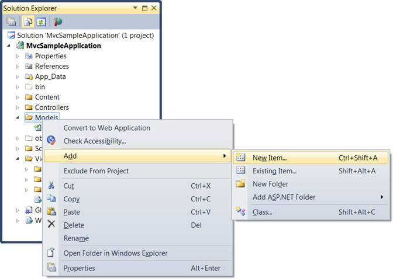
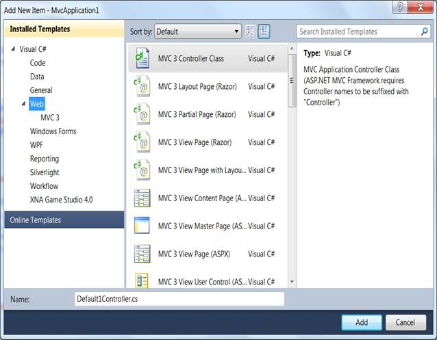
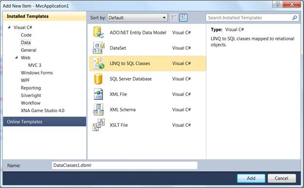
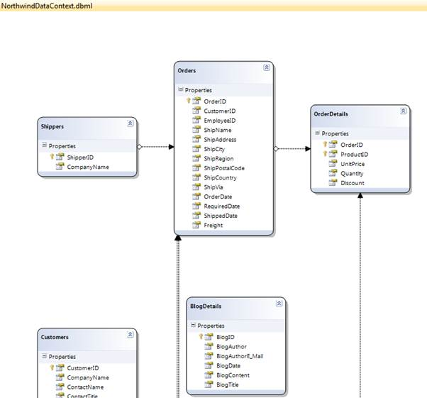

::: {style="DISPLAY: none"}
{#d2h_url_template}{#d2h_package_url style="WIDTH: 0px; DISPLAY: none; HEIGHT: 0px"}
:::

::::: {#nsbanner .d2h_main_nsbanner style="BORDER-BOTTOM: #999999 1px solid; POSITION: relative; PADDING-BOTTOM: 0px; BACKGROUND-COLOR: transparent; PADDING-LEFT: 0px; PADDING-RIGHT: 0px; DISPLAY: none; BORDER-TOP: #999999 1px solid; PADDING-TOP: 0px; LEFT: 0px"}
:::: {#TitleRow .d2h_main_titlerow style="PADDING-BOTTOM: 4px; BACKGROUND-COLOR: transparent; PADDING-LEFT: 22px; WIDTH: 100%; PADDING-RIGHT: 10px; DISPLAY: none; PADDING-TOP: 4px"}
::: {#ienav .d2h_main_ienav style="DISPLAY: none"}
{#D2HPrevious .D2HPreviousEnabled}  {#D2HNext .D2HNextEnabled}
:::
::::
:::::

:::: {#nstext .d2h_main_nstext style="PADDING-BOTTOM: 10px; BACKGROUND-COLOR: transparent; PADDING-LEFT: 22px; PADDING-RIGHT: 10px; HEIGHT: 100%; OVERFLOW: auto; PADDING-TOP: 5px" hasuserbackground="true" valign="bottom"}
::: {#d2h_breadcrumbs .d2h_breadcrumbs}
[Essential Studio User Guide Documentation](ms-xhelp:///?Id=12457748-09e3-4d74-a240-8e049cedf030){.d2h_breadcrumbsNormal}[ \> ]{.d2h_breadcrumbsLinkSeparator}[User Interface Edition](ms-xhelp:///?Id=c29296b7-531c-413b-a0ec-488ca1f7f669){.d2h_breadcrumbsNormal}[ \> ]{.d2h_breadcrumbsLinkSeparator}[Essential Mobile MVC](ms-xhelp:///?Id=74df42e3-5434-4590-9be6-3ae2f911cbbc){.d2h_breadcrumbsNormal}[ \> ]{.d2h_breadcrumbsLinkSeparator}[Essential Grid]{.d2h_breadcrumbsContentsOnly}[ \> ]{.d2h_breadcrumbsLinkSeparator}[Getting Started](ms-xhelp:///?Id=397f4d98-2e34-4dc5-8b77-1d56a317b150){.d2h_breadcrumbsNormal}
:::

## Adding a Model to the MVC3 ASPX Application {#adding-a-model-to-the-mvc3-aspx-application style="tab-stops: 0pt"}

[After an MVC application is created, a model has to be added. A model is a place from where the data can be fetched by the controller (Refer to Understanding ASP.NET MVC). This section guides you with the step-by-step procedure on adding a model.]{style="FONT-FAMILY: 'Arial','sans-serif'; FONT-SIZE: 10pt"}

1.  On the **Solution Explorer**, right-click the **Models** folder.

[ {border="0"} Note: A context menu will be displayed.]{style="FONT-FAMILY: 'Arial','sans-serif'; FONT-SIZE: 10pt"}

{border="0"}

Figure 12: Context Menu Displayed on Clicking the Models Folder

 

2.  On the **Context** menu, point to **Add** and click **New Item**.

 

{border="0"}[Note: The **Add New Item {Application Name}** is displayed. The **Categories** window displays the components available under Visual C# program. The **Templates** window displays the templates under the selected elements.]{style="FONT-FAMILY: 'Arial','sans-serif'; FONT-SIZE: 10pt"}

 

{border="0"}

Figure 13: Add New Item Dialog Box

 

3.  Click **Data** under **Visual C#***.*

 

[{border="0"}]{style="FONT-FAMILY: 'Arial','sans-serif'; FONT-SIZE: 10pt"}[Note: The Visual Studio installed templates are displayed in the **Templates** window.]{style="FONT-FAMILY: 'Arial','sans-serif'; FONT-SIZE: 10pt"}

 

 

{border="0"}

Figure 14: Connecting a Database to the Application

                                                                    

[{border="0"}]{style="FONT-FAMILY: 'Arial','sans-serif'; FONT-SIZE: 10pt"}[Note: This step is optional and should be performed only when you want to attach a database with the model. For details, see ]{style="FONT-FAMILY: 'Arial','sans-serif'; FONT-SIZE: 10pt"}[[[http://weblogs.asp.net/scottgu/archive/2007/05/29/linq-to-sql-part-2-defining-our-data-model-classes.aspx]{style="FONT-FAMILY: 'Arial','sans-serif'; FONT-SIZE: 10pt"}]{.ughyperlink}](http://weblogs.asp.net/scottgu/archive/2007/05/29/linq-to-sql-part-2-defining-our-data-model-classes.aspx)[[ .]{style="FONT-FAMILY: 'Arial','sans-serif'; FONT-SIZE: 10pt"}]{.ughyperlink}[]{style="FONT-FAMILY: 'Arial','sans-serif'; FONT-SIZE: 10pt"}

[4.   In the **Name** field, enter **NorthwindDataClasses***.*]{style="FONT-FAMILY: 'Arial','sans-serif'; FONT-SIZE: 10pt"}

[5.   Click **Linq to SQL Classes** under **Templates**.]{style="FONT-FAMILY: 'Arial','sans-serif'; FONT-SIZE: 10pt"}

[6.   Finally, click **Add**.]{style="FONT-FAMILY: 'Arial','sans-serif'; FONT-SIZE: 10pt"}

{border="0"}***[Note: The data classes are added under the Model folder.]{style="LAYOUT-GRID-MODE: line; FONT-SIZE: 9pt"}***

[7.   In the **Name** box, enter **NorthwindDataClasses.dbml** and click the **Add** button.]{style="FONT-FAMILY: 'Arial','sans-serif'; FONT-SIZE: 10pt"}

Now **Northwind LINQ to SQL** classes are created in your application and the **Object Relational Designer** appears.

[8.   Drag and drop the tables from the **Server Explorer** window onto the **Object Relational Designer** to create LINQ to SQL classes that represent particular database tables. We need to add all the Northwind database tables onto the **Object Relational Designer**.]{style="FONT-FAMILY: 'Arial','sans-serif'; FONT-SIZE: 10pt"}

When completed, you should have the following:

{border="0"}

Figure 15: NorthwindDataContext.dbml

[]{#related-topics}
::::
