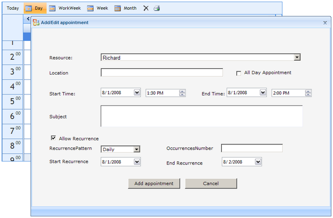
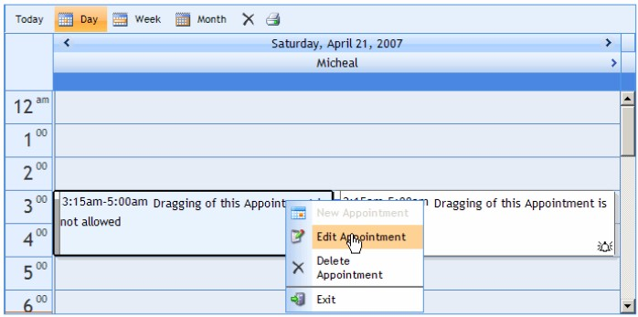
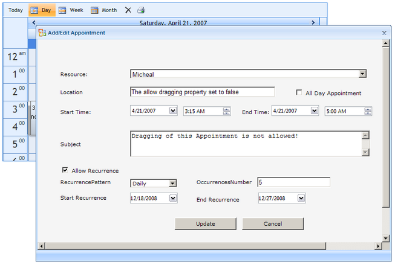
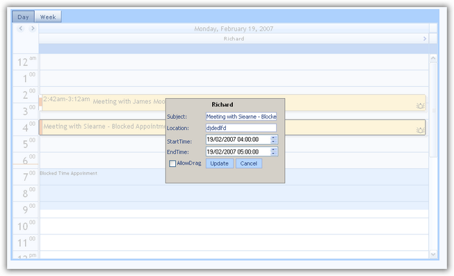

::: {style="DISPLAY: none"}
{#d2h_url_template}{#d2h_package_url style="WIDTH: 0px; DISPLAY: none; HEIGHT: 0px"}
:::

::::: {#nsbanner .d2h_main_nsbanner style="BORDER-BOTTOM: #999999 1px solid; POSITION: relative; PADDING-BOTTOM: 0px; BACKGROUND-COLOR: transparent; PADDING-LEFT: 0px; PADDING-RIGHT: 0px; DISPLAY: none; BORDER-TOP: #999999 1px solid; PADDING-TOP: 0px; LEFT: 0px"}
:::: {#TitleRow .d2h_main_titlerow style="PADDING-BOTTOM: 4px; BACKGROUND-COLOR: transparent; PADDING-LEFT: 22px; WIDTH: 100%; PADDING-RIGHT: 10px; DISPLAY: none; PADDING-TOP: 4px"}
::: {#ienav .d2h_main_ienav style="DISPLAY: none"}
{#D2HPrevious .D2HPreviousEnabled}  {#D2HNext .D2HNextEnabled}
:::
::::
:::::

::::: {#nstext .d2h_main_nstext style="PADDING-BOTTOM: 10px; BACKGROUND-COLOR: transparent; PADDING-LEFT: 22px; PADDING-RIGHT: 10px; HEIGHT: 100%; OVERFLOW: auto; PADDING-TOP: 5px" hasuserbackground="true" valign="bottom"}
::: {#d2h_breadcrumbs .d2h_breadcrumbs}
[Essential Studio User Guide Documentation](ms-xhelp:///?Id=12457748-09e3-4d74-a240-8e049cedf030){.d2h_breadcrumbsNormal}[ \> ]{.d2h_breadcrumbsLinkSeparator}[User Interface Edition](ms-xhelp:///?Id=c29296b7-531c-413b-a0ec-488ca1f7f669){.d2h_breadcrumbsNormal}[ \> ]{.d2h_breadcrumbsLinkSeparator}[Essential ASP.NET](ms-xhelp:///?Id=25c35330-c127-4dad-9a92-ed79dc7261a6){.d2h_breadcrumbsNormal}[ \> ]{.d2h_breadcrumbsLinkSeparator}[Essential Schedule]{.d2h_breadcrumbsContentsOnly}[ \> ]{.d2h_breadcrumbsLinkSeparator}[Concepts and Features](ms-xhelp:///?Id=64869483-f57f-4838-b322-b1a3d1ce8e40){.d2h_breadcrumbsNormal}[ \> ]{.d2h_breadcrumbsLinkSeparator}[Appointments](ms-xhelp:///?Id=8545e8cf-5b26-43a2-932f-f0087c9a1e0a){.d2h_breadcrumbsNormal}
:::

### Adding and Editing Appointments through Callbacks {#adding-and-editing-appointments-through-callbacks style="tab-stops: 0pt"}

[]{style="FONT-FAMILY: 'Trebuchet MS','sans-serif'; COLOR: #15428b; FONT-SIZE: 9pt"} 

This section discusses how appointments can be directly added and edited in the Schedule control through callbacks.

[]{style="FONT-FAMILY: 'Trebuchet MS','sans-serif'; COLOR: #15428b; FONT-SIZE: 9pt"} 

Adding Appointments

[]{style="FONT-FAMILY: 'Trebuchet MS','sans-serif'; COLOR: #15428b; FONT-SIZE: 9pt"} 

Appointments can be added through callbacks by double-clicking on the Schedule cells at run time. The **Add Appointment** dialog box that opens on double-clicking the Schedule cells, provides options to set the subject, start time and end time. Also, an appointment can be set as an \"allday\" appointment by checking the \'All Day\' check box provided. Now it is also possible to add recurring appointments through callbacks. The auto format of the Add pop-up window will be automatically changed based on the auto format of the Schedule control.

[]{style="FONT-FAMILY: 'Trebuchet MS','sans-serif'; COLOR: #15428b; FONT-SIZE: 9pt"} 

::: {align="center"}
+-----------------------------------+--------------------------------------------------------------------------------------------------------------------------------------+
|                                   |                                                                                                                                      |
|                                   |                                                                                                                                      |
| Schedule Property                 | Description                                                                                                                          |
+-----------------------------------+--------------------------------------------------------------------------------------------------------------------------------------+
| AllowAddingAppointByCallBack      | Gets or sets the value that indicates whether adding appointments through callbacks should be allowed. Default value is set to True. |
+-----------------------------------+--------------------------------------------------------------------------------------------------------------------------------------+
:::

[]{style="FONT-FAMILY: 'Trebuchet MS','sans-serif'; COLOR: #15428b; FONT-SIZE: 9pt"} 

+------------------------------------------------------------------------------------------------------------------------------------------------------------------------------------------------------------------------------------------------------------------------------------------------------------------------------------------------------------------------------------------------------------------------------------------------------------------------------------------------+
| **[\[ASPX\]]{style="FONT-FAMILY: 'Courier New'"}**                                                                                                                                                                                                                                                                                                                                                                                                                                             |
|                                                                                                                                                                                                                                                                                                                                                                                                                                                                                                |
| []{style="FONT-FAMILY: 'Courier New'"}                                                                                                                                                                                                                                                                                                                                                                                                                                                         |
|                                                                                                                                                                                                                                                                                                                                                                                                                                                                                                |
| [\<]{style="FONT-FAMILY: 'Courier New'; COLOR: blue"}[Syncfusion]{style="FONT-FAMILY: 'Courier New'; COLOR: #a31515"}[:]{style="FONT-FAMILY: 'Courier New'; COLOR: blue"}[schedule]{style="FONT-FAMILY: 'Courier New'; COLOR: #a31515"}[ [id]{style="COLOR: red"}[=\"Schedule1\"]{style="COLOR: blue"} [runat]{style="COLOR: red"}[=\"server\"]{style="COLOR: blue"} [AllowAddingAppointByCallBack]{style="COLOR: red"}[=\"True\"\>]{style="COLOR: blue"}]{style="FONT-FAMILY: 'Courier New'"} |
|                                                                                                                                                                                                                                                                                                                                                                                                                                                                                                |
| [\</]{style="FONT-FAMILY: 'Courier New'; COLOR: blue"}[Syncfusion]{style="FONT-FAMILY: 'Courier New'; COLOR: #a31515"}[:]{style="FONT-FAMILY: 'Courier New'; COLOR: blue"}[schedule]{style="FONT-FAMILY: 'Courier New'; COLOR: #a31515"}[\>]{style="FONT-FAMILY: 'Courier New'; COLOR: blue"}                                                                                                                                                                                                  |
+------------------------------------------------------------------------------------------------------------------------------------------------------------------------------------------------------------------------------------------------------------------------------------------------------------------------------------------------------------------------------------------------------------------------------------------------------------------------------------------------+

[]{style="FONT-FAMILY: 'Trebuchet MS','sans-serif'; COLOR: #15428b; FONT-SIZE: 9pt"} 

+-------------------------------------------------------------------------------------------------------------+
| **[\[C#\]]{style="FONT-FAMILY: 'Courier New'"}**                                                            |
|                                                                                                             |
| []{style="FONT-FAMILY: 'Courier New'"}                                                                      |
|                                                                                                             |
| [Schedule1.AllowAddingAppointByCallBack = [true]{style="COLOR: blue"};]{style="FONT-FAMILY: 'Courier New'"} |
+-------------------------------------------------------------------------------------------------------------+

[]{style="FONT-FAMILY: 'Trebuchet MS','sans-serif'; COLOR: #15428b; FONT-SIZE: 9pt"} 

+-----------------------------------------------------------------------------------------------------------------------------------------------------------------------+
| **[\[VB\]]{style="FONT-FAMILY: 'Courier New'"}**                                                                                                                      |
|                                                                                                                                                                       |
| []{style="FONT-FAMILY: 'Courier New'"}                                                                                                                                |
|                                                                                                                                                                       |
| [Private ]{style="FONT-FAMILY: 'Courier New'; COLOR: blue"}[Schedule1.AllowAddingAppointByCallBack = [True]{style="COLOR: blue"}]{style="FONT-FAMILY: 'Courier New'"} |
+-----------------------------------------------------------------------------------------------------------------------------------------------------------------------+

[]{style="FONT-FAMILY: 'Trebuchet MS','sans-serif'; COLOR: #15428b; FONT-SIZE: 9pt"} 

{border="0"}[]{style="FONT-SIZE: 12pt"}

Figure 63[]{style="FONT-SIZE: 12pt"}

Editing Appointments

[]{style="FONT-FAMILY: 'Trebuchet MS','sans-serif'; COLOR: #4a5c8c; FONT-SIZE: 9pt"} 

Schedule control provides two ways to edit an appointment.

[]{style="FONT-FAMILY: 'Trebuchet MS','sans-serif'; COLOR: #15428b; FONT-SIZE: 9pt"} 

[·      ]{style="FONT-FAMILY: Symbol"}Using Context Menu

[·      ]{style="FONT-FAMILY: Symbol"}Using AppointmentClicked Event

[]{style="FONT-FAMILY: 'Trebuchet MS','sans-serif'; COLOR: #15428b; FONT-SIZE: 9pt"} 

**[]{style="FONT-FAMILY: 'Trebuchet MS','sans-serif'; COLOR: #15428b; FONT-SIZE: 9pt"}** 

Using Context Menu

[]{style="FONT-FAMILY: 'Trebuchet MS','sans-serif'; COLOR: #15428b; FONT-SIZE: 9pt"} 

Essential Schedule provides support for editing an appointment on clicking the **Edit Appointment** menu item in the context menu. The Edit Appointment pop-up window contains all the details of the appointment. After making changes to an appointment, click the **Update** button in the pop-up window to reflect the changes made to the appointment. The auto format of the Edit Appointment pop-up window will be automatically changed based on the auto format of the Schedule control. To show the context menu on the Schedule control, you must set the **ShowContextMenu** property to **True**.

[]{style="FONT-FAMILY: 'Trebuchet MS','sans-serif'; COLOR: #15428b; FONT-SIZE: 9pt"} 

{border="0"}[]{style="FONT-SIZE: 12pt"}

Figure 64[]{style="FONT-SIZE: 12pt"}

[]{style="FONT-FAMILY: 'Trebuchet MS','sans-serif'; COLOR: #15428b; FONT-SIZE: 9pt"} 

Select **Edit Appointment** from the context menu in order to open the Edit Appointment pop-up window. The Edit Appointment pop-up window will be displayed as shown below.

[]{style="FONT-FAMILY: 'Trebuchet MS','sans-serif'; COLOR: #15428b; FONT-SIZE: 9pt"} 

{border="0"}[]{style="FONT-SIZE: 12pt"}

[]{style="FONT-FAMILY: 'Trebuchet MS','sans-serif'; COLOR: #15428b; FONT-SIZE: 9pt"} 

Figure 65[]{style="FONT-FAMILY: 'Trebuchet MS','sans-serif'; COLOR: #15428b"}

Using AppointmentClicked Event

[]{style="FONT-FAMILY: 'Trebuchet MS','sans-serif'; FONT-SIZE: 9pt"} 

On clicking an appointment, the AppointmentClicked event is handled on the server-side, which allows to edit the appointment. The arguments of the AppointmentClicked event return all the details of the appointment to the server-side. Here you can override the values as per your needs. To know more about the AppointmentClicked event, see [AppointmentClicked Event]{.UGHyperlink}.

[]{style="FONT-FAMILY: 'Trebuchet MS','sans-serif'; COLOR: #15428b; FONT-SIZE: 9pt"} 

+--------------------------------------------------------------------------------------------------------------------------------------------------------------------------------------------------------------------+
| **[\[C#\]]{style="FONT-FAMILY: 'Courier New'"}**                                                                                                                                                                   |
|                                                                                                                                                                                                                    |
| []{style="FONT-FAMILY: 'Courier New'"}                                                                                                                                                                             |
|                                                                                                                                                                                                                    |
| [protected]{style="FONT-FAMILY: 'Courier New'; COLOR: blue"}[ [void]{style="COLOR: blue"} Page_Load([object]{style="COLOR: blue"} sender, [EventArgs]{style="COLOR: teal"} e)]{style="FONT-FAMILY: 'Courier New'"} |
|                                                                                                                                                                                                                    |
| [{]{style="FONT-FAMILY: 'Courier New'"}                                                                                                                                                                            |
|                                                                                                                                                                                                                    |
| [Schedule1.AppointmentClicked += [new]{style="COLOR: blue"} Schedule.AppointmentClickedEventHandler(Schedule1_AppointmentClicked);]{style="FONT-FAMILY: 'Courier New'"}                                            |
|                                                                                                                                                                                                                    |
| [}]{style="FONT-FAMILY: 'Courier New'"}                                                                                                                                                                            |
|                                                                                                                                                                                                                    |
| []{style="FONT-FAMILY: 'Courier New'"}                                                                                                                                                                             |
|                                                                                                                                                                                                                    |
| [void]{style="FONT-FAMILY: 'Courier New'; COLOR: blue"}[ Schedule1_AppointmentClicked([object]{style="COLOR: blue"} sender, AppointmentEventArgs e)]{style="FONT-FAMILY: 'Courier New'"}                           |
|                                                                                                                                                                                                                    |
| [{]{style="FONT-FAMILY: 'Courier New'"}                                                                                                                                                                            |
|                                                                                                                                                                                                                    |
| [e.Appointment.Subject = [\"This is Edited Appointment\"]{style="COLOR: maroon"};]{style="FONT-FAMILY: 'Courier New'"}                                                                                             |
|                                                                                                                                                                                                                    |
| [e.Appointment.LocationValue = [\"Enter the text\"]{style="COLOR: maroon"};]{style="FONT-FAMILY: 'Courier New'"}                                                                                                   |
|                                                                                                                                                                                                                    |
| [e.Appointment.StartTime = [DateTime]{style="COLOR: teal"}.Now;]{style="FONT-FAMILY: 'Courier New'"}                                                                                                               |
|                                                                                                                                                                                                                    |
| [e.Appointment.EndTime = [DateTime]{style="COLOR: teal"}.Now.AddHours(2);]{style="FONT-FAMILY: 'Courier New'"}                                                                                                     |
|                                                                                                                                                                                                                    |
| [e.Appointment.AllDay = [true]{style="COLOR: blue"};]{style="FONT-FAMILY: 'Courier New'"}                                                                                                                          |
|                                                                                                                                                                                                                    |
| [}]{style="FONT-FAMILY: 'Courier New'"}                                                                                                                                                                            |
+--------------------------------------------------------------------------------------------------------------------------------------------------------------------------------------------------------------------+

[]{style="FONT-FAMILY: 'Trebuchet MS','sans-serif'; COLOR: #15428b; FONT-SIZE: 9pt"} 

+-----------------------------------------------------------------------------------------------------------------------------------------------------------------------------------------------------------------------------------------------------------------------------------------------------------------------------------------+
| **[\[VB\]]{style="FONT-FAMILY: 'Courier New'"}**                                                                                                                                                                                                                                                                                        |
|                                                                                                                                                                                                                                                                                                                                         |
| []{style="FONT-FAMILY: 'Courier New'"}                                                                                                                                                                                                                                                                                                  |
|                                                                                                                                                                                                                                                                                                                                         |
| [Protected]{style="FONT-FAMILY: 'Courier New'; COLOR: blue"}[ [Sub]{style="COLOR: blue"} Scheduler1_AppointmentClicked([ByVal]{style="COLOR: blue"} sender [As]{style="COLOR: blue"} [Object]{style="COLOR: blue"}, [ByVal]{style="COLOR: blue"} e [As]{style="COLOR: blue"} AppointmentEventArgs)]{style="FONT-FAMILY: 'Courier New'"} |
|                                                                                                                                                                                                                                                                                                                                         |
| [e.Appointment.Subject = [\"This is Edited Appointment\"]{style="COLOR: maroon"}]{style="FONT-FAMILY: 'Courier New'"}                                                                                                                                                                                                                   |
|                                                                                                                                                                                                                                                                                                                                         |
| [e.Appointment.LocationValue = [\"Enter the text\"]{style="COLOR: maroon"}]{style="FONT-FAMILY: 'Courier New'"}                                                                                                                                                                                                                         |
|                                                                                                                                                                                                                                                                                                                                         |
| [e.Appointment.StartTime = DateTime.Now]{style="FONT-FAMILY: 'Courier New'"}                                                                                                                                                                                                                                                            |
|                                                                                                                                                                                                                                                                                                                                         |
| [e.Appointment.EndTime = DateTime.Now.AddHours(2)]{style="FONT-FAMILY: 'Courier New'"}                                                                                                                                                                                                                                                  |
|                                                                                                                                                                                                                                                                                                                                         |
| [e.Appointment.AllDay = [True]{style="COLOR: blue"}]{style="FONT-FAMILY: 'Courier New'"}                                                                                                                                                                                                                                                |
|                                                                                                                                                                                                                                                                                                                                         |
| [End]{style="FONT-FAMILY: 'Courier New'; COLOR: blue"}[ [Sub]{style="COLOR: blue"}]{style="FONT-FAMILY: 'Courier New'"}                                                                                                                                                                                                                 |
+-----------------------------------------------------------------------------------------------------------------------------------------------------------------------------------------------------------------------------------------------------------------------------------------------------------------------------------------+

[]{style="FONT-FAMILY: 'Trebuchet MS','sans-serif'; COLOR: #15428b; FONT-SIZE: 9pt"} 

{border="0"}[]{style="FONT-SIZE: 12pt"}

**[]{style="FONT-FAMILY: 'Trebuchet MS','sans-serif'; COLOR: #15428b; FONT-SIZE: 9pt"}** 

Figure 66: Editing an Appointment using the AppointmentClicked Event

[]{style="FONT-FAMILY: 'Trebuchet MS','sans-serif'; COLOR: #15428b; FONT-SIZE: 9pt"} 

A sample which demonstrates the Editing feature is available in the below sample installation path.

[]{style="FONT-FAMILY: 'Trebuchet MS','sans-serif'; COLOR: #15428b; FONT-SIZE: 9pt"} 

\<Install Location\>\\Syncfusion\\EssentialStudio\\\<Version Number\>\\Web\\Schedule.Web\\Samples\\2.0\\Scheduler-Localization\\Localization

[]{style="FONT-FAMILY: 'Trebuchet MS','sans-serif'; COLOR: #15428b; FONT-SIZE: 9pt"} 

See Also

[]{style="FONT-FAMILY: 'Trebuchet MS','sans-serif'; COLOR: #15428b; FONT-SIZE: 9pt"} 

Edit or Delete Appointment

[]{#p47}[]{style="FONT-SIZE: 12pt"} 

[]{#related-topics}
:::::
