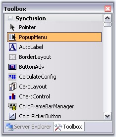
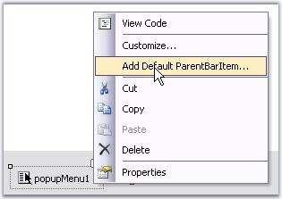
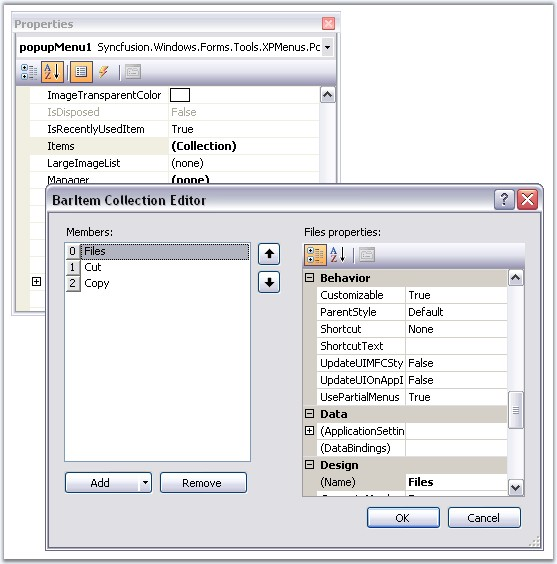
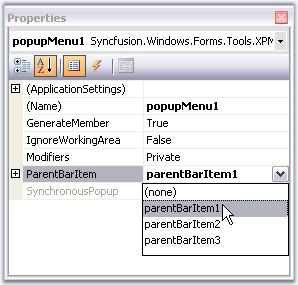
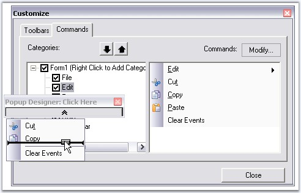

::: {style="DISPLAY: none"}
{#d2h_url_template}{#d2h_package_url style="WIDTH: 0px; DISPLAY: none; HEIGHT: 0px"}
:::

::::: {.d2h_secondary_topic style="PADDING-BOTTOM: 10pt; MARGIN: 0pt; PADDING-LEFT: 0pt; PADDING-RIGHT: 0pt; PADDING-TOP: 0pt"}
##### Adding and Filling a PopupMenu {#adding-and-filling-a-popupmenu style="tab-stops: 0pt"}

[]{style="COLOR: #15428b"} 

Adding a PopupMenu

[]{style="COLOR: #15428b"} 

Drag and drop a PopupMenu from the toolbox onto the designer form.

[]{style="COLOR: #15428b"} 

{border="0"}

[]{style="COLOR: #15428b"} 

Figure 811: PopupMenu in the Toolbar

[]{style="COLOR: #15428b"} 

Filling the Popup Menu

[]{style="COLOR: #15428b"} 

In the Absence of a BarManager

**[]{style="COLOR: #15428b"}** 

A **PopupMenu** needs to be associated with a ParentBarItem in order to fill it with menu items. Right click the PopupMenu and select \"Add Default ParentBarItem\" if there is no ParentBarItem added for the Menus before.

[]{style="COLOR: #15428b"} 

{border="0"}

***[]{style="COLOR: #15428b"}*** 

Figure 812: Add Default ParentBarItem Design-Time Verb

[]{style="COLOR: #15428b"} 

In the absence of a BarManager, use the **PopupMenu.ParentBarItem.Items** property\'s collection editor to add items to the popup menu.

[]{style="COLOR: #15428b"} 

{border="0"}

***[]{style="COLOR: #15428b"}*** 

Figure 813: BarItem Collection Editor

[]{style="COLOR: #15428b"} 

::: {style="BORDER-BOTTOM: windowtext 1pt solid; BORDER-LEFT: medium none; PADDING-BOTTOM: 1pt; MARGIN-TOP: 9pt; PADDING-LEFT: 0pt; PADDING-RIGHT: 0pt; MARGIN-BOTTOM: 9pt; BORDER-TOP: windowtext 1pt solid; BORDER-RIGHT: medium none; PADDING-TOP: 1pt"}
{border="0"} Note: With such a custom ParentBarItem associated with the popup menu, you cannot add items using drag-and-drop from the BarManager.
:::

[]{style="COLOR: #15428b"} 

In the Presence of the BarManager

[]{style="COLOR: #15428b"} 

You can also reuse the ParentBarItem that you have already created for your menu structure using BarManager to fill the Popup menu. To do so, set the **ParentBarItem** property of the Popup menu to one of the available ParentBarItems.

[]{style="COLOR: #15428b"} 

{border="0"}

[]{style="COLOR: #15428b"} 

Figure 814: Reusing ParentBarItem added through BarManager

**[]{style="COLOR: #15428b"}** 

In the presence of a BarManager, the user can just drag BarItems into the popup menu. Right-click on the popupMenu1 and select **Customize** to invoke this dialog and drag the required menu items.

[]{style="COLOR: #15428b"} 

{border="0"}

**[]{style="COLOR: #15428b"}** 

Figure 815: Customize Dialog Box

[]{style="COLOR: #15428b"} 

::: {style="BORDER-BOTTOM: windowtext 1pt solid; BORDER-LEFT: medium none; PADDING-BOTTOM: 1pt; MARGIN-TOP: 9pt; PADDING-LEFT: 0pt; PADDING-RIGHT: 0pt; MARGIN-BOTTOM: 9pt; BORDER-TOP: windowtext 1pt solid; BORDER-RIGHT: medium none; PADDING-TOP: 1pt"}
{border="0"} Note: You can also display the popup menu programmatically by calling PopupMenu.Show method. See [How to programmatically show a Popup Menu]{.UGHyperlink}
:::

[]{style="COLOR: #15428b"} 

See also

**[]{style="COLOR: #15428b"}** 

[[·      ]{style="FONT-FAMILY: Symbol; TEXT-DECORATION: none; text-underline: none"}]{.UGHyperlink}[Associating Popup Menu To a Control]{.UGHyperlink}[,]{.UGHyperlink}

[·      ]{style="FONT-FAMILY: Symbol; COLOR: #15428b"}[Grouping Items in a Popup Menu]{.UGHyperlink}[,]{style="COLOR: #15428b"}[]{style="COLOR: #15428b"}

[[·      ]{style="FONT-FAMILY: Symbol; TEXT-DECORATION: none; text-underline: none"}]{.UGHyperlink}[How to programmatically show a Popup Menu]{.UGHyperlink}[]{.UGHyperlink}

 

 

[]{#related-topics}
:::::
