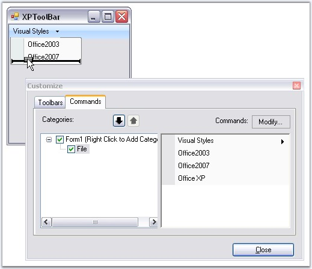
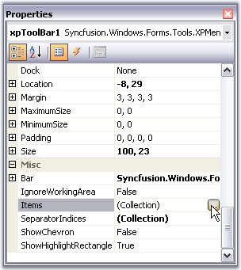
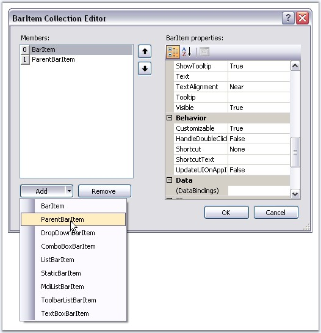
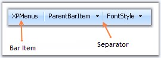

::: {style="DISPLAY: none"}
{#d2h_url_template}{#d2h_package_url style="WIDTH: 0px; DISPLAY: none; HEIGHT: 0px"}
:::

:::::: {.d2h_secondary_topic style="PADDING-BOTTOM: 10pt; MARGIN: 0pt; PADDING-LEFT: 0pt; PADDING-RIGHT: 0pt; PADDING-TOP: 0pt"}
##### Adding and Filling the XPToolbar {#adding-and-filling-the-xptoolbar style="tab-stops: 0pt"}

[]{style="COLOR: #15428b"} 

Adding XPToolBar to XPMenus

[]{style="COLOR: #15428b"} 

Drag and drop an XPToolbar control onto the form.

[]{style="COLOR: #15428b"} 

Supported BarItem types

[]{style="COLOR: #15428b"} 

The various types of BarItems supported by XPToolBar are:

[]{style="COLOR: #15428b"} 

[·      ]{style="FONT-FAMILY: Symbol"}BarItem

[·      ]{style="FONT-FAMILY: Symbol"}ParentBarItem

[·      ]{style="FONT-FAMILY: Symbol"}DropDownBarItem

[·      ]{style="FONT-FAMILY: Symbol"}ComboBoxBarItem

[·      ]{style="FONT-FAMILY: Symbol"}StaticBarItem

[·      ]{style="FONT-FAMILY: Symbol"}TextBoxBarItem

[·      ]{style="FONT-FAMILY: Symbol"}ListBarItem

[·      ]{style="FONT-FAMILY: Symbol"}MDIListBarItem

[·      ]{style="FONT-FAMILY: Symbol"}ToolbarListBarItem

[]{style="COLOR: #15428b"} 

Filling the XP Toolbar with Items from the BarManager

**[]{style="COLOR: #15428b"}** 

You can drag-and-drop items from the **Customize dialog** of the BarManager into the XP Toolbar, in the same way you filled the menus and toolbars.

[]{style="COLOR: #15428b"} 

{border="0"}

[]{style="COLOR: #15428b"} 

Figure 806: Filling XP Toolbar

 

In the presence of a BarManager, you can also add separators to the items by right-clicking on the items and selecting the **Begin A Group** option similar to Menus. See [Grouping Bar Items]{.UGHyperlink}.

[]{style="COLOR: #15428b"} 

Filling the XP ToolBar through the BarItems Collection Editor

[]{style="COLOR: #15428b"} 

During design-time, in the absence of BarManager, the XP Toolbar can be filled through the **BarItems collection editor,** which is invoked using **Items** property. In the collection editor, you can add any of the available BarItem types to the XP Toolbar\'s list. A customized text can be provided for the BarItems using **Text** property.

[]{style="COLOR: #15428b"} 

::: {align="center"}
  -------------------- ----------------------------------
  XPToolBar Property   Description
  Items                Indicates bar items collections.
  -------------------- ----------------------------------
:::

[]{style="COLOR: #15428b"} 

{border="0"}

[]{style="COLOR: #15428b"} 

Figure 807: Accessing BarItems Collection Editor through Items Property

**[]{style="COLOR: #15428b"}** 

{border="0"}

[]{style="COLOR: #15428b"} 

Figure 808: Adding bar items through BarItem Collection Editor

**[]{style="COLOR: #15428b"}** 

::: {style="BORDER-BOTTOM: windowtext 1pt solid; BORDER-LEFT: medium none; PADDING-BOTTOM: 1pt; MARGIN-TOP: 9pt; PADDING-LEFT: 0pt; PADDING-RIGHT: 0pt; MARGIN-BOTTOM: 9pt; BORDER-TOP: windowtext 1pt solid; BORDER-RIGHT: medium none; PADDING-TOP: 1pt"}
{border="0"} Note: This control is not normally used to create toolbars in the XP Menus. This is meant to be used within the form as a stand-alone control.
:::

[]{style="COLOR: #15428b"} 

+-------------------------------------------------------------------------------------------------------------------------------------------------------------------------------------------------------------------------+
| **[\[C#\]]{style="FONT-FAMILY: 'Courier New'; COLOR: black"}**                                                                                                                                                          |
|                                                                                                                                                                                                                         |
| **[]{style="FONT-FAMILY: 'Courier New'; COLOR: black"}**                                                                                                                                                                |
|                                                                                                                                                                                                                         |
| [this]{style="FONT-FAMILY: 'Courier New'; COLOR: blue"}[.barItem10.Text = [\"XPMenus\"]{style="COLOR: maroon"};]{style="FONT-FAMILY: 'Courier New'"}                                                                    |
|                                                                                                                                                                                                                         |
| [this]{style="FONT-FAMILY: 'Courier New'; COLOR: blue"}[.parentBarItem2.Text = [\"ParentBarItem\"]{style="COLOR: maroon"};  ]{style="FONT-FAMILY: 'Courier New'"}[                ]{style="FONT-FAMILY: 'Courier New'"} |
+-------------------------------------------------------------------------------------------------------------------------------------------------------------------------------------------------------------------------+

[]{style="COLOR: #15428b"} 

+--------------------------------------------------------------------------------------------------------------------------------------------------------------+
| **[\[VB.NET\]]{style="FONT-FAMILY: 'Courier New'; COLOR: black"}**                                                                                           |
|                                                                                                                                                              |
| **[]{style="FONT-FAMILY: 'Courier New'; COLOR: black"}**                                                                                                     |
|                                                                                                                                                              |
| [Me]{style="FONT-FAMILY: 'Courier New'; COLOR: blue"}[.barItem10.Text = [\"XPMenus\"]{style="COLOR: maroon"}]{style="FONT-FAMILY: 'Courier New'"}            |
|                                                                                                                                                              |
| [Me]{style="FONT-FAMILY: 'Courier New'; COLOR: blue"}[.parentBarItem2.Text = [\"ParentBarItem\"]{style="COLOR: maroon"}]{style="FONT-FAMILY: 'Courier New'"} |
+--------------------------------------------------------------------------------------------------------------------------------------------------------------+

[]{style="COLOR: #15428b"} 

Adding Separators

[]{style="COLOR: #15428b"} 

In the absence of a BarManager, you can add separators to the items by editing the **XPToolBar.SeparatorIndices** property list.

[]{style="COLOR: #15428b"} 

::: {align="center"}
  -------------------- -------------------------------------------------------------------------------------------
  XPToolBar Property   Description
  SeparatorIndices     Specifies the Indices values after which the separator have to be placed in an XPToolbar.
  -------------------- -------------------------------------------------------------------------------------------
:::

[]{style="COLOR: #15428b"} 

+--------------------------------------------------------------------------------------------------------------------------------------------------------------------------------------------------------------+
| **[\[C#\]]{style="FONT-FAMILY: 'Courier New'; COLOR: black"}**                                                                                                                                               |
|                                                                                                                                                                                                              |
| **[]{style="FONT-FAMILY: 'Courier New'; COLOR: black"}**                                                                                                                                                     |
|                                                                                                                                                                                                              |
| [this]{style="FONT-FAMILY: 'Courier New'; COLOR: blue"}[.xpToolBar1.SeparatorIndices.AddRange([new]{style="COLOR: blue"} [int]{style="COLOR: blue"}\[\] {1, 2});       ]{style="FONT-FAMILY: 'Courier New'"} |
+--------------------------------------------------------------------------------------------------------------------------------------------------------------------------------------------------------------+

[]{style="COLOR: #15428b"} 

+-------------------------------------------------------------------------------------------------------------------------------------------------------------------------------------------------------+
| **[\[VB.NET\]]{style="FONT-FAMILY: 'Courier New'; COLOR: black"}**                                                                                                                                    |
|                                                                                                                                                                                                       |
| **[]{style="FONT-FAMILY: 'Courier New'; COLOR: black"}**                                                                                                                                              |
|                                                                                                                                                                                                       |
| [Me]{style="FONT-FAMILY: 'Courier New'; COLOR: blue"}[.xpToolBar1.SeparatorIndices.AddRange([New]{style="COLOR: blue"} [Integer]{style="COLOR: blue"}() {1, 2}) ]{style="FONT-FAMILY: 'Courier New'"} |
+-------------------------------------------------------------------------------------------------------------------------------------------------------------------------------------------------------+

**[]{style="COLOR: #15428b"}** 

{border="0"}

***[]{style="COLOR: #15428b"}*** 

Figure 809: Separators added to the XPToolBar

[]{style="COLOR: #15428b"} 

The XPToolbars sample in the following installation path, shows how an XP toolbar can be used in an application.

 

..My Documents\\Syncfusion\\EssentialStudio\\***Version Number***\\Windows\\Tools.Windows\\Samples\\2.0\\Menus Package\\XPToolBars

[]{style="COLOR: #15428b"} 

See Also

[]{style="COLOR: #15428b"} 

[XPToolbar Properties]{.UGHyperlink}[]{.UGHyperlink}

[]{#related-topics}
::::::
