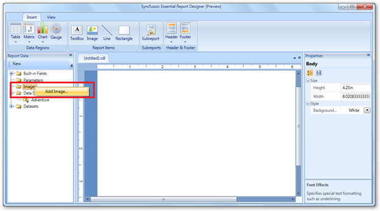
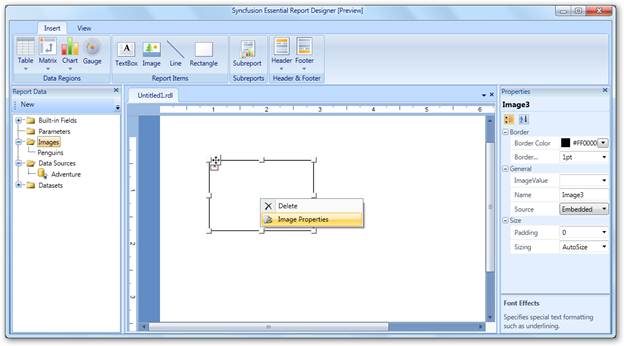
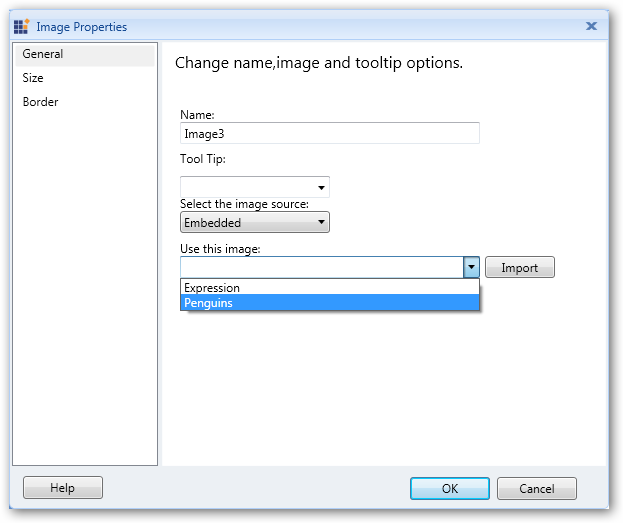
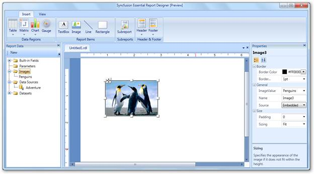
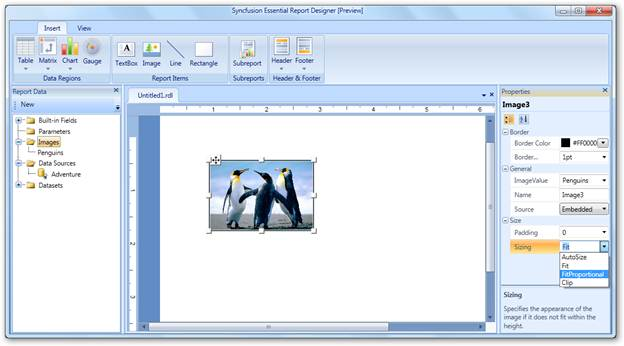
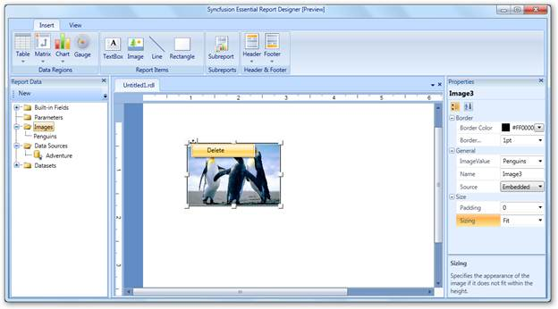

::: {style="DISPLAY: none"}
{#d2h_url_template}{#d2h_package_url style="WIDTH: 0px; DISPLAY: none; HEIGHT: 0px"}
:::

::::: {#nsbanner .d2h_main_nsbanner style="BORDER-BOTTOM: #999999 1px solid; POSITION: relative; PADDING-BOTTOM: 0px; BACKGROUND-COLOR: transparent; PADDING-LEFT: 0px; PADDING-RIGHT: 0px; DISPLAY: none; BORDER-TOP: #999999 1px solid; PADDING-TOP: 0px; LEFT: 0px"}
:::: {#TitleRow .d2h_main_titlerow style="PADDING-BOTTOM: 4px; BACKGROUND-COLOR: transparent; PADDING-LEFT: 22px; WIDTH: 100%; PADDING-RIGHT: 10px; DISPLAY: none; PADDING-TOP: 4px"}
::: {#ienav .d2h_main_ienav style="DISPLAY: none"}
{#D2HPrevious .D2HPreviousEnabled}  {#D2HNext .D2HNextEnabled}
:::
::::
:::::

::::::: {#nstext .d2h_main_nstext style="PADDING-BOTTOM: 10px; BACKGROUND-COLOR: transparent; PADDING-LEFT: 22px; PADDING-RIGHT: 10px; HEIGHT: 100%; OVERFLOW: auto; PADDING-TOP: 5px" hasuserbackground="true" valign="bottom"}
## Adding an Image to Report Designer {#adding-an-image-to-report-designer style="tab-stops: 0pt"}

You can add an image to the Syncfusion Essential Report Designer using the following steps.

 

1.   In **Report Data**, right-click on I**mages,** and then click **Add image**.

 

{border="0"}[]{style="FONT-FAMILY: 'Calibri','sans-serif'"}

Figure 36: Adding Image

[]{style="FONT-FAMILY: 'Calibri','sans-serif'"} 

::: {style="BORDER-BOTTOM: windowtext 1pt solid; BORDER-LEFT: medium none; PADDING-BOTTOM: 1pt; MARGIN-TOP: 9pt; PADDING-LEFT: 0pt; PADDING-RIGHT: 0pt; MARGIN-BOTTOM: 9pt; BORDER-TOP: windowtext 1pt solid; BORDER-RIGHT: medium none; PADDING-TOP: 1pt"}
{border="0"}Note: You can also insert an image by dragging the image from Report Data to Report Designer.

                         
:::

2.   To change properties of the added image, right-click on the image and select **Image Properties**.

::: {style="BORDER-BOTTOM: windowtext 1pt solid; BORDER-LEFT: medium none; PADDING-BOTTOM: 1pt; MARGIN-TOP: 9pt; PADDING-LEFT: 0pt; PADDING-RIGHT: 0pt; MARGIN-BOTTOM: 9pt; BORDER-TOP: windowtext 1pt solid; BORDER-RIGHT: medium none; PADDING-TOP: 1pt"}
 
:::

{border="0"}

Figure 37: Report Designer with Image

[]{style="FONT-FAMILY: 'Calibri','sans-serif'"} 

3.   In the **Image Properties** dialog, select an image you want to add in the Report Designer from the **Use this image** drop-down combo box, and then click **Import**.

 

{border="0"}

Figure 38: Image Properties Dialog

 

::: {style="BORDER-BOTTOM: windowtext 1pt solid; BORDER-LEFT: medium none; PADDING-BOTTOM: 1pt; MARGIN-TOP: 9pt; PADDING-LEFT: 0pt; PADDING-RIGHT: 0pt; MARGIN-BOTTOM: 9pt; BORDER-TOP: windowtext 1pt solid; BORDER-RIGHT: medium none; PADDING-TOP: 1pt"}
{border="0"}Note: You can also use the following properties to apply desired settings to the image:
:::

[·      ]{style="FONT-FAMILY: Symbol"}**General---**To set the ToolTip of the image or image source, select an embedded image, and import an image from the local disk.

[·      ]{style="FONT-FAMILY: Symbol"}**Size---**To set the size and padding of the image.

[·      ]{style="FONT-FAMILY: Symbol"}**Border---**To set the border color and border width of the image.

 

4.   Click **OK** to update the image with the selected values.

::: {style="BORDER-BOTTOM: windowtext 1pt solid; BORDER-LEFT: medium none; PADDING-BOTTOM: 1pt; MARGIN-TOP: 9pt; PADDING-LEFT: 0pt; PADDING-RIGHT: 0pt; MARGIN-BOTTOM: 9pt; BORDER-TOP: windowtext 1pt solid; BORDER-RIGHT: medium none; PADDING-TOP: 1pt"}
 
:::

[{border="0"}]{style="FONT-FAMILY: 'Calibri','sans-serif'"}

Figure 39: Adding an Image to Report Designer

 

Setting Image Properties Using Properties Grid

 

1.   Click on the image. The **Properties** grid will appear at the right of Report Designer.

2.   Apply the required settings to the image by using the **Editors** in the **Properties** grid.

 

{border="0"}

Figure 40: Setting Properties through the Properties Grid

 

Deleting Image

To delete the image from the Report Designer, right-click on the image and click **Delete**.

 

{border="0"}

Figure 41: Deleting Image[]{style="FONT-FAMILY: 'Calibri','sans-serif'"}

[]{#related-topics}
:::::::
