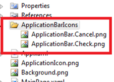
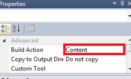
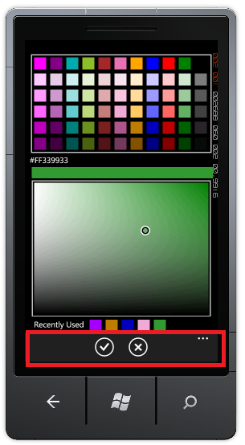

::: {style="DISPLAY: none"}
{#d2h_url_template}{#d2h_package_url style="WIDTH: 0px; DISPLAY: none; HEIGHT: 0px"}
:::

:::: {.d2h_secondary_topic style="PADDING-BOTTOM: 10pt; MARGIN: 0pt; PADDING-LEFT: 0pt; PADDING-RIGHT: 0pt; PADDING-TOP: 0pt"}
#### Adding Application Bar Icons to Color Picker page {#adding-application-bar-icons-to-color-picker-page style="tab-stops: 0pt"}

 

You can add the ApplicationBar to the TimeSpan Picker page. This consists of accept and cancel buttons.

 

The following are the steps to add the application bar icons to the time span picker page:

 

::: {style="BORDER-BOTTOM: windowtext 1pt solid; BORDER-LEFT: medium none; PADDING-BOTTOM: 1pt; MARGIN: 9pt 0pt 9pt 25.2pt; PADDING-LEFT: 0pt; PADDING-RIGHT: 0pt; BORDER-TOP: windowtext 1pt solid; BORDER-RIGHT: medium none; PADDING-TOP: 1pt"}
 
:::

1.   Create a folder with the name **ApplicationBarIcons** in the root directory of the Application.

2.   Add the application bar icons with the following naming convention:

 

[·      ]{style="FONT-FAMILY: Symbol"}**ApplicationBar.Cancel.png**

[·      ]{style="FONT-FAMILY: Symbol"}**ApplicationBar.Check.png**

 

 

{border="0"}

Figure 73: Adding ApplicaitonBarIcons

 

3.   Change the build type of the added icons to **Content**.

 

{border="0"}

Figure 74: Build Type to \"Content\"

 

4.   Application Bar Icon will be added to the ColorPicker control page.

 

 

{border="0"}

Figure 75: Application Bar Icons

 

 

 

[]{#related-topics}
::::
