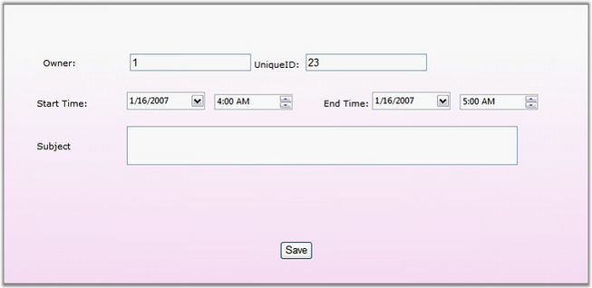

::: {style="DISPLAY: none"}
{#d2h_url_template}{#d2h_package_url style="WIDTH: 0px; DISPLAY: none; HEIGHT: 0px"}
:::

::::: {#nsbanner .d2h_main_nsbanner style="BORDER-BOTTOM: #999999 1px solid; POSITION: relative; PADDING-BOTTOM: 0px; BACKGROUND-COLOR: transparent; PADDING-LEFT: 0px; PADDING-RIGHT: 0px; DISPLAY: none; BORDER-TOP: #999999 1px solid; PADDING-TOP: 0px; LEFT: 0px"}
:::: {#TitleRow .d2h_main_titlerow style="PADDING-BOTTOM: 4px; BACKGROUND-COLOR: transparent; PADDING-LEFT: 22px; WIDTH: 100%; PADDING-RIGHT: 10px; DISPLAY: none; PADDING-TOP: 4px"}
::: {#ienav .d2h_main_ienav style="DISPLAY: none"}
{#D2HPrevious .D2HPreviousEnabled}  {#D2HNext .D2HNextEnabled}
:::
::::
:::::

:::: {#nstext .d2h_main_nstext style="PADDING-BOTTOM: 10px; BACKGROUND-COLOR: transparent; PADDING-LEFT: 22px; PADDING-RIGHT: 10px; HEIGHT: 100%; OVERFLOW: auto; PADDING-TOP: 5px" hasuserbackground="true" valign="bottom"}
::: {#d2h_breadcrumbs .d2h_breadcrumbs}
[Essential Studio User Guide Documentation](ms-xhelp:///?Id=12457748-09e3-4d74-a240-8e049cedf030){.d2h_breadcrumbsNormal}[ \> ]{.d2h_breadcrumbsLinkSeparator}[User Interface Edition](ms-xhelp:///?Id=c29296b7-531c-413b-a0ec-488ca1f7f669){.d2h_breadcrumbsNormal}[ \> ]{.d2h_breadcrumbsLinkSeparator}[Essential ASP.NET](ms-xhelp:///?Id=25c35330-c127-4dad-9a92-ed79dc7261a6){.d2h_breadcrumbsNormal}[ \> ]{.d2h_breadcrumbsLinkSeparator}[Essential Schedule]{.d2h_breadcrumbsContentsOnly}[ \> ]{.d2h_breadcrumbsLinkSeparator}[Concepts and Features](ms-xhelp:///?Id=64869483-f57f-4838-b322-b1a3d1ce8e40){.d2h_breadcrumbsNormal}[ \> ]{.d2h_breadcrumbsLinkSeparator}[Appointments](ms-xhelp:///?Id=8545e8cf-5b26-43a2-932f-f0087c9a1e0a){.d2h_breadcrumbsNormal}
:::

### Adding Appointment through Custom Form {#adding-appointment-through-custom-form style="tab-stops: 0pt"}

[]{style="FONT-FAMILY: 'Trebuchet MS','sans-serif'; COLOR: #15428b; FONT-SIZE: 9pt"} 

The **Add Appointment Window** dialog box can be customized with the required form for adding an appointment to the Schedule control. The Syncfusion Window control or any aspx page can be used to add an appointment. The **CustomizeAddNewAppointment** property adds an appointment to the Schedule control by using a customized form, and also raises a server-side event "AppointmentAdding", when set to *true*.

 

The following code snippet illustrates the customization of appointment forms:

[]{style="FONT-FAMILY: 'Trebuchet MS','sans-serif'; COLOR: #15428b; FONT-SIZE: 9pt"} 

+-------------------------------------------------------------------------------------------------------------------------------------------------------------------------------------------------------------------------------------------------------------------------------------------------------------------------------------------------------------------------------------------------------------------------+
| **[\[ASPX\]]{style="FONT-FAMILY: 'Courier New'"}**                                                                                                                                                                                                                                                                                                                                                                      |
|                                                                                                                                                                                                                                                                                                                                                                                                                         |
| []{style="FONT-FAMILY: 'Courier New'"}                                                                                                                                                                                                                                                                                                                                                                                  |
|                                                                                                                                                                                                                                                                                                                                                                                                                         |
| [\<]{style="FONT-FAMILY: 'Courier New'; COLOR: blue"}[ScheduleMenu]{style="FONT-FAMILY: 'Courier New'; COLOR: #a31515"}[ [CustomizeAddNewAppointment]{style="COLOR: red"}[=\"true\"]{style="COLOR: blue"} [ShowAddNewAppointmentMenuItem]{style="COLOR: red"}[=\"true\"]{style="COLOR: blue"} [ShowEditAppointmentMenuItem]{style="COLOR: red"}[=\"false\"\>]{style="COLOR: blue"}]{style="FONT-FAMILY: 'Courier New'"} |
+-------------------------------------------------------------------------------------------------------------------------------------------------------------------------------------------------------------------------------------------------------------------------------------------------------------------------------------------------------------------------------------------------------------------------+

[]{style="FONT-FAMILY: 'Trebuchet MS','sans-serif'; COLOR: #15428b; FONT-SIZE: 9pt"} 

+--------------------------------------------------------------------------------------------------------------------------------------------------------------------------------+
| **[\[C#\]]{style="FONT-FAMILY: 'Courier New'"}**                                                                                                                               |
|                                                                                                                                                                                |
| []{style="FONT-FAMILY: 'Courier New'"}                                                                                                                                         |
|                                                                                                                                                                                |
| [this]{style="FONT-FAMILY: 'Courier New'; COLOR: blue"}[.Schedule1.ScheduleMenu.CustomizeAddNewAppointment = [true]{style="COLOR: blue"};]{style="FONT-FAMILY: 'Courier New'"} |
+--------------------------------------------------------------------------------------------------------------------------------------------------------------------------------+

[]{style="FONT-FAMILY: 'Trebuchet MS','sans-serif'; COLOR: #15428b; FONT-SIZE: 9pt"} 

+------------------------------------------------------------------------------------------------------------------------------------------------------+
| **[\[VB\]]{style="FONT-FAMILY: 'Courier New'"}**                                                                                                     |
|                                                                                                                                                      |
| []{style="FONT-FAMILY: 'Courier New'"}                                                                                                               |
|                                                                                                                                                      |
| [Me]{style="FONT-FAMILY: 'Courier New'; COLOR: blue"}[.Schedule1.ScheduleMenu.CustomizeAddNewAppointment = True]{style="FONT-FAMILY: 'Courier New'"} |
+------------------------------------------------------------------------------------------------------------------------------------------------------+

[]{style="FONT-FAMILY: 'Trebuchet MS','sans-serif'; COLOR: #15428b; FONT-SIZE: 9pt"} 

The following is the resultant output:

[]{style="FONT-FAMILY: 'Trebuchet MS','sans-serif'; COLOR: #15428b; FONT-SIZE: 9pt"} 

{border="0"}[]{style="FONT-SIZE: 12pt"}

***[]{style="FONT-FAMILY: 'Trebuchet MS','sans-serif'; COLOR: #15428b; FONT-SIZE: 9pt"}*** 

Figure 68: Custom Form to add an Appointment to the Edit Control

 

[]{#related-topics}
::::
