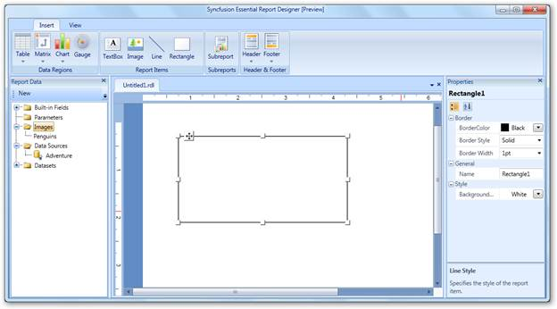
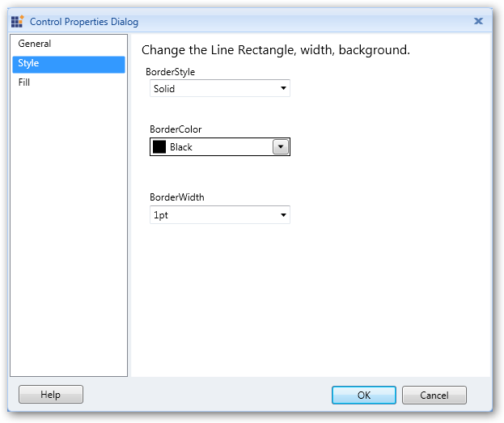
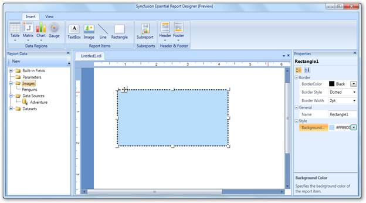
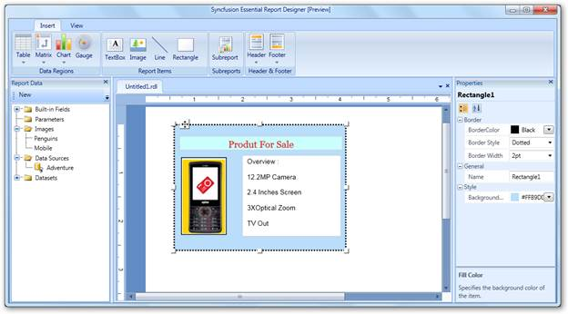

::: {style="DISPLAY: none"}
{#d2h_url_template}{#d2h_package_url style="WIDTH: 0px; DISPLAY: none; HEIGHT: 0px"}
:::

::::: {#nsbanner .d2h_main_nsbanner style="BORDER-BOTTOM: #999999 1px solid; POSITION: relative; PADDING-BOTTOM: 0px; BACKGROUND-COLOR: transparent; PADDING-LEFT: 0px; PADDING-RIGHT: 0px; DISPLAY: none; BORDER-TOP: #999999 1px solid; PADDING-TOP: 0px; LEFT: 0px"}
:::: {#TitleRow .d2h_main_titlerow style="PADDING-BOTTOM: 4px; BACKGROUND-COLOR: transparent; PADDING-LEFT: 22px; WIDTH: 100%; PADDING-RIGHT: 10px; DISPLAY: none; PADDING-TOP: 4px"}
::: {#ienav .d2h_main_ienav style="DISPLAY: none"}
{#D2HPrevious .D2HPreviousEnabled}  {#D2HNext .D2HNextEnabled}
:::
::::
:::::

:::: {#nstext .d2h_main_nstext style="PADDING-BOTTOM: 10px; BACKGROUND-COLOR: transparent; PADDING-LEFT: 22px; PADDING-RIGHT: 10px; HEIGHT: 100%; OVERFLOW: auto; PADDING-TOP: 5px" hasuserbackground="true" valign="bottom"}
## Adding a Rectangle to Report Designer {#adding-a-rectangle-to-report-designer style="tab-stops: 0pt"}

To add a rectangle to the Syncfusion Report Designer, select **Rectangle** from **Insert** tab and drag it to the Report Designer. A rectangle will appear on the Report Designer.

 

{border="0"}

Figure 48: Adding a Rectangle

 

Applying Styles to the Rectangle

To apply styles to the rectangle:

1.   Right-click on the added rectangle and click **Rectangle Properties**. It will display the **Control Properties Dialog**.

{border="0"}

Figure 49: Control Properties Dialog for Rectangle

 

2.   Select **Style** to set the style, color and width of the rectangle border.

3.   To set the background color of the rectangle, select **Fill**.

4.   Click **OK**.

 

::: {style="BORDER-BOTTOM: windowtext 1pt solid; BORDER-LEFT: medium none; PADDING-BOTTOM: 1pt; MARGIN-TOP: 9pt; PADDING-LEFT: 0pt; PADDING-RIGHT: 0pt; MARGIN-BOTTOM: 9pt; BORDER-TOP: windowtext 1pt solid; BORDER-RIGHT: medium none; PADDING-TOP: 1pt"}
{border="0"}You can also apply styles to the rectangle through the Properties grid. To open this grid, click on the added rectangle.

 
:::

The following illustration shows the rectangle styled by the properties grid.

 

{border="0"}

Figure 50: Rectangle Styled through the Properties Grid

 

Adding Report Items to the Rectangle

To add report items such as text boxes, lines, and images, to the rectangle, drag the selected report items to the rectangle.

 

{border="0"}

Figure 51: Adding Items inside the Rectangle

 

[]{#related-topics}
::::
