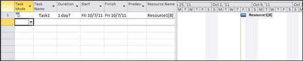

::: {style="DISPLAY: none"}
{#d2h_url_template}{#d2h_package_url style="WIDTH: 0px; DISPLAY: none; HEIGHT: 0px"}
:::

::::: {#nsbanner .d2h_main_nsbanner style="BORDER-BOTTOM: #999999 1px solid; POSITION: relative; PADDING-BOTTOM: 0px; BACKGROUND-COLOR: transparent; PADDING-LEFT: 0px; PADDING-RIGHT: 0px; DISPLAY: none; BORDER-TOP: #999999 1px solid; PADDING-TOP: 0px; LEFT: 0px"}
:::: {#TitleRow .d2h_main_titlerow style="PADDING-BOTTOM: 4px; BACKGROUND-COLOR: transparent; PADDING-LEFT: 22px; WIDTH: 100%; PADDING-RIGHT: 10px; DISPLAY: none; PADDING-TOP: 4px"}
::: {#ienav .d2h_main_ienav style="DISPLAY: none"}
{#D2HPrevious .D2HPreviousEnabled}  {#D2HNext .D2HNextEnabled}
:::
::::
:::::

:::: {#nstext .d2h_main_nstext style="PADDING-BOTTOM: 10px; BACKGROUND-COLOR: transparent; PADDING-LEFT: 22px; PADDING-RIGHT: 10px; HEIGHT: 100%; OVERFLOW: auto; PADDING-TOP: 5px" hasuserbackground="true" valign="bottom"}
::: {#d2h_breadcrumbs .d2h_breadcrumbs}
[Essential Studio User Guide Documentation](ms-xhelp:///?Id=12457748-09e3-4d74-a240-8e049cedf030){.d2h_breadcrumbsNormal}[ \> ]{.d2h_breadcrumbsLinkSeparator}[Reporting Edition](ms-xhelp:///?Id=027aa5b6-6676-4f93-ad23-c20e8c45792e){.d2h_breadcrumbsNormal}[ \> ]{.d2h_breadcrumbsLinkSeparator}[Essential ProjIO](ms-xhelp:///?Id=b95f675f-3e97-4b4b-93b9-e4daba965feb){.d2h_breadcrumbsNormal}[ \> ]{.d2h_breadcrumbsLinkSeparator}[Concepts and Features](ms-xhelp:///?Id=00cd1b25-14ca-4e2b-a23d-b4c6df7344ee){.d2h_breadcrumbsNormal}[ \> ]{.d2h_breadcrumbsLinkSeparator}[Assignment](ms-xhelp:///?Id=abf4f399-707d-482e-960b-d90954500879){.d2h_breadcrumbsNormal}
:::

### Adding Assignments to a Project {#adding-assignments-to-a-project style="tab-stops: 0pt"}

**Assignments** are used to bind the task and resources. **Project** class exposes **Assignments** collection that represents the list of all the **Assignment** objects in a project. This property can be used to add assignment.

The code below shows adding assignments to a project:

 

+----------------------------------------------------------------------------------------------------------------------------------------------------------------------------------------+
| **[\[C#\]]{style="FONT-FAMILY: 'Courier New'"}**                                                                                                                                       |
|                                                                                                                                                                                        |
| **[]{style="FONT-FAMILY: 'Courier New'"}**                                                                                                                                             |
|                                                                                                                                                                                        |
| [// Creating an instance of the Project]{style="FONT-FAMILY: 'Courier New'; COLOR: green"}                                                                                             |
|                                                                                                                                                                                        |
| [Project]{style="FONT-FAMILY: 'Courier New'; COLOR: #2b91af"}[ project = [new]{style="COLOR: blue"} [Project]{style="COLOR: #2b91af"}();]{style="FONT-FAMILY: 'Courier New'"}          |
|                                                                                                                                                                                        |
| []{style="FONT-FAMILY: 'Courier New'"}                                                                                                                                                 |
|                                                                                                                                                                                        |
| [// Creating a task]{style="FONT-FAMILY: 'Courier New'; COLOR: green"}                                                                                                                 |
|                                                                                                                                                                                        |
| [Task]{style="FONT-FAMILY: 'Courier New'; COLOR: #2b91af"}[ task = [new]{style="COLOR: blue"} [Task]{style="COLOR: #2b91af"}();]{style="FONT-FAMILY: 'Courier New'"}                   |
|                                                                                                                                                                                        |
| [task.Name = [\"Task1\"]{style="COLOR: #a31515"};]{style="FONT-FAMILY: 'Courier New'"}                                                                                                 |
|                                                                                                                                                                                        |
| []{style="FONT-FAMILY: 'Courier New'"}                                                                                                                                                 |
|                                                                                                                                                                                        |
| [// Adding the task to project]{style="FONT-FAMILY: 'Courier New'; COLOR: green"}                                                                                                      |
|                                                                                                                                                                                        |
| [project.RootTask.Children.Add(task);]{style="FONT-FAMILY: 'Courier New'"}                                                                                                             |
|                                                                                                                                                                                        |
| []{style="FONT-FAMILY: 'Courier New'"}                                                                                                                                                 |
|                                                                                                                                                                                        |
| [// Calculating Task ID]{style="FONT-FAMILY: 'Courier New'; COLOR: green"}                                                                                                             |
|                                                                                                                                                                                        |
| [project.CalculateTaskIDs();]{style="FONT-FAMILY: 'Courier New'"}                                                                                                                      |
|                                                                                                                                                                                        |
| []{style="FONT-FAMILY: 'Courier New'"}                                                                                                                                                 |
|                                                                                                                                                                                        |
| [// Creating a resource]{style="FONT-FAMILY: 'Courier New'; COLOR: green"}                                                                                                             |
|                                                                                                                                                                                        |
| [Resource]{style="FONT-FAMILY: 'Courier New'; COLOR: #2b91af"}[ resource = [new]{style="COLOR: blue"} [Resource]{style="COLOR: #2b91af"}();]{style="FONT-FAMILY: 'Courier New'"}       |
|                                                                                                                                                                                        |
| [resource.Name = [\"Resource1\"]{style="COLOR: #a31515"};]{style="FONT-FAMILY: 'Courier New'"}                                                                                         |
|                                                                                                                                                                                        |
| []{style="FONT-FAMILY: 'Courier New'"}                                                                                                                                                 |
|                                                                                                                                                                                        |
| [// Adding resource to project]{style="FONT-FAMILY: 'Courier New'; COLOR: green"}                                                                                                      |
|                                                                                                                                                                                        |
| [project.Resources.Add(resource)]{style="FONT-FAMILY: 'Courier New'"}                                                                                                                  |
|                                                                                                                                                                                        |
| []{style="FONT-FAMILY: 'Courier New'"}                                                                                                                                                 |
|                                                                                                                                                                                        |
| [// Calculating Resource ID]{style="FONT-FAMILY: 'Courier New'; COLOR: green"}                                                                                                         |
|                                                                                                                                                                                        |
| [project.CalculateResourceIDs()]{style="FONT-FAMILY: 'Courier New'"}                                                                                                                   |
|                                                                                                                                                                                        |
| []{style="FONT-FAMILY: 'Courier New'; COLOR: green"}                                                                                                                                   |
|                                                                                                                                                                                        |
| [// Creating an instance of Assignment]{style="FONT-FAMILY: 'Courier New'; COLOR: green"}                                                                                              |
|                                                                                                                                                                                        |
| [Assignment]{style="FONT-FAMILY: 'Courier New'; COLOR: #2b91af"}[ assignment = [new]{style="COLOR: blue"} [Assignment]{style="COLOR: #2b91af"}();]{style="FONT-FAMILY: 'Courier New'"} |
|                                                                                                                                                                                        |
| [assignment.UID = 1;]{style="FONT-FAMILY: 'Courier New'"}                                                                                                                              |
|                                                                                                                                                                                        |
| []{style="FONT-FAMILY: 'Courier New'"}                                                                                                                                                 |
|                                                                                                                                                                                        |
| [// Assigning resource to task]{style="FONT-FAMILY: 'Courier New'; COLOR: green"}[]{style="FONT-FAMILY: 'Courier New'"}                                                                |
|                                                                                                                                                                                        |
| [assignment.Task = task;]{style="FONT-FAMILY: 'Courier New'"}                                                                                                                          |
|                                                                                                                                                                                        |
| [assignment.Resource = resource;]{style="FONT-FAMILY: 'Courier New'"}                                                                                                                  |
|                                                                                                                                                                                        |
| []{style="FONT-FAMILY: 'Courier New'"}                                                                                                                                                 |
|                                                                                                                                                                                        |
| [// Adding resource to project]{style="FONT-FAMILY: 'Courier New'; COLOR: green"}                                                                                                      |
|                                                                                                                                                                                        |
| [project.Resources.Add(resource);]{style="FONT-FAMILY: 'Courier New'"}                                                                                                                 |
+----------------------------------------------------------------------------------------------------------------------------------------------------------------------------------------+

 

+----------------------------------------------------------------------------------------------------------------------------------------------------------------------------------------+
| **[\[VB\]]{style="FONT-FAMILY: 'Courier New'"}**                                                                                                                                       |
|                                                                                                                                                                                        |
| **[]{style="FONT-FAMILY: 'Courier New'"}**                                                                                                                                             |
|                                                                                                                                                                                        |
| [\' Creating an instance of Project]{style="FONT-FAMILY: 'Courier New'; COLOR: green"}                                                                                                 |
|                                                                                                                                                                                        |
| [Dim]{style="FONT-FAMILY: 'Courier New'; COLOR: blue"}[ project [As]{style="COLOR: blue"} Project = [New]{style="COLOR: blue"} Project()]{style="FONT-FAMILY: 'Courier New'"}          |
|                                                                                                                                                                                        |
| []{style="FONT-FAMILY: 'Courier New'"}                                                                                                                                                 |
|                                                                                                                                                                                        |
| [\' Creating an instance of Task]{style="FONT-FAMILY: 'Courier New'; COLOR: green"}                                                                                                    |
|                                                                                                                                                                                        |
| [Dim]{style="FONT-FAMILY: 'Courier New'; COLOR: blue"}[ task [As]{style="COLOR: blue"} Task = [New]{style="COLOR: blue"} Task()]{style="FONT-FAMILY: 'Courier New'"}                   |
|                                                                                                                                                                                        |
| [task.Name = [\"Task1\"]{style="COLOR: #a31515"}]{style="FONT-FAMILY: 'Courier New'"}                                                                                                  |
|                                                                                                                                                                                        |
| []{style="FONT-FAMILY: 'Courier New'; COLOR: #a31515"}                                                                                                                                 |
|                                                                                                                                                                                        |
| [\' Adding the task to project]{style="FONT-FAMILY: 'Courier New'; COLOR: green"}                                                                                                      |
|                                                                                                                                                                                        |
| [project.RootTask.Children.Add(task)]{style="FONT-FAMILY: 'Courier New'"}                                                                                                              |
|                                                                                                                                                                                        |
| []{style="FONT-FAMILY: 'Courier New'"}                                                                                                                                                 |
|                                                                                                                                                                                        |
| [\' Calculating Task ID]{style="FONT-FAMILY: 'Courier New'; COLOR: green"}                                                                                                             |
|                                                                                                                                                                                        |
| [project.CalculateTaskIDs()]{style="FONT-FAMILY: 'Courier New'"}                                                                                                                       |
|                                                                                                                                                                                        |
| []{style="FONT-FAMILY: 'Courier New'"}                                                                                                                                                 |
|                                                                                                                                                                                        |
| [\' Creating an instance of Resource]{style="FONT-FAMILY: 'Courier New'; COLOR: green"}                                                                                                |
|                                                                                                                                                                                        |
| [Dim]{style="FONT-FAMILY: 'Courier New'; COLOR: blue"}[ resource [As]{style="COLOR: blue"} Resource = [New]{style="COLOR: blue"} Resource()]{style="FONT-FAMILY: 'Courier New'"}       |
|                                                                                                                                                                                        |
| [resource.Name = [\"Resource1\"]{style="COLOR: #a31515"}]{style="FONT-FAMILY: 'Courier New'"}                                                                                          |
|                                                                                                                                                                                        |
| []{style="FONT-FAMILY: 'Courier New'; COLOR: #a31515"}                                                                                                                                 |
|                                                                                                                                                                                        |
| [\' Adding resource to project]{style="FONT-FAMILY: 'Courier New'; COLOR: green"}                                                                                                      |
|                                                                                                                                                                                        |
| [project.Resources.Add(resource)]{style="FONT-FAMILY: 'Courier New'"}                                                                                                                  |
|                                                                                                                                                                                        |
| []{style="FONT-FAMILY: 'Courier New'"}                                                                                                                                                 |
|                                                                                                                                                                                        |
| [\' Calculating Resource ID]{style="FONT-FAMILY: 'Courier New'; COLOR: green"}                                                                                                         |
|                                                                                                                                                                                        |
| [project.CalculateResourceIDs()]{style="FONT-FAMILY: 'Courier New'"}                                                                                                                   |
|                                                                                                                                                                                        |
| []{style="FONT-FAMILY: 'Courier New'"}                                                                                                                                                 |
|                                                                                                                                                                                        |
| [\' Creating an instance of Assignment]{style="FONT-FAMILY: 'Courier New'; COLOR: green"}                                                                                              |
|                                                                                                                                                                                        |
| [Dim]{style="FONT-FAMILY: 'Courier New'; COLOR: blue"}[ assignment [As]{style="COLOR: blue"} Assignment = [New]{style="COLOR: blue"} Assignment()]{style="FONT-FAMILY: 'Courier New'"} |
|                                                                                                                                                                                        |
| [assignment.UID = 1]{style="FONT-FAMILY: 'Courier New'"}                                                                                                                               |
|                                                                                                                                                                                        |
| []{style="FONT-FAMILY: 'Courier New'"}                                                                                                                                                 |
|                                                                                                                                                                                        |
| [\' Assigning tasks and resource to assignment]{style="FONT-FAMILY: 'Courier New'; COLOR: green"}                                                                                      |
|                                                                                                                                                                                        |
| [assignment.Task = task]{style="FONT-FAMILY: 'Courier New'"}                                                                                                                           |
|                                                                                                                                                                                        |
| [assignment.Resource = resource]{style="FONT-FAMILY: 'Courier New'"}                                                                                                                   |
|                                                                                                                                                                                        |
| []{style="FONT-FAMILY: 'Courier New'"}                                                                                                                                                 |
|                                                                                                                                                                                        |
| [\' Adding an assignment to a project]{style="FONT-FAMILY: 'Courier New'; COLOR: green"}                                                                                               |
|                                                                                                                                                                                        |
| [project.Assignments.Add(assignment)]{style="FONT-FAMILY: 'Courier New'"}                                                                                                              |
+----------------------------------------------------------------------------------------------------------------------------------------------------------------------------------------+

 

The project created using the above code will look as shown in the following Microsoft Project screenshot.

 

{border="0"}

 

[]{#related-topics}
::::
