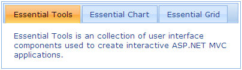

::: {style="DISPLAY: none"}
{#d2h_url_template}{#d2h_package_url style="WIDTH: 0px; DISPLAY: none; HEIGHT: 0px"}
:::

::::: {#nsbanner .d2h_main_nsbanner style="BORDER-BOTTOM: #999999 1px solid; POSITION: relative; PADDING-BOTTOM: 0px; BACKGROUND-COLOR: transparent; PADDING-LEFT: 0px; PADDING-RIGHT: 0px; DISPLAY: none; BORDER-TOP: #999999 1px solid; PADDING-TOP: 0px; LEFT: 0px"}
:::: {#TitleRow .d2h_main_titlerow style="PADDING-BOTTOM: 4px; BACKGROUND-COLOR: transparent; PADDING-LEFT: 22px; WIDTH: 100%; PADDING-RIGHT: 10px; DISPLAY: none; PADDING-TOP: 4px"}
::: {#ienav .d2h_main_ienav style="DISPLAY: none"}
{#D2HPrevious .D2HPreviousEnabled}  {#D2HNext .D2HNextEnabled}
:::
::::
:::::

:::::: {#nstext .d2h_main_nstext style="PADDING-BOTTOM: 10px; BACKGROUND-COLOR: transparent; PADDING-LEFT: 22px; PADDING-RIGHT: 10px; HEIGHT: 100%; OVERFLOW: auto; PADDING-TOP: 5px" hasuserbackground="true" valign="bottom"}
::: {#d2h_breadcrumbs .d2h_breadcrumbs}
[Essential Studio User Guide Documentation](ms-xhelp:///?Id=12457748-09e3-4d74-a240-8e049cedf030){.d2h_breadcrumbsNormal}[ \> ]{.d2h_breadcrumbsLinkSeparator}[User Interface Edition](ms-xhelp:///?Id=c29296b7-531c-413b-a0ec-488ca1f7f669){.d2h_breadcrumbsNormal}[ \> ]{.d2h_breadcrumbsLinkSeparator}[Essential ASP.NET MVC](ms-xhelp:///?Id=4b14e7d1-65c4-4f67-b1aa-2c37709905a5){.d2h_breadcrumbsNormal}[ \> ]{.d2h_breadcrumbsLinkSeparator}[Essential Tools]{.d2h_breadcrumbsContentsOnly}[ \> ]{.d2h_breadcrumbsLinkSeparator}[Controls and Components](ms-xhelp:///?Id=f0af2fff-6f00-4ca4-85a6-54e41ac5dc96){.d2h_breadcrumbsNormal}[ \> ]{.d2h_breadcrumbsLinkSeparator}[Tabs](ms-xhelp:///?Id=d92fa3d6-3155-4c9e-86f1-d37cd84b0558){.d2h_breadcrumbsNormal}
:::

### Adding a Tab Control to an ASP.NET MVC Application[]{style="FONT-FAMILY: 'Calibri','sans-serif'"} {#adding-a-tab-control-to-an-asp.net-mvc-application style="tab-stops: 0pt"}

Refer to the [Getting Started]{.UGHyperlink} section for prerequisites needed to add a tab control to an ASP.NET MVC application.

**[]{style="FONT-FAMILY: 'Calibri','sans-serif'; FONT-SIZE: 12pt"}** 

Using Builder

 

The following steps explain how to add a tab control through the builder.

1.   In **View**, create the contents for the tab with *ul* and *li* (for headers) and *div* tags (for content) and invoke the tab helper with the control ID as a first argument, followed by the **TargetControlId** method with the ID of the tab content as an argument.[]{style="FONT-FAMILY: Consolas; FONT-SIZE: 9.5pt"}

[]{style="FONT-FAMILY: Consolas; FONT-SIZE: 9.5pt"} 

+-----------------------------------------------------------------------------------------------------------------------------------------------------------------------------------------------------------------------------------------------------------------------------------------------------------------------------------------------------------------------------------+
| **View\[ASPX\]**                                                                                                                                                                                                                                                                                                                                                                  |
|                                                                                                                                                                                                                                                                                                                                                                                   |
| [\<]{style="FONT-FAMILY: 'Courier New'; COLOR: blue"}[div]{style="FONT-FAMILY: 'Courier New'; COLOR: maroon"}[ [id]{style="COLOR: red"}[=\"tabContents\"]{style="COLOR: blue"} [style]{style="COLOR: red"}[=\"]{style="COLOR: blue"}[visibility]{style="COLOR: red"}[: hidden\"\>]{style="COLOR: blue"}]{style="FONT-FAMILY: 'Courier New'"}                                      |
|                                                                                                                                                                                                                                                                                                                                                                                   |
| [            [\<]{style="COLOR: blue"}[ul]{style="COLOR: maroon"}[\>]{style="COLOR: blue"}]{style="FONT-FAMILY: 'Courier New'"}                                                                                                                                                                                                                                                   |
|                                                                                                                                                                                                                                                                                                                                                                                   |
| [                [\<]{style="COLOR: blue"}[li]{style="COLOR: maroon"}[\>\<]{style="COLOR: blue"}[a]{style="COLOR: maroon"} [href]{style="COLOR: red"}[=\"#tools\"\>]{style="COLOR: blue"}Essential Tools[\</]{style="COLOR: blue"}[a]{style="COLOR: maroon"}[\>\</]{style="COLOR: blue"}[li]{style="COLOR: maroon"}[\>]{style="COLOR: blue"}]{style="FONT-FAMILY: 'Courier New'"} |
|                                                                                                                                                                                                                                                                                                                                                                                   |
| [                [\<]{style="COLOR: blue"}[li]{style="COLOR: maroon"}[\>\<]{style="COLOR: blue"}[a]{style="COLOR: maroon"} [href]{style="COLOR: red"}[=\"#chart\"\>]{style="COLOR: blue"}Essential Chart[\</]{style="COLOR: blue"}[a]{style="COLOR: maroon"}[\>\</]{style="COLOR: blue"}[li]{style="COLOR: maroon"}[\>]{style="COLOR: blue"}]{style="FONT-FAMILY: 'Courier New'"} |
|                                                                                                                                                                                                                                                                                                                                                                                   |
| [                [\<]{style="COLOR: blue"}[li]{style="COLOR: maroon"}[\>\<]{style="COLOR: blue"}[a]{style="COLOR: maroon"} [href]{style="COLOR: red"}[=\"#grid\"\>]{style="COLOR: blue"}Essential Grid[\</]{style="COLOR: blue"}[a]{style="COLOR: maroon"}[\>\</]{style="COLOR: blue"}[li]{style="COLOR: maroon"}[\>]{style="COLOR: blue"}]{style="FONT-FAMILY: 'Courier New'"}   |
|                                                                                                                                                                                                                                                                                                                                                                                   |
| [            [\</]{style="COLOR: blue"}[ul]{style="COLOR: maroon"}[\>]{style="COLOR: blue"}]{style="FONT-FAMILY: 'Courier New'"}                                                                                                                                                                                                                                                  |
|                                                                                                                                                                                                                                                                                                                                                                                   |
| [            [\<]{style="COLOR: blue"}[div]{style="COLOR: maroon"} [id]{style="COLOR: red"}[=\"tools\"\>]{style="COLOR: blue"}]{style="FONT-FAMILY: 'Courier New'"}                                                                                                                                                                                                               |
|                                                                                                                                                                                                                                                                                                                                                                                   |
| [Essential Tools is a collection of user interface components used to create interactive ASP.NET MVC applications.]{style="FONT-FAMILY: 'Courier New'"}                                                                                                                                                                                                                           |
|                                                                                                                                                                                                                                                                                                                                                                                   |
| [            [\</]{style="COLOR: blue"}[div]{style="COLOR: maroon"}[\>]{style="COLOR: blue"}]{style="FONT-FAMILY: 'Courier New'"}                                                                                                                                                                                                                                                 |
|                                                                                                                                                                                                                                                                                                                                                                                   |
| [            [\<]{style="COLOR: blue"}[div]{style="COLOR: maroon"} [id]{style="COLOR: red"}[=\"chart\"\>]{style="COLOR: blue"}]{style="FONT-FAMILY: 'Courier New'"}                                                                                                                                                                                                               |
|                                                                                                                                                                                                                                                                                                                                                                                   |
| [Essential Chart is a business-oriented charting component. Essential Chart features an advanced styles architecture that makes complex multi-level formatting very easy.]{style="FONT-FAMILY: 'Courier New'"}                                                                                                                                                                    |
|                                                                                                                                                                                                                                                                                                                                                                                   |
| [            [\</]{style="COLOR: blue"}[div]{style="COLOR: maroon"}[\>]{style="COLOR: blue"}]{style="FONT-FAMILY: 'Courier New'"}                                                                                                                                                                                                                                                 |
|                                                                                                                                                                                                                                                                                                                                                                                   |
| [            [\<]{style="COLOR: blue"}[div]{style="COLOR: maroon"} [id]{style="COLOR: red"}[=\"grid\"\>]{style="COLOR: blue"}]{style="FONT-FAMILY: 'Courier New'"}                                                                                                                                                                                                                |
|                                                                                                                                                                                                                                                                                                                                                                                   |
| [Essential MVC Grid offers a full-featured grid control with extensive support for grouping and displaying hierarchical data.]{style="FONT-FAMILY: 'Courier New'"}                                                                                                                                                                                                                |
|                                                                                                                                                                                                                                                                                                                                                                                   |
| [            [\</]{style="COLOR: blue"}[div]{style="COLOR: maroon"}[\>]{style="COLOR: blue"}]{style="FONT-FAMILY: 'Courier New'"}                                                                                                                                                                                                                                                 |
|                                                                                                                                                                                                                                                                                                                                                                                   |
| [       [\</]{style="COLOR: blue"}[div]{style="COLOR: maroon"}[\>]{style="COLOR: blue"}]{style="FONT-FAMILY: 'Courier New'"}                                                                                                                                                                                                                                                      |
|                                                                                                                                                                                                                                                                                                                                                                                   |
| [       [\<%]{style="BACKGROUND: yellow"}[=]{style="COLOR: blue"}Html.Syncfusion().Tab([\"myTab\"]{style="COLOR: #a31515"})]{style="FONT-FAMILY: 'Courier New'"}                                                                                                                                                                                                                  |
|                                                                                                                                                                                                                                                                                                                                                                                   |
| **[.TargetControlId([\"tabContents\"]{style="COLOR: #a31515"})]{style="FONT-FAMILY: 'Courier New'"}**[ [%\>]{style="BACKGROUND: yellow"}]{style="FONT-FAMILY: 'Courier New'"}                                                                                                                                                                                                     |
|                                                                                                                                                                                                                                                                                                                                                                                   |
| []{style="FONT-FAMILY: 'Courier New'"}                                                                                                                                                                                                                                                                                                                                            |
+-----------------------------------------------------------------------------------------------------------------------------------------------------------------------------------------------------------------------------------------------------------------------------------------------------------------------------------------------------------------------------------+

[]{style="FONT-FAMILY: Consolas; FONT-SIZE: 9.5pt"} 

[]{style="FONT-FAMILY: Consolas; FONT-SIZE: 9.5pt"} 

+-----------------------------------------------------------------------------------------------------------------------------------------------------------------------------------------------------------------------------------------------------------------------------------------------------------------------------------------------------------------------------------+
| **View\[cshtml\]**                                                                                                                                                                                                                                                                                                                                                                |
|                                                                                                                                                                                                                                                                                                                                                                                   |
| [\<]{style="FONT-FAMILY: 'Courier New'; COLOR: blue"}[div]{style="FONT-FAMILY: 'Courier New'; COLOR: maroon"}[ [id]{style="COLOR: red"}[=\"tabContents\"]{style="COLOR: blue"} [style]{style="COLOR: red"}[=\"]{style="COLOR: blue"}[visibility]{style="COLOR: red"}[: hidden\"\>]{style="COLOR: blue"}]{style="FONT-FAMILY: 'Courier New'"}                                      |
|                                                                                                                                                                                                                                                                                                                                                                                   |
| [            [\<]{style="COLOR: blue"}[ul]{style="COLOR: maroon"}[\>]{style="COLOR: blue"}]{style="FONT-FAMILY: 'Courier New'"}                                                                                                                                                                                                                                                   |
|                                                                                                                                                                                                                                                                                                                                                                                   |
| [                [\<]{style="COLOR: blue"}[li]{style="COLOR: maroon"}[\>\<]{style="COLOR: blue"}[a]{style="COLOR: maroon"} [href]{style="COLOR: red"}[=\"#tools\"\>]{style="COLOR: blue"}Essential Tools[\</]{style="COLOR: blue"}[a]{style="COLOR: maroon"}[\>\</]{style="COLOR: blue"}[li]{style="COLOR: maroon"}[\>]{style="COLOR: blue"}]{style="FONT-FAMILY: 'Courier New'"} |
|                                                                                                                                                                                                                                                                                                                                                                                   |
| [                [\<]{style="COLOR: blue"}[li]{style="COLOR: maroon"}[\>\<]{style="COLOR: blue"}[a]{style="COLOR: maroon"} [href]{style="COLOR: red"}[=\"#chart\"\>]{style="COLOR: blue"}Essential Chart[\</]{style="COLOR: blue"}[a]{style="COLOR: maroon"}[\>\</]{style="COLOR: blue"}[li]{style="COLOR: maroon"}[\>]{style="COLOR: blue"}]{style="FONT-FAMILY: 'Courier New'"} |
|                                                                                                                                                                                                                                                                                                                                                                                   |
| [                [\<]{style="COLOR: blue"}[li]{style="COLOR: maroon"}[\>\<]{style="COLOR: blue"}[a]{style="COLOR: maroon"} [href]{style="COLOR: red"}[=\"#grid\"\>]{style="COLOR: blue"}Essential Grid[\</]{style="COLOR: blue"}[a]{style="COLOR: maroon"}[\>\</]{style="COLOR: blue"}[li]{style="COLOR: maroon"}[\>]{style="COLOR: blue"}]{style="FONT-FAMILY: 'Courier New'"}   |
|                                                                                                                                                                                                                                                                                                                                                                                   |
| [            [\</]{style="COLOR: blue"}[ul]{style="COLOR: maroon"}[\>]{style="COLOR: blue"}]{style="FONT-FAMILY: 'Courier New'"}                                                                                                                                                                                                                                                  |
|                                                                                                                                                                                                                                                                                                                                                                                   |
| [            [\<]{style="COLOR: blue"}[div]{style="COLOR: maroon"} [id]{style="COLOR: red"}[=\"tools\"\>]{style="COLOR: blue"}]{style="FONT-FAMILY: 'Courier New'"}                                                                                                                                                                                                               |
|                                                                                                                                                                                                                                                                                                                                                                                   |
| [Essential Tools is a collection of user interface components used to create interactive ASP.NET MVC applications.]{style="FONT-FAMILY: 'Courier New'"}                                                                                                                                                                                                                           |
|                                                                                                                                                                                                                                                                                                                                                                                   |
| [            [\</]{style="COLOR: blue"}[div]{style="COLOR: maroon"}[\>]{style="COLOR: blue"}]{style="FONT-FAMILY: 'Courier New'"}                                                                                                                                                                                                                                                 |
|                                                                                                                                                                                                                                                                                                                                                                                   |
| [            [\<]{style="COLOR: blue"}[div]{style="COLOR: maroon"} [id]{style="COLOR: red"}[=\"chart\"\>]{style="COLOR: blue"}]{style="FONT-FAMILY: 'Courier New'"}                                                                                                                                                                                                               |
|                                                                                                                                                                                                                                                                                                                                                                                   |
| [Essential Chart is a business-oriented charting component. Essential Chart features an advanced styles architecture that makes complex multi-level formatting very easy.]{style="FONT-FAMILY: 'Courier New'"}                                                                                                                                                                    |
|                                                                                                                                                                                                                                                                                                                                                                                   |
| [            [\</]{style="COLOR: blue"}[div]{style="COLOR: maroon"}[\>]{style="COLOR: blue"}]{style="FONT-FAMILY: 'Courier New'"}                                                                                                                                                                                                                                                 |
|                                                                                                                                                                                                                                                                                                                                                                                   |
| [            [\<]{style="COLOR: blue"}[div]{style="COLOR: maroon"} [id]{style="COLOR: red"}[=\"grid\"\>]{style="COLOR: blue"}]{style="FONT-FAMILY: 'Courier New'"}                                                                                                                                                                                                                |
|                                                                                                                                                                                                                                                                                                                                                                                   |
| [Essential MVC Grid offers a full-featured grid control with extensive support for grouping and displaying hierarchical data.]{style="FONT-FAMILY: 'Courier New'"}                                                                                                                                                                                                                |
|                                                                                                                                                                                                                                                                                                                                                                                   |
| [            [\</]{style="COLOR: blue"}[div]{style="COLOR: maroon"}[\>]{style="COLOR: blue"}]{style="FONT-FAMILY: 'Courier New'"}                                                                                                                                                                                                                                                 |
|                                                                                                                                                                                                                                                                                                                                                                                   |
| [       [\</]{style="COLOR: blue"}[div]{style="COLOR: maroon"}[\>]{style="COLOR: blue"}]{style="FONT-FAMILY: 'Courier New'"}                                                                                                                                                                                                                                                      |
|                                                                                                                                                                                                                                                                                                                                                                                   |
| [       [\@{]{style="BACKGROUND: yellow"} Html.Syncfusion().Tab([\"myTab\"]{style="COLOR: #a31515"})]{style="FONT-FAMILY: 'Courier New'"}                                                                                                                                                                                                                                         |
|                                                                                                                                                                                                                                                                                                                                                                                   |
| **[.TargetControlId([\"tabContents\"]{style="COLOR: #a31515"})]{style="FONT-FAMILY: 'Courier New'"}**[.Render();]{style="FONT-FAMILY: 'Courier New'"}[ [}]{style="BACKGROUND: yellow"}]{style="FONT-FAMILY: 'Courier New'"}                                                                                                                                                       |
|                                                                                                                                                                                                                                                                                                                                                                                   |
| []{style="FONT-FAMILY: 'Courier New'"}                                                                                                                                                                                                                                                                                                                                            |
+-----------------------------------------------------------------------------------------------------------------------------------------------------------------------------------------------------------------------------------------------------------------------------------------------------------------------------------------------------------------------------------+

[]{style="FONT-FAMILY: Consolas; FONT-SIZE: 9.5pt"} 

[]{style="FONT-FAMILY: Consolas; FONT-SIZE: 9.5pt"} 

::: {style="BORDER-BOTTOM: windowtext 1pt solid; BORDER-LEFT: medium none; PADDING-BOTTOM: 1pt; MARGIN-TOP: 9pt; PADDING-LEFT: 0pt; PADDING-RIGHT: 0pt; MARGIN-BOTTOM: 9pt; BORDER-TOP: windowtext 1pt solid; BORDER-RIGHT: medium none; PADDING-TOP: 1pt"}
{border="0"}Note: The style attribute visibility of tab content is set to hidden for better rendering when loading. The visibility will be reset internally once the resources related to the control are loaded completely.[]{style="FONT-FAMILY: Consolas"}
:::

[   []{style="COLOR: blue"}]{style="FONT-FAMILY: Consolas; FONT-SIZE: 9.5pt"}

2.   Build and run the application.

 

Using Properties Model

The following steps explain how to add a tab control through the properties Model.

1.   In the controller, create an instance of **TabModel**.**

2.   Define the **TargetControlId** property and pass the instance through the view-specific data to the view.**

 

+-----------------------------------------------------------------------------------------------------------------------------------------------------------------+
| **[\[Controller\]]{style="FONT-FAMILY: 'Courier New'"}**                                                                                                        |
|                                                                                                                                                                 |
| [public]{style="FONT-FAMILY: 'Courier New'; COLOR: blue"}[ [ActionResult]{style="COLOR: #2b91af"} Index()]{style="FONT-FAMILY: 'Courier New'"}                  |
|                                                                                                                                                                 |
| [        {]{style="FONT-FAMILY: 'Courier New'"}                                                                                                                 |
|                                                                                                                                                                 |
| [            [//Create an instance of TabModel.]{style="COLOR: green"}]{style="FONT-FAMILY: 'Courier New'"}                                                     |
|                                                                                                                                                                 |
| [            [TabModel]{style="COLOR: #2b91af"} myModel = [new]{style="COLOR: blue"} [TabModel]{style="COLOR: #2b91af"}();]{style="FONT-FAMILY: 'Courier New'"} |
|                                                                                                                                                                 |
| [            myModel.TargetControlId = [\"tabContents\"]{style="COLOR: #a31515"};]{style="FONT-FAMILY: 'Courier New'"}                                          |
|                                                                                                                                                                 |
| []{style="FONT-FAMILY: 'Courier New'"}                                                                                                                          |
|                                                                                                                                                                 |
| [            [//Pass the instance through the view data to the view.]{style="COLOR: green"}]{style="FONT-FAMILY: 'Courier New'"}                                |
|                                                                                                                                                                 |
| [            ViewData\[[\"myTab\"]{style="COLOR: #a31515"}\] = myModel;]{style="FONT-FAMILY: 'Courier New'"}                                                    |
|                                                                                                                                                                 |
| [            [return]{style="COLOR: blue"} View();]{style="FONT-FAMILY: 'Courier New'"}                                                                         |
|                                                                                                                                                                 |
| [        }]{style="FONT-FAMILY: 'Courier New'"}                                                                                                                 |
|                                                                                                                                                                 |
| **[]{style="FONT-FAMILY: 'Courier New'"}**                                                                                                                      |
+-----------------------------------------------------------------------------------------------------------------------------------------------------------------+

**[]{style="FONT-FAMILY: 'Calibri','sans-serif'"}** 

3.   In **View**, create the contents of the tab with *ul* and *li* (for headers) and *div* tags (for content) and invoke the tab helper with the view data key as the control ID.**

[]{style="FONT-FAMILY: Consolas; BACKGROUND: yellow; FONT-SIZE: 9.5pt"} 

+-----------------------------------------------------------------------------------------------------------------------------------------------------------------------------------------------------------------------------------------------------------------------------------------------------------------------------------------------------------------------------------+
| **View\[ASPX\]**                                                                                                                                                                                                                                                                                                                                                                  |
|                                                                                                                                                                                                                                                                                                                                                                                   |
| [\<]{style="FONT-FAMILY: 'Courier New'; COLOR: blue"}[div]{style="FONT-FAMILY: 'Courier New'; COLOR: maroon"}[ [id]{style="COLOR: red"}[=\"tabContents\"]{style="COLOR: blue"} [style]{style="COLOR: red"}[=\"]{style="COLOR: blue"}[visibility]{style="COLOR: red"}[: hidden\"\>]{style="COLOR: blue"}]{style="FONT-FAMILY: 'Courier New'"}                                      |
|                                                                                                                                                                                                                                                                                                                                                                                   |
| [            [\<]{style="COLOR: blue"}[ul]{style="COLOR: maroon"}[\>]{style="COLOR: blue"}]{style="FONT-FAMILY: 'Courier New'"}                                                                                                                                                                                                                                                   |
|                                                                                                                                                                                                                                                                                                                                                                                   |
| [                [\<]{style="COLOR: blue"}[li]{style="COLOR: maroon"}[\>\<]{style="COLOR: blue"}[a]{style="COLOR: maroon"} [href]{style="COLOR: red"}[=\"#tools\"\>]{style="COLOR: blue"}Essential Tools[\</]{style="COLOR: blue"}[a]{style="COLOR: maroon"}[\>\</]{style="COLOR: blue"}[li]{style="COLOR: maroon"}[\>]{style="COLOR: blue"}]{style="FONT-FAMILY: 'Courier New'"} |
|                                                                                                                                                                                                                                                                                                                                                                                   |
| [                [\<]{style="COLOR: blue"}[li]{style="COLOR: maroon"}[\>\<]{style="COLOR: blue"}[a]{style="COLOR: maroon"} [href]{style="COLOR: red"}[=\"#chart\"\>]{style="COLOR: blue"}Essential Chart[\</]{style="COLOR: blue"}[a]{style="COLOR: maroon"}[\>\</]{style="COLOR: blue"}[li]{style="COLOR: maroon"}[\>]{style="COLOR: blue"}]{style="FONT-FAMILY: 'Courier New'"} |
|                                                                                                                                                                                                                                                                                                                                                                                   |
| [                [\<]{style="COLOR: blue"}[li]{style="COLOR: maroon"}[\>\<]{style="COLOR: blue"}[a]{style="COLOR: maroon"} [href]{style="COLOR: red"}[=\"#grid\"\>]{style="COLOR: blue"}Essential Grid[\</]{style="COLOR: blue"}[a]{style="COLOR: maroon"}[\>\</]{style="COLOR: blue"}[li]{style="COLOR: maroon"}[\>]{style="COLOR: blue"}]{style="FONT-FAMILY: 'Courier New'"}   |
|                                                                                                                                                                                                                                                                                                                                                                                   |
| [            [\</]{style="COLOR: blue"}[ul]{style="COLOR: maroon"}[\>]{style="COLOR: blue"}]{style="FONT-FAMILY: 'Courier New'"}                                                                                                                                                                                                                                                  |
|                                                                                                                                                                                                                                                                                                                                                                                   |
| [            [\<]{style="COLOR: blue"}[div]{style="COLOR: maroon"} [id]{style="COLOR: red"}[=\"tools\"\>]{style="COLOR: blue"}]{style="FONT-FAMILY: 'Courier New'"}                                                                                                                                                                                                               |
|                                                                                                                                                                                                                                                                                                                                                                                   |
| [Essential Tools is a collection of user-interface components used to create interactive ASP.NET MVC applications.]{style="FONT-FAMILY: 'Courier New'"}                                                                                                                                                                                                                           |
|                                                                                                                                                                                                                                                                                                                                                                                   |
| [            [\</]{style="COLOR: blue"}[div]{style="COLOR: maroon"}[\>]{style="COLOR: blue"}]{style="FONT-FAMILY: 'Courier New'"}                                                                                                                                                                                                                                                 |
|                                                                                                                                                                                                                                                                                                                                                                                   |
| [            [\<]{style="COLOR: blue"}[div]{style="COLOR: maroon"} [id]{style="COLOR: red"}[=\"chart\"\>]{style="COLOR: blue"}]{style="FONT-FAMILY: 'Courier New'"}                                                                                                                                                                                                               |
|                                                                                                                                                                                                                                                                                                                                                                                   |
| [Essential Chart is a business-oriented charting component. Essential Chart features an advanced styles architecture that makes complex multi-level formatting very easy.]{style="FONT-FAMILY: 'Courier New'"}                                                                                                                                                                    |
|                                                                                                                                                                                                                                                                                                                                                                                   |
| [            [\</]{style="COLOR: blue"}[div]{style="COLOR: maroon"}[\>]{style="COLOR: blue"}]{style="FONT-FAMILY: 'Courier New'"}                                                                                                                                                                                                                                                 |
|                                                                                                                                                                                                                                                                                                                                                                                   |
| [            [\<]{style="COLOR: blue"}[div]{style="COLOR: maroon"} [id]{style="COLOR: red"}[=\"grid\"\>]{style="COLOR: blue"}]{style="FONT-FAMILY: 'Courier New'"}                                                                                                                                                                                                                |
|                                                                                                                                                                                                                                                                                                                                                                                   |
| [Essential MVC Grid offers a full-featured Grid control with extensive support for grouping and displaying hierarchical data.]{style="FONT-FAMILY: 'Courier New'"}                                                                                                                                                                                                                |
|                                                                                                                                                                                                                                                                                                                                                                                   |
| [            [\</]{style="COLOR: blue"}[div]{style="COLOR: maroon"}[\>]{style="COLOR: blue"}]{style="FONT-FAMILY: 'Courier New'"}                                                                                                                                                                                                                                                 |
|                                                                                                                                                                                                                                                                                                                                                                                   |
| [       [\</]{style="COLOR: blue"}[div]{style="COLOR: maroon"}[\>]{style="COLOR: blue"}]{style="FONT-FAMILY: 'Courier New'"}                                                                                                                                                                                                                                                      |
|                                                                                                                                                                                                                                                                                                                                                                                   |
| []{style="FONT-FAMILY: 'Courier New'"}                                                                                                                                                                                                                                                                                                                                            |
|                                                                                                                                                                                                                                                                                                                                                                                   |
| [\<%]{style="FONT-FAMILY: 'Courier New'; BACKGROUND: yellow"}[=]{style="FONT-FAMILY: 'Courier New'; COLOR: blue"}[Html.Syncfusion().Tab([\"myTab\"]{style="COLOR: #a31515"})[%\>]{style="BACKGROUND: yellow"}]{style="FONT-FAMILY: 'Courier New'"}**[[]{style="FONT-FAMILY: 'Courier New'"}]{.underline}**                                                                        |
+-----------------------------------------------------------------------------------------------------------------------------------------------------------------------------------------------------------------------------------------------------------------------------------------------------------------------------------------------------------------------------------+

***[[[]{style="TEXT-DECORATION: none"}]{style="FONT-FAMILY: 'Calibri','sans-serif'"}]{.underline}*** 

[]{style="FONT-FAMILY: Consolas; BACKGROUND: yellow; FONT-SIZE: 9.5pt"} 

+-----------------------------------------------------------------------------------------------------------------------------------------------------------------------------------------------------------------------------------------------------------------------------------------------------------------------------------------------------------------------------------+
| **View\[cshtml\]**                                                                                                                                                                                                                                                                                                                                                                |
|                                                                                                                                                                                                                                                                                                                                                                                   |
| [\<]{style="FONT-FAMILY: 'Courier New'; COLOR: blue"}[div]{style="FONT-FAMILY: 'Courier New'; COLOR: maroon"}[ [id]{style="COLOR: red"}[=\"tabContents\"]{style="COLOR: blue"} [style]{style="COLOR: red"}[=\"]{style="COLOR: blue"}[visibility]{style="COLOR: red"}[: hidden\"\>]{style="COLOR: blue"}]{style="FONT-FAMILY: 'Courier New'"}                                      |
|                                                                                                                                                                                                                                                                                                                                                                                   |
| [            [\<]{style="COLOR: blue"}[ul]{style="COLOR: maroon"}[\>]{style="COLOR: blue"}]{style="FONT-FAMILY: 'Courier New'"}                                                                                                                                                                                                                                                   |
|                                                                                                                                                                                                                                                                                                                                                                                   |
| [                [\<]{style="COLOR: blue"}[li]{style="COLOR: maroon"}[\>\<]{style="COLOR: blue"}[a]{style="COLOR: maroon"} [href]{style="COLOR: red"}[=\"#tools\"\>]{style="COLOR: blue"}Essential Tools[\</]{style="COLOR: blue"}[a]{style="COLOR: maroon"}[\>\</]{style="COLOR: blue"}[li]{style="COLOR: maroon"}[\>]{style="COLOR: blue"}]{style="FONT-FAMILY: 'Courier New'"} |
|                                                                                                                                                                                                                                                                                                                                                                                   |
| [                [\<]{style="COLOR: blue"}[li]{style="COLOR: maroon"}[\>\<]{style="COLOR: blue"}[a]{style="COLOR: maroon"} [href]{style="COLOR: red"}[=\"#chart\"\>]{style="COLOR: blue"}Essential Chart[\</]{style="COLOR: blue"}[a]{style="COLOR: maroon"}[\>\</]{style="COLOR: blue"}[li]{style="COLOR: maroon"}[\>]{style="COLOR: blue"}]{style="FONT-FAMILY: 'Courier New'"} |
|                                                                                                                                                                                                                                                                                                                                                                                   |
| [                [\<]{style="COLOR: blue"}[li]{style="COLOR: maroon"}[\>\<]{style="COLOR: blue"}[a]{style="COLOR: maroon"} [href]{style="COLOR: red"}[=\"#grid\"\>]{style="COLOR: blue"}Essential Grid[\</]{style="COLOR: blue"}[a]{style="COLOR: maroon"}[\>\</]{style="COLOR: blue"}[li]{style="COLOR: maroon"}[\>]{style="COLOR: blue"}]{style="FONT-FAMILY: 'Courier New'"}   |
|                                                                                                                                                                                                                                                                                                                                                                                   |
| [            [\</]{style="COLOR: blue"}[ul]{style="COLOR: maroon"}[\>]{style="COLOR: blue"}]{style="FONT-FAMILY: 'Courier New'"}                                                                                                                                                                                                                                                  |
|                                                                                                                                                                                                                                                                                                                                                                                   |
| [            [\<]{style="COLOR: blue"}[div]{style="COLOR: maroon"} [id]{style="COLOR: red"}[=\"tools\"\>]{style="COLOR: blue"}]{style="FONT-FAMILY: 'Courier New'"}                                                                                                                                                                                                               |
|                                                                                                                                                                                                                                                                                                                                                                                   |
| [Essential Tools is a collection of user-interface components used to create interactive ASP.NET MVC applications.]{style="FONT-FAMILY: 'Courier New'"}                                                                                                                                                                                                                           |
|                                                                                                                                                                                                                                                                                                                                                                                   |
| [            [\</]{style="COLOR: blue"}[div]{style="COLOR: maroon"}[\>]{style="COLOR: blue"}]{style="FONT-FAMILY: 'Courier New'"}                                                                                                                                                                                                                                                 |
|                                                                                                                                                                                                                                                                                                                                                                                   |
| [            [\<]{style="COLOR: blue"}[div]{style="COLOR: maroon"} [id]{style="COLOR: red"}[=\"chart\"\>]{style="COLOR: blue"}]{style="FONT-FAMILY: 'Courier New'"}                                                                                                                                                                                                               |
|                                                                                                                                                                                                                                                                                                                                                                                   |
| [Essential Chart is a business-oriented charting component. Essential Chart features an advanced styles architecture that makes complex multi-level formatting very easy.]{style="FONT-FAMILY: 'Courier New'"}                                                                                                                                                                    |
|                                                                                                                                                                                                                                                                                                                                                                                   |
| [            [\</]{style="COLOR: blue"}[div]{style="COLOR: maroon"}[\>]{style="COLOR: blue"}]{style="FONT-FAMILY: 'Courier New'"}                                                                                                                                                                                                                                                 |
|                                                                                                                                                                                                                                                                                                                                                                                   |
| [            [\<]{style="COLOR: blue"}[div]{style="COLOR: maroon"} [id]{style="COLOR: red"}[=\"grid\"\>]{style="COLOR: blue"}]{style="FONT-FAMILY: 'Courier New'"}                                                                                                                                                                                                                |
|                                                                                                                                                                                                                                                                                                                                                                                   |
| [Essential MVC Grid offers a full-featured Grid control with extensive support for grouping and displaying hierarchical data.]{style="FONT-FAMILY: 'Courier New'"}                                                                                                                                                                                                                |
|                                                                                                                                                                                                                                                                                                                                                                                   |
| [            [\</]{style="COLOR: blue"}[div]{style="COLOR: maroon"}[\>]{style="COLOR: blue"}]{style="FONT-FAMILY: 'Courier New'"}                                                                                                                                                                                                                                                 |
|                                                                                                                                                                                                                                                                                                                                                                                   |
| [       [\</]{style="COLOR: blue"}[div]{style="COLOR: maroon"}[\>]{style="COLOR: blue"}]{style="FONT-FAMILY: 'Courier New'"}                                                                                                                                                                                                                                                      |
|                                                                                                                                                                                                                                                                                                                                                                                   |
| [\@{]{style="FONT-FAMILY: 'Courier New'; BACKGROUND: yellow"}[ Html.Syncfusion().Tab([\"myTab\"]{style="COLOR: #a31515"}).Render();[}]{style="BACKGROUND: yellow"}]{style="FONT-FAMILY: 'Courier New'"}                                                                                                                                                                           |
|                                                                                                                                                                                                                                                                                                                                                                                   |
| **[[[]{style="TEXT-DECORATION: none"}]{style="FONT-FAMILY: 'Courier New'"}]{.underline}**                                                                                                                                                                                                                                                                                         |
+-----------------------------------------------------------------------------------------------------------------------------------------------------------------------------------------------------------------------------------------------------------------------------------------------------------------------------------------------------------------------------------+

***[[[]{style="TEXT-DECORATION: none"}]{style="FONT-FAMILY: 'Calibri','sans-serif'"}]{.underline}*** 

4.   Build and run the application.

 

The following figure shows the output of the tab control.

 

{border="0"}

Figure 264: Tab Control

 

A sample demonstrating a basic tab control can be downloaded from the following link:

[]{style="FONT-FAMILY: 'Calibri','sans-serif'; COLOR: black"} 

[[[Tab Control Sample]{.UGHyperlink}](http://files.syncfusion.com/Support/Tools_MVC/v8.3.0.20/Test_Tab.zip)]{style="FONT-FAMILY: 'Calibri','sans-serif'; COLOR: black"}

[]{style="FONT-FAMILY: 'Calibri','sans-serif'; COLOR: black"} 

::: {style="BORDER-BOTTOM: windowtext 1pt solid; BORDER-LEFT: medium none; PADDING-BOTTOM: 1pt; MARGIN-TOP: 9pt; PADDING-LEFT: 0pt; PADDING-RIGHT: 0pt; MARGIN-BOTTOM: 9pt; BORDER-TOP: windowtext 1pt solid; BORDER-RIGHT: medium none; PADDING-TOP: 1pt"}
{border="0"}Note: The version number for the assemblies has been set to 8.3.0.20 in the Web.config file of the sample. Please change the version number to the appropriate version in the Web-2008.config or Web-2010.config files (available in the root directory) and they will automatically update the Web.config file.
:::

[]{#related-topics}
::::::
