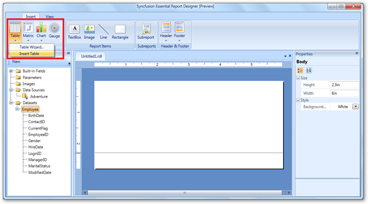
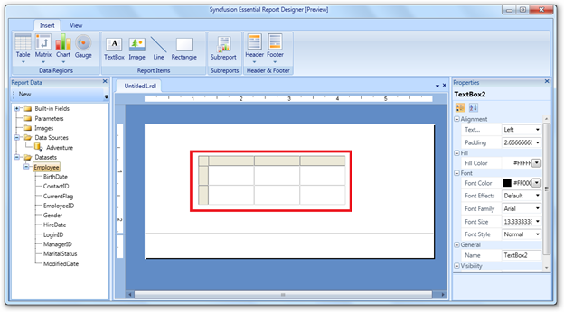
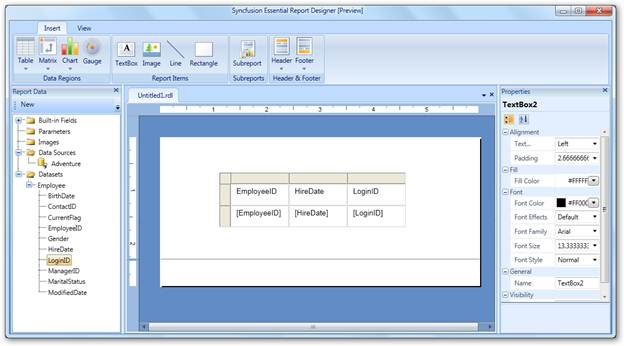
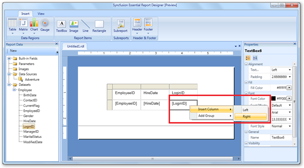
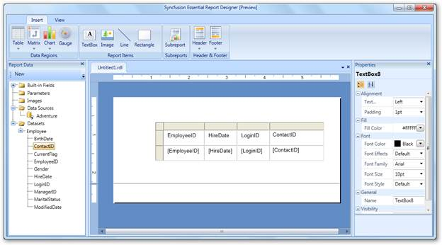
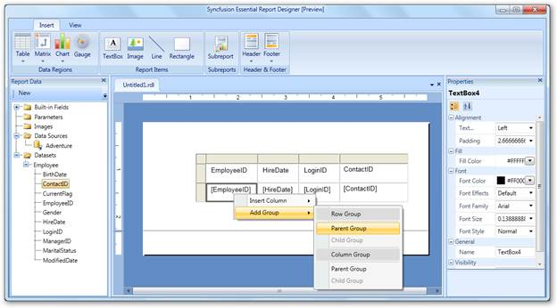
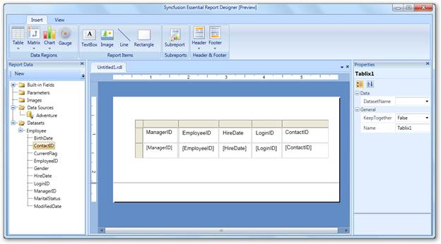

::: {style="DISPLAY: none"}
{#d2h_url_template}{#d2h_package_url style="WIDTH: 0px; DISPLAY: none; HEIGHT: 0px"}
:::

::::: {#nsbanner .d2h_main_nsbanner style="BORDER-BOTTOM: #999999 1px solid; POSITION: relative; PADDING-BOTTOM: 0px; BACKGROUND-COLOR: transparent; PADDING-LEFT: 0px; PADDING-RIGHT: 0px; DISPLAY: none; BORDER-TOP: #999999 1px solid; PADDING-TOP: 0px; LEFT: 0px"}
:::: {#TitleRow .d2h_main_titlerow style="PADDING-BOTTOM: 4px; BACKGROUND-COLOR: transparent; PADDING-LEFT: 22px; WIDTH: 100%; PADDING-RIGHT: 10px; DISPLAY: none; PADDING-TOP: 4px"}
::: {#ienav .d2h_main_ienav style="DISPLAY: none"}
{#D2HPrevious .D2HPreviousEnabled}  {#D2HNext .D2HNextEnabled}
:::
::::
:::::

::::: {#nstext .d2h_main_nstext style="PADDING-BOTTOM: 10px; BACKGROUND-COLOR: transparent; PADDING-LEFT: 22px; PADDING-RIGHT: 10px; HEIGHT: 100%; OVERFLOW: auto; PADDING-TOP: 5px" hasuserbackground="true" valign="bottom"}
## Adding a Table to Report Designer {#adding-a-table-to-report-designer style="tab-stops: 0pt"}

Users can add tables to the Report Designer and drag data fields to the table columns. The following steps illustrate how to add a table to the Report Designer.

 

1.   On the **Insert** tab, click **Table.**

 

{border="0"}

Figure 20: Insert Table

[]{style="FONT-FAMILY: 'Calibri','sans-serif'"} 

2.   To insert a table into Report Designer, click **Insert Table**[. ]{style="FONT-FAMILY: 'Calibri','sans-serif'"}The table with three columns will appear in the Report Designer by default.

 

[{border="0"}]{style="FONT-FAMILY: 'Calibri','sans-serif'"}

Figure 21: Report Designer with Table[]{style="FONT-FAMILY: 'Calibri','sans-serif'"}

 

3.   Drag the data fields to the table columns.

 

{border="0"}[]{style="FONT-FAMILY: 'Calibri','sans-serif'"}

Figure 22: Table with Data Fields

[]{style="FONT-FAMILY: 'Calibri','sans-serif'"} 

Steps to add a column to the table:

 

1.   Right-click on a cell where you want to insert a column.

 

[{border="0"}]{style="FONT-FAMILY: 'Calibri','sans-serif'"}

Figure 23: Insert Column

 

2.   Click **Insert Column,** and then click **Left** to insert the column to the left of the cell, or click **Right** to insert the column to right of the cell.

[]{style="FONT-FAMILY: 'Calibri','sans-serif'"} 

::: {style="BORDER-BOTTOM: windowtext 1pt solid; BORDER-LEFT: medium none; PADDING-BOTTOM: 1pt; MARGIN-TOP: 9pt; PADDING-LEFT: 0pt; PADDING-RIGHT: 0pt; MARGIN-BOTTOM: 9pt; BORDER-TOP: windowtext 1pt solid; BORDER-RIGHT: medium none; PADDING-TOP: 1pt"}
{border="0"}Note: When a new column is inserted in the table, you can drag a data field to the inserted column.

[]{style="FONT-FAMILY: 'Calibri','sans-serif'"} 
:::

[{border="0"}]{style="FONT-FAMILY: 'Calibri','sans-serif'"}

Figure 24: Inserted Column with Data Field

 

Steps to Add a Parent Group to the Table:

1.   Right-click on a cell where you want to insert a parent group.

2.   Click **Add Group,** and then select **Parent Group**.

 

[{border="0"}]{style="FONT-FAMILY: 'Calibri','sans-serif'"}

Figure 25: Add Group

[]{style="FONT-FAMILY: 'Calibri','sans-serif'"} 

::: {style="BORDER-BOTTOM: windowtext 1pt solid; BORDER-LEFT: medium none; PADDING-BOTTOM: 1pt; MARGIN-TOP: 9pt; PADDING-LEFT: 0pt; PADDING-RIGHT: 0pt; MARGIN-BOTTOM: 9pt; BORDER-TOP: windowtext 1pt solid; BORDER-RIGHT: medium none; PADDING-TOP: 1pt"}
{border="0"}Note: In the given example, all EmployeeIDs are grouped with ManagerIDs. The ManagerID column will be shown to the left of EmployeeID.
:::

 

{border="0"}

Figure 26: Group by ManagerID

 

More:

[ ]{#related-topics}

[{border="0" align="absMiddle"}4.3.1 Applying Styles to the Table](ms-xhelp:///?Id=8b1c0165-1755-41a4-bdc0-ec13d3a55a53){style="TEXT-DECORATION: none"}
:::::
