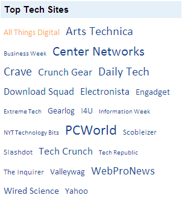

::: {style="DISPLAY: none"}
{#d2h_url_template}{#d2h_package_url style="WIDTH: 0px; DISPLAY: none; HEIGHT: 0px"}
:::

::::: {#nsbanner .d2h_main_nsbanner style="BORDER-BOTTOM: #999999 1px solid; POSITION: relative; PADDING-BOTTOM: 0px; BACKGROUND-COLOR: transparent; PADDING-LEFT: 0px; PADDING-RIGHT: 0px; DISPLAY: none; BORDER-TOP: #999999 1px solid; PADDING-TOP: 0px; LEFT: 0px"}
:::: {#TitleRow .d2h_main_titlerow style="PADDING-BOTTOM: 4px; BACKGROUND-COLOR: transparent; PADDING-LEFT: 22px; WIDTH: 100%; PADDING-RIGHT: 10px; DISPLAY: none; PADDING-TOP: 4px"}
::: {#ienav .d2h_main_ienav style="DISPLAY: none"}
{#D2HPrevious .D2HPreviousEnabled}  {#D2HNext .D2HNextEnabled}
:::
::::
:::::

:::::: {#nstext .d2h_main_nstext style="PADDING-BOTTOM: 10px; BACKGROUND-COLOR: transparent; PADDING-LEFT: 22px; PADDING-RIGHT: 10px; HEIGHT: 100%; OVERFLOW: auto; PADDING-TOP: 5px" hasuserbackground="true" valign="bottom"}
::: {#d2h_breadcrumbs .d2h_breadcrumbs}
[Essential Studio User Guide Documentation](ms-xhelp:///?Id=12457748-09e3-4d74-a240-8e049cedf030){.d2h_breadcrumbsNormal}[ \> ]{.d2h_breadcrumbsLinkSeparator}[User Interface Edition](ms-xhelp:///?Id=c29296b7-531c-413b-a0ec-488ca1f7f669){.d2h_breadcrumbsNormal}[ \> ]{.d2h_breadcrumbsLinkSeparator}[Essential ASP.NET MVC](ms-xhelp:///?Id=4b14e7d1-65c4-4f67-b1aa-2c37709905a5){.d2h_breadcrumbsNormal}[ \> ]{.d2h_breadcrumbsLinkSeparator}[Essential Tools]{.d2h_breadcrumbsContentsOnly}[ \> ]{.d2h_breadcrumbsLinkSeparator}[Controls and Components](ms-xhelp:///?Id=f0af2fff-6f00-4ca4-85a6-54e41ac5dc96){.d2h_breadcrumbsNormal}[ \> ]{.d2h_breadcrumbsLinkSeparator}[Tag Cloud](ms-xhelp:///?Id=1fdfcc82-6ce1-4df1-83e0-a7621ae19e3e){.d2h_breadcrumbsNormal}
:::

### Adding a Tag Cloud to an ASP.NET MVC Application {#adding-a-tag-cloud-to-an-asp.net-mvc-application style="tab-stops: 0pt"}

Refer to the [Getting Started]{.UGHyperlink} section for prerequisites needed to add a tag cloud control to an ASP.NET MVC application.**

**[]{style="FONT-FAMILY: 'Calibri','sans-serif'; FONT-SIZE: 12pt"}** 

Using Builder

The following steps explain how to add a tag cloud control to an application through the builder.

1.   In the controller, pass the model to the view.

 

+------------------------------------------------------------------------------------------------------------------------------------------------+
| **[\[Controller\]]{style="FONT-FAMILY: 'Courier New'"}**                                                                                       |
|                                                                                                                                                |
| [public]{style="FONT-FAMILY: 'Courier New'; COLOR: blue"}[ [ActionResult]{style="COLOR: #2b91af"} Index()]{style="FONT-FAMILY: 'Courier New'"} |
|                                                                                                                                                |
| [        {]{style="FONT-FAMILY: 'Courier New'"}                                                                                                |
|                                                                                                                                                |
| [            [Northwind]{style="COLOR: #2b91af"} data = SqlCE;]{style="FONT-FAMILY: 'Courier New'"}                                            |
|                                                                                                                                                |
| [            [//Passing the model to the view.]{style="COLOR: green"}]{style="FONT-FAMILY: 'Courier New'"}                                     |
|                                                                                                                                                |
| [            [return]{style="COLOR: blue"} View(data.Blogs);]{style="FONT-FAMILY: 'Courier New'"}                                              |
|                                                                                                                                                |
| [  } ]{style="FONT-FAMILY: 'Courier New'"}                                                                                                     |
|                                                                                                                                                |
| []{style="FONT-FAMILY: 'Courier New'"}                                                                                                         |
+------------------------------------------------------------------------------------------------------------------------------------------------+

[]{style="FONT-FAMILY: 'Courier New'"} 

2.   [Create a strongly typed view]{.UGHyperlink}[. ]{style="FONT-FAMILY: 'Calibri','sans-serif'"}

3.   In **View**, create a list of tag items and invoke the tag cloud helper with the control ID as the first argument followed by the **TagItems** method with the created list as an argument.

[]{style="FONT-FAMILY: 'Calibri','sans-serif'"} 

+-------------------------------------------------------------------------------------------------------------------------------------------------------------------------------------------------------------------------------------------------------------------------------------------------------------------+
| **View\[ASPX\]**                                                                                                                                                                                                                                                                                                  |
|                                                                                                                                                                                                                                                                                                                   |
| [\<%]{style="FONT-FAMILY: 'Courier New'; BACKGROUND: yellow"}[List]{style="FONT-FAMILY: 'Courier New'; COLOR: #2b91af"}[\<[TagItems]{style="COLOR: #2b91af"}\> tagItems = [new]{style="COLOR: blue"} [List]{style="COLOR: #2b91af"}\<[TagItems]{style="COLOR: #2b91af"}\>();]{style="FONT-FAMILY: 'Courier New'"} |
|                                                                                                                                                                                                                                                                                                                   |
| [      [foreach]{style="COLOR: blue"} ([var]{style="COLOR: blue"} item [in]{style="COLOR: blue"} Model.OrderBy(p =\> p.Title))]{style="FONT-FAMILY: 'Courier New'"}                                                                                                                                               |
|                                                                                                                                                                                                                                                                                                                   |
| [      {]{style="FONT-FAMILY: 'Courier New'"}                                                                                                                                                                                                                                                                     |
|                                                                                                                                                                                                                                                                                                                   |
| [          tagItems.Add([new]{style="COLOR: blue"} [TagItems]{style="COLOR: #2b91af"} { ]{style="FONT-FAMILY: 'Courier New'"}                                                                                                                                                                                     |
|                                                                                                                                                                                                                                                                                                                   |
| [TagName = item.Title, ]{style="FONT-FAMILY: 'Courier New'"}                                                                                                                                                                                                                                                      |
|                                                                                                                                                                                                                                                                                                                   |
| [Frequency = ([int]{style="COLOR: blue"})item.Rank, ]{style="FONT-FAMILY: 'Courier New'"}                                                                                                                                                                                                                         |
|                                                                                                                                                                                                                                                                                                                   |
| [NavigatetUrl = item.Website });]{style="FONT-FAMILY: 'Courier New'"}                                                                                                                                                                                                                                             |
|                                                                                                                                                                                                                                                                                                                   |
| [      } [%\>]{style="BACKGROUND: yellow"}]{style="FONT-FAMILY: 'Courier New'"}                                                                                                                                                                                                                                   |
|                                                                                                                                                                                                                                                                                                                   |
| [    [\<%]{style="BACKGROUND: yellow"}[=]{style="COLOR: blue"}Html.Syncfusion().TagCloud([\"myTagCloud\"]{style="COLOR: #a31515"})]{style="FONT-FAMILY: 'Courier New'"}                                                                                                                                           |
|                                                                                                                                                                                                                                                                                                                   |
| [.**TagItems(tagItems)**]{style="FONT-FAMILY: 'Courier New'"}                                                                                                                                                                                                                                                     |
|                                                                                                                                                                                                                                                                                                                   |
| [.Title([\"Top Blog Sites\"]{style="COLOR: #a31515"})[%\>]{style="BACKGROUND: yellow"}]{style="FONT-FAMILY: 'Courier New'"}                                                                                                                                                                                       |
|                                                                                                                                                                                                                                                                                                                   |
| []{style="FONT-FAMILY: 'Courier New'; BACKGROUND: yellow"}                                                                                                                                                                                                                                                        |
+-------------------------------------------------------------------------------------------------------------------------------------------------------------------------------------------------------------------------------------------------------------------------------------------------------------------+

[]{style="FONT-FAMILY: Consolas; BACKGROUND: yellow; FONT-SIZE: 9.5pt"} 

[]{style="FONT-FAMILY: 'Calibri','sans-serif'"} 

+----------------------------------------------------------------------------------------------------------------------------------------------------------------------------------------------------------------------------------------------------------------------------------------------------------------------------------------------------------+
| **View\[cshtml\]**                                                                                                                                                                                                                                                                                                                                       |
|                                                                                                                                                                                                                                                                                                                                                          |
|                                                                                                                                                                                                                                                                                                                                                          |
|                                                                                                                                                                                                                                                                                                                                                          |
| [\@{]{style="FONT-FAMILY: Consolas; BACKGROUND: yellow; FONT-SIZE: 9.5pt"}[List]{style="FONT-FAMILY: Consolas; COLOR: #2b91af; FONT-SIZE: 9.5pt"}[\<[TagItems]{style="COLOR: #2b91af"}\> tagItems = [new]{style="COLOR: blue"} [List]{style="COLOR: #2b91af"}\<[TagItems]{style="COLOR: #2b91af"}\>();]{style="FONT-FAMILY: Consolas; FONT-SIZE: 9.5pt"} |
|                                                                                                                                                                                                                                                                                                                                                          |
| [   foreach]{style="FONT-FAMILY: 'Courier New'; COLOR: blue"}[ ([var]{style="COLOR: blue"} item [in]{style="COLOR: blue"} Model.OrderBy(p =\> p.Title))]{style="FONT-FAMILY: 'Courier New'"}                                                                                                                                                             |
|                                                                                                                                                                                                                                                                                                                                                          |
| [      {]{style="FONT-FAMILY: 'Courier New'"}                                                                                                                                                                                                                                                                                                            |
|                                                                                                                                                                                                                                                                                                                                                          |
| [          tagItems.Add([new]{style="COLOR: blue"} [TagItems]{style="COLOR: #2b91af"} { ]{style="FONT-FAMILY: 'Courier New'"}                                                                                                                                                                                                                            |
|                                                                                                                                                                                                                                                                                                                                                          |
| [TagName = item.Title, ]{style="FONT-FAMILY: 'Courier New'"}                                                                                                                                                                                                                                                                                             |
|                                                                                                                                                                                                                                                                                                                                                          |
| [Frequency = ([int]{style="COLOR: blue"})item.Rank, ]{style="FONT-FAMILY: 'Courier New'"}                                                                                                                                                                                                                                                                |
|                                                                                                                                                                                                                                                                                                                                                          |
| [NavigatetUrl = item.Website });]{style="FONT-FAMILY: 'Courier New'"}                                                                                                                                                                                                                                                                                    |
|                                                                                                                                                                                                                                                                                                                                                          |
| [      }]{style="FONT-FAMILY: 'Courier New'"}[ [}]{style="BACKGROUND: yellow"}]{style="FONT-FAMILY: Consolas; FONT-SIZE: 9.5pt"}                                                                                                                                                                                                                         |
|                                                                                                                                                                                                                                                                                                                                                          |
| []{style="FONT-FAMILY: 'Courier New'"}                                                                                                                                                                                                                                                                                                                   |
|                                                                                                                                                                                                                                                                                                                                                          |
| [    [\@{]{style="BACKGROUND: yellow"} Html.Syncfusion().TagCloud([\"myTagCloud\"]{style="COLOR: #a31515"})]{style="FONT-FAMILY: 'Courier New'"}                                                                                                                                                                                                         |
|                                                                                                                                                                                                                                                                                                                                                          |
| [.**TagItems(tagItems)**]{style="FONT-FAMILY: 'Courier New'"}                                                                                                                                                                                                                                                                                            |
|                                                                                                                                                                                                                                                                                                                                                          |
| [.Title([\"Top Blog Sites\"]{style="COLOR: #a31515"}).Render();[}]{style="BACKGROUND: yellow"}]{style="FONT-FAMILY: 'Courier New'"}                                                                                                                                                                                                                      |
|                                                                                                                                                                                                                                                                                                                                                          |
| []{style="FONT-FAMILY: 'Courier New'; BACKGROUND: yellow"}                                                                                                                                                                                                                                                                                               |
+----------------------------------------------------------------------------------------------------------------------------------------------------------------------------------------------------------------------------------------------------------------------------------------------------------------------------------------------------------+

[]{style="FONT-FAMILY: Consolas; BACKGROUND: yellow; FONT-SIZE: 9.5pt"} 

4.   Build and run the application.

 

Using Properties Model

The following steps explain how to add a tag cloud control to an application through properties model.

1.   In the controller, create an instance of **TagCloudModel** and define the **TagItems** property with a list of tag items.**

2.   Pass the instance through the view-specific data to the view.**

[]{style="FONT-FAMILY: 'Courier New'"} 

[]{style="FONT-FAMILY: 'Courier New'"} 

+--------------------------------------------------------------------------------------------------------------------------------------------------------------------------------+
| **[\[Controller\]]{style="FONT-FAMILY: 'Courier New'"}**                                                                                                                       |
|                                                                                                                                                                                |
| [public]{style="FONT-FAMILY: 'Courier New'; COLOR: blue"}[ [ActionResult]{style="COLOR: #2b91af"} Index()]{style="FONT-FAMILY: 'Courier New'"}                                 |
|                                                                                                                                                                                |
| [        {]{style="FONT-FAMILY: 'Courier New'"}                                                                                                                                |
|                                                                                                                                                                                |
| [            [Northwind]{style="COLOR: #2b91af"} data = SqlCE;]{style="FONT-FAMILY: 'Courier New'"}                                                                            |
|                                                                                                                                                                                |
| [            [//Create an instance of TagCloudModel.]{style="COLOR: green"}]{style="FONT-FAMILY: 'Courier New'"}                                                               |
|                                                                                                                                                                                |
| [            [TagCloudModel]{style="COLOR: #2b91af"} myModel = [new]{style="COLOR: blue"} [TagCloudModel]{style="COLOR: #2b91af"}();]{style="FONT-FAMILY: 'Courier New'"}      |
|                                                                                                                                                                                |
| [            myModel.Title = [\"Top Tech Sites\"]{style="COLOR: #a31515"};]{style="FONT-FAMILY: 'Courier New'"}                                                                |
|                                                                                                                                                                                |
| [            ]{style="FONT-FAMILY: 'Courier New'"}                                                                                                                             |
|                                                                                                                                                                                |
| [            [//Create a list of tag items.]{style="COLOR: green"}]{style="FONT-FAMILY: 'Courier New'"}                                                                        |
|                                                                                                                                                                                |
| [            [foreach]{style="COLOR: blue"} ([var]{style="COLOR: blue"} item [in]{style="COLOR: blue"} data.Blogs.OrderBy(p =\> p.Title))]{style="FONT-FAMILY: 'Courier New'"} |
|                                                                                                                                                                                |
| [            {]{style="FONT-FAMILY: 'Courier New'"}                                                                                                                            |
|                                                                                                                                                                                |
| [                **myModel.TagItems.Add([new]{style="COLOR: blue"} [TagItems]{style="COLOR: #2b91af"} {** ]{style="FONT-FAMILY: 'Courier New'"}                                |
|                                                                                                                                                                                |
| **[TagName = item.Title, ]{style="FONT-FAMILY: 'Courier New'"}**                                                                                                               |
|                                                                                                                                                                                |
| **[Frequency = ([int]{style="COLOR: blue"})item.Rank, ]{style="FONT-FAMILY: 'Courier New'"}**                                                                                  |
|                                                                                                                                                                                |
| **[NavigatetUrl = item.Website });]{style="FONT-FAMILY: 'Courier New'"}**                                                                                                      |
|                                                                                                                                                                                |
| [            }]{style="FONT-FAMILY: 'Courier New'"}                                                                                                                            |
|                                                                                                                                                                                |
| []{style="FONT-FAMILY: 'Courier New'"}                                                                                                                                         |
|                                                                                                                                                                                |
| [            [//Pass the instance to the view through the view data.]{style="COLOR: green"}]{style="FONT-FAMILY: 'Courier New'"}                                               |
|                                                                                                                                                                                |
| [            ViewData\[[\"myTagCloud\"]{style="COLOR: #a31515"}\] = myModel;]{style="FONT-FAMILY: 'Courier New'"}                                                              |
|                                                                                                                                                                                |
| [            [return]{style="COLOR: blue"} View();]{style="FONT-FAMILY: 'Courier New'"}                                                                                        |
|                                                                                                                                                                                |
| [   }  ]{style="FONT-FAMILY: 'Courier New'"}                                                                                                                                   |
|                                                                                                                                                                                |
| []{style="FONT-FAMILY: 'Courier New'"}                                                                                                                                         |
+--------------------------------------------------------------------------------------------------------------------------------------------------------------------------------+

[]{style="FONT-FAMILY: 'Courier New'"} 

In the view, invoke the tag cloud helper with the view data key as the control ID.

[]{style="FONT-FAMILY: 'Courier New'"} 

+--------------------------------------------------------------------------------------------------------------------------------------------------------------------------------------------------------------------------------------------------------------+
| [.]{style="FONT-FAMILY: 'Courier New'"}**View\[ASPX\]**                                                                                                                                                                                                      |
|                                                                                                                                                                                                                                                              |
| [\<%]{style="FONT-FAMILY: 'Courier New'; BACKGROUND: yellow"}[=]{style="FONT-FAMILY: 'Courier New'; COLOR: blue"}[Html.Syncfusion().TagCloud([\"myTagCloud\"]{style="COLOR: #a31515"})[%\>]{style="BACKGROUND: yellow"}]{style="FONT-FAMILY: 'Courier New'"} |
|                                                                                                                                                                                                                                                              |
| **[]{style="FONT-FAMILY: 'Courier New'"}**                                                                                                                                                                                                                   |
+--------------------------------------------------------------------------------------------------------------------------------------------------------------------------------------------------------------------------------------------------------------+

[]{style="FONT-FAMILY: 'Calibri','sans-serif'"} 

[]{style="FONT-FAMILY: 'Courier New'"} 

+-------------------------------------------------------------------------------------------------------------------------------------------------------------------------------------------------------------------+
| **View\[cshtml\]**                                                                                                                                                                                                |
|                                                                                                                                                                                                                   |
| [\@{]{style="FONT-FAMILY: 'Courier New'; BACKGROUND: yellow"}[ Html.Syncfusion().TagCloud([\"myTagCloud\"]{style="COLOR: #a31515"}).Render();[}]{style="BACKGROUND: yellow"}]{style="FONT-FAMILY: 'Courier New'"} |
|                                                                                                                                                                                                                   |
| **[]{style="FONT-FAMILY: 'Courier New'"}**                                                                                                                                                                        |
+-------------------------------------------------------------------------------------------------------------------------------------------------------------------------------------------------------------------+

[]{style="FONT-FAMILY: 'Calibri','sans-serif'"} 

[]{style="FONT-FAMILY: 'Calibri','sans-serif'"} 

[]{style="FONT-FAMILY: 'Calibri','sans-serif'"} 

3.   Build and run the application.

[]{style="FONT-FAMILY: 'Calibri','sans-serif'"} 

The TagItems[ ]{style="COLOR: #2b91af"}class has three properties:

[·      ]{style="FONT-FAMILY: Symbol"}**TagName** - Sets the text that will be displayed within the cloud.

[·      ]{style="FONT-FAMILY: Symbol"}**Frequency** - Specifies the degree of importance of the tag.

[·      ]{style="FONT-FAMILY: Symbol"}**NavigateUrl** - Specifies the URL to navigate when clicking.****

**** 

::: {style="BORDER-BOTTOM: windowtext 1pt solid; BORDER-LEFT: medium none; PADDING-BOTTOM: 1pt; MARGIN-TOP: 9pt; PADDING-LEFT: 0pt; PADDING-RIGHT: 0pt; MARGIN-BOTTOM: 9pt; BORDER-TOP: windowtext 1pt solid; BORDER-RIGHT: medium none; PADDING-TOP: 1pt"}
{border="0"}Note:  When Frequency is undefined, the importance of the each tag will be assigned randomly.
:::

The following figure shows the output of the tag cloud.

 

{border="0"}

Figure 272: Tag Cloud

 

 

A sample demonstrating a basic tag cloud control can be downloaded from the following link:

[]{style="FONT-FAMILY: 'Calibri','sans-serif'; COLOR: black"} 

[[[[Tag Cloud]{style="COLOR: blue"}]{.underline}](http://files.syncfusion.com/Support/Tools_MVC/v8.3.0.20/Test_TagCloud.zip)]{.UGHyperlink}

[]{style="FONT-FAMILY: 'Calibri','sans-serif'; COLOR: black"} 

::: {style="BORDER-BOTTOM: windowtext 1pt solid; BORDER-LEFT: medium none; PADDING-BOTTOM: 1pt; MARGIN-TOP: 9pt; PADDING-LEFT: 0pt; PADDING-RIGHT: 0pt; MARGIN-BOTTOM: 9pt; BORDER-TOP: windowtext 1pt solid; BORDER-RIGHT: medium none; PADDING-TOP: 1pt"}
{border="0"}Note: The version number for the assemblies has been set to 8.3.0.20 in the Web.config file of the sample. Please change the version number to the appropriate version in the Web-2008.config or Web-2010.config file (available in the root directory) and they will automatically update the Web.config file.
:::

[]{#related-topics}
::::::
