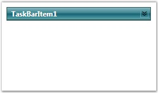
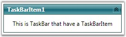

::: {style="DISPLAY: none"}
{#d2h_url_template}{#d2h_package_url style="WIDTH: 0px; DISPLAY: none; HEIGHT: 0px"}
:::

:::: {.d2h_secondary_topic style="PADDING-BOTTOM: 10pt; MARGIN: 0pt; PADDING-LEFT: 0pt; PADDING-RIGHT: 0pt; PADDING-TOP: 0pt"}
#### Adding a TaskBar Item to the TaskBar Control {#adding-a-taskbar-item-to-the-taskbar-control style="tab-stops: 0pt"}

The Task Bar Item is added to the Task Bar by using either XAML or C# coding. Use the following code to add a Task Bar Item to the Task Bar control.

[]{style="FONT-FAMILY: 'Trebuchet MS','sans-serif'; COLOR: #15428b; FONT-SIZE: 9pt"} 

+--------------------------------------------------------------------------------------------------------------------------------------------------------------------------------------------------------------------------------------------------------------------------------------------------------------------------------------------------------------------------------------------------------------------------------------------------------------------------------------------------------------------------------------------------------------------------------------------------------------------------------------+
| **[\[XAML\]]{style="FONT-FAMILY: 'Courier New'; COLOR: black"}**                                                                                                                                                                                                                                                                                                                                                                                                                                                                                                                                                                     |
|                                                                                                                                                                                                                                                                                                                                                                                                                                                                                                                                                                                                                                      |
| []{style="FONT-FAMILY: 'Courier New'; COLOR: black; FONT-SIZE: 9pt"}                                                                                                                                                                                                                                                                                                                                                                                                                                                                                                                                                                 |
|                                                                                                                                                                                                                                                                                                                                                                                                                                                                                                                                                                                                                                      |
| [\<!\-- Adding TaskBar \--\>]{style="FONT-FAMILY: 'Courier New'; COLOR: green; FONT-SIZE: 9pt"}                                                                                                                                                                                                                                                                                                                                                                                                                                                                                                                                      |
|                                                                                                                                                                                                                                                                                                                                                                                                                                                                                                                                                                                                                                      |
| [\<]{style="FONT-FAMILY: 'Courier New'; COLOR: blue; FONT-SIZE: 9pt"}[syncfusion]{style="FONT-FAMILY: 'Courier New'; COLOR: #a31515; FONT-SIZE: 9pt"}[:]{style="FONT-FAMILY: 'Courier New'; COLOR: blue; FONT-SIZE: 9pt"}[TaskBar]{style="FONT-FAMILY: 'Courier New'; COLOR: #a31515; FONT-SIZE: 9pt"}[ Name]{style="FONT-FAMILY: 'Courier New'; COLOR: red; FONT-SIZE: 9pt"}[=\"taskBar\" \>]{style="FONT-FAMILY: 'Courier New'; COLOR: blue; FONT-SIZE: 9pt"}                                                                                                                                                                      |
|                                                                                                                                                                                                                                                                                                                                                                                                                                                                                                                                                                                                                                      |
| []{style="FONT-FAMILY: 'Courier New'; COLOR: blue; FONT-SIZE: 9pt"}                                                                                                                                                                                                                                                                                                                                                                                                                                                                                                                                                                  |
|                                                                                                                                                                                                                                                                                                                                                                                                                                                                                                                                                                                                                                      |
| [\<!\-- Adding TaskBarItem \--\>]{style="FONT-FAMILY: 'Courier New'; COLOR: green; FONT-SIZE: 9pt"}                                                                                                                                                                                                                                                                                                                                                                                                                                                                                                                                  |
|                                                                                                                                                                                                                                                                                                                                                                                                                                                                                                                                                                                                                                      |
| [\<]{style="FONT-FAMILY: 'Courier New'; COLOR: blue; FONT-SIZE: 9pt"}[syncfusion]{style="FONT-FAMILY: 'Courier New'; COLOR: #a31515; FONT-SIZE: 9pt"}[:]{style="FONT-FAMILY: 'Courier New'; COLOR: blue; FONT-SIZE: 9pt"}[TaskBarItem]{style="FONT-FAMILY: 'Courier New'; COLOR: #a31515; FONT-SIZE: 9pt"}[ Name]{style="FONT-FAMILY: 'Courier New'; COLOR: red; FONT-SIZE: 9pt"}[=\"taskBarItem1\"]{style="FONT-FAMILY: 'Courier New'; COLOR: blue; FONT-SIZE: 9pt"}[ Header]{style="FONT-FAMILY: 'Courier New'; COLOR: red; FONT-SIZE: 9pt"}[=\"TaskBarItem1\"\>]{style="FONT-FAMILY: 'Courier New'; COLOR: blue; FONT-SIZE: 9pt"} |
|                                                                                                                                                                                                                                                                                                                                                                                                                                                                                                                                                                                                                                      |
| [\</]{style="FONT-FAMILY: 'Courier New'; COLOR: blue; FONT-SIZE: 9pt"}[syncfusion]{style="FONT-FAMILY: 'Courier New'; COLOR: #a31515; FONT-SIZE: 9pt"}[:]{style="FONT-FAMILY: 'Courier New'; COLOR: blue; FONT-SIZE: 9pt"}[TaskBarItem]{style="FONT-FAMILY: 'Courier New'; COLOR: #a31515; FONT-SIZE: 9pt"}[\>]{style="FONT-FAMILY: 'Courier New'; COLOR: blue; FONT-SIZE: 9pt"}                                                                                                                                                                                                                                                     |
|                                                                                                                                                                                                                                                                                                                                                                                                                                                                                                                                                                                                                                      |
| [\</]{style="FONT-FAMILY: 'Courier New'; COLOR: blue; FONT-SIZE: 9pt"}[syncfusion]{style="FONT-FAMILY: 'Courier New'; COLOR: #a31515; FONT-SIZE: 9pt"}[:]{style="FONT-FAMILY: 'Courier New'; COLOR: blue; FONT-SIZE: 9pt"}[TaskBar]{style="FONT-FAMILY: 'Courier New'; COLOR: #a31515; FONT-SIZE: 9pt"}[\>]{style="FONT-FAMILY: 'Courier New'; COLOR: blue; FONT-SIZE: 9pt"}                                                                                                                                                                                                                                                         |
+--------------------------------------------------------------------------------------------------------------------------------------------------------------------------------------------------------------------------------------------------------------------------------------------------------------------------------------------------------------------------------------------------------------------------------------------------------------------------------------------------------------------------------------------------------------------------------------------------------------------------------------+

[]{style="FONT-FAMILY: 'Trebuchet MS','sans-serif'; COLOR: #15428b; FONT-SIZE: 9pt"} 

+----------------------------------------------------------------------------------------------------------------------------------------------------------------------------------------------------------------------------+
| **[\[C#\]]{style="FONT-FAMILY: 'Courier New'; COLOR: black"}**                                                                                                                                                             |
|                                                                                                                                                                                                                            |
| []{style="FONT-FAMILY: 'Courier New'; COLOR: black; FONT-SIZE: 9pt"}                                                                                                                                                       |
|                                                                                                                                                                                                                            |
| [//Creating an instance for TaskBar]{style="FONT-FAMILY: 'Courier New'; COLOR: green; FONT-SIZE: 9pt"}                                                                                                                     |
|                                                                                                                                                                                                                            |
| [TaskBar]{style="FONT-FAMILY: 'Courier New'; COLOR: #2b91af; FONT-SIZE: 9pt"}[ taskBar = [new]{style="COLOR: blue"} [TaskBar]{style="COLOR: #2b91af"}();]{style="FONT-FAMILY: 'Courier New'; FONT-SIZE: 9pt"}              |
|                                                                                                                                                                                                                            |
| []{style="FONT-FAMILY: 'Courier New'; FONT-SIZE: 9pt"}                                                                                                                                                                     |
|                                                                                                                                                                                                                            |
| [//Creating an instance for TaskBarItem]{style="FONT-FAMILY: 'Courier New'; COLOR: green; FONT-SIZE: 9pt"}                                                                                                                 |
|                                                                                                                                                                                                                            |
| [TaskBarItem]{style="FONT-FAMILY: 'Courier New'; COLOR: #2b91af; FONT-SIZE: 9pt"}[ taskBarItem1 = [new]{style="COLOR: blue"} [TaskBarItem]{style="COLOR: #2b91af"}();]{style="FONT-FAMILY: 'Courier New'; FONT-SIZE: 9pt"} |
|                                                                                                                                                                                                                            |
| []{style="FONT-FAMILY: 'Courier New'; COLOR: green; FONT-SIZE: 9pt"}                                                                                                                                                       |
|                                                                                                                                                                                                                            |
| [//Setting the header of TaskBarItem1]{style="FONT-FAMILY: 'Courier New'; COLOR: green; FONT-SIZE: 9pt"}                                                                                                                   |
|                                                                                                                                                                                                                            |
| [taskBarItem1.Header = [\"TaskBarItem1\"]{style="COLOR: #a31515"};]{style="FONT-FAMILY: 'Courier New'; FONT-SIZE: 9pt"}                                                                                                    |
|                                                                                                                                                                                                                            |
| []{style="FONT-FAMILY: 'Courier New'; COLOR: green; FONT-SIZE: 9pt"}                                                                                                                                                       |
|                                                                                                                                                                                                                            |
| [//Adding the TaskBarItem to TaskBar]{style="FONT-FAMILY: 'Courier New'; COLOR: green; FONT-SIZE: 9pt"}                                                                                                                    |
|                                                                                                                                                                                                                            |
| [taskBar.Items.Add(taskBarItem1);]{style="FONT-FAMILY: 'Courier New'; FONT-SIZE: 9pt"}                                                                                                                                     |
|                                                                                                                                                                                                                            |
| []{style="FONT-FAMILY: 'Courier New'; COLOR: green; FONT-SIZE: 9pt"}                                                                                                                                                       |
|                                                                                                                                                                                                                            |
| [//Adding TaskBar as content of window]{style="FONT-FAMILY: 'Courier New'; COLOR: green; FONT-SIZE: 9pt"}                                                                                                                  |
|                                                                                                                                                                                                                            |
| [this]{style="FONT-FAMILY: 'Courier New'; COLOR: blue; FONT-SIZE: 9pt"}[.Content = taskBar; ]{style="FONT-FAMILY: 'Courier New'; FONT-SIZE: 9pt"}                                                                          |
+----------------------------------------------------------------------------------------------------------------------------------------------------------------------------------------------------------------------------+

[]{style="FONT-FAMILY: 'Trebuchet MS','sans-serif'; COLOR: #15428b; FONT-SIZE: 9pt"} 

The following screen shot shows the TaskBar control with TaskBar Item.

 

{border="0"}

*[]{style="FONT-FAMILY: 'Trebuchet MS','sans-serif'; COLOR: #15428b; FONT-SIZE: 9pt"}* 

Figure 1042: TaskBar Item Added to the TaskBar

**[]{style="FONT-FAMILY: 'Trebuchet MS','sans-serif'; COLOR: #15428b; FONT-SIZE: 9pt"}** 

Adding Content to TaskBar Item

[]{style="FONT-FAMILY: 'Trebuchet MS','sans-serif'; COLOR: #15428b; FONT-SIZE: 9pt"} 

To add text to the TaskBar Item, use the below code

[]{style="FONT-FAMILY: 'Trebuchet MS','sans-serif'; COLOR: #15428b; FONT-SIZE: 9pt"} 

+---------------------------------------------------------------------------------------------------------------------------------------------------------------------------------------------------------------------------------------------------------------------------------------------------------------------------------------------------------------------------------------------------------------------------------------------------------------------------------------------------------------------------------------------------------------------------------------------------------------------------------------------------------+
| **[\[XAML\]]{style="FONT-FAMILY: 'Courier New'; COLOR: black"}**                                                                                                                                                                                                                                                                                                                                                                                                                                                                                                                                                                                        |
|                                                                                                                                                                                                                                                                                                                                                                                                                                                                                                                                                                                                                                                         |
| []{style="FONT-FAMILY: 'Courier New'; COLOR: black; FONT-SIZE: 9pt"}                                                                                                                                                                                                                                                                                                                                                                                                                                                                                                                                                                                    |
|                                                                                                                                                                                                                                                                                                                                                                                                                                                                                                                                                                                                                                                         |
| [\<!\-- Adding TaskBar  \--\>]{style="FONT-FAMILY: 'Courier New'; COLOR: green; FONT-SIZE: 9pt"}                                                                                                                                                                                                                                                                                                                                                                                                                                                                                                                                                        |
|                                                                                                                                                                                                                                                                                                                                                                                                                                                                                                                                                                                                                                                         |
| [\<]{style="FONT-FAMILY: 'Courier New'; COLOR: blue; FONT-SIZE: 9pt"}[syncfusion]{style="FONT-FAMILY: 'Courier New'; COLOR: #a31515; FONT-SIZE: 9pt"}[:]{style="FONT-FAMILY: 'Courier New'; COLOR: blue; FONT-SIZE: 9pt"}[TaskBar]{style="FONT-FAMILY: 'Courier New'; COLOR: #a31515; FONT-SIZE: 9pt"}[ Name]{style="FONT-FAMILY: 'Courier New'; COLOR: red; FONT-SIZE: 9pt"}[=\"taskBar\" \>]{style="FONT-FAMILY: 'Courier New'; COLOR: blue; FONT-SIZE: 9pt"}                                                                                                                                                                                         |
|                                                                                                                                                                                                                                                                                                                                                                                                                                                                                                                                                                                                                                                         |
| []{style="FONT-FAMILY: 'Courier New'; COLOR: blue; FONT-SIZE: 9pt"}                                                                                                                                                                                                                                                                                                                                                                                                                                                                                                                                                                                     |
|                                                                                                                                                                                                                                                                                                                                                                                                                                                                                                                                                                                                                                                         |
| [\<!\-- Adding TaskBarItem \--\>]{style="FONT-FAMILY: 'Courier New'; COLOR: green; FONT-SIZE: 9pt"}                                                                                                                                                                                                                                                                                                                                                                                                                                                                                                                                                     |
|                                                                                                                                                                                                                                                                                                                                                                                                                                                                                                                                                                                                                                                         |
| [\<]{style="FONT-FAMILY: 'Courier New'; COLOR: blue; FONT-SIZE: 9pt"}[syncfusion]{style="FONT-FAMILY: 'Courier New'; COLOR: #a31515; FONT-SIZE: 9pt"}[:]{style="FONT-FAMILY: 'Courier New'; COLOR: blue; FONT-SIZE: 9pt"}[TaskBarItem]{style="FONT-FAMILY: 'Courier New'; COLOR: #a31515; FONT-SIZE: 9pt"}[ Name]{style="FONT-FAMILY: 'Courier New'; COLOR: red; FONT-SIZE: 9pt"}[=\"taskBarItem1\"]{style="FONT-FAMILY: 'Courier New'; COLOR: blue; FONT-SIZE: 9pt"}[ Header]{style="FONT-FAMILY: 'Courier New'; COLOR: red; FONT-SIZE: 9pt"}[=\"TaskBarItem1\"\>]{style="FONT-FAMILY: 'Courier New'; COLOR: blue; FONT-SIZE: 9pt"}                    |
|                                                                                                                                                                                                                                                                                                                                                                                                                                                                                                                                                                                                                                                         |
| []{style="FONT-FAMILY: 'Courier New'; COLOR: green; FONT-SIZE: 9pt"}                                                                                                                                                                                                                                                                                                                                                                                                                                                                                                                                                                                    |
|                                                                                                                                                                                                                                                                                                                                                                                                                                                                                                                                                                                                                                                         |
| [\<!\-- Adding content to TaskBarItem \--\>]{style="FONT-FAMILY: 'Courier New'; COLOR: green; FONT-SIZE: 9pt"}                                                                                                                                                                                                                                                                                                                                                                                                                                                                                                                                          |
|                                                                                                                                                                                                                                                                                                                                                                                                                                                                                                                                                                                                                                                         |
| [\<]{style="FONT-FAMILY: 'Courier New'; COLOR: blue; FONT-SIZE: 9pt"}[StackPanel]{style="FONT-FAMILY: 'Courier New'; COLOR: #a31515; FONT-SIZE: 9pt"}[ Margin]{style="FONT-FAMILY: 'Courier New'; COLOR: red; FONT-SIZE: 9pt"}[=\"10\"]{style="FONT-FAMILY: 'Courier New'; COLOR: blue; FONT-SIZE: 9pt"}[ HorizontalAlignment]{style="FONT-FAMILY: 'Courier New'; COLOR: red; FONT-SIZE: 9pt"}[=\"Center\"]{style="FONT-FAMILY: 'Courier New'; COLOR: blue; FONT-SIZE: 9pt"}[ [VerticalAlignment]{style="COLOR: red"}[=\"Stretch\"\>]{style="COLOR: blue"}]{style="FONT-FAMILY: 'Courier New'; FONT-SIZE: 9pt"}                                         |
|                                                                                                                                                                                                                                                                                                                                                                                                                                                                                                                                                                                                                                                         |
| [\<]{style="FONT-FAMILY: 'Courier New'; COLOR: blue; FONT-SIZE: 9pt"}[TextBlock]{style="FONT-FAMILY: 'Courier New'; COLOR: #a31515; FONT-SIZE: 9pt"}[ TextWrapping]{style="FONT-FAMILY: 'Courier New'; COLOR: red; FONT-SIZE: 9pt"}[=\"Wrap\"\> ]{style="FONT-FAMILY: 'Courier New'; COLOR: blue; FONT-SIZE: 9pt"}[This TaskBar that have a TaskBarItem.]{style="FONT-FAMILY: 'Courier New'; COLOR: #a31515; FONT-SIZE: 9pt"}[\</]{style="FONT-FAMILY: 'Courier New'; COLOR: blue; FONT-SIZE: 9pt"}[TextBlock]{style="FONT-FAMILY: 'Courier New'; COLOR: #a31515; FONT-SIZE: 9pt"}[\>]{style="FONT-FAMILY: 'Courier New'; COLOR: blue; FONT-SIZE: 9pt"} |
|                                                                                                                                                                                                                                                                                                                                                                                                                                                                                                                                                                                                                                                         |
| [\</]{style="FONT-FAMILY: 'Courier New'; COLOR: blue; FONT-SIZE: 9pt"}[StackPanel]{style="FONT-FAMILY: 'Courier New'; COLOR: #a31515; FONT-SIZE: 9pt"}[\>]{style="FONT-FAMILY: 'Courier New'; COLOR: blue; FONT-SIZE: 9pt"}                                                                                                                                                                                                                                                                                                                                                                                                                             |
|                                                                                                                                                                                                                                                                                                                                                                                                                                                                                                                                                                                                                                                         |
| [\</]{style="FONT-FAMILY: 'Courier New'; COLOR: blue; FONT-SIZE: 9pt"}[syncfusion]{style="FONT-FAMILY: 'Courier New'; COLOR: #a31515; FONT-SIZE: 9pt"}[:]{style="FONT-FAMILY: 'Courier New'; COLOR: blue; FONT-SIZE: 9pt"}[TaskBarItem]{style="FONT-FAMILY: 'Courier New'; COLOR: #a31515; FONT-SIZE: 9pt"}[\>]{style="FONT-FAMILY: 'Courier New'; COLOR: blue; FONT-SIZE: 9pt"}                                                                                                                                                                                                                                                                        |
|                                                                                                                                                                                                                                                                                                                                                                                                                                                                                                                                                                                                                                                         |
| [\</]{style="FONT-FAMILY: 'Courier New'; COLOR: blue; FONT-SIZE: 9pt"}[syncfusion]{style="FONT-FAMILY: 'Courier New'; COLOR: #a31515; FONT-SIZE: 9pt"}[:]{style="FONT-FAMILY: 'Courier New'; COLOR: blue; FONT-SIZE: 9pt"}[TaskBar]{style="FONT-FAMILY: 'Courier New'; COLOR: #a31515; FONT-SIZE: 9pt"}[\>]{style="FONT-FAMILY: 'Courier New'; COLOR: blue; FONT-SIZE: 9pt"}                                                                                                                                                                                                                                                                            |
+---------------------------------------------------------------------------------------------------------------------------------------------------------------------------------------------------------------------------------------------------------------------------------------------------------------------------------------------------------------------------------------------------------------------------------------------------------------------------------------------------------------------------------------------------------------------------------------------------------------------------------------------------------+

[]{style="FONT-FAMILY: 'Trebuchet MS','sans-serif'; COLOR: #15428b; FONT-SIZE: 9pt"} 

+----------------------------------------------------------------------------------------------------------------------------------------------------------------------------------------------------------------------------+
| **[\[C#\]]{style="FONT-FAMILY: 'Courier New'; COLOR: black"}**                                                                                                                                                             |
|                                                                                                                                                                                                                            |
| []{style="FONT-FAMILY: 'Courier New'; COLOR: black; FONT-SIZE: 9pt"}                                                                                                                                                       |
|                                                                                                                                                                                                                            |
| [//Creating an instance for TaskBar]{style="FONT-FAMILY: 'Courier New'; COLOR: green; FONT-SIZE: 9pt"}                                                                                                                     |
|                                                                                                                                                                                                                            |
| [TaskBar]{style="FONT-FAMILY: 'Courier New'; COLOR: #2b91af; FONT-SIZE: 9pt"}[ taskBar = [new]{style="COLOR: blue"} [TaskBar]{style="COLOR: #2b91af"}();]{style="FONT-FAMILY: 'Courier New'; FONT-SIZE: 9pt"}              |
|                                                                                                                                                                                                                            |
| []{style="FONT-FAMILY: 'Courier New'; FONT-SIZE: 9pt"}                                                                                                                                                                     |
|                                                                                                                                                                                                                            |
| [//Creating an instance for TaskBarItem]{style="FONT-FAMILY: 'Courier New'; COLOR: green; FONT-SIZE: 9pt"}                                                                                                                 |
|                                                                                                                                                                                                                            |
| [TaskBarItem]{style="FONT-FAMILY: 'Courier New'; COLOR: #2b91af; FONT-SIZE: 9pt"}[ taskBarItem1 = [new]{style="COLOR: blue"} [TaskBarItem]{style="COLOR: #2b91af"}();]{style="FONT-FAMILY: 'Courier New'; FONT-SIZE: 9pt"} |
|                                                                                                                                                                                                                            |
| []{style="FONT-FAMILY: 'Courier New'; COLOR: green; FONT-SIZE: 9pt"}                                                                                                                                                       |
|                                                                                                                                                                                                                            |
| [//Setting the header of TaskBarItem1]{style="FONT-FAMILY: 'Courier New'; COLOR: green; FONT-SIZE: 9pt"}                                                                                                                   |
|                                                                                                                                                                                                                            |
| [taskBarItem1.Header = [\"TaskBarItem1\"]{style="COLOR: #a31515"};]{style="FONT-FAMILY: 'Courier New'; FONT-SIZE: 9pt"}                                                                                                    |
|                                                                                                                                                                                                                            |
| []{style="FONT-FAMILY: 'Courier New'; COLOR: green; FONT-SIZE: 9pt"}                                                                                                                                                       |
|                                                                                                                                                                                                                            |
| [// Creating instance for TextBlock]{style="FONT-FAMILY: 'Courier New'; COLOR: green; FONT-SIZE: 9pt"}                                                                                                                     |
|                                                                                                                                                                                                                            |
| [TextBlock]{style="FONT-FAMILY: 'Courier New'; COLOR: #2b91af; FONT-SIZE: 9pt"}[ textBlock1 = [new]{style="COLOR: blue"} [TextBlock]{style="COLOR: #2b91af"}();]{style="FONT-FAMILY: 'Courier New'; FONT-SIZE: 9pt"}       |
|                                                                                                                                                                                                                            |
| []{style="FONT-FAMILY: 'Courier New'; COLOR: green; FONT-SIZE: 9pt"}                                                                                                                                                       |
|                                                                                                                                                                                                                            |
| [// Adding text to textblock]{style="FONT-FAMILY: 'Courier New'; COLOR: green; FONT-SIZE: 9pt"}                                                                                                                            |
|                                                                                                                                                                                                                            |
| [textBlock1.Text = [\"This TaskBar that have a TaskBarItem.\"]{style="COLOR: #a31515"};]{style="FONT-FAMILY: 'Courier New'; FONT-SIZE: 9pt"}                                                                               |
|                                                                                                                                                                                                                            |
| []{style="FONT-FAMILY: 'Courier New'; COLOR: green; FONT-SIZE: 9pt"}                                                                                                                                                       |
|                                                                                                                                                                                                                            |
| [// Adding textblock to taskbaritem]{style="FONT-FAMILY: 'Courier New'; COLOR: green; FONT-SIZE: 9pt"}                                                                                                                     |
|                                                                                                                                                                                                                            |
| [taskBarItem1.Items.Add(textBlock1);          ]{style="FONT-FAMILY: 'Courier New'; FONT-SIZE: 9pt"}                                                                                                                        |
|                                                                                                                                                                                                                            |
| []{style="FONT-FAMILY: 'Courier New'; COLOR: green; FONT-SIZE: 9pt"}                                                                                                                                                       |
|                                                                                                                                                                                                                            |
| [//Adding the TaskBarItem to TaskBar]{style="FONT-FAMILY: 'Courier New'; COLOR: green; FONT-SIZE: 9pt"}                                                                                                                    |
|                                                                                                                                                                                                                            |
| [taskBar.Items.Add(taskBarItem1);             ]{style="FONT-FAMILY: 'Courier New'; FONT-SIZE: 9pt"}                                                                                                                        |
|                                                                                                                                                                                                                            |
| []{style="FONT-FAMILY: 'Courier New'; COLOR: green; FONT-SIZE: 9pt"}                                                                                                                                                       |
|                                                                                                                                                                                                                            |
| [//Adding TaskBar as content of window]{style="FONT-FAMILY: 'Courier New'; COLOR: green; FONT-SIZE: 9pt"}                                                                                                                  |
|                                                                                                                                                                                                                            |
| [this]{style="FONT-FAMILY: 'Courier New'; COLOR: blue; FONT-SIZE: 9pt"}[.Content = taskBar; ]{style="FONT-FAMILY: 'Courier New'; FONT-SIZE: 9pt"}                                                                          |
+----------------------------------------------------------------------------------------------------------------------------------------------------------------------------------------------------------------------------+

[]{style="FONT-FAMILY: 'Trebuchet MS','sans-serif'; COLOR: #15428b; FONT-SIZE: 9pt"} 

::: {style="BORDER-BOTTOM: windowtext 1pt solid; BORDER-LEFT: medium none; PADDING-BOTTOM: 1pt; MARGIN-TOP: 9pt; PADDING-LEFT: 0pt; PADDING-RIGHT: 0pt; MARGIN-BOTTOM: 9pt; BORDER-TOP: windowtext 1pt solid; BORDER-RIGHT: medium none; PADDING-TOP: 1pt"}
{border="0"}Note: To display the TaskBar Item, you must already have the TaskBar in which you are going to add the TaskBar Item.
:::

[]{style="FONT-FAMILY: 'Trebuchet MS','sans-serif'; COLOR: #15428b; FONT-SIZE: 9pt"} 

The following screen shot illustrates how text has been added to the TaskBar Item.

[]{style="FONT-FAMILY: 'Trebuchet MS','sans-serif'; COLOR: #15428b; FONT-SIZE: 9pt"} 

{border="0"}

*[]{style="FONT-FAMILY: 'Trebuchet MS','sans-serif'; COLOR: #15428b; FONT-SIZE: 9pt"}* 

Figure 1043:Text Added to the TaskBar Item

 

[]{#p557} 

[]{#related-topics}
::::
