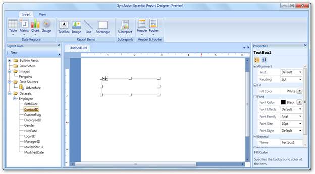
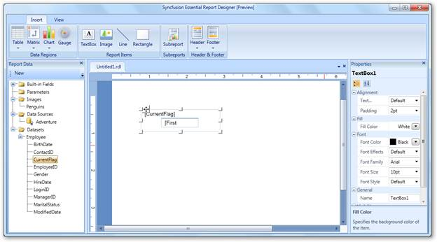

::: {style="DISPLAY: none"}
{#d2h_url_template}{#d2h_package_url style="WIDTH: 0px; DISPLAY: none; HEIGHT: 0px"}
:::

::::: {#nsbanner .d2h_main_nsbanner style="BORDER-BOTTOM: #999999 1px solid; POSITION: relative; PADDING-BOTTOM: 0px; BACKGROUND-COLOR: transparent; PADDING-LEFT: 0px; PADDING-RIGHT: 0px; DISPLAY: none; BORDER-TOP: #999999 1px solid; PADDING-TOP: 0px; LEFT: 0px"}
:::: {#TitleRow .d2h_main_titlerow style="PADDING-BOTTOM: 4px; BACKGROUND-COLOR: transparent; PADDING-LEFT: 22px; WIDTH: 100%; PADDING-RIGHT: 10px; DISPLAY: none; PADDING-TOP: 4px"}
::: {#ienav .d2h_main_ienav style="DISPLAY: none"}
{#D2HPrevious .D2HPreviousEnabled}  {#D2HNext .D2HNextEnabled}
:::
::::
:::::

::: {#nstext .d2h_main_nstext style="PADDING-BOTTOM: 10px; BACKGROUND-COLOR: transparent; PADDING-LEFT: 22px; PADDING-RIGHT: 10px; HEIGHT: 100%; OVERFLOW: auto; PADDING-TOP: 5px" hasuserbackground="true" valign="bottom"}
## Adding a Text Box to Report Designer {#adding-a-text-box-to-report-designer style="tab-stops: 0pt"}

You can insert a text box in the Report Designer and drag report items to the text box by using following steps.

 

1.   Click **Insert** tab

2.   Drag **TextBox** to the Report Designer panel. A text box will appear on the Report Designer window**.**

 

       {border="0"}

Figure 28: Report Designer with Text Box

 

3.   To add the first value of the data field, drag the data field from the **Report Data** to the added text box.

 

{border="0"}[]{style="FONT-FAMILY: 'Calibri','sans-serif'"}

Figure 29: Text Box with Data Field[]{style="FONT-FAMILY: 'Calibri','sans-serif'"}

More:

[ ]{#related-topics}

[{border="0" align="absMiddle"}Applying Styles to the Text Box](ms-xhelp:///?Id=bae4d506-5287-47e6-bcdf-aeeb443400d9){style="TEXT-DECORATION: none"}
:::
