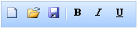

::: {style="DISPLAY: none"}
{#d2h_url_template}{#d2h_package_url style="WIDTH: 0px; DISPLAY: none; HEIGHT: 0px"}
:::

::::: {#nsbanner .d2h_main_nsbanner style="BORDER-BOTTOM: #999999 1px solid; POSITION: relative; PADDING-BOTTOM: 0px; BACKGROUND-COLOR: transparent; PADDING-LEFT: 0px; PADDING-RIGHT: 0px; DISPLAY: none; BORDER-TOP: #999999 1px solid; PADDING-TOP: 0px; LEFT: 0px"}
:::: {#TitleRow .d2h_main_titlerow style="PADDING-BOTTOM: 4px; BACKGROUND-COLOR: transparent; PADDING-LEFT: 22px; WIDTH: 100%; PADDING-RIGHT: 10px; DISPLAY: none; PADDING-TOP: 4px"}
::: {#ienav .d2h_main_ienav style="DISPLAY: none"}
{#D2HPrevious .D2HPreviousEnabled}  {#D2HNext .D2HNextEnabled}
:::
::::
:::::

:::::::: {#nstext .d2h_main_nstext style="PADDING-BOTTOM: 10px; BACKGROUND-COLOR: transparent; PADDING-LEFT: 22px; PADDING-RIGHT: 10px; HEIGHT: 100%; OVERFLOW: auto; PADDING-TOP: 5px" hasuserbackground="true" valign="bottom"}
::: {#d2h_breadcrumbs .d2h_breadcrumbs}
[Essential Studio User Guide Documentation](ms-xhelp:///?Id=12457748-09e3-4d74-a240-8e049cedf030){.d2h_breadcrumbsNormal}[ \> ]{.d2h_breadcrumbsLinkSeparator}[User Interface Edition](ms-xhelp:///?Id=c29296b7-531c-413b-a0ec-488ca1f7f669){.d2h_breadcrumbsNormal}[ \> ]{.d2h_breadcrumbsLinkSeparator}[Essential ASP.NET MVC](ms-xhelp:///?Id=4b14e7d1-65c4-4f67-b1aa-2c37709905a5){.d2h_breadcrumbsNormal}[ \> ]{.d2h_breadcrumbsLinkSeparator}[Essential Tools]{.d2h_breadcrumbsContentsOnly}[ \> ]{.d2h_breadcrumbsLinkSeparator}[Controls and Components](ms-xhelp:///?Id=f0af2fff-6f00-4ca4-85a6-54e41ac5dc96){.d2h_breadcrumbsNormal}[ \> ]{.d2h_breadcrumbsLinkSeparator}[Toolbar](ms-xhelp:///?Id=94b7c290-979a-4cd5-a731-2790fa7b2a94){.d2h_breadcrumbsNormal}
:::

### Adding a Toolbar Control to an ASP.NET MVC Application*[[]{style="FONT-FAMILY: 'Calibri','sans-serif'; COLOR: #4f81bd; FONT-SIZE: 9pt"}]{.underline}* {#adding-a-toolbar-control-to-an-asp.net-mvc-application style="tab-stops: 0pt"}

Refer to the [Getting Started]{.UGHyperlink} section for the prerequisites needed to add a toolbar control to an ASP.NET MVC application.**

**[]{style="FONT-FAMILY: 'Calibri','sans-serif'; FONT-SIZE: 12pt"}** 

Using Builder

The following steps explain how to add a toolbar to an MVC application through the builder.

1.   In **View**, create a *ul* or *li* list of toolbar items and invoke the toolbar helper.

[]{style="FONT-FAMILY: 'Calibri','sans-serif'"} 

+--------------------------------------------------------------------------------------------------------------------------------------------------------------------------------------------------------------------------------------------------------------------------------------------------------------------------------------------------------------------------------------------------------------------------+
| **View\[ASPX\]**                                                                                                                                                                                                                                                                                                                                                                                                         |
|                                                                                                                                                                                                                                                                                                                                                                                                                          |
| [\<]{style="FONT-FAMILY: 'Courier New'; COLOR: blue"}[div]{style="FONT-FAMILY: 'Courier New'; COLOR: maroon"}[ [id]{style="COLOR: red"}[=\"toolbarItems\"]{style="COLOR: blue"} [style]{style="COLOR: red"}[=\"]{style="COLOR: blue"}[visibility]{style="COLOR: red"}[:hidden\"\>]{style="COLOR: blue"}]{style="FONT-FAMILY: 'Courier New'"}                                                                             |
|                                                                                                                                                                                                                                                                                                                                                                                                                          |
| [     [\<]{style="COLOR: blue"}[ul]{style="COLOR: maroon"}[\>]{style="COLOR: blue"}]{style="FONT-FAMILY: 'Courier New'"}                                                                                                                                                                                                                                                                                                 |
|                                                                                                                                                                                                                                                                                                                                                                                                                          |
| [         [\<]{style="COLOR: blue"}[li]{style="COLOR: maroon"} [id]{style="COLOR: red"}[=\"New\"]{style="COLOR: blue"} [title]{style="COLOR: red"}[=\"New \[Ctrl + N\]\"\>]{style="COLOR: blue"}]{style="FONT-FAMILY: 'Courier New'"}                                                                                                                                                                                    |
|                                                                                                                                                                                                                                                                                                                                                                                                                          |
| [             [\<]{style="COLOR: blue"}[img]{style="COLOR: maroon"} [src]{style="COLOR: red"}[=\']{style="COLOR: blue"}[\<%]{style="BACKGROUND: yellow"}[=]{style="COLOR: blue"} Url.Content(\"\~/Content/new.gif\")[%\>]{style="BACKGROUND: yellow"}[\']{style="COLOR: blue"} [/\>\</]{style="COLOR: blue"}[li]{style="COLOR: maroon"}[\>]{style="COLOR: blue"}          ]{style="FONT-FAMILY: 'Courier New'"}          |
|                                                                                                                                                                                                                                                                                                                                                                                                                          |
| [          [\<]{style="COLOR: blue"}[li]{style="COLOR: maroon"} [id]{style="COLOR: red"}[=\"Open\"]{style="COLOR: blue"} [title]{style="COLOR: red"}[=\"Open file\]\"\>]{style="COLOR: blue"}]{style="FONT-FAMILY: 'Courier New'"}                                                                                                                                                                                       |
|                                                                                                                                                                                                                                                                                                                                                                                                                          |
| [               [\<]{style="COLOR: blue"}[img]{style="COLOR: maroon"} [src]{style="COLOR: red"}[=\']{style="COLOR: blue"}[\<%]{style="BACKGROUND: yellow"}[=]{style="COLOR: blue"} Url.Content(\"\~/Content/openremote.gif\")[%\>]{style="BACKGROUND: yellow"}[\']{style="COLOR: blue"} [/\>\</]{style="COLOR: blue"}[li]{style="COLOR: maroon"}[\>]{style="COLOR: blue"}          ]{style="FONT-FAMILY: 'Courier New'"} |
|                                                                                                                                                                                                                                                                                                                                                                                                                          |
| [          [\<]{style="COLOR: blue"}[li]{style="COLOR: maroon"} [id]{style="COLOR: red"}[=\"Save\"]{style="COLOR: blue"} [title]{style="COLOR: red"}[=\"Save \[Ctrl + S\]\"\>]{style="COLOR: blue"}]{style="FONT-FAMILY: 'Courier New'"}                                                                                                                                                                                 |
|                                                                                                                                                                                                                                                                                                                                                                                                                          |
| [               [\<]{style="COLOR: blue"}[img]{style="COLOR: maroon"} [src]{style="COLOR: red"}[=\']{style="COLOR: blue"}[\<%]{style="BACKGROUND: yellow"}[=]{style="COLOR: blue"} Url.Content(\"\~/Content/savelocal.gif\")[%\>]{style="BACKGROUND: yellow"}[\']{style="COLOR: blue"} [/\>\</]{style="COLOR: blue"}[li]{style="COLOR: maroon"}[\>]{style="COLOR: blue"}]{style="FONT-FAMILY: 'Courier New'"}            |
|                                                                                                                                                                                                                                                                                                                                                                                                                          |
| [      \</]{style="FONT-FAMILY: 'Courier New'; COLOR: blue"}[ul]{style="FONT-FAMILY: 'Courier New'; COLOR: maroon"}[\>]{style="FONT-FAMILY: 'Courier New'; COLOR: blue"}[]{style="FONT-FAMILY: 'Courier New'"}                                                                                                                                                                                                           |
|                                                                                                                                                                                                                                                                                                                                                                                                                          |
| []{style="FONT-FAMILY: 'Courier New'"}                                                                                                                                                                                                                                                                                                                                                                                   |
|                                                                                                                                                                                                                                                                                                                                                                                                                          |
| [       ]{style="FONT-FAMILY: 'Courier New'"}                                                                                                                                                                                                                                                                                                                                                                            |
|                                                                                                                                                                                                                                                                                                                                                                                                                          |
| [       [\<]{style="COLOR: blue"}[ul]{style="COLOR: maroon"}[\>]{style="COLOR: blue"}]{style="FONT-FAMILY: 'Courier New'"}                                                                                                                                                                                                                                                                                               |
|                                                                                                                                                                                                                                                                                                                                                                                                                          |
| [          [\<]{style="COLOR: blue"}[li]{style="COLOR: maroon"} [id]{style="COLOR: red"}[=\"Bold\"]{style="COLOR: blue"} [tilte]{style="COLOR: red"}[=\"Bold \[Ctrl + B\]\"\>]{style="COLOR: blue"}]{style="FONT-FAMILY: 'Courier New'"}                                                                                                                                                                                 |
|                                                                                                                                                                                                                                                                                                                                                                                                                          |
| [              [\<]{style="COLOR: blue"}[img]{style="COLOR: maroon"} [src]{style="COLOR: red"}[=\']{style="COLOR: blue"}[\<%]{style="BACKGROUND: yellow"}[=]{style="COLOR: blue"} Url.Content(\"\~/Content/bold.gif\")[%\>]{style="BACKGROUND: yellow"}[\']{style="COLOR: blue"} [/\>\</]{style="COLOR: blue"}[li]{style="COLOR: maroon"}[\>          ]{style="COLOR: blue"}]{style="FONT-FAMILY: 'Courier New'"}        |
|                                                                                                                                                                                                                                                                                                                                                                                                                          |
| [          [\<]{style="COLOR: blue"}[li]{style="COLOR: maroon"} [id]{style="COLOR: red"}[=\"Italic\"]{style="COLOR: blue"} [tilte]{style="COLOR: red"}[=\"Bold \[Ctrl + I\]\"\>]{style="COLOR: blue"}]{style="FONT-FAMILY: 'Courier New'"}                                                                                                                                                                               |
|                                                                                                                                                                                                                                                                                                                                                                                                                          |
| [              [\<]{style="COLOR: blue"}[img]{style="COLOR: maroon"} [src]{style="COLOR: red"}[=\']{style="COLOR: blue"}[\<%]{style="BACKGROUND: yellow"}[=]{style="COLOR: blue"} Url.Content(\"\~/Content/italic.gif\")[%\>]{style="BACKGROUND: yellow"}[\']{style="COLOR: blue"} [/\>\</]{style="COLOR: blue"}[li]{style="COLOR: maroon"}[\>          ]{style="COLOR: blue"}]{style="FONT-FAMILY: 'Courier New'"}      |
|                                                                                                                                                                                                                                                                                                                                                                                                                          |
| [          [\<]{style="COLOR: blue"}[li]{style="COLOR: maroon"} [id]{style="COLOR: red"}[=\"Underline\"]{style="COLOR: blue"} [tilte]{style="COLOR: red"}[=\"Bold \[Ctrl + U\]\"\>]{style="COLOR: blue"}]{style="FONT-FAMILY: 'Courier New'"}                                                                                                                                                                            |
|                                                                                                                                                                                                                                                                                                                                                                                                                          |
| [              [\<]{style="COLOR: blue"}[img]{style="COLOR: maroon"} [src]{style="COLOR: red"}[=\']{style="COLOR: blue"}[\<%]{style="BACKGROUND: yellow"}[=]{style="COLOR: blue"} Url.Content(\"\~/Content/underline.gif\")[%\>]{style="BACKGROUND: yellow"}[\']{style="COLOR: blue"} [/\>\</]{style="COLOR: blue"}[li]{style="COLOR: maroon"}[\>]{style="COLOR: blue"}]{style="FONT-FAMILY: 'Courier New'"}             |
|                                                                                                                                                                                                                                                                                                                                                                                                                          |
| [       [\</]{style="COLOR: blue"}[ul]{style="COLOR: maroon"}[\>]{style="COLOR: blue"}]{style="FONT-FAMILY: 'Courier New'"}                                                                                                                                                                                                                                                                                              |
|                                                                                                                                                                                                                                                                                                                                                                                                                          |
| [   [\</]{style="COLOR: blue"}[div]{style="COLOR: maroon"}[\>]{style="COLOR: blue"}]{style="FONT-FAMILY: 'Courier New'"}                                                                                                                                                                                                                                                                                                 |
|                                                                                                                                                                                                                                                                                                                                                                                                                          |
| [    [\<%]{style="BACKGROUND: yellow"}[=]{style="COLOR: blue"}Html.Syncfusion().Toolbar([\"myToolbar\"]{style="COLOR: #a31515"})]{style="FONT-FAMILY: 'Courier New'"}                                                                                                                                                                                                                                                    |
|                                                                                                                                                                                                                                                                                                                                                                                                                          |
| [        **.TargetId([\"toolbarItems\"]{style="COLOR: #a31515"})**[%\>]{style="BACKGROUND: yellow"}]{style="FONT-FAMILY: 'Courier New'"}                                                                                                                                                                                                                                                                                 |
|                                                                                                                                                                                                                                                                                                                                                                                                                          |
| **[]{style="FONT-FAMILY: 'Courier New'"}**                                                                                                                                                                                                                                                                                                                                                                               |
+--------------------------------------------------------------------------------------------------------------------------------------------------------------------------------------------------------------------------------------------------------------------------------------------------------------------------------------------------------------------------------------------------------------------------+

 

+--------------------------------------------------------------------------------------------------------------------------------------------------------------------------------------------------------------------------------------------------------------------------------------------------------------------------------------------------------------+
| **View\[cshtml\]**                                                                                                                                                                                                                                                                                                                                           |
|                                                                                                                                                                                                                                                                                                                                                              |
| [\<]{style="FONT-FAMILY: 'Courier New'; COLOR: blue"}[div]{style="FONT-FAMILY: 'Courier New'; COLOR: maroon"}[ [id]{style="COLOR: red"}[=\"toolbarItems\"]{style="COLOR: blue"} [style]{style="COLOR: red"}[=\"]{style="COLOR: blue"}[visibility]{style="COLOR: red"}[:hidden\"\>]{style="COLOR: blue"}]{style="FONT-FAMILY: 'Courier New'"}                 |
|                                                                                                                                                                                                                                                                                                                                                              |
| [     [\<]{style="COLOR: blue"}[ul]{style="COLOR: maroon"}[\>]{style="COLOR: blue"}]{style="FONT-FAMILY: 'Courier New'"}                                                                                                                                                                                                                                     |
|                                                                                                                                                                                                                                                                                                                                                              |
| [         [\<]{style="COLOR: blue"}[li]{style="COLOR: maroon"} [id]{style="COLOR: red"}[=\"New\"]{style="COLOR: blue"} [title]{style="COLOR: red"}[=\"New \[Ctrl + N\]\"\>]{style="COLOR: blue"}]{style="FONT-FAMILY: 'Courier New'"}                                                                                                                        |
|                                                                                                                                                                                                                                                                                                                                                              |
| [             [\<]{style="COLOR: blue"}[img]{style="COLOR: maroon"} [src]{style="COLOR: red"}[=\']{style="COLOR: blue"}[@]{style="BACKGROUND: yellow"}Url.Content(\"\~/Content/new.gif\")[\']{style="COLOR: blue"} [/\>\</]{style="COLOR: blue"}[li]{style="COLOR: maroon"}[\>]{style="COLOR: blue"}          ]{style="FONT-FAMILY: 'Courier New'"}          |
|                                                                                                                                                                                                                                                                                                                                                              |
| [          [\<]{style="COLOR: blue"}[li]{style="COLOR: maroon"} [id]{style="COLOR: red"}[=\"Open\"]{style="COLOR: blue"} [title]{style="COLOR: red"}[=\"Open file\]\"\>]{style="COLOR: blue"}]{style="FONT-FAMILY: 'Courier New'"}                                                                                                                           |
|                                                                                                                                                                                                                                                                                                                                                              |
| [               [\<]{style="COLOR: blue"}[img]{style="COLOR: maroon"} [src]{style="COLOR: red"}[=\']{style="COLOR: blue"}[@]{style="BACKGROUND: yellow"}Url.Content(\"\~/Content/openremote.gif\")[\']{style="COLOR: blue"} [/\>\</]{style="COLOR: blue"}[li]{style="COLOR: maroon"}[\>]{style="COLOR: blue"}          ]{style="FONT-FAMILY: 'Courier New'"} |
|                                                                                                                                                                                                                                                                                                                                                              |
| [          [\<]{style="COLOR: blue"}[li]{style="COLOR: maroon"} [id]{style="COLOR: red"}[=\"Save\"]{style="COLOR: blue"} [title]{style="COLOR: red"}[=\"Save \[Ctrl + S\]\"\>]{style="COLOR: blue"}]{style="FONT-FAMILY: 'Courier New'"}                                                                                                                     |
|                                                                                                                                                                                                                                                                                                                                                              |
| [               [\<]{style="COLOR: blue"}[img]{style="COLOR: maroon"} [src]{style="COLOR: red"}[=\']{style="COLOR: blue"}[@]{style="BACKGROUND: yellow"}Url.Content(\"\~/Content/savelocal.gif\")[\']{style="COLOR: blue"} [/\>\</]{style="COLOR: blue"}[li]{style="COLOR: maroon"}[\>]{style="COLOR: blue"}]{style="FONT-FAMILY: 'Courier New'"}            |
|                                                                                                                                                                                                                                                                                                                                                              |
| [      \</]{style="FONT-FAMILY: 'Courier New'; COLOR: blue"}[ul]{style="FONT-FAMILY: 'Courier New'; COLOR: maroon"}[\>]{style="FONT-FAMILY: 'Courier New'; COLOR: blue"}[       ]{style="FONT-FAMILY: 'Courier New'"}                                                                                                                                        |
|                                                                                                                                                                                                                                                                                                                                                              |
| [       [\<]{style="COLOR: blue"}[ul]{style="COLOR: maroon"}[\>]{style="COLOR: blue"}]{style="FONT-FAMILY: 'Courier New'"}                                                                                                                                                                                                                                   |
|                                                                                                                                                                                                                                                                                                                                                              |
| [          [\<]{style="COLOR: blue"}[li]{style="COLOR: maroon"} [id]{style="COLOR: red"}[=\"Bold\"]{style="COLOR: blue"} [tilte]{style="COLOR: red"}[=\"Bold \[Ctrl + B\]\"\>]{style="COLOR: blue"}]{style="FONT-FAMILY: 'Courier New'"}                                                                                                                     |
|                                                                                                                                                                                                                                                                                                                                                              |
| [              [\<]{style="COLOR: blue"}[img]{style="COLOR: maroon"} [src]{style="COLOR: red"}[=\']{style="COLOR: blue"}[@]{style="BACKGROUND: yellow"}Url.Content(\"\~/Content/bold.gif\")[\']{style="COLOR: blue"} [/\>\</]{style="COLOR: blue"}[li]{style="COLOR: maroon"}[\>          ]{style="COLOR: blue"}]{style="FONT-FAMILY: 'Courier New'"}        |
|                                                                                                                                                                                                                                                                                                                                                              |
| [          [\<]{style="COLOR: blue"}[li]{style="COLOR: maroon"} [id]{style="COLOR: red"}[=\"Italic\"]{style="COLOR: blue"} [tilte]{style="COLOR: red"}[=\"Bold \[Ctrl + I\]\"\>]{style="COLOR: blue"}]{style="FONT-FAMILY: 'Courier New'"}                                                                                                                   |
|                                                                                                                                                                                                                                                                                                                                                              |
| [              [\<]{style="COLOR: blue"}[img]{style="COLOR: maroon"} [src]{style="COLOR: red"}[=\']{style="COLOR: blue"}[@]{style="BACKGROUND: yellow"}Url.Content(\"\~/Content/italic.gif\")[\']{style="COLOR: blue"} [/\>\</]{style="COLOR: blue"}[li]{style="COLOR: maroon"}[\>          ]{style="COLOR: blue"}]{style="FONT-FAMILY: 'Courier New'"}      |
|                                                                                                                                                                                                                                                                                                                                                              |
| [          [\<]{style="COLOR: blue"}[li]{style="COLOR: maroon"} [id]{style="COLOR: red"}[=\"Underline\"]{style="COLOR: blue"} [tilte]{style="COLOR: red"}[=\"Bold \[Ctrl + U\]\"\>]{style="COLOR: blue"}]{style="FONT-FAMILY: 'Courier New'"}                                                                                                                |
|                                                                                                                                                                                                                                                                                                                                                              |
| [              [\<]{style="COLOR: blue"}[img]{style="COLOR: maroon"} [src]{style="COLOR: red"}[=\']{style="COLOR: blue"}[@]{style="BACKGROUND: yellow"}Url.Content(\"\~/Content/underline.gif\")[\']{style="COLOR: blue"} [/\>\</]{style="COLOR: blue"}[li]{style="COLOR: maroon"}[\>]{style="COLOR: blue"}]{style="FONT-FAMILY: 'Courier New'"}             |
|                                                                                                                                                                                                                                                                                                                                                              |
| [       [\</]{style="COLOR: blue"}[ul]{style="COLOR: maroon"}[\>]{style="COLOR: blue"}]{style="FONT-FAMILY: 'Courier New'"}                                                                                                                                                                                                                                  |
|                                                                                                                                                                                                                                                                                                                                                              |
| [   [\</]{style="COLOR: blue"}[div]{style="COLOR: maroon"}[\>]{style="COLOR: blue"}]{style="FONT-FAMILY: 'Courier New'"}                                                                                                                                                                                                                                     |
|                                                                                                                                                                                                                                                                                                                                                              |
| [    [\@{]{style="BACKGROUND: yellow"} Html.Syncfusion().Toolbar([\"myToolbar\"]{style="COLOR: #a31515"})]{style="FONT-FAMILY: 'Courier New'"}                                                                                                                                                                                                               |
|                                                                                                                                                                                                                                                                                                                                                              |
| [        **.TargetId([\"toolbarItems\"]{style="COLOR: #a31515"})**.Render();[}]{style="BACKGROUND: yellow"}]{style="FONT-FAMILY: 'Courier New'"}                                                                                                                                                                                                             |
|                                                                                                                                                                                                                                                                                                                                                              |
| **[]{style="FONT-FAMILY: 'Courier New'"}**                                                                                                                                                                                                                                                                                                                   |
+--------------------------------------------------------------------------------------------------------------------------------------------------------------------------------------------------------------------------------------------------------------------------------------------------------------------------------------------------------------+

 

 

2.   Use the first argument of the helper to specify a unique ID attribute. **TargetId** is the ID *div* tag holding the list of toolbar items.

::: {style="BORDER-BOTTOM: windowtext 1pt solid; BORDER-LEFT: medium none; PADDING-BOTTOM: 1pt; MARGIN-TOP: 9pt; PADDING-LEFT: 0pt; PADDING-RIGHT: 0pt; MARGIN-BOTTOM: 9pt; BORDER-TOP: windowtext 1pt solid; BORDER-RIGHT: medium none; PADDING-TOP: 1pt"}
Tip: The toolbar items can be grouped under different ul tags so that a separator will be rendered between groups.

{border="0"}Note: The style attribute visibility of the toolbar content is set to hidden for better rendering when a page loads. The visibility will be reset internally once the resources related to the control are loaded completely.
:::

 

3.   Run the application.

 

Using Properties Model

The following steps explain how to add a toolbar to an ASP.NET MVC application.

1.   In the controller, create an instance of **ToolbarModel**.

2.   Define the **TargetId** property and pass the instance through the view-specific data to the view.[]{style="FONT-FAMILY: Consolas; FONT-SIZE: 9.5pt"}

[]{style="FONT-FAMILY: Consolas; FONT-SIZE: 9.5pt"} 

+-------------------------------------------------------------------------------------------------------------------------------------------------------------------------+
| **[\[Controller\]]{style="FONT-FAMILY: 'Courier New'"}**                                                                                                                |
|                                                                                                                                                                         |
| [public]{style="FONT-FAMILY: 'Courier New'; COLOR: blue"}[ [ActionResult]{style="COLOR: #2b91af"} Index()]{style="FONT-FAMILY: 'Courier New'"}                          |
|                                                                                                                                                                         |
| [        {]{style="FONT-FAMILY: 'Courier New'"}                                                                                                                         |
|                                                                                                                                                                         |
| [            [ToolbarModel]{style="COLOR: #2b91af"} myModel = [new]{style="COLOR: blue"} [ToolbarModel]{style="COLOR: #2b91af"}();]{style="FONT-FAMILY: 'Courier New'"} |
|                                                                                                                                                                         |
| [            myModel.TargetId = [\"toolbarItems\"]{style="COLOR: #a31515"};]{style="FONT-FAMILY: 'Courier New'"}                                                        |
|                                                                                                                                                                         |
| []{style="FONT-FAMILY: 'Courier New'"}                                                                                                                                  |
|                                                                                                                                                                         |
| [            [//Pass the instance through the view data to the view.]{style="COLOR: green"}]{style="FONT-FAMILY: 'Courier New'"}                                        |
|                                                                                                                                                                         |
| [            ViewData\[[\"myToolbar\"]{style="COLOR: #a31515"}\] = myModel;]{style="FONT-FAMILY: 'Courier New'"}                                                        |
|                                                                                                                                                                         |
| [            [return]{style="COLOR: blue"} View();]{style="FONT-FAMILY: 'Courier New'"}                                                                                 |
|                                                                                                                                                                         |
| [        }]{style="FONT-FAMILY: 'Courier New'"}                                                                                                                         |
|                                                                                                                                                                         |
| []{style="FONT-FAMILY: 'Courier New'"}                                                                                                                                  |
+-------------------------------------------------------------------------------------------------------------------------------------------------------------------------+

[]{style="FONT-FAMILY: Consolas; FONT-SIZE: 9.5pt"} 

::: {style="BORDER-BOTTOM: windowtext 1pt solid; BORDER-LEFT: medium none; PADDING-BOTTOM: 1pt; MARGIN-TOP: 9pt; PADDING-LEFT: 0pt; PADDING-RIGHT: 0pt; MARGIN-BOTTOM: 9pt; BORDER-TOP: windowtext 1pt solid; BORDER-RIGHT: medium none; PADDING-TOP: 1pt"}
{border="0"}Note: The ViewData key should match the first argument of the toolbar helper in the view.
:::

[]{style="FONT-FAMILY: 'Calibri','sans-serif'; FONT-SIZE: 9.5pt"} 

3.   In **View**, create a *ul-li* list of toolbar items and invoke the toolbar helper.

**[]{style="FONT-FAMILY: 'Calibri','sans-serif'"}** 

+--------------------------------------------------------------------------------------------------------------------------------------------------------------------------------------------------------------------------------------------------------------------------------------------------------------------------------------------------------------------------------------------------------------------------+
| **[View\[ASPX\]]{style="FONT-FAMILY: 'Courier New'"}**                                                                                                                                                                                                                                                                                                                                                                   |
|                                                                                                                                                                                                                                                                                                                                                                                                                          |
| [\<]{style="FONT-FAMILY: 'Courier New'; COLOR: blue"}[div]{style="FONT-FAMILY: 'Courier New'; COLOR: maroon"}[ [id]{style="COLOR: red"}[=\"toolbarItems\"]{style="COLOR: blue"} [style]{style="COLOR: red"}[=\"]{style="COLOR: blue"}[visibility]{style="COLOR: red"}[:hidden\"\>]{style="COLOR: blue"}]{style="FONT-FAMILY: 'Courier New'"}                                                                             |
|                                                                                                                                                                                                                                                                                                                                                                                                                          |
| [     [\<]{style="COLOR: blue"}[ul]{style="COLOR: maroon"}[\>]{style="COLOR: blue"}]{style="FONT-FAMILY: 'Courier New'"}                                                                                                                                                                                                                                                                                                 |
|                                                                                                                                                                                                                                                                                                                                                                                                                          |
| [         [\<]{style="COLOR: blue"}[li]{style="COLOR: maroon"} [id]{style="COLOR: red"}[=\"New\"]{style="COLOR: blue"} [title]{style="COLOR: red"}[=\"New \[Ctrl + N\]\"\>]{style="COLOR: blue"}]{style="FONT-FAMILY: 'Courier New'"}                                                                                                                                                                                    |
|                                                                                                                                                                                                                                                                                                                                                                                                                          |
| [             [\<]{style="COLOR: blue"}[img]{style="COLOR: maroon"} [src]{style="COLOR: red"}[=\']{style="COLOR: blue"}[\<%]{style="BACKGROUND: yellow"}[=]{style="COLOR: blue"} Url.Content(\"\~/Content/new.gif\")[%\>]{style="BACKGROUND: yellow"}[\']{style="COLOR: blue"} [/\>\</]{style="COLOR: blue"}[li]{style="COLOR: maroon"}[\>]{style="COLOR: blue"}          ]{style="FONT-FAMILY: 'Courier New'"}          |
|                                                                                                                                                                                                                                                                                                                                                                                                                          |
| [          [\<]{style="COLOR: blue"}[li]{style="COLOR: maroon"} [id]{style="COLOR: red"}[=\"Open\"]{style="COLOR: blue"} [title]{style="COLOR: red"}[=\"Open file\]\"\>]{style="COLOR: blue"}]{style="FONT-FAMILY: 'Courier New'"}                                                                                                                                                                                       |
|                                                                                                                                                                                                                                                                                                                                                                                                                          |
| [               [\<]{style="COLOR: blue"}[img]{style="COLOR: maroon"} [src]{style="COLOR: red"}[=\']{style="COLOR: blue"}[\<%]{style="BACKGROUND: yellow"}[=]{style="COLOR: blue"} Url.Content(\"\~/Content/openremote.gif\")[%\>]{style="BACKGROUND: yellow"}[\']{style="COLOR: blue"} [/\>\</]{style="COLOR: blue"}[li]{style="COLOR: maroon"}[\>]{style="COLOR: blue"}          ]{style="FONT-FAMILY: 'Courier New'"} |
|                                                                                                                                                                                                                                                                                                                                                                                                                          |
| [          [\<]{style="COLOR: blue"}[li]{style="COLOR: maroon"} [id]{style="COLOR: red"}[=\"Save\"]{style="COLOR: blue"} [title]{style="COLOR: red"}[=\"Save \[Ctrl + S\]\"\>]{style="COLOR: blue"}]{style="FONT-FAMILY: 'Courier New'"}                                                                                                                                                                                 |
|                                                                                                                                                                                                                                                                                                                                                                                                                          |
| [               [\<]{style="COLOR: blue"}[img]{style="COLOR: maroon"} [src]{style="COLOR: red"}[=\']{style="COLOR: blue"}[\<%]{style="BACKGROUND: yellow"}[=]{style="COLOR: blue"} Url.Content(\"\~/Content/savelocal.gif\")[%\>]{style="BACKGROUND: yellow"}[\']{style="COLOR: blue"} [/\>\</]{style="COLOR: blue"}[li]{style="COLOR: maroon"}[\>]{style="COLOR: blue"}]{style="FONT-FAMILY: 'Courier New'"}            |
|                                                                                                                                                                                                                                                                                                                                                                                                                          |
| [      \</]{style="FONT-FAMILY: 'Courier New'; COLOR: blue"}[ul]{style="FONT-FAMILY: 'Courier New'; COLOR: maroon"}[\>]{style="FONT-FAMILY: 'Courier New'; COLOR: blue"}[       ]{style="FONT-FAMILY: 'Courier New'"}                                                                                                                                                                                                    |
|                                                                                                                                                                                                                                                                                                                                                                                                                          |
| [       [\<]{style="COLOR: blue"}[ul]{style="COLOR: maroon"}[\>]{style="COLOR: blue"}]{style="FONT-FAMILY: 'Courier New'"}                                                                                                                                                                                                                                                                                               |
|                                                                                                                                                                                                                                                                                                                                                                                                                          |
| [          [\<]{style="COLOR: blue"}[li]{style="COLOR: maroon"} [id]{style="COLOR: red"}[=\"Bold\"]{style="COLOR: blue"} [tilte]{style="COLOR: red"}[=\"Bold \[Ctrl + B\]\"\>]{style="COLOR: blue"}]{style="FONT-FAMILY: 'Courier New'"}                                                                                                                                                                                 |
|                                                                                                                                                                                                                                                                                                                                                                                                                          |
| [              [\<]{style="COLOR: blue"}[img]{style="COLOR: maroon"} [src]{style="COLOR: red"}[=\']{style="COLOR: blue"}[\<%]{style="BACKGROUND: yellow"}[=]{style="COLOR: blue"} Url.Content(\"\~/Content/bold.gif\")[%\>]{style="BACKGROUND: yellow"}[\']{style="COLOR: blue"} [/\>\</]{style="COLOR: blue"}[li]{style="COLOR: maroon"}[\>          ]{style="COLOR: blue"}]{style="FONT-FAMILY: 'Courier New'"}        |
|                                                                                                                                                                                                                                                                                                                                                                                                                          |
| [          [\<]{style="COLOR: blue"}[li]{style="COLOR: maroon"} [id]{style="COLOR: red"}[=\"Italic\"]{style="COLOR: blue"} [tilte]{style="COLOR: red"}[=\"Bold \[Ctrl + I\]\"\>]{style="COLOR: blue"}]{style="FONT-FAMILY: 'Courier New'"}                                                                                                                                                                               |
|                                                                                                                                                                                                                                                                                                                                                                                                                          |
| [              [\<]{style="COLOR: blue"}[img]{style="COLOR: maroon"} [src]{style="COLOR: red"}[=\']{style="COLOR: blue"}[\<%]{style="BACKGROUND: yellow"}[=]{style="COLOR: blue"} Url.Content(\"\~/Content/italic.gif\")[%\>]{style="BACKGROUND: yellow"}[\']{style="COLOR: blue"} [/\>\</]{style="COLOR: blue"}[li]{style="COLOR: maroon"}[\>          ]{style="COLOR: blue"}]{style="FONT-FAMILY: 'Courier New'"}      |
|                                                                                                                                                                                                                                                                                                                                                                                                                          |
| [          [\<]{style="COLOR: blue"}[li]{style="COLOR: maroon"} [id]{style="COLOR: red"}[=\"Underline\"]{style="COLOR: blue"} [tilte]{style="COLOR: red"}[=\"Bold \[Ctrl + U\]\"\>]{style="COLOR: blue"}]{style="FONT-FAMILY: 'Courier New'"}                                                                                                                                                                            |
|                                                                                                                                                                                                                                                                                                                                                                                                                          |
| [              [\<]{style="COLOR: blue"}[img]{style="COLOR: maroon"} [src]{style="COLOR: red"}[=\']{style="COLOR: blue"}[\<%]{style="BACKGROUND: yellow"}[=]{style="COLOR: blue"} Url.Content(\"\~/Content/underline.gif\")[%\>]{style="BACKGROUND: yellow"}[\']{style="COLOR: blue"} [/\>\</]{style="COLOR: blue"}[li]{style="COLOR: maroon"}[\>]{style="COLOR: blue"}]{style="FONT-FAMILY: 'Courier New'"}             |
|                                                                                                                                                                                                                                                                                                                                                                                                                          |
| [       [\</]{style="COLOR: blue"}[ul]{style="COLOR: maroon"}[\>]{style="COLOR: blue"}]{style="FONT-FAMILY: 'Courier New'"}                                                                                                                                                                                                                                                                                              |
|                                                                                                                                                                                                                                                                                                                                                                                                                          |
| [   [\</]{style="COLOR: blue"}[div]{style="COLOR: maroon"}[\>]{style="COLOR: blue"}]{style="FONT-FAMILY: 'Courier New'"}                                                                                                                                                                                                                                                                                                 |
|                                                                                                                                                                                                                                                                                                                                                                                                                          |
| [    [\<%]{style="BACKGROUND: yellow"}[=]{style="COLOR: blue"}Html.Syncfusion().Toolbar([\"myToolbar\"]{style="COLOR: #a31515"})[%\>]{style="BACKGROUND: yellow"}]{style="FONT-FAMILY: 'Courier New'"}                                                                                                                                                                                                                   |
|                                                                                                                                                                                                                                                                                                                                                                                                                          |
| []{style="FONT-FAMILY: 'Courier New'; BACKGROUND: yellow"}                                                                                                                                                                                                                                                                                                                                                               |
+--------------------------------------------------------------------------------------------------------------------------------------------------------------------------------------------------------------------------------------------------------------------------------------------------------------------------------------------------------------------------------------------------------------------------+

[]{style="FONT-FAMILY: Consolas; BACKGROUND: yellow; FONT-SIZE: 9.5pt"} 

 

+--------------------------------------------------------------------------------------------------------------------------------------------------------------------------------------------------------------------------------------------------------------------------------------------------------------------------------------------------------------+
| **View\[cshtml\]**                                                                                                                                                                                                                                                                                                                                           |
|                                                                                                                                                                                                                                                                                                                                                              |
| [\<]{style="FONT-FAMILY: 'Courier New'; COLOR: blue"}[div]{style="FONT-FAMILY: 'Courier New'; COLOR: maroon"}[ [id]{style="COLOR: red"}[=\"toolbarItems\"]{style="COLOR: blue"} [style]{style="COLOR: red"}[=\"]{style="COLOR: blue"}[visibility]{style="COLOR: red"}[:hidden\"\>]{style="COLOR: blue"}]{style="FONT-FAMILY: 'Courier New'"}                 |
|                                                                                                                                                                                                                                                                                                                                                              |
| [     [\<]{style="COLOR: blue"}[ul]{style="COLOR: maroon"}[\>]{style="COLOR: blue"}]{style="FONT-FAMILY: 'Courier New'"}                                                                                                                                                                                                                                     |
|                                                                                                                                                                                                                                                                                                                                                              |
| [         [\<]{style="COLOR: blue"}[li]{style="COLOR: maroon"} [id]{style="COLOR: red"}[=\"New\"]{style="COLOR: blue"} [title]{style="COLOR: red"}[=\"New \[Ctrl + N\]\"\>]{style="COLOR: blue"}]{style="FONT-FAMILY: 'Courier New'"}                                                                                                                        |
|                                                                                                                                                                                                                                                                                                                                                              |
| [             [\<]{style="COLOR: blue"}[img]{style="COLOR: maroon"} [src]{style="COLOR: red"}[=\']{style="COLOR: blue"}[@]{style="BACKGROUND: yellow"}Url.Content(\"\~/Content/new.gif\")[\']{style="COLOR: blue"} [/\>\</]{style="COLOR: blue"}[li]{style="COLOR: maroon"}[\>]{style="COLOR: blue"}          ]{style="FONT-FAMILY: 'Courier New'"}          |
|                                                                                                                                                                                                                                                                                                                                                              |
| [          [\<]{style="COLOR: blue"}[li]{style="COLOR: maroon"} [id]{style="COLOR: red"}[=\"Open\"]{style="COLOR: blue"} [title]{style="COLOR: red"}[=\"Open file\]\"\>]{style="COLOR: blue"}]{style="FONT-FAMILY: 'Courier New'"}                                                                                                                           |
|                                                                                                                                                                                                                                                                                                                                                              |
| [               [\<]{style="COLOR: blue"}[img]{style="COLOR: maroon"} [src]{style="COLOR: red"}[=\']{style="COLOR: blue"}[@]{style="BACKGROUND: yellow"}Url.Content(\"\~/Content/openremote.gif\")[\']{style="COLOR: blue"} [/\>\</]{style="COLOR: blue"}[li]{style="COLOR: maroon"}[\>]{style="COLOR: blue"}          ]{style="FONT-FAMILY: 'Courier New'"} |
|                                                                                                                                                                                                                                                                                                                                                              |
| [          [\<]{style="COLOR: blue"}[li]{style="COLOR: maroon"} [id]{style="COLOR: red"}[=\"Save\"]{style="COLOR: blue"} [title]{style="COLOR: red"}[=\"Save \[Ctrl + S\]\"\>]{style="COLOR: blue"}]{style="FONT-FAMILY: 'Courier New'"}                                                                                                                     |
|                                                                                                                                                                                                                                                                                                                                                              |
| [               [\<]{style="COLOR: blue"}[img]{style="COLOR: maroon"} [src]{style="COLOR: red"}[=\']{style="COLOR: blue"}[@]{style="BACKGROUND: yellow"}Url.Content(\"\~/Content/savelocal.gif\")[\']{style="COLOR: blue"} [/\>\</]{style="COLOR: blue"}[li]{style="COLOR: maroon"}[\>]{style="COLOR: blue"}]{style="FONT-FAMILY: 'Courier New'"}            |
|                                                                                                                                                                                                                                                                                                                                                              |
| [      \</]{style="FONT-FAMILY: 'Courier New'; COLOR: blue"}[ul]{style="FONT-FAMILY: 'Courier New'; COLOR: maroon"}[\>]{style="FONT-FAMILY: 'Courier New'; COLOR: blue"}[       ]{style="FONT-FAMILY: 'Courier New'"}                                                                                                                                        |
|                                                                                                                                                                                                                                                                                                                                                              |
| [       [\<]{style="COLOR: blue"}[ul]{style="COLOR: maroon"}[\>]{style="COLOR: blue"}]{style="FONT-FAMILY: 'Courier New'"}                                                                                                                                                                                                                                   |
|                                                                                                                                                                                                                                                                                                                                                              |
| [          [\<]{style="COLOR: blue"}[li]{style="COLOR: maroon"} [id]{style="COLOR: red"}[=\"Bold\"]{style="COLOR: blue"} [tilte]{style="COLOR: red"}[=\"Bold \[Ctrl + B\]\"\>]{style="COLOR: blue"}]{style="FONT-FAMILY: 'Courier New'"}                                                                                                                     |
|                                                                                                                                                                                                                                                                                                                                                              |
| [              [\<]{style="COLOR: blue"}[img]{style="COLOR: maroon"} [src]{style="COLOR: red"}[=\']{style="COLOR: blue"}[@]{style="BACKGROUND: yellow"}Url.Content(\"\~/Content/bold.gif\")[\']{style="COLOR: blue"} [/\>\</]{style="COLOR: blue"}[li]{style="COLOR: maroon"}[\>          ]{style="COLOR: blue"}]{style="FONT-FAMILY: 'Courier New'"}        |
|                                                                                                                                                                                                                                                                                                                                                              |
| [          [\<]{style="COLOR: blue"}[li]{style="COLOR: maroon"} [id]{style="COLOR: red"}[=\"Italic\"]{style="COLOR: blue"} [tilte]{style="COLOR: red"}[=\"Bold \[Ctrl + I\]\"\>]{style="COLOR: blue"}]{style="FONT-FAMILY: 'Courier New'"}                                                                                                                   |
|                                                                                                                                                                                                                                                                                                                                                              |
| [              [\<]{style="COLOR: blue"}[img]{style="COLOR: maroon"} [src]{style="COLOR: red"}[=\']{style="COLOR: blue"}[@]{style="BACKGROUND: yellow"}Url.Content(\"\~/Content/italic.gif\")[\']{style="COLOR: blue"} [/\>\</]{style="COLOR: blue"}[li]{style="COLOR: maroon"}[\>          ]{style="COLOR: blue"}]{style="FONT-FAMILY: 'Courier New'"}      |
|                                                                                                                                                                                                                                                                                                                                                              |
| [          [\<]{style="COLOR: blue"}[li]{style="COLOR: maroon"} [id]{style="COLOR: red"}[=\"Underline\"]{style="COLOR: blue"} [tilte]{style="COLOR: red"}[=\"Bold \[Ctrl + U\]\"\>]{style="COLOR: blue"}]{style="FONT-FAMILY: 'Courier New'"}                                                                                                                |
|                                                                                                                                                                                                                                                                                                                                                              |
| [              [\<]{style="COLOR: blue"}[img]{style="COLOR: maroon"} [src]{style="COLOR: red"}[=\']{style="COLOR: blue"}[@]{style="BACKGROUND: yellow"}Url.Content(\"\~/Content/underline.gif\")[\']{style="COLOR: blue"} [/\>\</]{style="COLOR: blue"}[li]{style="COLOR: maroon"}[\>]{style="COLOR: blue"}]{style="FONT-FAMILY: 'Courier New'"}             |
|                                                                                                                                                                                                                                                                                                                                                              |
| [       [\</]{style="COLOR: blue"}[ul]{style="COLOR: maroon"}[\>]{style="COLOR: blue"}]{style="FONT-FAMILY: 'Courier New'"}                                                                                                                                                                                                                                  |
|                                                                                                                                                                                                                                                                                                                                                              |
| [   [\</]{style="COLOR: blue"}[div]{style="COLOR: maroon"}[\>]{style="COLOR: blue"}]{style="FONT-FAMILY: 'Courier New'"}                                                                                                                                                                                                                                     |
|                                                                                                                                                                                                                                                                                                                                                              |
| [    [\@{]{style="BACKGROUND: yellow"} Html.Syncfusion().Toolbar([\"myToolbar\"]{style="COLOR: #a31515"}).Render();[}]{style="BACKGROUND: yellow"}]{style="FONT-FAMILY: 'Courier New'"}                                                                                                                                                                      |
|                                                                                                                                                                                                                                                                                                                                                              |
| **[]{style="FONT-FAMILY: 'Courier New'"}**                                                                                                                                                                                                                                                                                                                   |
+--------------------------------------------------------------------------------------------------------------------------------------------------------------------------------------------------------------------------------------------------------------------------------------------------------------------------------------------------------------+

[]{style="FONT-FAMILY: Consolas; BACKGROUND: yellow; FONT-SIZE: 9.5pt"} 

4.   Run the application.

::: {style="BORDER-BOTTOM: windowtext 1pt solid; BORDER-LEFT: medium none; PADDING-BOTTOM: 1pt; MARGIN-TOP: 9pt; PADDING-LEFT: 0pt; PADDING-RIGHT: 0pt; MARGIN-BOTTOM: 9pt; BORDER-TOP: windowtext 1pt solid; BORDER-RIGHT: medium none; PADDING-TOP: 1pt"}
{border="0"}Note: The style visibility attribute of the toolbar content is set to hidden for better rendering when the page loads. The visibility will reset internally once the resources related to the control are completely loaded.
:::

The following figure shows the output of the toolbar control.

 

{border="0"}

Figure 305: Toolbar Control

**[]{style="FONT-FAMILY: 'Calibri','sans-serif'"}** 

** **A sample demonstrating a basic toolbar control can be downloaded from the following link:

[]{style="FONT-FAMILY: 'Calibri','sans-serif'; COLOR: black"} 

[[Toolbar Sample]{.UGHyperlink}](http://files.syncfusion.com/Support/Tools_MVC/v8.3.0.20/Test_Toolbar.zip)[]{.UGHyperlink}

[]{style="FONT-FAMILY: 'Calibri','sans-serif'; COLOR: black"} 

::: {style="BORDER-BOTTOM: windowtext 1pt solid; BORDER-LEFT: medium none; PADDING-BOTTOM: 1pt; MARGIN-TOP: 9pt; PADDING-LEFT: 0pt; PADDING-RIGHT: 0pt; MARGIN-BOTTOM: 9pt; BORDER-TOP: windowtext 1pt solid; BORDER-RIGHT: medium none; PADDING-TOP: 1pt"}
{border="0"}Note: The version number for the assemblies has been set to 8.3.0.20 in the Web.config file of the sample. Please change the version number to the appropriate version in the Web-2008.config or Web-2010.config file (available in the root directory), and it will automatically update the Web.config file.

 
:::

[]{#related-topics}
::::::::
