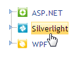

::: {style="DISPLAY: none"}
{#d2h_url_template}{#d2h_package_url style="WIDTH: 0px; DISPLAY: none; HEIGHT: 0px"}
:::

::::: {#nsbanner .d2h_main_nsbanner style="BORDER-BOTTOM: #999999 1px solid; POSITION: relative; PADDING-BOTTOM: 0px; BACKGROUND-COLOR: transparent; PADDING-LEFT: 0px; PADDING-RIGHT: 0px; DISPLAY: none; BORDER-TOP: #999999 1px solid; PADDING-TOP: 0px; LEFT: 0px"}
:::: {#TitleRow .d2h_main_titlerow style="PADDING-BOTTOM: 4px; BACKGROUND-COLOR: transparent; PADDING-LEFT: 22px; WIDTH: 100%; PADDING-RIGHT: 10px; DISPLAY: none; PADDING-TOP: 4px"}
::: {#ienav .d2h_main_ienav style="DISPLAY: none"}
{#D2HPrevious .D2HPreviousEnabled}  {#D2HNext .D2HNextEnabled}
:::
::::
:::::

:::::: {#nstext .d2h_main_nstext style="PADDING-BOTTOM: 10px; BACKGROUND-COLOR: transparent; PADDING-LEFT: 22px; PADDING-RIGHT: 10px; HEIGHT: 100%; OVERFLOW: auto; PADDING-TOP: 5px" hasuserbackground="true" valign="bottom"}
::: {#d2h_breadcrumbs .d2h_breadcrumbs}
[Essential Studio User Guide Documentation](ms-xhelp:///?Id=12457748-09e3-4d74-a240-8e049cedf030){.d2h_breadcrumbsNormal}[ \> ]{.d2h_breadcrumbsLinkSeparator}[User Interface Edition](ms-xhelp:///?Id=c29296b7-531c-413b-a0ec-488ca1f7f669){.d2h_breadcrumbsNormal}[ \> ]{.d2h_breadcrumbsLinkSeparator}[Essential ASP.NET MVC](ms-xhelp:///?Id=4b14e7d1-65c4-4f67-b1aa-2c37709905a5){.d2h_breadcrumbsNormal}[ \> ]{.d2h_breadcrumbsLinkSeparator}[Essential Tools]{.d2h_breadcrumbsContentsOnly}[ \> ]{.d2h_breadcrumbsLinkSeparator}[Controls and Components](ms-xhelp:///?Id=f0af2fff-6f00-4ca4-85a6-54e41ac5dc96){.d2h_breadcrumbsNormal}[ \> ]{.d2h_breadcrumbsLinkSeparator}[Tree View](ms-xhelp:///?Id=245435d2-001b-4fb8-b081-1dbded45c23f){.d2h_breadcrumbsNormal}
:::

### Adding a Tree View to an ASP.NET MVC application {#adding-a-tree-view-to-an-asp.net-mvc-application style="tab-stops: 0pt"}

[]{style="FONT-FAMILY: 'Calibri','sans-serif'"} 

Refer to the [Getting Started]{.UGHyperlink} section for pre-requisites needed to add a tree view control to an ASP.NET MVC application.

The following steps explain how to add a tree view control to an application.

1.   In **View**, create a *ul-li* hierarchy of tree-view nodes and invoke the tree view helper with the control ID as the first argument and the tree-view content ID as the second argument.

**[]{style="FONT-FAMILY: 'Calibri','sans-serif'"}** 

+--------------------------------------------------------------------------------------------------------------------------------------------------------------------------------------------------------------------------------------------------------------------------------------------------------------------------------------------------+
| **[View\[ASPX\]]{style="FONT-FAMILY: 'Courier New'"}**                                                                                                                                                                                                                                                                                           |
|                                                                                                                                                                                                                                                                                                                                                  |
| **[]{style="FONT-FAMILY: 'Courier New'"}**                                                                                                                                                                                                                                                                                                       |
|                                                                                                                                                                                                                                                                                                                                                  |
| [\<]{style="FONT-FAMILY: 'Courier New'; COLOR: blue"}[ul]{style="FONT-FAMILY: 'Courier New'; COLOR: maroon"}[ [id]{style="COLOR: red"}[=\"treeViewContents\"]{style="COLOR: blue"} [style]{style="COLOR: red"}[=\"]{style="COLOR: blue"}[visibility]{style="COLOR: red"}[: hidden\"\>]{style="COLOR: blue"}]{style="FONT-FAMILY: 'Courier New'"} |
|                                                                                                                                                                                                                                                                                                                                                  |
| [    [\<]{style="COLOR: blue"}[li]{style="COLOR: maroon"} [id]{style="COLOR: red"}[=\"ASP.NET\"\>]{style="COLOR: blue"}]{style="FONT-FAMILY: 'Courier New'"}                                                                                                                                                                                     |
|                                                                                                                                                                                                                                                                                                                                                  |
| [        [\<]{style="COLOR: blue"}[img]{style="COLOR: maroon"} [src]{style="COLOR: red"}[=\']{style="COLOR: blue"}[\<%]{style="BACKGROUND: yellow"}[=]{style="COLOR: blue"} Url.Content(\"\~/Images/asp.png\")[%\>]{style="BACKGROUND: yellow"}[\']{style="COLOR: blue"} [/\>]{style="COLOR: blue"}]{style="FONT-FAMILY: 'Courier New'"}         |
|                                                                                                                                                                                                                                                                                                                                                  |
| [  ]{style="FONT-FAMILY: 'Courier New'; COLOR: blue"}[ASP.NET]{style="FONT-FAMILY: 'Courier New'"}                                                                                                                                                                                                                                               |
|                                                                                                                                                                                                                                                                                                                                                  |
| [         [\<]{style="COLOR: blue"}[ul]{style="COLOR: maroon"}[\>]{style="COLOR: blue"}]{style="FONT-FAMILY: 'Courier New'"}                                                                                                                                                                                                                     |
|                                                                                                                                                                                                                                                                                                                                                  |
| [            [\<]{style="COLOR: blue"}[li]{style="COLOR: maroon"} [id]{style="COLOR: red"}[=\"aspGrid\"\>]{style="COLOR: blue"}Essential Grid[\</]{style="COLOR: blue"}[li]{style="COLOR: maroon"}[\>]{style="COLOR: blue"}]{style="FONT-FAMILY: 'Courier New'"}                                                                                 |
|                                                                                                                                                                                                                                                                                                                                                  |
| [            [\<]{style="COLOR: blue"}[li]{style="COLOR: maroon"} [id]{style="COLOR: red"}[=\"aspSchedule\"\>]{style="COLOR: blue"}Essential Schedule[\</]{style="COLOR: blue"}[li]{style="COLOR: maroon"}[\>]{style="COLOR: blue"}]{style="FONT-FAMILY: 'Courier New'"}                                                                         |
|                                                                                                                                                                                                                                                                                                                                                  |
| [            [\<]{style="COLOR: blue"}[li]{style="COLOR: maroon"} [id]{style="COLOR: red"}[=\"aspTools\"\>]{style="COLOR: blue"}Essential Tools[\</]{style="COLOR: blue"}[li]{style="COLOR: maroon"}[\>]{style="COLOR: blue"}]{style="FONT-FAMILY: 'Courier New'"}                                                                               |
|                                                                                                                                                                                                                                                                                                                                                  |
| [         [\</]{style="COLOR: blue"}[ul]{style="COLOR: maroon"}[\>]{style="COLOR: blue"}]{style="FONT-FAMILY: 'Courier New'"}                                                                                                                                                                                                                    |
|                                                                                                                                                                                                                                                                                                                                                  |
| [    [\</]{style="COLOR: blue"}[li]{style="COLOR: maroon"}[\>]{style="COLOR: blue"}        ]{style="FONT-FAMILY: 'Courier New'"}                                                                                                                                                                                                                 |
|                                                                                                                                                                                                                                                                                                                                                  |
| [    [\<]{style="COLOR: blue"}[li]{style="COLOR: maroon"} [id]{style="COLOR: red"}[=\"Silverlight\"\>]{style="COLOR: blue"}]{style="FONT-FAMILY: 'Courier New'"}                                                                                                                                                                                 |
|                                                                                                                                                                                                                                                                                                                                                  |
| [        [\<]{style="COLOR: blue"}[img]{style="COLOR: maroon"} [src]{style="COLOR: red"}[=\']{style="COLOR: blue"}[\<%]{style="BACKGROUND: yellow"}[=]{style="COLOR: blue"} Url.Content(\"\~/Images/silverlight.png\")[%\>]{style="BACKGROUND: yellow"}[\']{style="COLOR: blue"} [/\>\                                                           |
| ]{style="COLOR: blue"}        Silverlight]{style="FONT-FAMILY: 'Courier New'"}                                                                                                                                                                                                                                                                   |
|                                                                                                                                                                                                                                                                                                                                                  |
| [        [\<]{style="COLOR: blue"}[ul]{style="COLOR: maroon"}[\>]{style="COLOR: blue"}]{style="FONT-FAMILY: 'Courier New'"}                                                                                                                                                                                                                      |
|                                                                                                                                                                                                                                                                                                                                                  |
| [           [\<]{style="COLOR: blue"}[li]{style="COLOR: maroon"} [id]{style="COLOR: red"}[=\"silverGrid\"\>]{style="COLOR: blue"}Essential Tools [\</]{style="COLOR: blue"}[li]{style="COLOR: maroon"}[\>]{style="COLOR: blue"}]{style="FONT-FAMILY: 'Courier New'"}                                                                             |
|                                                                                                                                                                                                                                                                                                                                                  |
| [           [\<]{style="COLOR: blue"}[li]{style="COLOR: maroon"} [id]{style="COLOR: red"}[=\"silverGauge\"\>]{style="COLOR: blue"}Essential Gauge [\</]{style="COLOR: blue"}[li]{style="COLOR: maroon"}[\>]{style="COLOR: blue"}]{style="FONT-FAMILY: 'Courier New'"}                                                                            |
|                                                                                                                                                                                                                                                                                                                                                  |
| [           [\<]{style="COLOR: blue"}[li]{style="COLOR: maroon"} [id]{style="COLOR: red"}[=\"silverChart\"\>]{style="COLOR: blue"}Essential Chart [\</]{style="COLOR: blue"}[li]{style="COLOR: maroon"}[\>]{style="COLOR: blue"}]{style="FONT-FAMILY: 'Courier New'"}                                                                            |
|                                                                                                                                                                                                                                                                                                                                                  |
| [        [\</]{style="COLOR: blue"}[ul]{style="COLOR: maroon"}[\>]{style="COLOR: blue"}]{style="FONT-FAMILY: 'Courier New'"}                                                                                                                                                                                                                     |
|                                                                                                                                                                                                                                                                                                                                                  |
| [    [\</]{style="COLOR: blue"}[li]{style="COLOR: maroon"}[\>]{style="COLOR: blue"}]{style="FONT-FAMILY: 'Courier New'"}                                                                                                                                                                                                                         |
|                                                                                                                                                                                                                                                                                                                                                  |
| [    [\<]{style="COLOR: blue"}[li]{style="COLOR: maroon"} [id]{style="COLOR: red"}[=\"WPF\"\>]{style="COLOR: blue"}]{style="FONT-FAMILY: 'Courier New'"}                                                                                                                                                                                         |
|                                                                                                                                                                                                                                                                                                                                                  |
| [        [\<]{style="COLOR: blue"}[img]{style="COLOR: maroon"} [src]{style="COLOR: red"}[=\']{style="COLOR: blue"}[\<%]{style="BACKGROUND: yellow"}[=]{style="COLOR: blue"} Url.Content(\"\~/Images/wpf.png\")[%\>]{style="BACKGROUND: yellow"}[\']{style="COLOR: blue"} [/\>]{style="COLOR: blue"}WPF]{style="FONT-FAMILY: 'Courier New'"}      |
|                                                                                                                                                                                                                                                                                                                                                  |
| [        [\<]{style="COLOR: blue"}[ul]{style="COLOR: maroon"}[\>]{style="COLOR: blue"}]{style="FONT-FAMILY: 'Courier New'"}                                                                                                                                                                                                                      |
|                                                                                                                                                                                                                                                                                                                                                  |
| [           [\<]{style="COLOR: blue"}[li]{style="COLOR: maroon"} [id]{style="COLOR: red"}[=\"wpfGrid\"\>]{style="COLOR: blue"}Essential Grid[\</]{style="COLOR: blue"}[li]{style="COLOR: maroon"}[\>]{style="COLOR: blue"}]{style="FONT-FAMILY: 'Courier New'"}                                                                                  |
|                                                                                                                                                                                                                                                                                                                                                  |
| [           [\<]{style="COLOR: blue"}[li]{style="COLOR: maroon"} [id]{style="COLOR: red"}[=\"wpfSchedule\"\>]{style="COLOR: blue"}Essential Schedule[\</]{style="COLOR: blue"}[li]{style="COLOR: maroon"}[\>]{style="COLOR: blue"}]{style="FONT-FAMILY: 'Courier New'"}                                                                          |
|                                                                                                                                                                                                                                                                                                                                                  |
| [            [\<]{style="COLOR: blue"}[li]{style="COLOR: maroon"} [id]{style="COLOR: red"}[=\"wpfTools\"\>]{style="COLOR: blue"}Essential Tools[\</]{style="COLOR: blue"}[li]{style="COLOR: maroon"}[\>]{style="COLOR: blue"}]{style="FONT-FAMILY: 'Courier New'"}                                                                               |
|                                                                                                                                                                                                                                                                                                                                                  |
| [        [\</]{style="COLOR: blue"}[ul]{style="COLOR: maroon"}[\>]{style="COLOR: blue"}]{style="FONT-FAMILY: 'Courier New'"}                                                                                                                                                                                                                     |
|                                                                                                                                                                                                                                                                                                                                                  |
| [     [\</]{style="COLOR: blue"}[li]{style="COLOR: maroon"}[\>]{style="COLOR: blue"}]{style="FONT-FAMILY: 'Courier New'"}                                                                                                                                                                                                                        |
|                                                                                                                                                                                                                                                                                                                                                  |
| [\</]{style="FONT-FAMILY: 'Courier New'; COLOR: blue"}[ul]{style="FONT-FAMILY: 'Courier New'; COLOR: maroon"}[\>]{style="FONT-FAMILY: 'Courier New'; COLOR: blue"}[]{style="FONT-FAMILY: 'Courier New'"}                                                                                                                                         |
|                                                                                                                                                                                                                                                                                                                                                  |
| [        [\<%]{style="BACKGROUND: yellow"}[=]{style="COLOR: blue"}Html.Syncfusion().TreeView([\"**myTreeView**\"]{style="COLOR: #a31515"}, [\"**treeViewContents**\"]{style="COLOR: #a31515"})[%\>]{style="BACKGROUND: yellow"}]{style="FONT-FAMILY: 'Courier New'"}                                                                             |
|                                                                                                                                                                                                                                                                                                                                                  |
| []{style="FONT-FAMILY: 'Courier New'; BACKGROUND: yellow"}                                                                                                                                                                                                                                                                                       |
+--------------------------------------------------------------------------------------------------------------------------------------------------------------------------------------------------------------------------------------------------------------------------------------------------------------------------------------------------+

**[]{style="FONT-FAMILY: 'Calibri','sans-serif'"}** 

+--------------------------------------------------------------------------------------------------------------------------------------------------------------------------------------------------------------------------------------------------------------------------------------------------------------------------------------------------+
| **[View\[cshtml\]]{style="FONT-FAMILY: 'Courier New'"}**                                                                                                                                                                                                                                                                                         |
|                                                                                                                                                                                                                                                                                                                                                  |
| **[]{style="FONT-FAMILY: 'Courier New'"}**                                                                                                                                                                                                                                                                                                       |
|                                                                                                                                                                                                                                                                                                                                                  |
| [\<]{style="FONT-FAMILY: 'Courier New'; COLOR: blue"}[ul]{style="FONT-FAMILY: 'Courier New'; COLOR: maroon"}[ [id]{style="COLOR: red"}[=\"treeViewContents\"]{style="COLOR: blue"} [style]{style="COLOR: red"}[=\"]{style="COLOR: blue"}[visibility]{style="COLOR: red"}[: hidden\"\>]{style="COLOR: blue"}]{style="FONT-FAMILY: 'Courier New'"} |
|                                                                                                                                                                                                                                                                                                                                                  |
| [    [\<]{style="COLOR: blue"}[li]{style="COLOR: maroon"} [id]{style="COLOR: red"}[=\"ASP.NET\"\>]{style="COLOR: blue"}]{style="FONT-FAMILY: 'Courier New'"}                                                                                                                                                                                     |
|                                                                                                                                                                                                                                                                                                                                                  |
| [        [\<]{style="COLOR: blue"}[img]{style="COLOR: maroon"} [src]{style="COLOR: red"}[=\']{style="COLOR: blue"}[@]{style="BACKGROUND: yellow"}Url.Content(\"\~/Images/asp.png\")[\']{style="COLOR: blue"} [/\>]{style="COLOR: blue"}]{style="FONT-FAMILY: 'Courier New'"}                                                                     |
|                                                                                                                                                                                                                                                                                                                                                  |
| [  ]{style="FONT-FAMILY: 'Courier New'; COLOR: blue"}[ASP.NET]{style="FONT-FAMILY: 'Courier New'"}                                                                                                                                                                                                                                               |
|                                                                                                                                                                                                                                                                                                                                                  |
| [         [\<]{style="COLOR: blue"}[ul]{style="COLOR: maroon"}[\>]{style="COLOR: blue"}]{style="FONT-FAMILY: 'Courier New'"}                                                                                                                                                                                                                     |
|                                                                                                                                                                                                                                                                                                                                                  |
| [            [\<]{style="COLOR: blue"}[li]{style="COLOR: maroon"} [id]{style="COLOR: red"}[=\"aspGrid\"\>]{style="COLOR: blue"}Essential Grid[\</]{style="COLOR: blue"}[li]{style="COLOR: maroon"}[\>]{style="COLOR: blue"}]{style="FONT-FAMILY: 'Courier New'"}                                                                                 |
|                                                                                                                                                                                                                                                                                                                                                  |
| [            [\<]{style="COLOR: blue"}[li]{style="COLOR: maroon"} [id]{style="COLOR: red"}[=\"aspSchedule\"\>]{style="COLOR: blue"}Essential Schedule[\</]{style="COLOR: blue"}[li]{style="COLOR: maroon"}[\>]{style="COLOR: blue"}]{style="FONT-FAMILY: 'Courier New'"}                                                                         |
|                                                                                                                                                                                                                                                                                                                                                  |
| [            [\<]{style="COLOR: blue"}[li]{style="COLOR: maroon"} [id]{style="COLOR: red"}[=\"aspTools\"\>]{style="COLOR: blue"}Essential Tools[\</]{style="COLOR: blue"}[li]{style="COLOR: maroon"}[\>]{style="COLOR: blue"}]{style="FONT-FAMILY: 'Courier New'"}                                                                               |
|                                                                                                                                                                                                                                                                                                                                                  |
| [         [\</]{style="COLOR: blue"}[ul]{style="COLOR: maroon"}[\>]{style="COLOR: blue"}]{style="FONT-FAMILY: 'Courier New'"}                                                                                                                                                                                                                    |
|                                                                                                                                                                                                                                                                                                                                                  |
| [    [\</]{style="COLOR: blue"}[li]{style="COLOR: maroon"}[\>]{style="COLOR: blue"}        ]{style="FONT-FAMILY: 'Courier New'"}                                                                                                                                                                                                                 |
|                                                                                                                                                                                                                                                                                                                                                  |
| [    [\<]{style="COLOR: blue"}[li]{style="COLOR: maroon"} [id]{style="COLOR: red"}[=\"Silverlight\"\>]{style="COLOR: blue"}]{style="FONT-FAMILY: 'Courier New'"}                                                                                                                                                                                 |
|                                                                                                                                                                                                                                                                                                                                                  |
| [        [\<]{style="COLOR: blue"}[img]{style="COLOR: maroon"} [src]{style="COLOR: red"}[=\']{style="COLOR: blue"}[@]{style="BACKGROUND: yellow"}Url.Content(\"\~/Images/silverlight.png\")[\']{style="COLOR: blue"} [/\>\                                                                                                                       |
| ]{style="COLOR: blue"}        Silverlight]{style="FONT-FAMILY: 'Courier New'"}                                                                                                                                                                                                                                                                   |
|                                                                                                                                                                                                                                                                                                                                                  |
| [        [\<]{style="COLOR: blue"}[ul]{style="COLOR: maroon"}[\>]{style="COLOR: blue"}]{style="FONT-FAMILY: 'Courier New'"}                                                                                                                                                                                                                      |
|                                                                                                                                                                                                                                                                                                                                                  |
| [           [\<]{style="COLOR: blue"}[li]{style="COLOR: maroon"} [id]{style="COLOR: red"}[=\"silverGrid\"\>]{style="COLOR: blue"}Essential Tools [\</]{style="COLOR: blue"}[li]{style="COLOR: maroon"}[\>]{style="COLOR: blue"}]{style="FONT-FAMILY: 'Courier New'"}                                                                             |
|                                                                                                                                                                                                                                                                                                                                                  |
| [           [\<]{style="COLOR: blue"}[li]{style="COLOR: maroon"} [id]{style="COLOR: red"}[=\"silverGauge\"\>]{style="COLOR: blue"}Essential Gauge [\</]{style="COLOR: blue"}[li]{style="COLOR: maroon"}[\>]{style="COLOR: blue"}]{style="FONT-FAMILY: 'Courier New'"}                                                                            |
|                                                                                                                                                                                                                                                                                                                                                  |
| [           [\<]{style="COLOR: blue"}[li]{style="COLOR: maroon"} [id]{style="COLOR: red"}[=\"silverChart\"\>]{style="COLOR: blue"}Essential Chart [\</]{style="COLOR: blue"}[li]{style="COLOR: maroon"}[\>]{style="COLOR: blue"}]{style="FONT-FAMILY: 'Courier New'"}                                                                            |
|                                                                                                                                                                                                                                                                                                                                                  |
| [        [\</]{style="COLOR: blue"}[ul]{style="COLOR: maroon"}[\>]{style="COLOR: blue"}]{style="FONT-FAMILY: 'Courier New'"}                                                                                                                                                                                                                     |
|                                                                                                                                                                                                                                                                                                                                                  |
| [    [\</]{style="COLOR: blue"}[li]{style="COLOR: maroon"}[\>]{style="COLOR: blue"}]{style="FONT-FAMILY: 'Courier New'"}                                                                                                                                                                                                                         |
|                                                                                                                                                                                                                                                                                                                                                  |
| [    [\<]{style="COLOR: blue"}[li]{style="COLOR: maroon"} [id]{style="COLOR: red"}[=\"WPF\"\>]{style="COLOR: blue"}]{style="FONT-FAMILY: 'Courier New'"}                                                                                                                                                                                         |
|                                                                                                                                                                                                                                                                                                                                                  |
| [        [\<]{style="COLOR: blue"}[img]{style="COLOR: maroon"} [src]{style="COLOR: red"}[=\']{style="COLOR: blue"}[@]{style="BACKGROUND: yellow"}Url.Content(\"\~/Images/wpf.png\")[\']{style="COLOR: blue"} [/\>]{style="COLOR: blue"}WPF]{style="FONT-FAMILY: 'Courier New'"}                                                                  |
|                                                                                                                                                                                                                                                                                                                                                  |
| [        [\<]{style="COLOR: blue"}[ul]{style="COLOR: maroon"}[\>]{style="COLOR: blue"}]{style="FONT-FAMILY: 'Courier New'"}                                                                                                                                                                                                                      |
|                                                                                                                                                                                                                                                                                                                                                  |
| [           [\<]{style="COLOR: blue"}[li]{style="COLOR: maroon"} [id]{style="COLOR: red"}[=\"wpfGrid\"\>]{style="COLOR: blue"}Essential Grid[\</]{style="COLOR: blue"}[li]{style="COLOR: maroon"}[\>]{style="COLOR: blue"}]{style="FONT-FAMILY: 'Courier New'"}                                                                                  |
|                                                                                                                                                                                                                                                                                                                                                  |
| [           [\<]{style="COLOR: blue"}[li]{style="COLOR: maroon"} [id]{style="COLOR: red"}[=\"wpfSchedule\"\>]{style="COLOR: blue"}Essential Schedule[\</]{style="COLOR: blue"}[li]{style="COLOR: maroon"}[\>]{style="COLOR: blue"}]{style="FONT-FAMILY: 'Courier New'"}                                                                          |
|                                                                                                                                                                                                                                                                                                                                                  |
| [            [\<]{style="COLOR: blue"}[li]{style="COLOR: maroon"} [id]{style="COLOR: red"}[=\"wpfTools\"\>]{style="COLOR: blue"}Essential Tools[\</]{style="COLOR: blue"}[li]{style="COLOR: maroon"}[\>]{style="COLOR: blue"}]{style="FONT-FAMILY: 'Courier New'"}                                                                               |
|                                                                                                                                                                                                                                                                                                                                                  |
| [        [\</]{style="COLOR: blue"}[ul]{style="COLOR: maroon"}[\>]{style="COLOR: blue"}]{style="FONT-FAMILY: 'Courier New'"}                                                                                                                                                                                                                     |
|                                                                                                                                                                                                                                                                                                                                                  |
| [     [\</]{style="COLOR: blue"}[li]{style="COLOR: maroon"}[\>]{style="COLOR: blue"}]{style="FONT-FAMILY: 'Courier New'"}                                                                                                                                                                                                                        |
|                                                                                                                                                                                                                                                                                                                                                  |
| [\</]{style="FONT-FAMILY: 'Courier New'; COLOR: blue"}[ul]{style="FONT-FAMILY: 'Courier New'; COLOR: maroon"}[\>]{style="FONT-FAMILY: 'Courier New'; COLOR: blue"}[]{style="FONT-FAMILY: 'Courier New'"}                                                                                                                                         |
|                                                                                                                                                                                                                                                                                                                                                  |
| [\@{]{style="FONT-FAMILY: 'Courier New'; BACKGROUND: yellow"}[ Html.Syncfusion().TreeView([\"**myTreeView**\"]{style="COLOR: #a31515"}, [\"**treeViewContents**\"]{style="COLOR: #a31515"}).Render();[}]{style="BACKGROUND: yellow"}]{style="FONT-FAMILY: 'Courier New'"}                                                                        |
+--------------------------------------------------------------------------------------------------------------------------------------------------------------------------------------------------------------------------------------------------------------------------------------------------------------------------------------------------+

[]{style="FONT-FAMILY: Consolas; BACKGROUND: yellow; FONT-SIZE: 9.5pt"} 

[]{style="FONT-FAMILY: Consolas; BACKGROUND: yellow; FONT-SIZE: 9.5pt"} 

::: {style="BORDER-BOTTOM: windowtext 1pt solid; BORDER-LEFT: medium none; PADDING-BOTTOM: 1pt; MARGIN-TOP: 9pt; PADDING-LEFT: 0pt; PADDING-RIGHT: 0pt; MARGIN-BOTTOM: 9pt; BORDER-TOP: windowtext 1pt solid; BORDER-RIGHT: medium none; PADDING-TOP: 1pt"}
{border="0"}Note: The visibility style attribute of the tree view content is set to hidden for better rendering when a page loads. The visibility will be reset internally once the resources related to the control are completely loaded.
:::

[]{style="FONT-FAMILY: Consolas; BACKGROUND: yellow"} 

2.   Build and run the application.

[]{style="FONT-FAMILY: 'Calibri','sans-serif'"} 

The following figure shows the output of the tree view control.

{border="0"}

Figure 311: Tree View

A sample demonstrating a basic tree-view control can be downloaded from the following link.

[]{style="FONT-FAMILY: 'Calibri','sans-serif'; COLOR: black"} 

[[Tree View Sample]{.UGHyperlink}](http://files.syncfusion.com/Support/Tools_MVC/v8.3.0.20/Test_TreeView.zip)[]{.UGHyperlink}

[]{style="FONT-FAMILY: 'Calibri','sans-serif'; COLOR: black"} 

::: {style="BORDER-BOTTOM: windowtext 1pt solid; BORDER-LEFT: medium none; PADDING-BOTTOM: 1pt; MARGIN-TOP: 9pt; PADDING-LEFT: 0pt; PADDING-RIGHT: 0pt; MARGIN-BOTTOM: 9pt; BORDER-TOP: windowtext 1pt solid; BORDER-RIGHT: medium none; PADDING-TOP: 1pt"}
 

{border="0"}Note: The version number for the assemblies has been set to 8.3.0.20 in the Web.config file of the sample. Please change the version number to the appropriate version in the Web-2008.config or Web-2010.config file (available in the root directory) and it will automatically update the Web.config file.
:::

 

[]{#related-topics}
::::::
