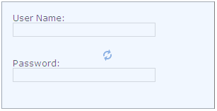

::: {style="DISPLAY: none"}
{#d2h_url_template}{#d2h_package_url style="WIDTH: 0px; DISPLAY: none; HEIGHT: 0px"}
:::

::::: {#nsbanner .d2h_main_nsbanner style="BORDER-BOTTOM: #999999 1px solid; POSITION: relative; PADDING-BOTTOM: 0px; BACKGROUND-COLOR: transparent; PADDING-LEFT: 0px; PADDING-RIGHT: 0px; DISPLAY: none; BORDER-TOP: #999999 1px solid; PADDING-TOP: 0px; LEFT: 0px"}
:::: {#TitleRow .d2h_main_titlerow style="PADDING-BOTTOM: 4px; BACKGROUND-COLOR: transparent; PADDING-LEFT: 22px; WIDTH: 100%; PADDING-RIGHT: 10px; DISPLAY: none; PADDING-TOP: 4px"}
::: {#ienav .d2h_main_ienav style="DISPLAY: none"}
{#D2HPrevious .D2HPreviousEnabled}  {#D2HNext .D2HNextEnabled}
:::
::::
:::::

::::: {#nstext .d2h_main_nstext style="PADDING-BOTTOM: 10px; BACKGROUND-COLOR: transparent; PADDING-LEFT: 22px; PADDING-RIGHT: 10px; HEIGHT: 100%; OVERFLOW: auto; PADDING-TOP: 5px" hasuserbackground="true" valign="bottom"}
::: {#d2h_breadcrumbs .d2h_breadcrumbs}
[Essential Studio User Guide Documentation](ms-xhelp:///?Id=12457748-09e3-4d74-a240-8e049cedf030){.d2h_breadcrumbsNormal}[ \> ]{.d2h_breadcrumbsLinkSeparator}[User Interface Edition](ms-xhelp:///?Id=c29296b7-531c-413b-a0ec-488ca1f7f669){.d2h_breadcrumbsNormal}[ \> ]{.d2h_breadcrumbsLinkSeparator}[Essential ASP.NET MVC](ms-xhelp:///?Id=4b14e7d1-65c4-4f67-b1aa-2c37709905a5){.d2h_breadcrumbsNormal}[ \> ]{.d2h_breadcrumbsLinkSeparator}[Essential Tools]{.d2h_breadcrumbsContentsOnly}[ \> ]{.d2h_breadcrumbsLinkSeparator}[Controls and Components](ms-xhelp:///?Id=f0af2fff-6f00-4ca4-85a6-54e41ac5dc96){.d2h_breadcrumbsNormal}[ \> ]{.d2h_breadcrumbsLinkSeparator}[Waiting Pop-up](ms-xhelp:///?Id=031b8795-f257-40d0-8e96-dad51631b1e0){.d2h_breadcrumbsNormal}
:::

### Adding a Waiting Pop-up to an ASP.NET MVC Application {#adding-a-waiting-pop-up-to-an-asp.net-mvc-application style="tab-stops: 0pt"}

Refer to the [Getting Started]{.UGHyperlink} section for prerequisites needed to add a tree view control to an ASP.NET MVC application.**

**[]{style="FONT-FAMILY: 'Calibri','sans-serif'; FONT-SIZE: 12pt"}** 

Using Builder

The following steps explain how to add a waiting pop-up to an application using Builder.

1.   In **View**, create the target element over which the waiting pop-up is to be displayed.

2.   Invoke the waiting pop-up helper followed by the **TargetId** method with the ID of the target element as an argument.

 

**[]{style="FONT-FAMILY: 'Calibri','sans-serif'"}** 

+--------------------------------------------------------------------------------------------------------------------------------------------------------------------------------------------------------------------------------------------------------------------------------------------------------------------------------------------------+
| **View\[ASPX\]**                                                                                                                                                                                                                                                                                                                                 |
|                                                                                                                                                                                                                                                                                                                                                  |
| **[]{style="FONT-FAMILY: 'Courier New'"}**                                                                                                                                                                                                                                                                                                       |
|                                                                                                                                                                                                                                                                                                                                                  |
| [      [\<]{style="COLOR: blue"}[div]{style="COLOR: maroon"} [id]{style="COLOR: red"}[=\"targetArea\"]{style="COLOR: blue"} [style]{style="COLOR: red"}[=\"]{style="COLOR: blue"}[width]{style="COLOR: red"}[: 300px; ]{style="COLOR: blue"}[height]{style="COLOR: red"}[: 150px;\"\>]{style="COLOR: blue"}]{style="FONT-FAMILY: 'Courier New'"} |
|                                                                                                                                                                                                                                                                                                                                                  |
| [        [\<]{style="COLOR: blue"}[div]{style="COLOR: maroon"}[\>]{style="COLOR: blue"}]{style="FONT-FAMILY: 'Courier New'"}                                                                                                                                                                                                                     |
|                                                                                                                                                                                                                                                                                                                                                  |
| [            User Name:]{style="FONT-FAMILY: 'Courier New'"}                                                                                                                                                                                                                                                                                     |
|                                                                                                                                                                                                                                                                                                                                                  |
| [            [\<%]{style="BACKGROUND: yellow"}[=]{style="COLOR: blue"}Html.Syncfusion().TextBox([\"userName\"]{style="COLOR: #a31515"}) [%\>]{style="BACKGROUND: yellow"}[\</]{style="COLOR: blue"}[div]{style="COLOR: maroon"}[\>]{style="COLOR: blue"}]{style="FONT-FAMILY: 'Courier New'"}                                                    |
|                                                                                                                                                                                                                                                                                                                                                  |
| [        [\<]{style="COLOR: blue"}[div]{style="COLOR: maroon"}[\>]{style="COLOR: blue"}]{style="FONT-FAMILY: 'Courier New'"}                                                                                                                                                                                                                     |
|                                                                                                                                                                                                                                                                                                                                                  |
| [            Password:]{style="FONT-FAMILY: 'Courier New'"}                                                                                                                                                                                                                                                                                      |
|                                                                                                                                                                                                                                                                                                                                                  |
| [            [\<%]{style="BACKGROUND: yellow"}[=]{style="COLOR: blue"}Html.Syncfusion().Password([\"password\"]{style="COLOR: #a31515"}) [%\>]{style="BACKGROUND: yellow"}[\</]{style="COLOR: blue"}[div]{style="COLOR: maroon"}[\>]{style="COLOR: blue"}]{style="FONT-FAMILY: 'Courier New'"}                                                   |
|                                                                                                                                                                                                                                                                                                                                                  |
| [      [\</]{style="COLOR: blue"}[div]{style="COLOR: maroon"}[\>]{style="COLOR: blue"}]{style="FONT-FAMILY: 'Courier New'"}                                                                                                                                                                                                                      |
|                                                                                                                                                                                                                                                                                                                                                  |
| [      [\<%]{style="BACKGROUND: yellow"}[=]{style="COLOR: blue"}Html.Syncfusion().WaitingPopup([\"myPopup\"]{style="COLOR: #a31515"})]{style="FONT-FAMILY: 'Courier New'"}                                                                                                                                                                       |
|                                                                                                                                                                                                                                                                                                                                                  |
| **[.TargetId([\"targetArea\"]{style="COLOR: #a31515"})]{style="FONT-FAMILY: 'Courier New'"}**[ [%\>]{style="BACKGROUND: yellow"}]{style="FONT-FAMILY: 'Courier New'"}                                                                                                                                                                            |
|                                                                                                                                                                                                                                                                                                                                                  |
| []{style="FONT-FAMILY: 'Courier New'; BACKGROUND: yellow"}                                                                                                                                                                                                                                                                                       |
+--------------------------------------------------------------------------------------------------------------------------------------------------------------------------------------------------------------------------------------------------------------------------------------------------------------------------------------------------+

**[]{style="FONT-FAMILY: 'Calibri','sans-serif'"}** 

+--------------------------------------------------------------------------------------------------------------------------------------------------------------------------------------------------------------------------------------------------------------------------------------------------------------------------------------------------+
| **View\[cshtml\]**                                                                                                                                                                                                                                                                                                                               |
|                                                                                                                                                                                                                                                                                                                                                  |
| **[]{style="FONT-FAMILY: 'Courier New'"}**                                                                                                                                                                                                                                                                                                       |
|                                                                                                                                                                                                                                                                                                                                                  |
| [      [\<]{style="COLOR: blue"}[div]{style="COLOR: maroon"} [id]{style="COLOR: red"}[=\"targetArea\"]{style="COLOR: blue"} [style]{style="COLOR: red"}[=\"]{style="COLOR: blue"}[width]{style="COLOR: red"}[: 300px; ]{style="COLOR: blue"}[height]{style="COLOR: red"}[: 150px;\"\>]{style="COLOR: blue"}]{style="FONT-FAMILY: 'Courier New'"} |
|                                                                                                                                                                                                                                                                                                                                                  |
| [        [\<]{style="COLOR: blue"}[div]{style="COLOR: maroon"}[\>]{style="COLOR: blue"}]{style="FONT-FAMILY: 'Courier New'"}                                                                                                                                                                                                                     |
|                                                                                                                                                                                                                                                                                                                                                  |
| [            User Name:]{style="FONT-FAMILY: 'Courier New'"}                                                                                                                                                                                                                                                                                     |
|                                                                                                                                                                                                                                                                                                                                                  |
| [            [@]{style="BACKGROUND: yellow"}Html.Syncfusion().TextBox([\"userName\"]{style="COLOR: #a31515"})[\</]{style="COLOR: blue"}[div]{style="COLOR: maroon"}[\>]{style="COLOR: blue"}]{style="FONT-FAMILY: 'Courier New'"}                                                                                                                |
|                                                                                                                                                                                                                                                                                                                                                  |
| [        [\<]{style="COLOR: blue"}[div]{style="COLOR: maroon"}[\>]{style="COLOR: blue"}]{style="FONT-FAMILY: 'Courier New'"}                                                                                                                                                                                                                     |
|                                                                                                                                                                                                                                                                                                                                                  |
| [            Password:]{style="FONT-FAMILY: 'Courier New'"}                                                                                                                                                                                                                                                                                      |
|                                                                                                                                                                                                                                                                                                                                                  |
| [            [@]{style="BACKGROUND: yellow"}Html.Syncfusion().Password([\"password\"]{style="COLOR: #a31515"})[\</]{style="COLOR: blue"}[div]{style="COLOR: maroon"}[\>]{style="COLOR: blue"}]{style="FONT-FAMILY: 'Courier New'"}                                                                                                               |
|                                                                                                                                                                                                                                                                                                                                                  |
| [      [\</]{style="COLOR: blue"}[div]{style="COLOR: maroon"}[\>]{style="COLOR: blue"}]{style="FONT-FAMILY: 'Courier New'"}                                                                                                                                                                                                                      |
|                                                                                                                                                                                                                                                                                                                                                  |
| [      ]{style="FONT-FAMILY: 'Courier New'"}[\@{]{style="FONT-FAMILY: 'Courier New'; BACKGROUND: yellow"}[ Html.Syncfusion().WaitingPopup([\"myPopup\"]{style="COLOR: #a31515"})]{style="FONT-FAMILY: 'Courier New'"}                                                                                                                            |
|                                                                                                                                                                                                                                                                                                                                                  |
| [.TargetId([\"targetArea\"]{style="COLOR: #a31515"}).Render();[}]{style="BACKGROUND: yellow"}]{style="FONT-FAMILY: 'Courier New'"}                                                                                                                                                                                                               |
|                                                                                                                                                                                                                                                                                                                                                  |
| []{style="FONT-FAMILY: 'Courier New'; BACKGROUND: yellow"}                                                                                                                                                                                                                                                                                       |
+--------------------------------------------------------------------------------------------------------------------------------------------------------------------------------------------------------------------------------------------------------------------------------------------------------------------------------------------------+

[]{style="FONT-FAMILY: Consolas; BACKGROUND: yellow; FONT-SIZE: 9.5pt"} 

3.   Build and run the application.

[]{style="FONT-FAMILY: 'Calibri','sans-serif'"} 

Using Properties Model

The following steps explain how to add a waiting popup to an application through the properties model.

1.   In the controller, create an instance of **WaitingPopupModel**.**

2.   Define **TargetId** and pass the instance through the **view-specific data** to the **view**.**

**[]{style="FONT-FAMILY: 'Calibri','sans-serif'"}** 

+-----------------------------------------------------------------------------------------------------------------------------------------------------------------------------------+
| **[\[Controller\]]{style="FONT-FAMILY: 'Courier New'"}**                                                                                                                          |
|                                                                                                                                                                                   |
| **[]{style="FONT-FAMILY: 'Courier New'"}**                                                                                                                                        |
|                                                                                                                                                                                   |
| [public]{style="FONT-FAMILY: 'Courier New'; COLOR: blue"}[ [ActionResult]{style="COLOR: #2b91af"} Index()]{style="FONT-FAMILY: 'Courier New'"}                                    |
|                                                                                                                                                                                   |
| [        {]{style="FONT-FAMILY: 'Courier New'"}                                                                                                                                   |
|                                                                                                                                                                                   |
| [            [//Create an instance of WatingPopupModel]{style="COLOR: green"}]{style="FONT-FAMILY: 'Courier New'"}                                                                |
|                                                                                                                                                                                   |
| [            [WaitingPopupModel]{style="COLOR: #2b91af"} myModel = [new]{style="COLOR: blue"} [WaitingPopupModel]{style="COLOR: #2b91af"}();]{style="FONT-FAMILY: 'Courier New'"} |
|                                                                                                                                                                                   |
| [            myModel.TargetId = [\"targetArea\"]{style="COLOR: #a31515"};]{style="FONT-FAMILY: 'Courier New'"}                                                                    |
|                                                                                                                                                                                   |
| []{style="FONT-FAMILY: 'Courier New'"}                                                                                                                                            |
|                                                                                                                                                                                   |
| [            [//Pass the instance through view data to the view]{style="COLOR: green"}]{style="FONT-FAMILY: 'Courier New'"}                                                       |
|                                                                                                                                                                                   |
| [            ViewData\[[\"myPopup\"]{style="COLOR: #a31515"}\] = myModel;]{style="FONT-FAMILY: 'Courier New'"}                                                                    |
|                                                                                                                                                                                   |
| [            [return]{style="COLOR: blue"} View();]{style="FONT-FAMILY: 'Courier New'"}                                                                                           |
|                                                                                                                                                                                   |
| [        }]{style="FONT-FAMILY: 'Courier New'"}                                                                                                                                   |
|                                                                                                                                                                                   |
| []{style="FONT-FAMILY: 'Courier New'; BACKGROUND: yellow"}                                                                                                                        |
+-----------------------------------------------------------------------------------------------------------------------------------------------------------------------------------+

***[[[]{style="TEXT-DECORATION: none"}]{style="FONT-FAMILY: 'Calibri','sans-serif'"}]{.underline}*** 

3.   In **View**, create the target element over which the waiting pop-up is to be displayed.**

4.   Invoke the waiting pop-up helper with view data key as the control ID.**

**[]{style="FONT-FAMILY: 'Calibri','sans-serif'"}** 

+----------------------------------------------------------------------------------------------------------------------------------------------------------------------------------------------------------------------------------------------------------------------------------------------------------------------------------------------------------------------------------------------------+
| **[\[ASPX\]]{style="FONT-FAMILY: 'Courier New'"}**                                                                                                                                                                                                                                                                                                                                                 |
|                                                                                                                                                                                                                                                                                                                                                                                                    |
| **[]{style="FONT-FAMILY: 'Courier New'"}**                                                                                                                                                                                                                                                                                                                                                         |
|                                                                                                                                                                                                                                                                                                                                                                                                    |
| [\<]{style="FONT-FAMILY: 'Courier New'; COLOR: blue"}[div]{style="FONT-FAMILY: 'Courier New'; COLOR: maroon"}[ [id]{style="COLOR: red"}[=\"targetArea\"]{style="COLOR: blue"} [style]{style="COLOR: red"}[=\"]{style="COLOR: blue"}[width]{style="COLOR: red"}[: 300px; ]{style="COLOR: blue"}[height]{style="COLOR: red"}[: 150px;\"\>]{style="COLOR: blue"}]{style="FONT-FAMILY: 'Courier New'"} |
|                                                                                                                                                                                                                                                                                                                                                                                                    |
| [        [\<]{style="COLOR: blue"}[div]{style="COLOR: maroon"}[\>]{style="COLOR: blue"}]{style="FONT-FAMILY: 'Courier New'"}                                                                                                                                                                                                                                                                       |
|                                                                                                                                                                                                                                                                                                                                                                                                    |
| [            User Name:]{style="FONT-FAMILY: 'Courier New'"}                                                                                                                                                                                                                                                                                                                                       |
|                                                                                                                                                                                                                                                                                                                                                                                                    |
| [            [\<%]{style="BACKGROUND: yellow"}[=]{style="COLOR: blue"}Html.Syncfusion().TextBox([\"userName\"]{style="COLOR: #a31515"}) [%\>]{style="BACKGROUND: yellow"}[\</]{style="COLOR: blue"}[div]{style="COLOR: maroon"}[\>]{style="COLOR: blue"}]{style="FONT-FAMILY: 'Courier New'"}                                                                                                      |
|                                                                                                                                                                                                                                                                                                                                                                                                    |
| [        [\<]{style="COLOR: blue"}[div]{style="COLOR: maroon"}[\>]{style="COLOR: blue"}]{style="FONT-FAMILY: 'Courier New'"}                                                                                                                                                                                                                                                                       |
|                                                                                                                                                                                                                                                                                                                                                                                                    |
| [            Password:]{style="FONT-FAMILY: 'Courier New'"}                                                                                                                                                                                                                                                                                                                                        |
|                                                                                                                                                                                                                                                                                                                                                                                                    |
| [            [\<%]{style="BACKGROUND: yellow"}[=]{style="COLOR: blue"}Html.Syncfusion().Password([\"password\"]{style="COLOR: #a31515"}) [%\>]{style="BACKGROUND: yellow"}[\</]{style="COLOR: blue"}[div]{style="COLOR: maroon"}[\>]{style="COLOR: blue"}]{style="FONT-FAMILY: 'Courier New'"}                                                                                                     |
|                                                                                                                                                                                                                                                                                                                                                                                                    |
| [      [\</]{style="COLOR: blue"}[div]{style="COLOR: maroon"}[\>]{style="COLOR: blue"}]{style="FONT-FAMILY: 'Courier New'"}                                                                                                                                                                                                                                                                        |
|                                                                                                                                                                                                                                                                                                                                                                                                    |
| [\<%]{style="FONT-FAMILY: 'Courier New'; BACKGROUND: yellow"}[=]{style="FONT-FAMILY: 'Courier New'; COLOR: blue"}[Html.Syncfusion().WaitingPopup([\"myPopup\"]{style="COLOR: #a31515"})[%\>]{style="BACKGROUND: yellow"}]{style="FONT-FAMILY: 'Courier New'"}                                                                                                                                      |
|                                                                                                                                                                                                                                                                                                                                                                                                    |
| []{style="FONT-FAMILY: 'Courier New'; BACKGROUND: yellow"}                                                                                                                                                                                                                                                                                                                                         |
+----------------------------------------------------------------------------------------------------------------------------------------------------------------------------------------------------------------------------------------------------------------------------------------------------------------------------------------------------------------------------------------------------+

***[[[]{style="TEXT-DECORATION: none"}]{style="FONT-FAMILY: 'Calibri','sans-serif'"}]{.underline}*** 

+--------------------------------------------------------------------------------------------------------------------------------------------------------------------------------------------------------------------------------------------------------------------------------------------------------------------------------------------------+
| **View\[cshtml\]**                                                                                                                                                                                                                                                                                                                               |
|                                                                                                                                                                                                                                                                                                                                                  |
| **[]{style="FONT-FAMILY: 'Courier New'"}**                                                                                                                                                                                                                                                                                                       |
|                                                                                                                                                                                                                                                                                                                                                  |
| [      [\<]{style="COLOR: blue"}[div]{style="COLOR: maroon"} [id]{style="COLOR: red"}[=\"targetArea\"]{style="COLOR: blue"} [style]{style="COLOR: red"}[=\"]{style="COLOR: blue"}[width]{style="COLOR: red"}[: 300px; ]{style="COLOR: blue"}[height]{style="COLOR: red"}[: 150px;\"\>]{style="COLOR: blue"}]{style="FONT-FAMILY: 'Courier New'"} |
|                                                                                                                                                                                                                                                                                                                                                  |
| [        [\<]{style="COLOR: blue"}[div]{style="COLOR: maroon"}[\>]{style="COLOR: blue"}]{style="FONT-FAMILY: 'Courier New'"}                                                                                                                                                                                                                     |
|                                                                                                                                                                                                                                                                                                                                                  |
| [            User Name:]{style="FONT-FAMILY: 'Courier New'"}                                                                                                                                                                                                                                                                                     |
|                                                                                                                                                                                                                                                                                                                                                  |
| [            [@]{style="BACKGROUND: yellow"}Html.Syncfusion().TextBox([\"userName\"]{style="COLOR: #a31515"})[\</]{style="COLOR: blue"}[div]{style="COLOR: maroon"}[\>]{style="COLOR: blue"}]{style="FONT-FAMILY: 'Courier New'"}                                                                                                                |
|                                                                                                                                                                                                                                                                                                                                                  |
| [        [\<]{style="COLOR: blue"}[div]{style="COLOR: maroon"}[\>]{style="COLOR: blue"}]{style="FONT-FAMILY: 'Courier New'"}                                                                                                                                                                                                                     |
|                                                                                                                                                                                                                                                                                                                                                  |
| [            Password:]{style="FONT-FAMILY: 'Courier New'"}                                                                                                                                                                                                                                                                                      |
|                                                                                                                                                                                                                                                                                                                                                  |
| [            [@]{style="BACKGROUND: yellow"}Html.Syncfusion().Password([\"password\"]{style="COLOR: #a31515"})[\</]{style="COLOR: blue"}[div]{style="COLOR: maroon"}[\>]{style="COLOR: blue"}]{style="FONT-FAMILY: 'Courier New'"}                                                                                                               |
|                                                                                                                                                                                                                                                                                                                                                  |
| [      [\</]{style="COLOR: blue"}[div]{style="COLOR: maroon"}[\>]{style="COLOR: blue"}]{style="FONT-FAMILY: 'Courier New'"}                                                                                                                                                                                                                      |
|                                                                                                                                                                                                                                                                                                                                                  |
| [      ]{style="FONT-FAMILY: 'Courier New'"}[\@{]{style="FONT-FAMILY: 'Courier New'; BACKGROUND: yellow"}[ Html.Syncfusion().WaitingPopup([\"myPopup\"]{style="COLOR: #a31515"}).Render();[}]{style="BACKGROUND: yellow"}]{style="FONT-FAMILY: 'Courier New'"}                                                                                   |
|                                                                                                                                                                                                                                                                                                                                                  |
| []{style="FONT-FAMILY: 'Courier New'; BACKGROUND: yellow"}                                                                                                                                                                                                                                                                                       |
+--------------------------------------------------------------------------------------------------------------------------------------------------------------------------------------------------------------------------------------------------------------------------------------------------------------------------------------------------+

***[[[]{style="TEXT-DECORATION: none"}]{style="FONT-FAMILY: 'Calibri','sans-serif'"}]{.underline}*** 

***[[[]{style="TEXT-DECORATION: none"}]{style="FONT-FAMILY: 'Calibri','sans-serif'"}]{.underline}*** 

5.   Build and run the application.

 

After performing the above steps, the waiting pop-up will be added to your MVC application. The pop-up will be displayed when you invoke the client-side method [[ShowPopUp]{style="COLOR: windowtext; TEXT-DECORATION: none; text-underline: none"}]{.UGHyperlink}. The following figure shows the output of the waiting pop-up control:

 

{border="0"}

Figure 337: Wating Pop-up Control

 

A sample demonstrating a basic waiting pop-up control can be downloaded from the following link:

 

[[Waiting Pop-up Sample]{.UGHyperlink}](http://files.syncfusion.com/Support/Tools_MVC/v8.3.0.20/Test_WaitingPopUp.zip)[]{.UGHyperlink}

[]{style="FONT-FAMILY: 'Calibri','sans-serif'; COLOR: black"} 

::: {style="BORDER-BOTTOM: windowtext 1pt solid; BORDER-LEFT: medium none; PADDING-BOTTOM: 1pt; MARGIN-TOP: 9pt; PADDING-LEFT: 0pt; PADDING-RIGHT: 0pt; MARGIN-BOTTOM: 9pt; BORDER-TOP: windowtext 1pt solid; BORDER-RIGHT: medium none; PADDING-TOP: 1pt"}
{border="0"}Note:  The version number for the assemblies has been set to 8.3.0.20 in the Web.config file of the sample. Please change the version number to the appropriate version in the Web-2008.config or Web-2010.config file (available in the root directory) and it will automatically update the Web.config file.

 
:::

[]{#related-topics}
:::::
