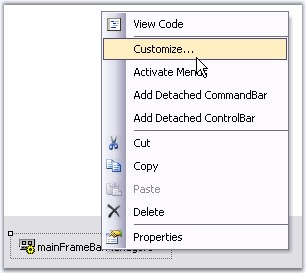
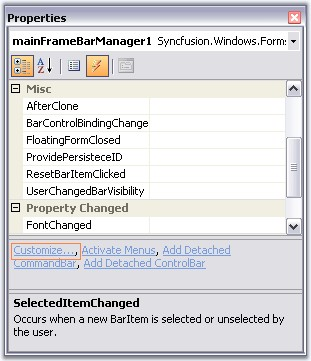
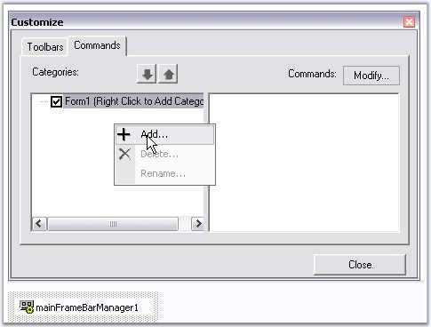
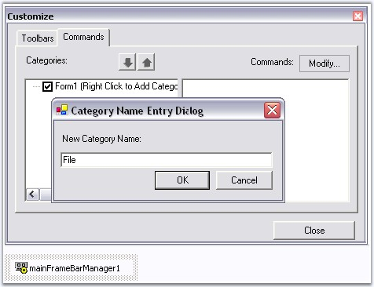
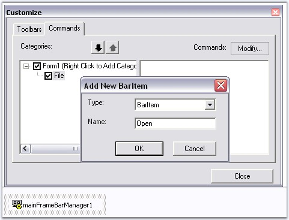
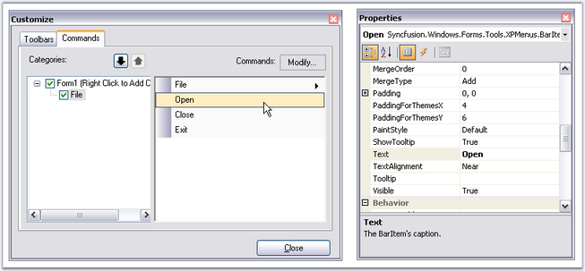

::: {style="DISPLAY: none"}
{#d2h_url_template}{#d2h_package_url style="WIDTH: 0px; DISPLAY: none; HEIGHT: 0px"}
:::

::::: {.d2h_secondary_topic style="PADDING-BOTTOM: 10pt; MARGIN: 0pt; PADDING-LEFT: 0pt; PADDING-RIGHT: 0pt; PADDING-TOP: 0pt"}
##### Adding Bar Items to a BarManager {#adding-bar-items-to-a-barmanager style="tab-stops: 0pt"}

[]{style="COLOR: #15428b"} 

To add BarItems (menu items) to the menu Bar (note that this step will NOT automatically populate menus and toolbars) during design-time:

[]{style="COLOR: #15428b"} 

[·      ]{style="FONT-FAMILY: Symbol"}Drag-and-drop one of the BarManagers, **MainFrameBarManager** (if this is the top-level form) or a **ChildFrameBarManager** if this is an MDIChild form, onto the form, which will be added to the component tray.

 

[·      ]{style="FONT-FAMILY: Symbol"}To invoke the **Customize dialog**, right click the component and select the **Customize\... option**, or choose the \'Customize\...\' option from the smart tag.

[]{style="COLOR: #15428b"} 

{border="0"}

Figure 714: Customize option in Designer on Right-Clicking the Mouse

**[]{style="COLOR: #15428b"}** 

{border="0"}

[]{style="COLOR: #15428b"} 

Figure 715: Customize Command in the Property Grid

**[]{style="COLOR: #15428b"}** 

[·      ]{style="FONT-FAMILY: Symbol"}In the customization dialog, go to the **Commands** tab.

 

[·      ]{style="FONT-FAMILY: Symbol"}To add new categories, right click on the Categories\' area and select **Add**.

[]{style="COLOR: #15428b"} 

{border="0"}

[]{style="COLOR: #15428b"} 

Figure 716: Adding Categories

 

[·      ]{style="FONT-FAMILY: Symbol"}This will open up a dialog where you can enter the name of a new category. The category name should be unique within this BarManager.

[]{style="COLOR: #15428b"} 

::: {style="BORDER-BOTTOM: windowtext 1pt solid; BORDER-LEFT: medium none; PADDING-BOTTOM: 1pt; MARGIN-TOP: 9pt; PADDING-LEFT: 0pt; PADDING-RIGHT: 0pt; MARGIN-BOTTOM: 9pt; BORDER-TOP: windowtext 1pt solid; BORDER-RIGHT: medium none; PADDING-TOP: 1pt"}
{border="0"} Note: The categories do not correspond to any menu entries in the main menu or toolbars, they just provide you a logical grouping of different BarItems.
:::

[]{style="COLOR: #15428b"} 

{border="0"}

[]{style="COLOR: #15428b"} 

Figure 717: Category Entry Dialog

[]{style="COLOR: #15428b"} 

[·      ]{style="FONT-FAMILY: Symbol"}Now to add bar items into this category, select the **category** and click the **Modify\...** button (top right corner of the Commands tab) select **Add** to invoke the **Add New BarItem** dialog**.**

 

[·      ]{style="FONT-FAMILY: Symbol"}Select the type of BarItem you would like to add, from the list and name it (the BarItem\'s **text** property). Take a look at the topic Bar Items for more information on the different types of BarItems.

[]{style="COLOR: #15428b"} 

{border="0"}

[]{style="COLOR: #15428b"} 

Figure 718: Adding BarItems

[]{style="COLOR: #15428b"} 

[·      ]{style="FONT-FAMILY: Symbol"}Once you insert the BarItems, you can select them in the Commands list and modify their properties in the **VS .NET** design-time property grid.

[]{style="COLOR: #15428b"} 

{border="0"}

[]{style="COLOR: #15428b"} 

Figure 719: Properties of BarItem (Open)

[]{style="COLOR: #15428b"} 

::: {style="BORDER-BOTTOM: windowtext 1pt solid; BORDER-LEFT: medium none; PADDING-BOTTOM: 1pt; MARGIN-TOP: 9pt; PADDING-LEFT: 0pt; PADDING-RIGHT: 0pt; MARGIN-BOTTOM: 9pt; BORDER-TOP: windowtext 1pt solid; BORDER-RIGHT: medium none; PADDING-TOP: 1pt"}
{border="0"} Note: Remember that you haven\'t filled your menus and toolbars yet. To display the items refer to [Adding Toolbars]{style="FONT-FAMILY: 'Segoe UI','sans-serif'"}[.]{style="FONT-FAMILY: 'Segoe UI','sans-serif'; COLOR: black"}[]{style="FONT-FAMILY: 'Segoe UI','sans-serif'; COLOR: black"}
:::

 

[]{#related-topics}
:::::
