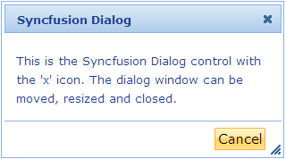

::: {style="DISPLAY: none"}
{#d2h_url_template}{#d2h_package_url style="WIDTH: 0px; DISPLAY: none; HEIGHT: 0px"}
:::

::: {.d2h_secondary_topic style="PADDING-BOTTOM: 10pt; MARGIN: 0pt; PADDING-LEFT: 0pt; PADDING-RIGHT: 0pt; PADDING-TOP: 0pt"}
#### Adding Buttons to the dialog {#adding-buttons-to-the-dialog style="tab-stops: 0pt"}

Dialog supports adding buttons and defining the call back functions to respond on being clicked

 

Properties

+-------------+--------------------------------------------------------+--------------------------------------------------------+-----------------------------------------------------+-------------+
| Name        | Description                                            | Type of property                                       | Value it accepts                                    | Dependency  |
+-------------+--------------------------------------------------------+--------------------------------------------------------+-----------------------------------------------------+-------------+
| Buttons     | Defines whether to display the date picker as calendar | [Dictionary]{style="COLOR: #2b91af"}\<string, string\> | Dictionary with key-value of a pair of type strings | NA          |
|             |                                                        |                                                        |                                                     |             |
|             |                                                        | []{style="COLOR: blue"}                                |                                                     |             |
+-------------+--------------------------------------------------------+--------------------------------------------------------+-----------------------------------------------------+-------------+

 

Using Builder

The following steps explain the addition of a dialog to an application through Builder.

1.   In **View**, create the contents of the dialog and invoke the dialog helper with the Control ID as the first argument followed by the **TargetControlId** method with the ID of the dialog contents as argument.

[]{style="FONT-FAMILY: Consolas; BACKGROUND: yellow; FONT-SIZE: 9.5pt"} 

[]{style="FONT-FAMILY: 'Calibri','sans-serif'"} 

+-----------------------------------------------------------------------------------------------------------------------------------------------------------------------------------------------------------------------------------------------------------------------------------------------------------------------------------------------------------------------------------------------------------------------------------------------------------+
| **View\[aspx\]**                                                                                                                                                                                                                                                                                                                                                                                                                                          |
|                                                                                                                                                                                                                                                                                                                                                                                                                                                           |
|                                                                                                                                                                                                                                                                                                                                                                                                                                                           |
|                                                                                                                                                                                                                                                                                                                                                                                                                                                           |
| [\<]{style="FONT-FAMILY: Consolas; COLOR: blue; FONT-SIZE: 9.5pt"}[div]{style="FONT-FAMILY: Consolas; COLOR: maroon; FONT-SIZE: 9.5pt"}[ [id]{style="COLOR: red"}[=\"myDialog\"]{style="COLOR: blue"} [title]{style="COLOR: red"}[=\"Syncfusion Dialog\"]{style="COLOR: blue"} [style]{style="COLOR: red"}[=\"]{style="COLOR: blue"}[visibility]{style="COLOR: red"}[: hidden\"\>]{style="COLOR: blue"}]{style="FONT-FAMILY: Consolas; FONT-SIZE: 9.5pt"} |
|                                                                                                                                                                                                                                                                                                                                                                                                                                                           |
| [This is the Syncfusion Dialog control with the \'x\' icon. The dialog    window can be moved, resized and closed.]{style="FONT-FAMILY: Consolas; FONT-SIZE: 9.5pt"}                                                                                                                                                                                                                                                                                      |
|                                                                                                                                                                                                                                                                                                                                                                                                                                                           |
| [       [\</]{style="COLOR: blue"}[div]{style="COLOR: maroon"}[\>]{style="COLOR: blue"}]{style="FONT-FAMILY: Consolas; FONT-SIZE: 9.5pt"}                                                                                                                                                                                                                                                                                                                 |
|                                                                                                                                                                                                                                                                                                                                                                                                                                                           |
| [       [\<%]{style="BACKGROUND: yellow"}**[Dictionary]{style="COLOR: #2b91af"}\<[string]{style="COLOR: blue"}, [string]{style="COLOR: blue"}\> buttons = [new]{style="COLOR: blue"} [Dictionary]{style="COLOR: #2b91af"}\<[string]{style="COLOR: blue"}, [string]{style="COLOR: blue"}\>();**]{style="FONT-FAMILY: Consolas; FONT-SIZE: 9.5pt"}                                                                                                          |
|                                                                                                                                                                                                                                                                                                                                                                                                                                                           |
| **[              buttons.Add([\"Cancel\"]{style="COLOR: #a31515"}, [\"CloseDialog\"]{style="COLOR: #a31515"});]{style="FONT-FAMILY: Consolas; FONT-SIZE: 9.5pt"}**[ [%\>]{style="BACKGROUND: yellow"}]{style="FONT-FAMILY: Consolas; FONT-SIZE: 9.5pt"}                                                                                                                                                                                                   |
|                                                                                                                                                                                                                                                                                                                                                                                                                                                           |
| [       [\<%]{style="BACKGROUND: yellow"}[=]{style="COLOR: blue"}Html.Syncfusion().Dialog([\"myDialog\"]{style="COLOR: #a31515"})]{style="FONT-FAMILY: Consolas; FONT-SIZE: 9.5pt"}                                                                                                                                                                                                                                                                       |
|                                                                                                                                                                                                                                                                                                                                                                                                                                                           |
| **[.Buttons(buttons)]{style="FONT-FAMILY: Consolas; FONT-SIZE: 9.5pt"}**[%\>]{style="FONT-FAMILY: Consolas; BACKGROUND: yellow; FONT-SIZE: 9.5pt"}                                                                                                                                                                                                                                                                                                        |
|                                                                                                                                                                                                                                                                                                                                                                                                                                                           |
| []{style="FONT-FAMILY: Consolas; FONT-SIZE: 9.5pt"}                                                                                                                                                                                                                                                                                                                                                                                                       |
+-----------------------------------------------------------------------------------------------------------------------------------------------------------------------------------------------------------------------------------------------------------------------------------------------------------------------------------------------------------------------------------------------------------------------------------------------------------+

[]{style="FONT-FAMILY: Consolas; BACKGROUND: yellow; FONT-SIZE: 9.5pt"} 

[]{style="FONT-FAMILY: Consolas; BACKGROUND: yellow; FONT-SIZE: 9.5pt"} 

+-----------------------------------------------------------------------------------------------------------------------------------------------------------------------------------------------------------------------------------------------------------------------------------------------------------------------------------------------------------------------------------------------------------------------------------------------------------------------------------+
| **View\[cshtml\]**                                                                                                                                                                                                                                                                                                                                                                                                                                                                |
|                                                                                                                                                                                                                                                                                                                                                                                                                                                                                   |
|                                                                                                                                                                                                                                                                                                                                                                                                                                                                                   |
|                                                                                                                                                                                                                                                                                                                                                                                                                                                                                   |
| [\<]{style="FONT-FAMILY: Consolas; COLOR: blue; FONT-SIZE: 9.5pt"}[div]{style="FONT-FAMILY: Consolas; COLOR: maroon; FONT-SIZE: 9.5pt"}[ [id]{style="COLOR: red"}[=\" myDialog\"]{style="COLOR: blue"} [title]{style="COLOR: red"}[=\"Syncfusion Dialog\"]{style="COLOR: blue"} [style]{style="COLOR: red"}[=\"]{style="COLOR: blue"}[visibility]{style="COLOR: red"}[: hidden\"\>]{style="COLOR: blue"}]{style="FONT-FAMILY: Consolas; FONT-SIZE: 9.5pt"}                        |
|                                                                                                                                                                                                                                                                                                                                                                                                                                                                                   |
| [This is the Syncfusion Dialog control with the \'x\' icon. The dialog    window can be moved, resized and closed.]{style="FONT-FAMILY: Consolas; FONT-SIZE: 9.5pt"}                                                                                                                                                                                                                                                                                                              |
|                                                                                                                                                                                                                                                                                                                                                                                                                                                                                   |
| [       [\</]{style="COLOR: blue"}[div]{style="COLOR: maroon"}[\>]{style="COLOR: blue"}]{style="FONT-FAMILY: Consolas; FONT-SIZE: 9.5pt"}                                                                                                                                                                                                                                                                                                                                         |
|                                                                                                                                                                                                                                                                                                                                                                                                                                                                                   |
| [       ]{style="FONT-FAMILY: Consolas; FONT-SIZE: 9.5pt"}[\@{]{style="FONT-FAMILY: Consolas; BACKGROUND: yellow; FONT-SIZE: 9.5pt"}[Dictionary]{style="FONT-FAMILY: Consolas; COLOR: #2b91af; FONT-SIZE: 9.5pt"}[\<[string]{style="COLOR: blue"}, [string]{style="COLOR: blue"}\> buttons = [new]{style="COLOR: blue"} [Dictionary]{style="COLOR: #2b91af"}\<[string]{style="COLOR: blue"}, [string]{style="COLOR: blue"}\>();]{style="FONT-FAMILY: Consolas; FONT-SIZE: 9.5pt"} |
|                                                                                                                                                                                                                                                                                                                                                                                                                                                                                   |
| [              buttons.Add([\"Cancel\"]{style="COLOR: #a31515"}, [\"CloseDialog\"]{style="COLOR: #a31515"}); [}]{style="BACKGROUND: yellow"}]{style="FONT-FAMILY: Consolas; FONT-SIZE: 9.5pt"}                                                                                                                                                                                                                                                                                    |
|                                                                                                                                                                                                                                                                                                                                                                                                                                                                                   |
| [       [\@{]{style="BACKGROUND: yellow"}Html.Syncfusion().Dialog([\"myDialog\"]{style="COLOR: #a31515"})]{style="FONT-FAMILY: Consolas; FONT-SIZE: 9.5pt"}                                                                                                                                                                                                                                                                                                                       |
|                                                                                                                                                                                                                                                                                                                                                                                                                                                                                   |
| [.Buttons(buttons).Render();[}]{style="BACKGROUND: yellow"}]{style="FONT-FAMILY: Consolas; FONT-SIZE: 9.5pt"}                                                                                                                                                                                                                                                                                                                                                                     |
|                                                                                                                                                                                                                                                                                                                                                                                                                                                                                   |
| []{style="FONT-FAMILY: Consolas; FONT-SIZE: 9.5pt"}                                                                                                                                                                                                                                                                                                                                                                                                                               |
|                                                                                                                                                                                                                                                                                                                                                                                                                                                                                   |
| []{style="FONT-FAMILY: Consolas; FONT-SIZE: 9.5pt"}                                                                                                                                                                                                                                                                                                                                                                                                                               |
+-----------------------------------------------------------------------------------------------------------------------------------------------------------------------------------------------------------------------------------------------------------------------------------------------------------------------------------------------------------------------------------------------------------------------------------------------------------------------------------+

[]{style="FONT-FAMILY: Consolas; BACKGROUND: yellow; FONT-SIZE: 9.5pt"} 

2.   Build and run the application.

**[]{style="FONT-FAMILY: 'Calibri','sans-serif'; FONT-SIZE: 12pt"}** 

Using the Properties Model

The following steps explain the addition of a dialog to an application through the Properties model.

1.   In the **Controller**, create an instance of DialogModel, define the **TargetControlId** and pass the instance through **view specific data** to **view** as given below.**

**[]{style="FONT-FAMILY: 'Calibri','sans-serif'"}** 

**[]{style="FONT-FAMILY: 'Calibri','sans-serif'"}** 

+------------------------------------------------------------------------------------------------------------------------------------------------------------------------------------+
| **\[Controller\]**                                                                                                                                                                 |
|                                                                                                                                                                                    |
|                                                                                                                                                                                    |
|                                                                                                                                                                                    |
| [public]{style="FONT-FAMILY: Consolas; COLOR: blue; FONT-SIZE: 9.5pt"}[ [ActionResult]{style="COLOR: #2b91af"} Index()]{style="FONT-FAMILY: Consolas; FONT-SIZE: 9.5pt"}           |
|                                                                                                                                                                                    |
| [        {]{style="FONT-FAMILY: Consolas; FONT-SIZE: 9.5pt"}                                                                                                                       |
|                                                                                                                                                                                    |
| [            [//create an instance of DialogModel]{style="COLOR: green"}]{style="FONT-FAMILY: Consolas; FONT-SIZE: 9.5pt"}                                                         |
|                                                                                                                                                                                    |
| [            [DialogModel]{style="COLOR: #2b91af"} myModel = [new]{style="COLOR: blue"} [DialogModel]{style="COLOR: #2b91af"}();]{style="FONT-FAMILY: Consolas; FONT-SIZE: 9.5pt"} |
|                                                                                                                                                                                    |
| [            myModel.TargetControlId = [\"dialogContents\"]{style="COLOR: #a31515"};]{style="FONT-FAMILY: Consolas; FONT-SIZE: 9.5pt"}                                             |
|                                                                                                                                                                                    |
| [     **myModel.Buttons.Add([\"Cancel\"]{style="COLOR: #a31515"}, [\"CloseDialog\"]{style="COLOR: #a31515"});**]{style="FONT-FAMILY: Consolas; FONT-SIZE: 9.5pt"}                  |
|                                                                                                                                                                                    |
| **[]{style="FONT-FAMILY: Consolas; FONT-SIZE: 9.5pt"}**                                                                                                                            |
|                                                                                                                                                                                    |
| [            [//pass the instance through view data to the view]{style="COLOR: green"}]{style="FONT-FAMILY: Consolas; FONT-SIZE: 9.5pt"}                                           |
|                                                                                                                                                                                    |
| [            ViewData\[[\"myDialog\"]{style="COLOR: #a31515"}\] = myModel;]{style="FONT-FAMILY: Consolas; FONT-SIZE: 9.5pt"}                                                       |
|                                                                                                                                                                                    |
| [            [return]{style="COLOR: blue"} View();]{style="FONT-FAMILY: Consolas; FONT-SIZE: 9.5pt"}                                                                               |
|                                                                                                                                                                                    |
| [        }]{style="FONT-FAMILY: Consolas; FONT-SIZE: 9.5pt"}                                                                                                                       |
|                                                                                                                                                                                    |
| []{style="FONT-FAMILY: Consolas; FONT-SIZE: 9.5pt"}                                                                                                                                |
+------------------------------------------------------------------------------------------------------------------------------------------------------------------------------------+

 

2.   In **View**, create the dialog contents and invoke the dialog helper with the **View Data** key as the first argument.

[]{style="FONT-FAMILY: 'Calibri','sans-serif'"} 

+-----------------------------------------------------------------------------------------------------------------------------------------------------------------------------------------------------------------------------------------------------------------------------------------------------------------------------------------------------------------------------------------------------------------------------------------------------------+
| **View\[aspx\]**                                                                                                                                                                                                                                                                                                                                                                                                                                          |
|                                                                                                                                                                                                                                                                                                                                                                                                                                                           |
|                                                                                                                                                                                                                                                                                                                                                                                                                                                           |
|                                                                                                                                                                                                                                                                                                                                                                                                                                                           |
| [\<]{style="FONT-FAMILY: Consolas; COLOR: blue; FONT-SIZE: 9.5pt"}[div]{style="FONT-FAMILY: Consolas; COLOR: maroon; FONT-SIZE: 9.5pt"}[ [id]{style="COLOR: red"}[=\"myDialog\"]{style="COLOR: blue"} [title]{style="COLOR: red"}[=\"Syncfusion Dialog\"]{style="COLOR: blue"} [style]{style="COLOR: red"}[=\"]{style="COLOR: blue"}[visibility]{style="COLOR: red"}[: hidden\"\>]{style="COLOR: blue"}]{style="FONT-FAMILY: Consolas; FONT-SIZE: 9.5pt"} |
|                                                                                                                                                                                                                                                                                                                                                                                                                                                           |
| [This is the Syncfusion Dialog control with the \'x\' icon. The dialog    window can be moved, resized and closed.]{style="FONT-FAMILY: Consolas; FONT-SIZE: 9.5pt"}                                                                                                                                                                                                                                                                                      |
|                                                                                                                                                                                                                                                                                                                                                                                                                                                           |
| [       [\</]{style="COLOR: blue"}[div]{style="COLOR: maroon"}[\>]{style="COLOR: blue"}]{style="FONT-FAMILY: Consolas; FONT-SIZE: 9.5pt"}                                                                                                                                                                                                                                                                                                                 |
|                                                                                                                                                                                                                                                                                                                                                                                                                                                           |
| [\<%]{style="FONT-FAMILY: Consolas; BACKGROUND: yellow; FONT-SIZE: 9.5pt"}[=]{style="FONT-FAMILY: Consolas; COLOR: blue; FONT-SIZE: 9.5pt"}[Html.Syncfusion().Dialog([\"myDialog\"]{style="COLOR: #a31515"})[%\>]{style="BACKGROUND: yellow"}]{style="FONT-FAMILY: Consolas; FONT-SIZE: 9.5pt"}                                                                                                                                                           |
|                                                                                                                                                                                                                                                                                                                                                                                                                                                           |
| []{style="FONT-FAMILY: Consolas; FONT-SIZE: 9.5pt"}                                                                                                                                                                                                                                                                                                                                                                                                       |
+-----------------------------------------------------------------------------------------------------------------------------------------------------------------------------------------------------------------------------------------------------------------------------------------------------------------------------------------------------------------------------------------------------------------------------------------------------------+

[]{style="FONT-FAMILY: Consolas; BACKGROUND: yellow; FONT-SIZE: 9.5pt"} 

[]{style="FONT-FAMILY: 'Calibri','sans-serif'"} 

+-----------------------------------------------------------------------------------------------------------------------------------------------------------------------------------------------------------------------------------------------------------------------------------------------------------------------------------------------------------------------------------------------------------------------------------------------------------+
| **View\[cshtml\]**                                                                                                                                                                                                                                                                                                                                                                                                                                        |
|                                                                                                                                                                                                                                                                                                                                                                                                                                                           |
|                                                                                                                                                                                                                                                                                                                                                                                                                                                           |
|                                                                                                                                                                                                                                                                                                                                                                                                                                                           |
| [\<]{style="FONT-FAMILY: Consolas; COLOR: blue; FONT-SIZE: 9.5pt"}[div]{style="FONT-FAMILY: Consolas; COLOR: maroon; FONT-SIZE: 9.5pt"}[ [id]{style="COLOR: red"}[=\"myDialog\"]{style="COLOR: blue"} [title]{style="COLOR: red"}[=\"Syncfusion Dialog\"]{style="COLOR: blue"} [style]{style="COLOR: red"}[=\"]{style="COLOR: blue"}[visibility]{style="COLOR: red"}[: hidden\"\>]{style="COLOR: blue"}]{style="FONT-FAMILY: Consolas; FONT-SIZE: 9.5pt"} |
|                                                                                                                                                                                                                                                                                                                                                                                                                                                           |
| [This is the Syncfusion Dialog control with the \'x\' icon. The dialog    window can be moved, resized and closed.]{style="FONT-FAMILY: Consolas; FONT-SIZE: 9.5pt"}                                                                                                                                                                                                                                                                                      |
|                                                                                                                                                                                                                                                                                                                                                                                                                                                           |
| [       [\</]{style="COLOR: blue"}[div]{style="COLOR: maroon"}[\>]{style="COLOR: blue"}]{style="FONT-FAMILY: Consolas; FONT-SIZE: 9.5pt"}                                                                                                                                                                                                                                                                                                                 |
|                                                                                                                                                                                                                                                                                                                                                                                                                                                           |
| [\@{]{style="FONT-FAMILY: Consolas; BACKGROUND: yellow; FONT-SIZE: 9.5pt"}[ ]{style="FONT-FAMILY: Consolas; COLOR: blue; FONT-SIZE: 9.5pt"}[Html.Syncfusion().Dialog([\"myDialog\"]{style="COLOR: #a31515"}).Render();[}]{style="BACKGROUND: yellow"}]{style="FONT-FAMILY: Consolas; FONT-SIZE: 9.5pt"}                                                                                                                                                   |
|                                                                                                                                                                                                                                                                                                                                                                                                                                                           |
| []{style="FONT-FAMILY: Consolas; FONT-SIZE: 9.5pt"}                                                                                                                                                                                                                                                                                                                                                                                                       |
+-----------------------------------------------------------------------------------------------------------------------------------------------------------------------------------------------------------------------------------------------------------------------------------------------------------------------------------------------------------------------------------------------------------------------------------------------------------+

[]{style="FONT-FAMILY: Consolas; BACKGROUND: yellow; FONT-SIZE: 9.5pt"} 

3.   Build and run the application.

The output is shown in the following screenshot.

{border="0"}

Figure 118:Dialog with buttons

 

 

[]{#related-topics}
:::
