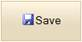

::: {style="DISPLAY: none"}
{#d2h_url_template}{#d2h_package_url style="WIDTH: 0px; DISPLAY: none; HEIGHT: 0px"}
:::

::::: {#nsbanner .d2h_main_nsbanner style="BORDER-BOTTOM: #999999 1px solid; POSITION: relative; PADDING-BOTTOM: 0px; BACKGROUND-COLOR: transparent; PADDING-LEFT: 0px; PADDING-RIGHT: 0px; DISPLAY: none; BORDER-TOP: #999999 1px solid; PADDING-TOP: 0px; LEFT: 0px"}
:::: {#TitleRow .d2h_main_titlerow style="PADDING-BOTTOM: 4px; BACKGROUND-COLOR: transparent; PADDING-LEFT: 22px; WIDTH: 100%; PADDING-RIGHT: 10px; DISPLAY: none; PADDING-TOP: 4px"}
::: {#ienav .d2h_main_ienav style="DISPLAY: none"}
{#D2HPrevious .D2HPreviousEnabled}  {#D2HNext .D2HNextEnabled}
:::
::::
:::::

:::: {#nstext .d2h_main_nstext style="PADDING-BOTTOM: 10px; BACKGROUND-COLOR: transparent; PADDING-LEFT: 22px; PADDING-RIGHT: 10px; HEIGHT: 100%; OVERFLOW: auto; PADDING-TOP: 5px" hasuserbackground="true" valign="bottom"}
::: {#d2h_breadcrumbs .d2h_breadcrumbs}
[Essential Studio User Guide Documentation](ms-xhelp:///?Id=12457748-09e3-4d74-a240-8e049cedf030){.d2h_breadcrumbsNormal}[ \> ]{.d2h_breadcrumbsLinkSeparator}[User Interface Edition](ms-xhelp:///?Id=c29296b7-531c-413b-a0ec-488ca1f7f669){.d2h_breadcrumbsNormal}[ \> ]{.d2h_breadcrumbsLinkSeparator}[Essential ASP.NET MVC](ms-xhelp:///?Id=4b14e7d1-65c4-4f67-b1aa-2c37709905a5){.d2h_breadcrumbsNormal}[ \> ]{.d2h_breadcrumbsLinkSeparator}[Essential Tools]{.d2h_breadcrumbsContentsOnly}[ \> ]{.d2h_breadcrumbsLinkSeparator}[Controls and Components](ms-xhelp:///?Id=f0af2fff-6f00-4ca4-85a6-54e41ac5dc96){.d2h_breadcrumbsNormal}[ \> ]{.d2h_breadcrumbsLinkSeparator}[Button Control](ms-xhelp:///?Id=1459d62e-b32f-4745-9a4e-5d6a49e1b017){.d2h_breadcrumbsNormal}
:::

### Adding Button to an Application {#adding-button-to-an-application style="tab-stops: 0pt"}

In the Getting Started section, we discussed how to create a MVC application and add the Tools package to the application. This section guides you to add the Button control to an application.

1.   In View, invoke the normal Button helper with the button id as the first argument followed by the button's **Text**, **ImageUrl** and **ContentType** methods.

 

+--------------------------------------------------------------------------------------------------------------------------------------------------------------------------+
| **[View\[aspx\]]{style="FONT-FAMILY: 'Courier New'"}**                                                                                                                   |
|                                                                                                                                                                          |
| **[]{style="FONT-FAMILY: 'Courier New'"}**                                                                                                                               |
|                                                                                                                                                                          |
| [        [\<%]{style="BACKGROUND: yellow"}[=]{style="COLOR: blue"}Html.Syncfusion().Button([\"btnNormal\"]{style="COLOR: #a31515"})]{style="FONT-FAMILY: 'Courier New'"} |
|                                                                                                                                                                          |
| [        .Text([\"Save\"]{style="COLOR: #a31515"})]{style="FONT-FAMILY: 'Courier New'"}                                                                                  |
|                                                                                                                                                                          |
| [        .ImageUrl([\"Content/icon_save.png\"]{style="COLOR: #a31515"})]{style="FONT-FAMILY: 'Courier New'"}                                                             |
|                                                                                                                                                                          |
| [        .ContentType([ContentTypes]{style="COLOR: #2b91af"}.TextAndImage) [%\>]{style="BACKGROUND: yellow"}]{style="FONT-FAMILY: 'Courier New'"}                        |
+--------------------------------------------------------------------------------------------------------------------------------------------------------------------------+

 

 

+--------------------------------------------------------------------------------------------------------------------------------------------------------------------------------------------------------------------------------+
| **[View\[cshtml\]]{style="FONT-FAMILY: 'Courier New'"}**                                                                                                                                                                       |
|                                                                                                                                                                                                                                |
| **[]{style="FONT-FAMILY: 'Courier New'"}**                                                                                                                                                                                     |
|                                                                                                                                                                                                                                |
| [        ]{style="FONT-FAMILY: 'Courier New'"}[ [\@{]{style="BACKGROUND: yellow"}]{style="FONT-FAMILY: 'Courier New'"}[ Html.Syncfusion().Button([\"btnNormal\"]{style="COLOR: #a31515"})]{style="FONT-FAMILY: 'Courier New'"} |
|                                                                                                                                                                                                                                |
| [        .Text([\"Save\"]{style="COLOR: #a31515"})]{style="FONT-FAMILY: 'Courier New'"}                                                                                                                                        |
|                                                                                                                                                                                                                                |
| [        .ImageUrl([\"Content/icon_save.png\"]{style="COLOR: #a31515"})]{style="FONT-FAMILY: 'Courier New'"}                                                                                                                   |
|                                                                                                                                                                                                                                |
| [        .ContentType([ContentTypes]{style="COLOR: #2b91af"}.TextAndImage)]{style="FONT-FAMILY: 'Courier New'"}[.Render();[}]{style="BACKGROUND: yellow"}]{style="FONT-FAMILY: 'Courier New'"}                                 |
|                                                                                                                                                                                                                                |
| []{style="FONT-FAMILY: 'Courier New'; BACKGROUND: yellow"}                                                                                                                                                                     |
+--------------------------------------------------------------------------------------------------------------------------------------------------------------------------------------------------------------------------------+

 

 

2.   Run the application.

 

The output is shown in the following screenshot.

 

 

 

{border="0"}

Figure 83: Normal Button

[]{style="FONT-FAMILY: 'Calibri','sans-serif'"} 

[]{#related-topics}
::::
