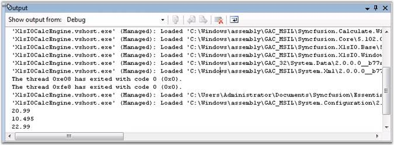
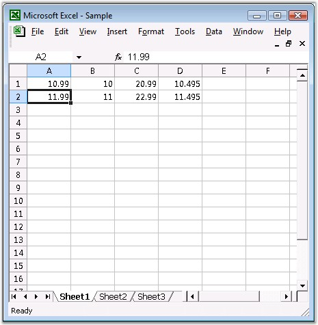

::: {style="DISPLAY: none"}
{#d2h_url_template}{#d2h_package_url style="WIDTH: 0px; DISPLAY: none; HEIGHT: 0px"}
:::

:::::::: {.d2h_secondary_topic style="PADDING-BOTTOM: 10pt; MARGIN: 0pt; PADDING-LEFT: 0pt; PADDING-RIGHT: 0pt; PADDING-TOP: 0pt"}
##### Adding Calculation Engine to an Application {#adding-calculation-engine-to-an-application style="tab-stops: 0pt"}

[]{style="FONT-FAMILY: 'Trebuchet MS','sans-serif'; COLOR: #15428b; FONT-SIZE: 9pt"} 

Enable Formula Calculations:

Essential XlsIO includes support for enabling the calculations of Essential Calculate supported formulas that are added at runtime to the worksheet and the computed value will be set to the "CalculatedValue" property associated to the "IRange" object. The following code snippet illustrates how to enable the sheet formula calculations.

[]{style="FONT-FAMILY: 'Trebuchet MS','sans-serif'; COLOR: #15428b; FONT-SIZE: 9pt"} 

+------------------------------------------------------------------------------------------------------------------------------------------------------------------------------------------------------------------------+
| **[\[C#\]]{style="FONT-FAMILY: 'Courier New'"}**                                                                                                                                                                       |
|                                                                                                                                                                                                                        |
| [IWorksheet]{style="FONT-FAMILY: 'Courier New'; COLOR: #2b91af"}[ sheet = workbook.Worksheets\[0\];]{style="FONT-FAMILY: 'Courier New'"}                                                                               |
|                                                                                                                                                                                                                        |
| [//Formula calculation is enabled for the sheet.]{style="FONT-FAMILY: 'Courier New'; COLOR: green"}                                                                                                                    |
|                                                                                                                                                                                                                        |
| [sheet.EnableSheetCalculations();]{style="FONT-FAMILY: 'Courier New'"}                                                                                                                                                 |
|                                                                                                                                                                                                                        |
| [string]{style="FONT-FAMILY: 'Courier New'; COLOR: blue"}[ computedValue = sheet.Range\[[\"C1\"]{style="COLOR: #a31515"}\].CalculatedValue;]{style="FONT-FAMILY: 'Courier New'"}[]{style="FONT-FAMILY: 'Courier New'"} |
+------------------------------------------------------------------------------------------------------------------------------------------------------------------------------------------------------------------------+

[]{style="FONT-FAMILY: 'Trebuchet MS','sans-serif'; COLOR: #15428b; FONT-SIZE: 9pt"} 

Disable Formula Calculations:

Essential XlsIO will be able to disable the calculations of Essential Calculate supported formulas that are added at runtime to the worksheet. The following code snippet illustrates how to disable the sheet formula calculations.

[]{style="FONT-FAMILY: 'Trebuchet MS','sans-serif'; COLOR: #15428b; FONT-SIZE: 9pt"} 

+------------------------------------------------------------------------------------------------------------------------------------------+
| **[\[C#\]]{style="FONT-FAMILY: 'Courier New'"}**                                                                                         |
|                                                                                                                                          |
| [IWorksheet]{style="FONT-FAMILY: 'Courier New'; COLOR: #2b91af"}[ sheet = workbook.Worksheets\[0\];]{style="FONT-FAMILY: 'Courier New'"} |
|                                                                                                                                          |
| [//Formula calculation is enabled for the sheet.]{style="FONT-FAMILY: 'Courier New'; COLOR: green"}                                      |
|                                                                                                                                          |
| [sheet.DisableSheetCalculations();]{style="FONT-FAMILY: 'Courier New'"}[]{style="FONT-FAMILY: 'Courier New'"}                            |
+------------------------------------------------------------------------------------------------------------------------------------------+

[]{style="FONT-FAMILY: 'Trebuchet MS','sans-serif'; COLOR: #15428b; FONT-SIZE: 9pt"} 

Here are some code samples, to evaluate some formulas entered by using Essential XlsIO during runtime. The XlsIO computed value is identical to the values computed by using MS Excel.

[]{style="FONT-FAMILY: 'Trebuchet MS','sans-serif'; COLOR: #15428b; FONT-SIZE: 9pt"} 

+------------------------------------------------------------------------------------------------------------------------------------------------------------------------------------------------------------------------------------------------------------------------------------------+
| **[\[C#\]]{style="FONT-FAMILY: 'Courier New'"}**                                                                                                                                                                                                                                         |
|                                                                                                                                                                                                                                                                                          |
| **[]{style="FONT-FAMILY: 'Courier New'"}**                                                                                                                                                                                                                                               |
|                                                                                                                                                                                                                                                                                          |
| [//Inserting sample text into the first cell of the first worksheet.]{style="FONT-FAMILY: 'Courier New'; COLOR: green"}                                                                                                                                                                  |
|                                                                                                                                                                                                                                                                                          |
| [sheet.Range\[[\"A1\"]{style="COLOR: #a31515"}\].Number = 10.99;]{style="FONT-FAMILY: 'Courier New'"}                                                                                                                                                                                    |
|                                                                                                                                                                                                                                                                                          |
| [sheet.Range\[[\"B1\"]{style="COLOR: #a31515"}\].Number = 10;]{style="FONT-FAMILY: 'Courier New'"}                                                                                                                                                                                       |
|                                                                                                                                                                                                                                                                                          |
| [sheet.Range\[[\"C1\"]{style="COLOR: #a31515"}\].Formula = [\"A1+B1\"]{style="COLOR: #a31515"};]{style="FONT-FAMILY: 'Courier New'"}                                                                                                                                                     |
|                                                                                                                                                                                                                                                                                          |
| [sheet.Range\[[\"D1\"]{style="COLOR: #a31515"}\].Formula = [\"AVERAGE(A1:B1)\"]{style="COLOR: #a31515"};]{style="FONT-FAMILY: 'Courier New'"}                                                                                                                                            |
|                                                                                                                                                                                                                                                                                          |
| []{style="FONT-FAMILY: 'Courier New'"}                                                                                                                                                                                                                                                   |
|                                                                                                                                                                                                                                                                                          |
| [//Formula calculation is enabled for the sheet.]{style="FONT-FAMILY: 'Courier New'; COLOR: green"}                                                                                                                                                                                      |
|                                                                                                                                                                                                                                                                                          |
| [sheet.EnableSheetCalculations();]{style="FONT-FAMILY: 'Courier New'"}                                                                                                                                                                                                                   |
|                                                                                                                                                                                                                                                                                          |
| []{style="FONT-FAMILY: 'Courier New'"}                                                                                                                                                                                                                                                   |
|                                                                                                                                                                                                                                                                                          |
| [Console]{style="FONT-FAMILY: 'Courier New'; COLOR: #2b91af"}[.WriteLine(sheet.Range\[[\"C1\"]{style="COLOR: #a31515"}\].CalculatedValue.ToString(),               sheet.Range\[[\"C1\"]{style="COLOR: #a31515"}\].Formula);]{style="FONT-FAMILY: 'Courier New'"}                        |
|                                                                                                                                                                                                                                                                                          |
| [Console]{style="FONT-FAMILY: 'Courier New'; COLOR: #2b91af"}[.WriteLine(sheet.Range\[[\"D1\"]{style="COLOR: #a31515"}\].CalculatedValue.ToString(),sheet.Range\[[\"D1\"]{style="COLOR: #a31515"}\].Formula);]{style="FONT-FAMILY: 'Courier New'"}                                       |
|                                                                                                                                                                                                                                                                                          |
| []{style="FONT-FAMILY: 'Courier New'"}                                                                                                                                                                                                                                                   |
|                                                                                                                                                                                                                                                                                          |
| [//Add more data]{style="FONT-FAMILY: 'Courier New'; COLOR: green"}                                                                                                                                                                                                                      |
|                                                                                                                                                                                                                                                                                          |
| [sheet.Range\[[\"A2\"]{style="COLOR: #a31515"}\].Number = 11.99;]{style="FONT-FAMILY: 'Courier New'"}                                                                                                                                                                                    |
|                                                                                                                                                                                                                                                                                          |
| [sheet.Range\[[\"B2\"]{style="COLOR: #a31515"}\].Number = 11;]{style="FONT-FAMILY: 'Courier New'"}                                                                                                                                                                                       |
|                                                                                                                                                                                                                                                                                          |
| [sheet.Range\[[\"C2\"]{style="COLOR: #a31515"}\].Formula = [\"A2+B2\"]{style="COLOR: #a31515"};]{style="FONT-FAMILY: 'Courier New'"}                                                                                                                                                     |
|                                                                                                                                                                                                                                                                                          |
| [sheet.Range\[[\"D2\"]{style="COLOR: #a31515"}\].Formula = [\"AVERAGE(A2:B2)\"]{style="COLOR: #a31515"};]{style="FONT-FAMILY: 'Courier New'"}                                                                                                                                            |
|                                                                                                                                                                                                                                                                                          |
| []{style="FONT-FAMILY: 'Courier New'"}                                                                                                                                                                                                                                                   |
|                                                                                                                                                                                                                                                                                          |
| []{style="FONT-FAMILY: 'Courier New'"}                                                                                                                                                                                                                                                   |
|                                                                                                                                                                                                                                                                                          |
| [Console]{style="FONT-FAMILY: 'Courier New'; COLOR: #2b91af"}[.WriteLine(sheet.Range\[[\"C2\"]{style="COLOR: #a31515"}\].CalculatedValue.ToString(),sheet.Range\[[\"C2\"]{style="COLOR: #a31515"}\].Formula);]{style="FONT-FAMILY: 'Courier New'"}                                       |
|                                                                                                                                                                                                                                                                                          |
| [Console]{style="FONT-FAMILY: 'Courier New'; COLOR: #2b91af"}[.WriteLine(sheet.Range\[[\"D2\"]{style="COLOR: #a31515"}\].CalculatedValue.ToString(),sheet.Range\[[\"D2\"]{style="COLOR: #a31515"}\].Formula);]{style="FONT-FAMILY: 'Courier New'"}[]{style="FONT-FAMILY: 'Courier New'"} |
+------------------------------------------------------------------------------------------------------------------------------------------------------------------------------------------------------------------------------------------------------------------------------------------+

[]{style="FONT-FAMILY: 'Trebuchet MS','sans-serif'; COLOR: #15428b; FONT-SIZE: 9pt"} 

+------------------------------------------------------------------------------------------------------------------------------------------------------------------------------------------+
| **[\[VB.NET\]]{style="FONT-FAMILY: 'Courier New'"}**                                                                                                                                     |
|                                                                                                                                                                                          |
| **[]{style="FONT-FAMILY: 'Courier New'"}**                                                                                                                                               |
|                                                                                                                                                                                          |
| [\' Inserting sample text into the first cell of the first worksheet.]{style="FONT-FAMILY: 'Courier New'; COLOR: green"}                                                                 |
|                                                                                                                                                                                          |
| [sheet.Range([\"A1\"]{style="COLOR: maroon"}).Number = 10.99]{style="FONT-FAMILY: 'Courier New'"}                                                                                        |
|                                                                                                                                                                                          |
| [sheet.Range([\"B1\"]{style="COLOR: maroon"}).Number = 10]{style="FONT-FAMILY: 'Courier New'"}                                                                                           |
|                                                                                                                                                                                          |
| [sheet.Range([\"C1\"]{style="COLOR: maroon"}).Formula = [\"A1+B1\"]{style="COLOR: maroon"}]{style="FONT-FAMILY: 'Courier New'"}                                                          |
|                                                                                                                                                                                          |
| [sheet.Range([\"D1\"]{style="COLOR: maroon"}).Formula = [\"AVERAGE(A1:B1)\"]{style="COLOR: maroon"}]{style="FONT-FAMILY: 'Courier New'"}                                                 |
|                                                                                                                                                                                          |
| []{style="FONT-FAMILY: 'Courier New'; COLOR: maroon"}                                                                                                                                    |
|                                                                                                                                                                                          |
| [\' ]{style="FONT-FAMILY: 'Courier New'; COLOR: green"}[Formula calculation is enabled for the sheet.]{style="FONT-FAMILY: 'Courier New'; COLOR: green"}                                 |
|                                                                                                                                                                                          |
| [sheet.EnableSheetCalculations()]{style="FONT-FAMILY: 'Courier New'"}[ ]{style="FONT-FAMILY: 'Courier New'"}                                                                             |
|                                                                                                                                                                                          |
| [Console.WriteLine(sheet.Range([\"C1\"]{style="COLOR: maroon"}).FormulaNumberValue.ToString(),sheet.Range([\"C1\"]{style="COLOR: maroon"}).Formula)]{style="FONT-FAMILY: 'Courier New'"} |
|                                                                                                                                                                                          |
| [Console.WriteLine(sheet.Range([\"D1\"]{style="COLOR: maroon"}).FormulaNumberValue.ToString(),sheet.Range([\"D1\"]{style="COLOR: maroon"}).Formula)]{style="FONT-FAMILY: 'Courier New'"} |
|                                                                                                                                                                                          |
| []{style="FONT-FAMILY: 'Courier New'"}                                                                                                                                                   |
|                                                                                                                                                                                          |
| [\' Add more data.]{style="FONT-FAMILY: 'Courier New'; COLOR: green"}                                                                                                                    |
|                                                                                                                                                                                          |
| [sheet.Range([\"A2\"]{style="COLOR: maroon"}).Number = 11.99]{style="FONT-FAMILY: 'Courier New'"}                                                                                        |
|                                                                                                                                                                                          |
| [sheet.Range([\"B2\"]{style="COLOR: maroon"}).Number = 11]{style="FONT-FAMILY: 'Courier New'"}                                                                                           |
|                                                                                                                                                                                          |
| [sheet.Range([\"C2\"]{style="COLOR: maroon"}).Formula = [\"A2+B2\"]{style="COLOR: maroon"}]{style="FONT-FAMILY: 'Courier New'"}                                                          |
|                                                                                                                                                                                          |
| [sheet.Range([\"D2\"]{style="COLOR: maroon"}).Formula = [\"AVERAGE(A2:B2)\"]{style="COLOR: maroon"}]{style="FONT-FAMILY: 'Courier New'"}                                                 |
|                                                                                                                                                                                          |
| []{style="FONT-FAMILY: 'Courier New'"}                                                                                                                                                   |
|                                                                                                                                                                                          |
| [Console.WriteLine(sheet.Range([\"C2\"]{style="COLOR: maroon"}).FormulaNumberValue.ToString(),sheet.Range([\"C2\"]{style="COLOR: maroon"}).Formula)]{style="FONT-FAMILY: 'Courier New'"} |
|                                                                                                                                                                                          |
| [Console.WriteLine(sheet.Range([\"D2\"]{style="COLOR: maroon"}).FormulaNumberValue.ToString(),sheet.Range([\"D2\"]{style="COLOR: maroon"}).Formula)]{style="FONT-FAMILY: 'Courier New'"} |
+------------------------------------------------------------------------------------------------------------------------------------------------------------------------------------------+

[]{style="FONT-FAMILY: 'Trebuchet MS','sans-serif'; COLOR: #15428b; FONT-SIZE: 9pt"} 

{border="0"}

Figure 121: Output Box in Visual Studio[]{style="FONT-FAMILY: 'Trebuchet MS','sans-serif'; COLOR: #15428b"}

[]{style="FONT-FAMILY: 'Trebuchet MS','sans-serif'; COLOR: #15428b; FONT-SIZE: 9pt"} 

{border="0"}

Figure 122: XlsIO with XlsIO CalcEngine[]{style="FONT-FAMILY: 'Trebuchet MS','sans-serif'; COLOR: #15428b"}

***[]{style="FONT-SIZE: 9pt"}*** 

::: {style="BORDER-BOTTOM: windowtext 1pt solid; BORDER-LEFT: medium none; PADDING-BOTTOM: 1pt; MARGIN-TOP: 9pt; PADDING-LEFT: 0pt; PADDING-RIGHT: 0pt; MARGIN-BOTTOM: 9pt; BORDER-TOP: windowtext 1pt solid; BORDER-RIGHT: medium none; PADDING-TOP: 1pt"}
{border="0"}Note:
:::

::: {style="BORDER-BOTTOM: windowtext 1pt solid; BORDER-LEFT: medium none; PADDING-BOTTOM: 1pt; MARGIN: 9pt 0pt 9pt 18pt; PADDING-LEFT: 0pt; PADDING-RIGHT: 0pt; BORDER-TOP: windowtext 1pt solid; BORDER-RIGHT: medium none; PADDING-TOP: 1pt"}
1   In order to use the Essential XlsIO\'s Calculate engine, you have to add the following namespace:
:::

::: {style="BORDER-BOTTOM: windowtext 1pt solid; BORDER-LEFT: medium none; PADDING-BOTTOM: 1pt; MARGIN: 9pt 0pt 9pt 54pt; PADDING-LEFT: 0pt; PADDING-RIGHT: 0pt; BORDER-TOP: windowtext 1pt solid; BORDER-RIGHT: medium none; PADDING-TOP: 1pt"}
***[·    ]{style="FONT-FAMILY: Symbol"}***using Syncfusion.Calculate
:::

::: {style="BORDER-BOTTOM: windowtext 1pt solid; BORDER-LEFT: medium none; PADDING-BOTTOM: 1pt; MARGIN: 9pt 0pt 9pt 18pt; PADDING-LEFT: 0pt; PADDING-RIGHT: 0pt; BORDER-TOP: windowtext 1pt solid; BORDER-RIGHT: medium none; PADDING-TOP: 1pt"}
2   Do not add reference to Syncfusion.Calculate.Base. It will throw conflict errors as these are already integrated with XlsIO from Version 7.2.X.X.

3   Only the formulas that are supported by Calculate engine can be calculated at runtime using Essential XlsIO.
:::

::: {style="BORDER-BOTTOM: windowtext 1pt solid; BORDER-LEFT: medium none; PADDING-BOTTOM: 1pt; MARGIN-TOP: 9pt; PADDING-LEFT: 0pt; PADDING-RIGHT: 0pt; MARGIN-BOTTOM: 9pt; BORDER-TOP: windowtext 1pt solid; BORDER-RIGHT: medium none; PADDING-TOP: 1pt"}
 
:::

[]{#related-topics}
::::::::
