::: {style="DISPLAY: none"}
{#d2h_url_template}{#d2h_package_url style="WIDTH: 0px; DISPLAY: none; HEIGHT: 0px"}
:::

:::::::: {.d2h_secondary_topic style="PADDING-BOTTOM: 10pt; MARGIN: 0pt; PADDING-LEFT: 0pt; PADDING-RIGHT: 0pt; PADDING-TOP: 0pt"}
##### Adding CellTypes to an Application {#adding-celltypes-to-an-application style="tab-stops: 0pt"}

There are more than ten CellTypes that are currently available. The following are the cell types:

[]{style="FONT-FAMILY: 'Trebuchet MS','sans-serif'; COLOR: #15428b; FONT-SIZE: 9pt"} 

[·      ]{style="FONT-FAMILY: Symbol"}Basic Cells

[·      ]{style="FONT-FAMILY: Symbol"}TextBox Cells

[·      ]{style="FONT-FAMILY: Symbol"}CheckBox Cells

[·      ]{style="FONT-FAMILY: Symbol"}Data Template Cells

[·      ]{style="FONT-FAMILY: Symbol"}ComboBox Cells

[·      ]{style="FONT-FAMILY: Symbol"}MaskEdit Cells

[·      ]{style="FONT-FAMILY: Symbol"}IntegerEdit Cells

[·      ]{style="FONT-FAMILY: Symbol"}DoubleEdit Cells

[·      ]{style="FONT-FAMILY: Symbol"}PercentEdit Cells

[·      ]{style="FONT-FAMILY: Symbol"}UpDownEdit Cells

[·      ]{style="FONT-FAMILY: Symbol"}Currency Cells

 

###### []{#_Basic_Cell_Types}4.1.1.2.1.1 Basic Cell Types {#basic-cell-types style="tab-stops: 0pt"}

Basic controls like Check Boxes can be implemented within a grid cell. The list of cell types and their usages are tabulated in the following table. The table also lists the format string for the individual cell types.

 Table 1: Basic Cell Types Property Table

::: {align="center"}
  ----------- ------------------ --------------------------------
  Cell Type   Cell Type String   Cell Usage
  Header      "Header"           Used as row and column headers
  Static      "Static"           Cannot be edited
  Check Box   "CheckBox"         Used for toggling options
  Image       "ImageCell"        Used to display pictures
  TextBlock   "TextBlock"        Used to display text
  ----------- ------------------ --------------------------------
:::

 

To set up the desired cell type, the Style.CellType property must be assigned with the corresponding format string. For instance, if you want to display a Check box control in the cell (2, 2), then you have to use the following code.

 

Displaying a Check Box Control in a Cell:

 

+-----------------------------------------------------------------------------------------+
| **[\[C#\]]{style="FONT-FAMILY: 'Courier New'"}**                                        |
|                                                                                         |
| []{style="FONT-FAMILY: 'Courier New'"}                                                  |
|                                                                                         |
| [GridStyleInfo style = gridControl1.Model\[2, 2\];]{style="FONT-FAMILY: 'Courier New'"} |
|                                                                                         |
| [style.CellType = \"CheckBox\";]{style="FONT-FAMILY: 'Courier New'"}                    |
+-----------------------------------------------------------------------------------------+

 

 

Displaying a Cell as a Header Cell:

 

+-----------------------------------------------------------------------------------------+
| **[\[C#\]]{style="FONT-FAMILY: 'Courier New'"}**                                        |
|                                                                                         |
| []{style="FONT-FAMILY: 'Courier New'"}                                                  |
|                                                                                         |
| [GridStyleInfo style = gridControl1.Model\[2, 2\];]{style="FONT-FAMILY: 'Courier New'"} |
|                                                                                         |
| [style.CellType = \"Header\";]{style="FONT-FAMILY: 'Courier New'"}                      |
+-----------------------------------------------------------------------------------------+

 

Displaying a Cell as a Static Cell:

 

+-----------------------------------------------------------------------------------------+
| **[\[C#\]]{style="FONT-FAMILY: 'Courier New'"}**                                        |
|                                                                                         |
| []{style="FONT-FAMILY: 'Courier New'"}                                                  |
|                                                                                         |
| [GridStyleInfo style = gridControl1.Model\[2, 2\];]{style="FONT-FAMILY: 'Courier New'"} |
|                                                                                         |
| [style.CellType = \"Static\";]{style="FONT-FAMILY: 'Courier New'"}                      |
+-----------------------------------------------------------------------------------------+

 

Displaying a Cell as the Image Cell:

 

+-----------------------------------------------------------------------------------------+
| **[\[C#\]]{style="FONT-FAMILY: 'Courier New'"}**                                        |
|                                                                                         |
|                                                                                         |
|                                                                                         |
| [GridStyleInfo style = gridControl1.Model\[2, 2\];]{style="FONT-FAMILY: 'Courier New'"} |
|                                                                                         |
| [style.CellType = \"ImageCell\";]{style="FONT-FAMILY: 'Courier New'"}                   |
+-----------------------------------------------------------------------------------------+

 

Displaying a Cell as the TextBlock Cell:

[]{style="FONT-FAMILY: 'Trebuchet MS','sans-serif'; COLOR: #15428b; FONT-SIZE: 9pt"} 

+-----------------------------------------------------------------------------------------+
| **[\[C#\]]{style="FONT-FAMILY: 'Courier New'"}**                                        |
|                                                                                         |
|                                                                                         |
|                                                                                         |
| [GridStyleInfo style = gridControl1.Model\[2, 2\];]{style="FONT-FAMILY: 'Courier New'"} |
|                                                                                         |
| [style.CellType = \"TextBlock\";]{style="FONT-FAMILY: 'Courier New'"}                   |
+-----------------------------------------------------------------------------------------+

 

A sample output is shown in the following screenshot:

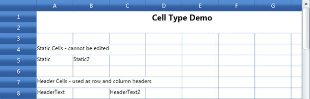{border="0"}

Figure 23: Basic Cell Types

 

###### 4.1.1.2.1.2 TextBlock Cells {#textblock-cells style="tab-stops: 0pt"}

TextBlock cells enable the grid cell as TextBlock so that it displays text that cannot be edited further. The following table consists of properties that are used to customize these cells.

[]{style="FONT-FAMILY: 'Trebuchet MS','sans-serif'; COLOR: #15428b; FONT-SIZE: 9pt"} 

Table 2: TextBlock Cell Type Property Table

::: {align="center"}
  ----------- -------------------------------------------- -------- ------------------ ------------------------------------------------
  Property    Description                                  Type     Value It Accepts   Property Syntax
  CellType    Set to "TextBlock".                          Normal   String             grid.Model\[6, 2\].CellType = \" TextBlock \";
  CellValue   Sets the value to be displayed in the cell   Normal   String             grid.Model\[6, 2\].CellValue =  "Textblock1";
  ----------- -------------------------------------------- -------- ------------------ ------------------------------------------------
:::

 

Creating a TextBlock Cell

The following code illustrates the implementation of  TextBlock Control in the grid cells.

 

+--------------------------------------------------------------------------------------------------------+
| **[\[C#\]]{style="FONT-FAMILY: 'Courier New'"}**                                                       |
|                                                                                                        |
| [grid.Model\[rowIndex, colIndex\].Text = \"TextBlock Cells \";]{style="FONT-FAMILY: 'Courier New'"}    |
|                                                                                                        |
| [rowIndex++;]{style="FONT-FAMILY: 'Courier New'"}                                                      |
|                                                                                                        |
| [grid.Model\[rowIndex, colIndex\].CellType = \"TextBlock\";]{style="FONT-FAMILY: 'Courier New'"}       |
|                                                                                                        |
| [grid.Model\[rowIndex, colIndex\].CellValue = \"TextBlock1\";]{style="FONT-FAMILY: 'Courier New'"}     |
|                                                                                                        |
| [grid.Model\[rowIndex, colIndex + 2\].CellType = \"TextBlock\";]{style="FONT-FAMILY: 'Courier New'"}   |
|                                                                                                        |
| [grid.Model\[rowIndex, colIndex + 2\].CellValue = \"TextBlock2\";]{style="FONT-FAMILY: 'Courier New'"} |
+--------------------------------------------------------------------------------------------------------+

[]{style="COLOR: #15428b; FONT-SIZE: 9pt"} 

When the code runs, the following output is displayed:

 

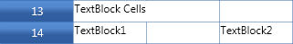{border="0"}***[]{style="COLOR: #15428b; FONT-SIZE: 9pt"}***

***[]{style="FONT-FAMILY: 'Trebuchet MS','sans-serif'; COLOR: #1f497d; FONT-SIZE: 9pt"}*** 

***[]{style="FONT-FAMILY: 'Trebuchet MS','sans-serif'; COLOR: #1f497d; FONT-SIZE: 9pt"}*** 

Figure 24: TextBlock Cells

 

###### 4.1.1.2.1.3 TextBox Cells {#textbox-cells style="tab-stops: 0pt"}

TextBox cells enable the grid cell as TextBox so that any text can be typed inside the control. It is the default type for grid cells. The following table consists of properties that are used to customize these cells.

 

Table 3: TextBox Cell Type Property Table

  ----------- -------------------------------------------- -------- ------------------- ---------------------------------------------
  Property    Description                                  Type     Value it  Accepts   Property Syntax
  CellType    Set to "TextBox".                            Normal   String              grid.Model\[6, 2\].CellType = \"TextBox\";
  CellValue   Sets the value to be displayed in the cell   Normal   String              grid.Model\[6, 2\].CellValue =  "Textbox1";
  ----------- -------------------------------------------- -------- ------------------- ---------------------------------------------

[]{style="FONT-FAMILY: 'Trebuchet MS','sans-serif'; COLOR: #15428b; FONT-SIZE: 9pt"} 

Creating a TextBox cell

The following code illustrates the implementation of  TextBox Control in the grid cells.

.

+------------------------------------------------------------------------------------------------------+
| **[\[C#\]]{style="FONT-FAMILY: 'Courier New'"}**                                                     |
|                                                                                                      |
| [grid.Model\[rowIndex, colIndex\].CellType = \"TextBox\";]{style="FONT-FAMILY: 'Courier New'"}       |
|                                                                                                      |
| [grid.Model\[rowIndex, colIndex\].CellValue = \"TextBox1\";]{style="FONT-FAMILY: 'Courier New'"}     |
|                                                                                                      |
| [grid.Model\[rowIndex, colIndex + 2\].CellType = \"TextBox\";]{style="FONT-FAMILY: 'Courier New'"}   |
|                                                                                                      |
| [grid.Model\[rowIndex, colIndex + 2\].CellValue = \"TextBox2\";]{style="FONT-FAMILY: 'Courier New'"} |
+------------------------------------------------------------------------------------------------------+

[]{style="COLOR: #15428b; FONT-SIZE: 9pt"} 

When the code runs, the following output is displayed:

[]{style="FONT-FAMILY: 'Trebuchet MS','sans-serif'; COLOR: #15428b; FONT-SIZE: 9pt"} 

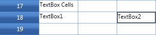{border="0"}***[]{style="COLOR: #15428b; FONT-SIZE: 9pt"}***

***[]{style="FONT-FAMILY: 'Trebuchet MS','sans-serif'; COLOR: #1f497d; FONT-SIZE: 9pt"}*** 

Figure 25: TextBox cells

***[]{style="FONT-FAMILY: 'Trebuchet MS','sans-serif'; COLOR: #1f497d; FONT-SIZE: 9pt"}*** 

###### []{#_CheckBox_Cells}4.1.1.2.1.4 CheckBox Cells {#checkbox-cells style="tab-stops: 0pt"}

The CheckBox cells enable the grid cell as a checkbox. The following table consists of properties used to customize these cells.

Table 4: CheckBox Cell Type Property Table

  ------------- ---------------------------------------------------------------------------------- -------- ------------------ ----------------------------------------------
  Property      Description                                                                        Type     Value It Accepts   Property Syntax
  CellType      Set to "CheckBox".                                                                 Normal   String             grid.Model\[6, 2\].CellType = \"CheckBox\";
  CellValue     Sets true or false for the checkbox in order to select and deselect respectively   Normal   Boolean            grid.Model\[6, 2\].CellValue = true;
  Description   Sets options for the control namely Enable, Disable and TriState                   Normal   String             grid.Model\[6, 2\].Description= \"Enabled\";
  Enabled       Shows whether the control is enabled or disabled (by default it is true)           Normal   Boolean            grid.Model\[6, 2\].Enabled = true;
  ------------- ---------------------------------------------------------------------------------- -------- ------------------ ----------------------------------------------

[]{style="FONT-FAMILY: 'Trebuchet MS','sans-serif'; COLOR: #15428b; FONT-SIZE: 9pt"} 

Creating a CheckBox Cell

The following code illustrates the implementation of  CheckBox Control in the grid cells.

[]{style="FONT-FAMILY: 'Trebuchet MS','sans-serif'; COLOR: #15428b; FONT-SIZE: 9pt"} 

+----------------------------------------------------------------------------------------------------------------------------------+
| **[\[C#\]]{style="FONT-FAMILY: 'Courier New'"}**                                                                                 |
|                                                                                                                                  |
| [grid.Model\[rowIndex, colIndex\].CellValue = [false]{style="COLOR: blue"};]{style="FONT-FAMILY: 'Courier New'"}                 |
|                                                                                                                                  |
| [grid.Model\[rowIndex, colIndex\].CellType = [\"CheckBox\"]{style="COLOR: #a31515"};]{style="FONT-FAMILY: 'Courier New'"}        |
|                                                                                                                                  |
| [grid.Model\[rowIndex, colIndex\].Description = [\"Enabled\"]{style="COLOR: #a31515"};]{style="FONT-FAMILY: 'Courier New'"}      |
|                                                                                                                                  |
| [           ]{style="FONT-FAMILY: 'Courier New'"}                                                                                |
|                                                                                                                                  |
| [grid.Model\[rowIndex, colIndex + 1\].CellValue = [true]{style="COLOR: blue"};]{style="FONT-FAMILY: 'Courier New'"}              |
|                                                                                                                                  |
| [grid.Model\[rowIndex, colIndex + 1\].CellType = [\"CheckBox\"]{style="COLOR: #a31515"};]{style="FONT-FAMILY: 'Courier New'"}    |
|                                                                                                                                  |
| [grid.Model\[rowIndex, colIndex + 1\].Description = [\"TriState\"]{style="COLOR: #a31515"};]{style="FONT-FAMILY: 'Courier New'"} |
|                                                                                                                                  |
| []{style="FONT-FAMILY: 'Courier New'"}                                                                                           |
|                                                                                                                                  |
| [grid.Model\[rowIndex, colIndex + 2\].CellValue = [true]{style="COLOR: blue"};]{style="FONT-FAMILY: 'Courier New'"}              |
|                                                                                                                                  |
| [grid.Model\[rowIndex, colIndex + 2\].Description = [\"Disabled\"]{style="COLOR: #a31515"};]{style="FONT-FAMILY: 'Courier New'"} |
|                                                                                                                                  |
| [grid.Model\[rowIndex, colIndex + 2\].CellType = [\"CheckBox\"]{style="COLOR: #a31515"};]{style="FONT-FAMILY: 'Courier New'"}    |
|                                                                                                                                  |
| [grid.Model\[rowIndex, colIndex + 2\].Enabled = [false]{style="COLOR: blue"};]{style="FONT-FAMILY: 'Courier New'"}               |
|                                                                                                                                  |
| []{style="FONT-FAMILY: 'Courier New'"}                                                                                           |
+----------------------------------------------------------------------------------------------------------------------------------+

 

When the code runs, the following output is displayed:

[]{style="FONT-FAMILY: 'Trebuchet MS','sans-serif'; COLOR: #15428b; FONT-SIZE: 9pt"} 

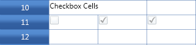{border="0"}***[]{style="FONT-FAMILY: 'Trebuchet MS','sans-serif'; COLOR: #15428b; FONT-SIZE: 9pt"}***

Figure 26: CheckBox cells

***[]{style="FONT-FAMILY: 'Trebuchet MS','sans-serif'; COLOR: #1f497d; FONT-SIZE: 9pt"}*** 

 

###### 4.1.1.2.1.5 Data Template Cells {#data-template-cells style="tab-stops: 0pt"}

 

This cell builds a custom data template that can be used to set enriched styles for associated cells. To achieve this, you need to create custom data templates and by making use of QueryCellInfo event, you can assign the CellType, CellEditTemplateKey, CellItemTemplateKey to display the enriched styles. CellEditTemplateKey specifies the CellRenderer while editing and the CellItemTemplateKey specifies the CellRenderer on cell load time. The following is the sample code to set two different styles inside a cell. It includes a TextBlock cell type and a TextBox cell type while editing (CellEditTemplateKey). While loading the cell, it loads as two TextBlocks (CellItemTemplateKey).

[]{style="FONT-FAMILY: 'Trebuchet MS','sans-serif'; COLOR: #15428b; FONT-SIZE: 9pt"} 

Data Template Definition

 

+-----------------------------------------------------------------------------------------------------------------------------------------------------------------------------------------------------------------------------------------------------------------------------------------------------+
| **[\[XAML\]]{style="FONT-FAMILY: 'Courier New'"}**                                                                                                                                                                                                                                                  |
|                                                                                                                                                                                                                                                                                                     |
| [       ]{style="FONT-FAMILY: 'Courier New'; COLOR: #a31515"}[\<[DataTemplate]{style="COLOR: #a31515"}[ x]{style="COLOR: red"}:[Key]{style="COLOR: red"}=\"editableEmployee\"\>]{style="FONT-FAMILY: 'Courier New'"}                                                                                |
|                                                                                                                                                                                                                                                                                                     |
| [            ]{style="FONT-FAMILY: 'Courier New'; COLOR: #a31515"}[\<[StackPanel]{style="COLOR: #a31515"}[ Orientation]{style="COLOR: red"}=\"Horizontal\"[ Background]{style="COLOR: red"}=\"Transparent\"\>]{style="FONT-FAMILY: 'Courier New'"}                                                  |
|                                                                                                                                                                                                                                                                                                     |
| [                [\<]{style="COLOR: blue"}TextBlock[ FontWeight]{style="COLOR: red"}[=\"Bold\"]{style="COLOR: blue"}]{style="FONT-FAMILY: 'Courier New'"}                                                                                                                                           |
|                                                                                                                                                                                                                                                                                                     |
| [                          [ Text]{style="COLOR: red"}[=\"{]{style="COLOR: blue"}[Binding]{style="COLOR: #a31515"}[ Path]{style="COLOR: red"}[=CellBoundValue.Name}\"]{style="COLOR: blue"} ]{style="FONT-FAMILY: 'Courier New'"}                                                                   |
|                                                                                                                                                                                                                                                                                                     |
| [                          [ Width]{style="COLOR: red"}[=\"70\" /\>]{style="COLOR: blue"}]{style="FONT-FAMILY: 'Courier New'"}                                                                                                                                                                      |
|                                                                                                                                                                                                                                                                                                     |
| [               ]{style="FONT-FAMILY: 'Courier New'; COLOR: #a31515"}[\<[TextBox]{style="COLOR: #a31515"}[ Text]{style="COLOR: red"}=\"{[Binding]{style="COLOR: #a31515"}[ Path]{style="COLOR: red"}=CellBoundValue.Title,[Mode]{style="COLOR: red"}=TwoWay}\"]{style="FONT-FAMILY: 'Courier New'"} |
|                                                                                                                                                                                                                                                                                                     |
| [                         syncfusion[:]{style="COLOR: blue"}BindingHelper.UpdateSourceOnChange[=\"True\"]{style="COLOR: blue"}]{style="FONT-FAMILY: 'Courier New'"}                                                                                                                                 |
|                                                                                                                                                                                                                                                                                                     |
| [                        [ BorderThickness]{style="COLOR: red"}[=\"0\"]{style="COLOR: blue"}  ]{style="FONT-FAMILY: 'Courier New'"}                                                                                                                                                                 |
|                                                                                                                                                                                                                                                                                                     |
| [                        [ Padding]{style="COLOR: red"}[=\"0\"]{style="COLOR: blue"} ]{style="FONT-FAMILY: 'Courier New'"}                                                                                                                                                                          |
|                                                                                                                                                                                                                                                                                                     |
| [                        [ Margin]{style="COLOR: red"}[=\"0\"]{style="COLOR: blue"} ]{style="FONT-FAMILY: 'Courier New'"}                                                                                                                                                                           |
|                                                                                                                                                                                                                                                                                                     |
| [                        [ Width]{style="COLOR: red"}[=\"130\"]{style="COLOR: blue"}   [ /\>]{style="COLOR: blue"}]{style="FONT-FAMILY: 'Courier New'"}                                                                                                                                             |
|                                                                                                                                                                                                                                                                                                     |
| [            [\</]{style="COLOR: blue"}StackPanel[\>]{style="COLOR: blue"}]{style="FONT-FAMILY: 'Courier New'"}                                                                                                                                                                                     |
|                                                                                                                                                                                                                                                                                                     |
| [        [\</]{style="COLOR: blue"}DataTemplate[\>]{style="COLOR: blue"}]{style="FONT-FAMILY: 'Courier New'"}                                                                                                                                                                                       |
|                                                                                                                                                                                                                                                                                                     |
| []{style="FONT-FAMILY: 'Courier New'"}                                                                                                                                                                                                                                                              |
|                                                                                                                                                                                                                                                                                                     |
| [        ]{style="FONT-FAMILY: 'Courier New'; COLOR: #a31515"}[\<[DataTemplate]{style="COLOR: #a31515"}[ x]{style="COLOR: red"}:[Key]{style="COLOR: red"}=\"nonEditableEmployee\"\>]{style="FONT-FAMILY: 'Courier New'"}                                                                            |
|                                                                                                                                                                                                                                                                                                     |
| [            ]{style="FONT-FAMILY: 'Courier New'; COLOR: #a31515"}[\<[StackPanel]{style="COLOR: #a31515"}[ Orientation]{style="COLOR: red"}=\"Horizontal\"[ Background]{style="COLOR: red"}=\"Transparent\"\>]{style="FONT-FAMILY: 'Courier New'"}                                                  |
|                                                                                                                                                                                                                                                                                                     |
| [                [\<]{style="COLOR: blue"}TextBlock[ FontWeight]{style="COLOR: red"}[=\"Bold\"]{style="COLOR: blue"} ]{style="FONT-FAMILY: 'Courier New'"}                                                                                                                                          |
|                                                                                                                                                                                                                                                                                                     |
| [                          [ Text]{style="COLOR: red"}[=\"{]{style="COLOR: blue"}[Binding]{style="COLOR: #a31515"}[ Path]{style="COLOR: red"}[=CellBoundValue.Name}\"]{style="COLOR: blue"} ]{style="FONT-FAMILY: 'Courier New'"}                                                                   |
|                                                                                                                                                                                                                                                                                                     |
| [                          [ Width]{style="COLOR: red"}[=\"70\"/\>]{style="COLOR: blue"}]{style="FONT-FAMILY: 'Courier New'"}                                                                                                                                                                       |
|                                                                                                                                                                                                                                                                                                     |
| [                [\<]{style="COLOR: blue"}TextBlock[ Text]{style="COLOR: red"}[=\"{]{style="COLOR: blue"}Binding[ Path]{style="COLOR: red"}[=CellBoundValue.Title}\"]{style="COLOR: blue"} [ /\>]{style="COLOR: blue"}]{style="FONT-FAMILY: 'Courier New'"}                                         |
|                                                                                                                                                                                                                                                                                                     |
| [            [\</]{style="COLOR: blue"}StackPanel[\>]{style="COLOR: blue"}]{style="FONT-FAMILY: 'Courier New'"}                                                                                                                                                                                     |
|                                                                                                                                                                                                                                                                                                     |
| [        [\</]{style="COLOR: blue"}DataTemplate[\>]{style="COLOR: blue"}]{style="FONT-FAMILY: 'Courier New'"}                                                                                                                                                                                       |
+-----------------------------------------------------------------------------------------------------------------------------------------------------------------------------------------------------------------------------------------------------------------------------------------------------+

 

Setting Up the Data Template Cell and Assigning the Cell Template

[]{style="FONT-FAMILY: 'Courier New'"} 

+-----------------------------------------------------------------------------------------------------------------------------------------------------------------------------------------------+
| **[\[C#\]]{style="FONT-FAMILY: 'Courier New'"}**                                                                                                                                              |
|                                                                                                                                                                                               |
| []{style="FONT-FAMILY: 'Courier New'"}                                                                                                                                                        |
|                                                                                                                                                                                               |
| [this.grid.QueryCellInfo += new Syncfusion.Windows.Controls.Grid.GridQueryCellInfoEventHandler(grid_QueryCellInfo); ]{style="FONT-FAMILY: 'Courier New'"}                                     |
|                                                                                                                                                                                               |
| []{style="FONT-FAMILY: 'Courier New'"}                                                                                                                                                        |
|                                                                                                                                                                                               |
| [        void grid_QueryCellInfo(object sender, Syncfusion.Windows.Controls.Grid.GridQueryCellInfoEventArgs e)]{style="FONT-FAMILY: 'Courier New'"}                                           |
|                                                                                                                                                                                               |
| [        {]{style="FONT-FAMILY: 'Courier New'"}                                                                                                                                               |
|                                                                                                                                                                                               |
| [            if (e.Cell.RowIndex \> 1 && e.Cell.ColumnIndex == 2)]{style="FONT-FAMILY: 'Courier New'"}                                                                                        |
|                                                                                                                                                                                               |
| [            {]{style="FONT-FAMILY: 'Courier New'"}                                                                                                                                           |
|                                                                                                                                                                                               |
| [                e.Style.CellType = \"DataBoundTemplate\";]{style="FONT-FAMILY: 'Courier New'"}                                                                                               |
|                                                                                                                                                                                               |
| [                e.Style.CellEditTemplateKey = \"editableEmployee\";]{style="FONT-FAMILY: 'Courier New'"}                                                                                     |
|                                                                                                                                                                                               |
| [                e.Style.CellItemTemplateKey = \"nonEditableEmployee\";]{style="FONT-FAMILY: 'Courier New'"}                                                                                  |
|                                                                                                                                                                                               |
| [                e.Style.CellValue = employeesSource.Employees\[e.Cell.RowIndex % employeesSource.Employees.Count\];//Values to be displayed in the cell]{style="FONT-FAMILY: 'Courier New'"} |
|                                                                                                                                                                                               |
| [            }]{style="FONT-FAMILY: 'Courier New'"}                                                                                                                                           |
|                                                                                                                                                                                               |
| [               }]{style="FONT-FAMILY: 'Courier New'"}                                                                                                                                        |
+-----------------------------------------------------------------------------------------------------------------------------------------------------------------------------------------------+

**[]{style="FONT-FAMILY: 'Trebuchet MS','sans-serif'; COLOR: #15428b; FONT-SIZE: 9pt"}** 

Output

The following output is generated using code above:

 

 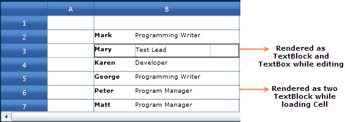{border="0"}

***[]{style="FONT-FAMILY: 'Trebuchet MS','sans-serif'; COLOR: #1f497d; FONT-SIZE: 9pt"}*** 

Figure 27: Data Template with Cell Template Assigned

 

***[]{style="COLOR: #15428b; FONT-SIZE: 9pt"}*** 

###### []{#_ComboBox_Cells}4.1.1.2.1.6 ComboBox Cells {#combobox-cells style="tab-stops: 0pt"}

A combo box is a component with a drop-down arrow that users click to display an associated list of choices. The user displays the list by clicking or dragging the drop-down arrow. This cell type allows you to choose the cell value from a drop-down list.

The following table lists various properties that can affect combo box cells.

Table 5 : ComboBox Cell Type Property Table

::: {align="center"}
+-----------------+----------------------------------------------------------------------------------------------------------+----------------------------------------------------------------------+--------------------------------------------------------------------+
| Property        | Description                                                                                              | Value It Accepts                                                     | Property Syntax                                                    |
+-----------------+----------------------------------------------------------------------------------------------------------+----------------------------------------------------------------------+--------------------------------------------------------------------+
| CellType        | Set to "ComboBox" for a Combo box control                                                                | String                                                               | grid.Model\[6, 2\].CellType                                        |
|                 |                                                                                                          |                                                                      |                                                                    |
|                 |                                                                                                          |                                                                      | = \"ComboBox\";                                                    |
+-----------------+----------------------------------------------------------------------------------------------------------+----------------------------------------------------------------------+--------------------------------------------------------------------+
| ChoiceList      | Not Applicable                                                                                           | Not Applicable                                                       | Not Applicable                                                     |
+-----------------+----------------------------------------------------------------------------------------------------------+----------------------------------------------------------------------+--------------------------------------------------------------------+
| DropDownStyle   | Determines the drop-down cell behavior.                                                                  | GridDropDownStyle Enumeration                                        | grid.Model\[6, 2\].DropDownStyle = GridDropDownStyle.AutoComplete; |
|                 |                                                                                                          |                                                                      |                                                                    |
|                 | [·      ]{style="FONT-FAMILY: Symbol"}Editable( Not Applicable)                                          |                                                                      |                                                                    |
|                 |                                                                                                          |                                                                      |                                                                    |
|                 | [·      ]{style="FONT-FAMILY: Symbol"}Autocomplete                                                       |                                                                      |                                                                    |
|                 |                                                                                                          |                                                                      |                                                                    |
|                 | [·      ]{style="FONT-FAMILY: Symbol"}Exclusive ( Not Applicable)                                        |                                                                      |                                                                    |
+-----------------+----------------------------------------------------------------------------------------------------------+----------------------------------------------------------------------+--------------------------------------------------------------------+
| ItemsSource     | Specifies the binding source for the Combo box.                                                          | Collection                                                           | grid.Model\[6, 2\].ItemsSource = employeesSource.Employees;        |
+-----------------+----------------------------------------------------------------------------------------------------------+----------------------------------------------------------------------+--------------------------------------------------------------------+
| Display Member  | String that names the public property from the data source object to be displayed in the cell.           | String                                                               | grid.Model\[6, 2\].DisplayMember = \"Name\";                       |
+-----------------+----------------------------------------------------------------------------------------------------------+----------------------------------------------------------------------+--------------------------------------------------------------------+
| CellValue       | String that names the public property from the data source object to be used as the value for this cell. | The value to be displayed in the ComboBox from the given data source | grid.Model\[6, 2\].ValueMember                                     |
|                 |                                                                                                          |                                                                      |                                                                    |
|                 |                                                                                                          |                                                                      |  = employeesSource.Employees\[0\];                                 |
+-----------------+----------------------------------------------------------------------------------------------------------+----------------------------------------------------------------------+--------------------------------------------------------------------+
| ValueMember     | Not Applicable                                                                                           | Not Applicable                                                       | Not Applicable                                                     |
+-----------------+----------------------------------------------------------------------------------------------------------+----------------------------------------------------------------------+--------------------------------------------------------------------+
:::

 

 

Using ItemsSource

The combo boxes created using ItemsSource class ensure that the options available in the drop-down list are populated from the data source the combo box is bound to. The combo boxes in the following examples are bound to ObservableCollection employees. The following code shows the implementation of ObservableCollection for EmployeesSource class. It has two properties namely Name and Title of the employees.

**[]{style="FONT-FAMILY: 'Trebuchet MS','sans-serif'; COLOR: #15428b; FONT-SIZE: 9pt"}** 

Setting Up ItemsSource to the Combo Box

 

+-----------------------------------------------------------------------------------------------------------------------------------------------------------------------------------------------------------------------------+
| **[\[C#\]]{style="FONT-FAMILY: 'Courier New'"}**                                                                                                                                                                            |
|                                                                                                                                                                                                                             |
| []{style="FONT-FAMILY: 'Courier New'"}                                                                                                                                                                                      |
|                                                                                                                                                                                                                             |
| [public]{style="FONT-FAMILY: 'Courier New'; COLOR: blue"}[ [class]{style="COLOR: blue"} [EmployeesSource]{style="COLOR: #2b91af"}]{style="FONT-FAMILY: 'Courier New'"}                                                      |
|                                                                                                                                                                                                                             |
| [    {]{style="FONT-FAMILY: 'Courier New'"}                                                                                                                                                                                 |
|                                                                                                                                                                                                                             |
| [        [private]{style="COLOR: blue"} [ObservableCollection]{style="COLOR: #2b91af"}\<[Employee]{style="COLOR: #2b91af"}\> employees;]{style="FONT-FAMILY: 'Courier New'"}                                                |
|                                                                                                                                                                                                                             |
| []{style="FONT-FAMILY: 'Courier New'"}                                                                                                                                                                                      |
|                                                                                                                                                                                                                             |
| [        [public]{style="COLOR: blue"} [ObservableCollection]{style="COLOR: #2b91af"}\<[Employee]{style="COLOR: #2b91af"}\> Employees]{style="FONT-FAMILY: 'Courier New'"}                                                  |
|                                                                                                                                                                                                                             |
| [        {]{style="FONT-FAMILY: 'Courier New'"}                                                                                                                                                                             |
|                                                                                                                                                                                                                             |
| [            [get]{style="COLOR: blue"} { [return]{style="COLOR: blue"} employees; }]{style="FONT-FAMILY: 'Courier New'"}                                                                                                   |
|                                                                                                                                                                                                                             |
| [        }]{style="FONT-FAMILY: 'Courier New'"}                                                                                                                                                                             |
|                                                                                                                                                                                                                             |
| []{style="FONT-FAMILY: 'Courier New'"}                                                                                                                                                                                      |
|                                                                                                                                                                                                                             |
| [        [public]{style="COLOR: blue"} EmployeesSource()]{style="FONT-FAMILY: 'Courier New'"}                                                                                                                               |
|                                                                                                                                                                                                                             |
| [        {]{style="FONT-FAMILY: 'Courier New'"}                                                                                                                                                                             |
|                                                                                                                                                                                                                             |
| [            employees = [new]{style="COLOR: blue"} [ObservableCollection]{style="COLOR: #2b91af"}\<[Employee]{style="COLOR: #2b91af"}\>();]{style="FONT-FAMILY: 'Courier New'"}                                            |
|                                                                                                                                                                                                                             |
| [            {]{style="FONT-FAMILY: 'Courier New'"}                                                                                                                                                                         |
|                                                                                                                                                                                                                             |
| [                employees.Add([new]{style="COLOR: blue"} [Employee]{style="COLOR: #2b91af"}([\"Matt\"]{style="COLOR: #a31515"}, [\"Program Manager\"]{style="COLOR: #a31515"}));]{style="FONT-FAMILY: 'Courier New'"}      |
|                                                                                                                                                                                                                             |
| [                employees.Add([new]{style="COLOR: blue"} [Employee]{style="COLOR: #2b91af"}([\"Joan\"]{style="COLOR: #a31515"}, [\"Developer\"]{style="COLOR: #a31515"}));]{style="FONT-FAMILY: 'Courier New'"}            |
|                                                                                                                                                                                                                             |
| [                employees.Add([new]{style="COLOR: blue"} [Employee]{style="COLOR: #2b91af"}([\"Mark\"]{style="COLOR: #a31515"}, [\"Programming Writer\"]{style="COLOR: #a31515"}));]{style="FONT-FAMILY: 'Courier New'"}   |
|                                                                                                                                                                                                                             |
| [                employees.Add([new]{style="COLOR: blue"} [Employee]{style="COLOR: #2b91af"}([\"Mary\"]{style="COLOR: #a31515"}, [\"Test Lead\"]{style="COLOR: #a31515"}));]{style="FONT-FAMILY: 'Courier New'"}            |
|                                                                                                                                                                                                                             |
| [                employees.Add([new]{style="COLOR: blue"} [Employee]{style="COLOR: #2b91af"}([\"Karen\"]{style="COLOR: #a31515"}, [\"Developer\"]{style="COLOR: #a31515"}));]{style="FONT-FAMILY: 'Courier New'"}           |
|                                                                                                                                                                                                                             |
| [                employees.Add([new]{style="COLOR: blue"} [Employee]{style="COLOR: #2b91af"}([\"George\"]{style="COLOR: #a31515"}, [\"Programming Writer\"]{style="COLOR: #a31515"}));]{style="FONT-FAMILY: 'Courier New'"} |
|                                                                                                                                                                                                                             |
| [                employees.Add([new]{style="COLOR: blue"} [Employee]{style="COLOR: #2b91af"}([\"Peter\"]{style="COLOR: #a31515"}, [\"Program Manager\"]{style="COLOR: #a31515"}));]{style="FONT-FAMILY: 'Courier New'"}     |
|                                                                                                                                                                                                                             |
| [            }]{style="FONT-FAMILY: 'Courier New'"}                                                                                                                                                                         |
|                                                                                                                                                                                                                             |
| [        }    }]{style="FONT-FAMILY: 'Courier New'"}                                                                                                                                                                        |
|                                                                                                                                                                                                                             |
| []{style="FONT-FAMILY: 'Courier New'"}                                                                                                                                                                                      |
|                                                                                                                                                                                                                             |
| [    [public]{style="COLOR: blue"} [class]{style="COLOR: blue"} [Employee]{style="COLOR: #2b91af"} : [INotifyPropertyChanged]{style="COLOR: #2b91af"}]{style="FONT-FAMILY: 'Courier New'"}                                  |
|                                                                                                                                                                                                                             |
| [    {]{style="FONT-FAMILY: 'Courier New'"}                                                                                                                                                                                 |
|                                                                                                                                                                                                                             |
| [        [private]{style="COLOR: blue"} [string]{style="COLOR: blue"} name;]{style="FONT-FAMILY: 'Courier New'"}                                                                                                            |
|                                                                                                                                                                                                                             |
| []{style="FONT-FAMILY: 'Courier New'"}                                                                                                                                                                                      |
|                                                                                                                                                                                                                             |
| [        [public]{style="COLOR: blue"} [string]{style="COLOR: blue"} Name]{style="FONT-FAMILY: 'Courier New'"}                                                                                                              |
|                                                                                                                                                                                                                             |
| [        {]{style="FONT-FAMILY: 'Courier New'"}                                                                                                                                                                             |
|                                                                                                                                                                                                                             |
| [            [get]{style="COLOR: blue"} { [return]{style="COLOR: blue"} name; }]{style="FONT-FAMILY: 'Courier New'"}                                                                                                        |
|                                                                                                                                                                                                                             |
| [            [set]{style="COLOR: blue"}]{style="FONT-FAMILY: 'Courier New'"}                                                                                                                                                |
|                                                                                                                                                                                                                             |
| [            {]{style="FONT-FAMILY: 'Courier New'"}                                                                                                                                                                         |
|                                                                                                                                                                                                                             |
| [                name = [value]{style="COLOR: blue"};]{style="FONT-FAMILY: 'Courier New'"}                                                                                                                                  |
|                                                                                                                                                                                                                             |
| [                OnPropertyChanged([\"Name\"]{style="COLOR: #a31515"});]{style="FONT-FAMILY: 'Courier New'"}                                                                                                                |
|                                                                                                                                                                                                                             |
| [            }]{style="FONT-FAMILY: 'Courier New'"}                                                                                                                                                                         |
|                                                                                                                                                                                                                             |
| [        }]{style="FONT-FAMILY: 'Courier New'"}                                                                                                                                                                             |
|                                                                                                                                                                                                                             |
| []{style="FONT-FAMILY: 'Courier New'"}                                                                                                                                                                                      |
|                                                                                                                                                                                                                             |
| [        [private]{style="COLOR: blue"} [string]{style="COLOR: blue"} title;]{style="FONT-FAMILY: 'Courier New'"}                                                                                                           |
|                                                                                                                                                                                                                             |
| []{style="FONT-FAMILY: 'Courier New'"}                                                                                                                                                                                      |
|                                                                                                                                                                                                                             |
| [        [public]{style="COLOR: blue"} [string]{style="COLOR: blue"} Title]{style="FONT-FAMILY: 'Courier New'"}                                                                                                             |
|                                                                                                                                                                                                                             |
| [        {]{style="FONT-FAMILY: 'Courier New'"}                                                                                                                                                                             |
|                                                                                                                                                                                                                             |
| [            [get]{style="COLOR: blue"} { [return]{style="COLOR: blue"} title; }]{style="FONT-FAMILY: 'Courier New'"}                                                                                                       |
|                                                                                                                                                                                                                             |
| [            [set]{style="COLOR: blue"}]{style="FONT-FAMILY: 'Courier New'"}                                                                                                                                                |
|                                                                                                                                                                                                                             |
| [            {]{style="FONT-FAMILY: 'Courier New'"}                                                                                                                                                                         |
|                                                                                                                                                                                                                             |
| [                title = [value]{style="COLOR: blue"};]{style="FONT-FAMILY: 'Courier New'"}                                                                                                                                 |
|                                                                                                                                                                                                                             |
| [                OnPropertyChanged([\"Title\"]{style="COLOR: #a31515"});]{style="FONT-FAMILY: 'Courier New'"}                                                                                                               |
|                                                                                                                                                                                                                             |
| [            }]{style="FONT-FAMILY: 'Courier New'"}                                                                                                                                                                         |
|                                                                                                                                                                                                                             |
| [        }]{style="FONT-FAMILY: 'Courier New'"}                                                                                                                                                                             |
|                                                                                                                                                                                                                             |
| []{style="FONT-FAMILY: 'Courier New'"}                                                                                                                                                                                      |
|                                                                                                                                                                                                                             |
| [        [public]{style="COLOR: blue"} Employee([string]{style="COLOR: blue"} name, [string]{style="COLOR: blue"} title)]{style="FONT-FAMILY: 'Courier New'"}                                                               |
|                                                                                                                                                                                                                             |
| [        {]{style="FONT-FAMILY: 'Courier New'"}                                                                                                                                                                             |
|                                                                                                                                                                                                                             |
| [            [this]{style="COLOR: blue"}.name = name;]{style="FONT-FAMILY: 'Courier New'"}                                                                                                                                  |
|                                                                                                                                                                                                                             |
| [            [this]{style="COLOR: blue"}.title = title;]{style="FONT-FAMILY: 'Courier New'"}                                                                                                                                |
|                                                                                                                                                                                                                             |
| [        }]{style="FONT-FAMILY: 'Courier New'"}                                                                                                                                                                             |
|                                                                                                                                                                                                                             |
| []{style="FONT-FAMILY: 'Courier New'"}                                                                                                                                                                                      |
|                                                                                                                                                                                                                             |
| [        [public]{style="COLOR: blue"} [event]{style="COLOR: blue"} [PropertyChangedEventHandler]{style="COLOR: #2b91af"} PropertyChanged;]{style="FONT-FAMILY: 'Courier New'"}                                             |
|                                                                                                                                                                                                                             |
| []{style="FONT-FAMILY: 'Courier New'"}                                                                                                                                                                                      |
|                                                                                                                                                                                                                             |
| [        [private]{style="COLOR: blue"} [void]{style="COLOR: blue"} OnPropertyChanged([string]{style="COLOR: blue"} propertyName)]{style="FONT-FAMILY: 'Courier New'"}                                                      |
|                                                                                                                                                                                                                             |
| [        {]{style="FONT-FAMILY: 'Courier New'"}                                                                                                                                                                             |
|                                                                                                                                                                                                                             |
| [            [if]{style="COLOR: blue"} (PropertyChanged != [null]{style="COLOR: blue"})]{style="FONT-FAMILY: 'Courier New'"}                                                                                                |
|                                                                                                                                                                                                                             |
| [            {]{style="FONT-FAMILY: 'Courier New'"}                                                                                                                                                                         |
|                                                                                                                                                                                                                             |
| [                PropertyChanged([this]{style="COLOR: blue"}, [new]{style="COLOR: blue"} [PropertyChangedEventArgs]{style="COLOR: #2b91af"}(propertyName));]{style="FONT-FAMILY: 'Courier New'"}                            |
|                                                                                                                                                                                                                             |
| [            }]{style="FONT-FAMILY: 'Courier New'"}                                                                                                                                                                         |
|                                                                                                                                                                                                                             |
| [        }]{style="FONT-FAMILY: 'Courier New'"}                                                                                                                                                                             |
|                                                                                                                                                                                                                             |
| [    }]{style="FONT-FAMILY: 'Courier New'"}                                                                                                                                                                                 |
+-----------------------------------------------------------------------------------------------------------------------------------------------------------------------------------------------------------------------------+

 

The following code sets the ItemSource values from the ObservableCollection.

 

+---------------------------------------------------------------------------------------------------------------------------------------+
| **[\[C#\]]{style="FONT-FAMILY: 'Courier New'"}**                                                                                      |
|                                                                                                                                       |
| []{style="FONT-FAMILY: 'Courier New'"}                                                                                                |
|                                                                                                                                       |
| [var]{style="FONT-FAMILY: 'Courier New'; COLOR: blue"}[ style = grid.Model\[rowIndex,colIndex\];]{style="FONT-FAMILY: 'Courier New'"} |
|                                                                                                                                       |
| [style.ItemsSource = employeesSource.Employees;]{style="FONT-FAMILY: 'Courier New'"}                                                  |
|                                                                                                                                       |
| [style.CellType = [\"ComboBox\"]{style="COLOR: #a31515"};]{style="FONT-FAMILY: 'Courier New'"}                                        |
|                                                                                                                                       |
| [style.CellValue = employeesSource.Employees\[0\];]{style="FONT-FAMILY: 'Courier New'"}                                               |
|                                                                                                                                       |
| [style.DisplayMember = **[\"Name\"]{style="COLOR: #a31515"};**]{style="FONT-FAMILY: 'Courier New'"}                                   |
+---------------------------------------------------------------------------------------------------------------------------------------+

 

In the above sample code the "Name" is used as the DisplayMember. Therefore, the Combo box will be filled with the Name as the CellValue.

[]{style="FONT-FAMILY: 'Trebuchet MS','sans-serif'; COLOR: #15428b; FONT-SIZE: 9pt"} 

Output

The following output is generated using code above:

 

 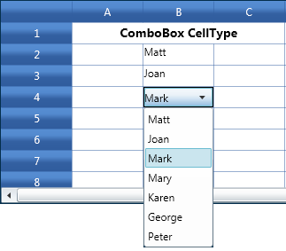{border="0"}

***[]{style="FONT-FAMILY: 'Trebuchet MS','sans-serif'; COLOR: #1f497d; FONT-SIZE: 9pt"}*** 

Figure 28: Combo Box using DisplayMember as Name

 

If we set the DisplayMember to the "Title", the combobox will be filled with the Title object. The following code explains the same.

 

+---------------------------------------------------------------------------------------------------------------------------------------+
| **[\[C#\]]{style="FONT-FAMILY: 'Courier New'"}**                                                                                      |
|                                                                                                                                       |
| []{style="FONT-FAMILY: 'Courier New'"}                                                                                                |
|                                                                                                                                       |
| [var]{style="FONT-FAMILY: 'Courier New'; COLOR: blue"}[ style = grid.Model\[rowIndex,colIndex\];]{style="FONT-FAMILY: 'Courier New'"} |
|                                                                                                                                       |
| [style.ItemsSource = employeesSource.Employees;]{style="FONT-FAMILY: 'Courier New'"}                                                  |
|                                                                                                                                       |
| [style.CellType = [\"ComboBox\"]{style="COLOR: #a31515"};]{style="FONT-FAMILY: 'Courier New'"}                                        |
|                                                                                                                                       |
| [style.CellValue = employeesSource.Employees\[0\];]{style="FONT-FAMILY: 'Courier New'"}                                               |
|                                                                                                                                       |
| [style.DisplayMember = **[\"Title\"]{style="COLOR: #a31515"};**]{style="FONT-FAMILY: 'Courier New'"}                                  |
+---------------------------------------------------------------------------------------------------------------------------------------+

 

Output

The following output is generated from the above code:

 

 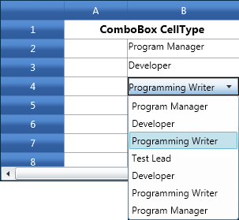{border="0"}

 

Figure 29: Combo Box using DisplayMember as Title

***[]{style="COLOR: #1f497d; FONT-SIZE: 9pt"}*** 

ComboBox with DataTemplate

DataTemplate can be used to format the view of the Combo box. The following code shows the definition of the DataTemplate in XAML.

 

+----------------------------------------------------------------------------------------------------------------------------------------------------------------------------------------------------------------+
| **[\[XAML\]]{style="FONT-FAMILY: 'Courier New'"}**                                                                                                                                                             |
|                                                                                                                                                                                                                |
| []{style="FONT-FAMILY: 'Courier New'"}                                                                                                                                                                         |
|                                                                                                                                                                                                                |
| [\<[DataTemplate]{style="COLOR: #a31515"}[ x]{style="COLOR: red"}:[Key]{style="COLOR: red"}=\"editableEmployee\"\>]{style="FONT-FAMILY: 'Courier New'"}                                                        |
|                                                                                                                                                                                                                |
| [                    \<StackPanel[ Orientation]{style="COLOR: red"}=\"Horizontal\"\>]{style="FONT-FAMILY: 'Courier New'"}                                                                                      |
|                                                                                                                                                                                                                |
| [                        \<TextBlock [ Width]{style="COLOR: red"}=\"150\"[ Text]{style="COLOR: red"}=\"{Binding[ Path]{style="COLOR: red"}=Name}\"[ ]{style="COLOR: red"}]{style="FONT-FAMILY: 'Courier New'"} |
|                                                                                                                                                                                                                |
| [                                    VerticalAlignment=\"Center\" FontSize=\"14\"/\>]{style="FONT-FAMILY: 'Courier New'"}                                                                                      |
|                                                                                                                                                                                                                |
| [                        \<TextBlock[ Text]{style="COLOR: red"}=\"{Binding[ Path]{style="COLOR: red"}=Title}\"[ ]{style="COLOR: red"}]{style="FONT-FAMILY: 'Courier New'"}                                     |
|                                                                                                                                                                                                                |
| [                                   HorizontalAlignment=\"Right\" ]{style="FONT-FAMILY: 'Courier New'"}                                                                                                        |
|                                                                                                                                                                                                                |
| [                                   VerticalAlignment=\"Center\" FontSize=\"12\"  /\>]{style="FONT-FAMILY: 'Courier New'"}                                                                                     |
|                                                                                                                                                                                                                |
| [                    \</StackPanel\>]{style="FONT-FAMILY: 'Courier New'"}                                                                                                                                      |
|                                                                                                                                                                                                                |
| [\</DataTemplate\>]{style="FONT-FAMILY: 'Courier New'"}                                                                                                                                                        |
+----------------------------------------------------------------------------------------------------------------------------------------------------------------------------------------------------------------+

 

The following code shows the implementation of the above DataTemplate.

[]{style="FONT-FAMILY: 'Courier New'"} 

+---------------------------------------------------------------------------------------------------------------------------------------+
| **[\[C#\]]{style="FONT-FAMILY: 'Courier New'"}**                                                                                      |
|                                                                                                                                       |
| []{style="FONT-FAMILY: 'Courier New'"}                                                                                                |
|                                                                                                                                       |
| [var]{style="FONT-FAMILY: 'Courier New'; COLOR: blue"}[ style = grid.Model\[rowIndex,colIndex\];]{style="FONT-FAMILY: 'Courier New'"} |
|                                                                                                                                       |
| [style.CellItemTemplateKey = [\"editableEmployee\"]{style="COLOR: #a31515"};]{style="FONT-FAMILY: 'Courier New'"}                     |
|                                                                                                                                       |
| [style.CellType = [\"ComboBox\"]{style="COLOR: #a31515"};]{style="FONT-FAMILY: 'Courier New'"}                                        |
|                                                                                                                                       |
| [style.ItemsSource   = employeesSource.Employees;]{style="FONT-FAMILY: 'Courier New'"}                                                |
|                                                                                                                                       |
| [style.CellValue = employeesSource.Employees\[0\];]{style="FONT-FAMILY: 'Courier New'"}                                               |
|                                                                                                                                       |
| [style.DisplayMember = [\"Name\"]{style="COLOR: #a31515"};]{style="FONT-FAMILY: 'Courier New'"}                                       |
+---------------------------------------------------------------------------------------------------------------------------------------+

 

Output

The following output is generated using code above:

[]{style="FONT-FAMILY: 'Trebuchet MS','sans-serif'; COLOR: #15428b; FONT-SIZE: 9pt"} 

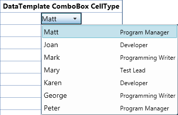{border="0"}

 

Figure 30: ComboBox is displayed with DataTemplate

 

###### 4.1.1.2.1.7 MaskEdit Cells {#maskedit-cells style="tab-stops: 0pt"}

The MaskEdit cells enable the grid cell to customize the way values are displayed. Masking can be achieved using this cell type. The MaskEdit cells do not accept the values more than the masked type. The following table consists of properties that are used to customize these cells.

 

Table 6: MaskEdit Cell Type Property Table

+-------------+-----------------------------------------------------------------------------------------------------------+-------------+-----------------------+---------------------------------------------------------------------------------------------+
| Property    | Description                                                                                               | Type        | Value It Accepts      | Property Syntax                                                                             |
+-------------+-----------------------------------------------------------------------------------------------------------+-------------+-----------------------+---------------------------------------------------------------------------------------------+
| CellType    | Set to "MaskEdit".                                                                                        | Normal      | String                | grid.Model\[6, 2\].CellType = \"MaskEdit\";                                                 |
+-------------+-----------------------------------------------------------------------------------------------------------+-------------+-----------------------+---------------------------------------------------------------------------------------------+
| CellValue   | Sets the value to be displayed in the cell                                                                | Normal      | Number (only)         | grid.Model\[6, 2\].CellValue =  08192010;                                                   |
+-------------+-----------------------------------------------------------------------------------------------------------+-------------+-----------------------+---------------------------------------------------------------------------------------------+
| MaskEdit    | Sets the mask edit style                                                                                  | Normal      | GridMaskEditStyleInfo |             this.grid.Model\[rowIndex, colIndex\].MaskEdit = GridMaskEditStyleInfo.Default; |
+-------------+-----------------------------------------------------------------------------------------------------------+-------------+-----------------------+---------------------------------------------------------------------------------------------+
| Mask        | Formats the number and masks according to the given Mask string. See the Property syntax for sample code. | Normal      | String                | this.grid.Model\[rowIndex, colIndex\].MaskEdit.Mask                                         |
|             |                                                                                                           |             |                       |                                                                                             |
|             |                                                                                                           |             |                       |  = \"00/00/0000\";                                                                          |
+-------------+-----------------------------------------------------------------------------------------------------------+-------------+-----------------------+---------------------------------------------------------------------------------------------+

 

Creating a MaskEdit Cell

**[]{style="FONT-FAMILY: 'Trebuchet MS','sans-serif'; COLOR: #15428b; FONT-SIZE: 9pt"}** 

The following code describes the implementation of  MaskEdit Control in the grid cells.

 

+--------------------------------------------------------------------------------------------------------------------------------------------------------------------------+
| **[\[C#\]]{style="FONT-FAMILY: 'Courier New'"}**                                                                                                                         |
|                                                                                                                                                                          |
| [            [this]{style="COLOR: blue"}.grid.Model\[rowIndex, colIndex\].CellType = [\"MaskEdit\"]{style="COLOR: #a31515"};]{style="FONT-FAMILY: 'Courier New'"}        |
|                                                                                                                                                                          |
| [            [this]{style="COLOR: blue"}.grid.Model\[rowIndex, colIndex\].MaskEdit = ]{style="FONT-FAMILY: 'Courier New'"}                                               |
|                                                                                                                                                                          |
| [            GridMaskEditStyleInfo]{style="FONT-FAMILY: 'Courier New'; COLOR: #2b91af"}[.Default;]{style="FONT-FAMILY: 'Courier New'"}                                   |
|                                                                                                                                                                          |
| [            [this]{style="COLOR: blue"}.grid.Model\[rowIndex, colIndex\].MaskEdit.Mask = [\"00/00/0000\"]{style="COLOR: #a31515"};]{style="FONT-FAMILY: 'Courier New'"} |
|                                                                                                                                                                          |
| [            [this]{style="COLOR: blue"}.grid.Model\[rowIndex, colIndex\].CellValue = 08192010;]{style="FONT-FAMILY: 'Courier New'"}                                     |
|                                                                                                                                                                          |
| [            rowIndex++;]{style="FONT-FAMILY: 'Courier New'"}                                                                                                            |
|                                                                                                                                                                          |
| [            [var]{style="COLOR: blue"} maskStyleInfo1 = [this]{style="COLOR: blue"}.grid.Model\[rowIndex, colIndex\];]{style="FONT-FAMILY: 'Courier New'"}              |
|                                                                                                                                                                          |
| [            maskStyleInfo1.CellType = [\"MaskEdit\"]{style="COLOR: #a31515"};]{style="FONT-FAMILY: 'Courier New'"}                                                      |
|                                                                                                                                                                          |
| [            maskStyleInfo1.MaskEdit = [GridMaskEditStyleInfo]{style="COLOR: #2b91af"}.Default;]{style="FONT-FAMILY: 'Courier New'"}                                     |
|                                                                                                                                                                          |
| [            maskStyleInfo1.MaskEdit.Mask = [\"00:00:00\"]{style="COLOR: #a31515"};]{style="FONT-FAMILY: 'Courier New'"}                                                 |
|                                                                                                                                                                          |
| [            maskStyleInfo1.CellValue = 043549;]{style="FONT-FAMILY: 'Courier New'"}                                                                                     |
|                                                                                                                                                                          |
|                                                                                                                                                                          |
+--------------------------------------------------------------------------------------------------------------------------------------------------------------------------+

 

 

###### 4.1.1.2.1.8 IntegerEdit Cells {#integeredit-cells style="tab-stops: 0pt"}

 

IntegerEdit is a specialized cell type that restricts the data entry to integers. The following table consists of GridStyleInfo properties that are used to customize these cells.

 

Table 7:IntegerEdit Cell Type Property Table

::: {align="center"}
  ---------------------- ------------------------------------------------- -------- ------------------ ---------------------------------------------------------------------------------------------------------------------
  Property               Description                                       Type     Value it Accepts   Property Syntax
  CellType               Set to "IntegerEdit"                              Normal   String             grid.Model\[6, 2\].CellType = \"IntegerEdit\";
  NumberGroupSeparator   Sets the string that separates groups of digits   Normal   String             grid.Model\[6, 2\].NumberFormat = new NumberFormatInfo{                NumberGroupSeparator = \";\" };
  NumberGroupSizes       Sets the number of digits in each group           Normal   int\[\]            grid.Model\[6, 2\].NumberFormat = new NumberFormatInfo{                NumberGroupSizes = new int\[\] { 2, 3, 4 }};
  ---------------------- ------------------------------------------------- -------- ------------------ ---------------------------------------------------------------------------------------------------------------------
:::

 

Creating Integer Edit Cells

[]{style="FONT-FAMILY: 'Trebuchet MS','sans-serif'; COLOR: #15428b; FONT-SIZE: 9pt"} 

The following code illustrates the creation of three different Integer Edit Cells.

 

+-----------------------------------------------------------------------------------------------------------------------------------------------------------------------------------------------------------------------+
| **[\[C#\]]{style="FONT-FAMILY: 'Courier New'"}**                                                                                                                                                                      |
|                                                                                                                                                                                                                       |
| [            int]{style="FONT-FAMILY: 'Courier New'; COLOR: blue"}[\[\] sizes = { 2, 3, 4 };]{style="FONT-FAMILY: 'Courier New'"}                                                                                     |
|                                                                                                                                                                                                                       |
| [            grid.Model\[4, 2\].CellType = [\"IntegerEdit\"]{style="COLOR: #a31515"};]{style="FONT-FAMILY: 'Courier New'"}                                                                                            |
|                                                                                                                                                                                                                       |
| [            grid.Model\[4, 2\].IsEditable = [true]{style="COLOR: blue"};]{style="FONT-FAMILY: 'Courier New'"}                                                                                                        |
|                                                                                                                                                                                                                       |
| [            grid.Model\[4, 2\].NumberFormat = [new]{style="COLOR: blue"} [NumberFormatInfo]{style="COLOR: #2b91af"} { NumberGroupSeparator = [\"@\"]{style="COLOR: #a31515"} };]{style="FONT-FAMILY: 'Courier New'"} |
|                                                                                                                                                                                                                       |
| [            grid.Model\[4, 2\].NumberFormat.NumberGroupSizes = sizes;]{style="FONT-FAMILY: 'Courier New'"}                                                                                                           |
|                                                                                                                                                                                                                       |
| [            grid.Model\[4, 2\].CellValue = 1000; ]{style="FONT-FAMILY: 'Courier New'"}                                                                                                                               |
|                                                                                                                                                                                                                       |
| [            ]{style="FONT-FAMILY: 'Courier New'"}                                                                                                                                                                    |
|                                                                                                                                                                                                                       |
| [            grid.Model\[6, 2\].CellType = [\"IntegerEdit\"]{style="COLOR: #a31515"};]{style="FONT-FAMILY: 'Courier New'"}                                                                                            |
|                                                                                                                                                                                                                       |
| [            grid.Model\[6, 2\].IsEditable = [true]{style="COLOR: blue"};]{style="FONT-FAMILY: 'Courier New'"}                                                                                                        |
|                                                                                                                                                                                                                       |
| [            grid.Model\[6, 2\].NumberFormat = [new]{style="COLOR: blue"} [NumberFormatInfo]{style="COLOR: #2b91af"} { NumberGroupSeparator = [\",\"]{style="COLOR: #a31515"} };]{style="FONT-FAMILY: 'Courier New'"} |
|                                                                                                                                                                                                                       |
| [            grid.Model\[6, 2\].NumberFormat.NumberGroupSizes = sizes;]{style="FONT-FAMILY: 'Courier New'"}                                                                                                           |
|                                                                                                                                                                                                                       |
| [            grid.Model\[6, 2\].CellValue = 1;]{style="FONT-FAMILY: 'Courier New'"}                                                                                                                                   |
|                                                                                                                                                                                                                       |
| []{style="FONT-FAMILY: 'Courier New'"}                                                                                                                                                                                |
|                                                                                                                                                                                                                       |
| [            grid.Model\[8, 2\].CellType = [\"IntegerEdit\"]{style="COLOR: #a31515"};]{style="FONT-FAMILY: 'Courier New'"}                                                                                            |
|                                                                                                                                                                                                                       |
| [            grid.Model\[8, 2\].IsEditable = [true]{style="COLOR: blue"};]{style="FONT-FAMILY: 'Courier New'"}                                                                                                        |
|                                                                                                                                                                                                                       |
| [            grid.Model\[8, 2\].NumberFormat = [new]{style="COLOR: blue"} [NumberFormatInfo]{style="COLOR: #2b91af"} { NumberGroupSeparator = [\";\"]{style="COLOR: #a31515"} };]{style="FONT-FAMILY: 'Courier New'"} |
|                                                                                                                                                                                                                       |
| [            grid.Model\[8, 2\].NumberFormat.NumberGroupSizes = sizes;]{style="FONT-FAMILY: 'Courier New'"}                                                                                                           |
|                                                                                                                                                                                                                       |
| [            grid.Model\[8, 2\].CellValue = 222222;]{style="FONT-FAMILY: 'Courier New'"}                                                                                                                              |
+-----------------------------------------------------------------------------------------------------------------------------------------------------------------------------------------------------------------------+

[]{style="COLOR: black; FONT-SIZE: 9pt"} 

When the code runs, the following output displays:

[]{style="FONT-FAMILY: 'Trebuchet MS','sans-serif'; COLOR: #15428b; FONT-SIZE: 9pt"} 

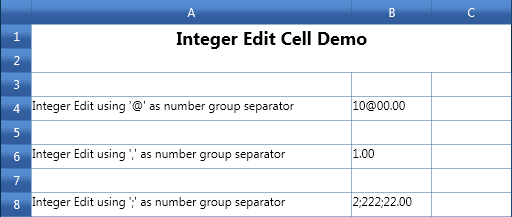{border="0"}

***[]{style="FONT-FAMILY: 'Trebuchet MS','sans-serif'; COLOR: #1f497d; FONT-SIZE: 9pt"}*** 

Figure 31: Integer Edit Cells

***[]{style="COLOR: #15428b; FONT-SIZE: 9pt"}*** 

 

###### 4.1.1.2.1.9 DoubleEdit Cells {#doubleedit-cells style="tab-stops: 0pt"}

**[]{style="COLOR: #1f497d"}** 

**DoubleEdit** cell restricts you to enter only double (value type) values into the cell. This is useful to display System.Double type values. The following table consists of **GridStyleInfo** properties that are used to customize these cells.

[]{style="FONT-FAMILY: 'Trebuchet MS','sans-serif'; COLOR: #15428b; FONT-SIZE: 9pt"} 

[]{style="FONT-FAMILY: 'Trebuchet MS','sans-serif'; COLOR: #15428b; FONT-SIZE: 9pt"} 

Table 8:DoubleEdit Cell Type Property Table

  Property                 Description                                                                   Type     Value It Accepts   Property Syntax
  ------------------------ ----------------------------------------------------------------------------- -------- ------------------ ----------------------------------------------------------------------------------------------------------------------
  Cell Type                Set to "DoubleEdit"                                                           Normal   String             grid.Model\[6, 2\].CellType = \"DoubleEdit\";
  NumberGroupSeparator     Sets the string that separates groups of digits to the left of the decimal.   Normal   String             grid.Model\[6, 2\].NumberFormat = new NumberFormatInfo{                NumberGroupSeparator = \"@\" };
  NumberDecimalSeparator   Sets the string to use as decimal separator.                                  Normal   String             grid.Model\[6, 2\].NumberFormat = new NumberFormatInfo{                NumberDecimalSeparator = \".\" };
  NumberDecimalDigits      Sets the number of decimal places.                                            Normal   int                grid.Model\[6, 2\].NumberFormat = new NumberFormatInfo{                NumberDecimalDigits = 0};
  NumberGroupSizes         Sets the number of digits in each group to the left of the decimal.           Normal   Int\[\]             grid.Model\[6, 2\].NumberFormat = new NumberFormatInfo{                NumberGroupSizes = new int\[\] { 2, 3, 4 }};

 

Creating DoubleEdit Cells

[]{style="FONT-FAMILY: 'Trebuchet MS','sans-serif'; COLOR: #15428b; FONT-SIZE: 9pt"} 

The following code illustrates the creation of three double edit cells using different group separators and different decimal digits.

[]{style="COLOR: black; FONT-SIZE: 9pt"} 

+------------------------------------------------------------------------------------------------------------------------------------------------------------------------------------------------+
| **[\[C#\]]{style="FONT-FAMILY: 'Courier New'"}**                                                                                                                                               |
|                                                                                                                                                                                                |
| []{style="FONT-FAMILY: 'Courier New'"}                                                                                                                                                         |
|                                                                                                                                                                                                |
| [grid.Model\[6, 2\].CellType = [\"DoubleEdit\"]{style="COLOR: #a31515"};]{style="FONT-FAMILY: 'Courier New'"}                                                                                  |
|                                                                                                                                                                                                |
| [            [this]{style="COLOR: blue"}.grid.Model.CoveredCells.Add([new]{style="COLOR: blue"} [CoveredCellInfo]{style="COLOR: #2b91af"}(6, 2, 6, 3));]{style="FONT-FAMILY: 'Courier New'"}   |
|                                                                                                                                                                                                |
| [            grid.Model\[6, 2\].NumberFormat = [new]{style="COLOR: blue"} [NumberFormatInfo]{style="COLOR: #2b91af"}]{style="FONT-FAMILY: 'Courier New'"}                                      |
|                                                                                                                                                                                                |
| [            {]{style="FONT-FAMILY: 'Courier New'"}                                                                                                                                            |
|                                                                                                                                                                                                |
| [                NumberGroupSeparator = [\"@\"]{style="COLOR: #a31515"},]{style="FONT-FAMILY: 'Courier New'"}                                                                                  |
|                                                                                                                                                                                                |
| [                NumberDecimalSeparator = [\".\"]{style="COLOR: #a31515"},]{style="FONT-FAMILY: 'Courier New'"}                                                                                |
|                                                                                                                                                                                                |
| [                NumberDecimalDigits = 0,]{style="FONT-FAMILY: 'Courier New'"}                                                                                                                 |
|                                                                                                                                                                                                |
| [                NumberGroupSizes = [new]{style="COLOR: blue"} [int]{style="COLOR: blue"}\[\] { 2, 3, 4 }]{style="FONT-FAMILY: 'Courier New'"}                                                 |
|                                                                                                                                                                                                |
| [            };]{style="FONT-FAMILY: 'Courier New'"}                                                                                                                                           |
|                                                                                                                                                                                                |
| [            grid.Model\[6, 2\].CellValue = 12345678.00;]{style="FONT-FAMILY: 'Courier New'"}                                                                                                  |
|                                                                                                                                                                                                |
| [            grid.Model\[8, 2\].CellType = [\"DoubleEdit\"]{style="COLOR: #a31515"};]{style="FONT-FAMILY: 'Courier New'"}                                                                      |
|                                                                                                                                                                                                |
| [            [this]{style="COLOR: blue"}.grid.Model.CoveredCells.Add([new]{style="COLOR: blue"} [CoveredCellInfo]{style="COLOR: #2b91af"}(8, 2, 8, 8));]{style="FONT-FAMILY: 'Courier New'"}   |
|                                                                                                                                                                                                |
| [            grid.Model\[8, 2\].NumberFormat = [new]{style="COLOR: blue"} [NumberFormatInfo]{style="COLOR: #2b91af"}]{style="FONT-FAMILY: 'Courier New'"}                                      |
|                                                                                                                                                                                                |
| [            {]{style="FONT-FAMILY: 'Courier New'"}                                                                                                                                            |
|                                                                                                                                                                                                |
| [                NumberGroupSeparator = [\",\"]{style="COLOR: #a31515"},]{style="FONT-FAMILY: 'Courier New'"}                                                                                  |
|                                                                                                                                                                                                |
| [                NumberDecimalSeparator = [\".\"]{style="COLOR: #a31515"},]{style="FONT-FAMILY: 'Courier New'"}                                                                                |
|                                                                                                                                                                                                |
| [                NumberDecimalDigits = 4,]{style="FONT-FAMILY: 'Courier New'"}                                                                                                                 |
|                                                                                                                                                                                                |
| [                NumberGroupSizes = [new]{style="COLOR: blue"} [int]{style="COLOR: blue"}\[\] { 2, 3, 4 }]{style="FONT-FAMILY: 'Courier New'"}                                                 |
|                                                                                                                                                                                                |
| [            };]{style="FONT-FAMILY: 'Courier New'"}                                                                                                                                           |
|                                                                                                                                                                                                |
| [            grid.Model\[8, 2\].CellValue = 12;]{style="FONT-FAMILY: 'Courier New'"}                                                                                                           |
|                                                                                                                                                                                                |
| [            grid.Model\[10, 2\].CellValue = 2345.00;]{style="FONT-FAMILY: 'Courier New'"}                                                                                                     |
|                                                                                                                                                                                                |
| [            grid.Model\[10, 2\].CellType = [\"DoubleEdit\"]{style="COLOR: #a31515"};]{style="FONT-FAMILY: 'Courier New'"}                                                                     |
|                                                                                                                                                                                                |
| [            [this]{style="COLOR: blue"}.grid.Model.CoveredCells.Add([new]{style="COLOR: blue"} [CoveredCellInfo]{style="COLOR: #2b91af"}(10, 2, 10, 3));]{style="FONT-FAMILY: 'Courier New'"} |
|                                                                                                                                                                                                |
| [            grid.Model\[10, 2\].NumberFormat = [new]{style="COLOR: blue"} [NumberFormatInfo]{style="COLOR: #2b91af"}]{style="FONT-FAMILY: 'Courier New'"}                                     |
|                                                                                                                                                                                                |
| [            {]{style="FONT-FAMILY: 'Courier New'"}                                                                                                                                            |
|                                                                                                                                                                                                |
| [                NumberGroupSeparator = [\";\"]{style="COLOR: #a31515"},]{style="FONT-FAMILY: 'Courier New'"}                                                                                  |
|                                                                                                                                                                                                |
| [                NumberDecimalSeparator = [\".\"]{style="COLOR: #a31515"},]{style="FONT-FAMILY: 'Courier New'"}                                                                                |
|                                                                                                                                                                                                |
| [                NumberDecimalDigits = 4,]{style="FONT-FAMILY: 'Courier New'"}                                                                                                                 |
|                                                                                                                                                                                                |
| [                NumberGroupSizes = [new]{style="COLOR: blue"} [int]{style="COLOR: blue"}\[\]{2, 3, 4}]{style="FONT-FAMILY: 'Courier New'"}                                                    |
|                                                                                                                                                                                                |
| [            };]{style="FONT-FAMILY: 'Courier New'"}                                                                                                                                           |
+------------------------------------------------------------------------------------------------------------------------------------------------------------------------------------------------+

[]{style="COLOR: #15428b; FONT-SIZE: 9pt"} 

When the code runs, the following output displays:

[]{style="FONT-FAMILY: 'Trebuchet MS','sans-serif'; COLOR: #15428b; FONT-SIZE: 9pt"} 

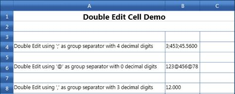{border="0"}[]{style="COLOR: #15428b; FONT-SIZE: 9pt"}

***[]{style="FONT-FAMILY: 'Trebuchet MS','sans-serif'; COLOR: #1f497d; FONT-SIZE: 9pt"}*** 

Figure 32: DoubleEdit Cells

***[]{style="FONT-FAMILY: 'Trebuchet MS','sans-serif'; COLOR: #1f497d; FONT-SIZE: 9pt"}*** 

###### 4.1.1.2.1.10        PercentEdit Cells {#percentedit-cells style="tab-stops: 0pt"}

**[]{style="COLOR: #15428b; FONT-SIZE: 14pt"}** 

The PercentEdit cell type restricts you in data entry. This accepts only percentage values. The following table consists of GridStyleInfo properties that are used to customize these cells.

[]{style="FONT-FAMILY: 'Trebuchet MS','sans-serif'; COLOR: #15428b; FONT-SIZE: 9pt"} 

Table 9:PercentEdit Cell Type Property Table[]{style="COLOR: #15428b"}

::: {align="center"}
+-----------------------+--------------------------------------------------------------------------------+-------------+------------------+--------------------------------------------------------------------------------------------------------------+
| Property              | Description                                                                    | Type        | Value It Accepts | Property Syntax                                                                                              |
+-----------------------+--------------------------------------------------------------------------------+-------------+------------------+--------------------------------------------------------------------------------------------------------------+
| CellType              | Set to "PercentEdit".                                                          | Normal      | String           | grid.Model\[6, 2\].CellType = \"PercentEdit\";                                                               |
+-----------------------+--------------------------------------------------------------------------------+-------------+------------------+--------------------------------------------------------------------------------------------------------------+
| PercentSymbol         | Allows to set any String as PercentSymbol                                      | Normal      | String           | grid.Model\[6, 2\].NumberFormat = new NumberFormatInfo{                                                      |
|                       |                                                                                |             |                  |                                                                                                              |
|                       |                                                                                |             |                  | PercentSymbol = \"%\"};                                                                                      |
+-----------------------+--------------------------------------------------------------------------------+-------------+------------------+--------------------------------------------------------------------------------------------------------------+
| PercentGroupSizes     | Sets the number of digits in each group to the left of the decimal.            | Normal      | int\[\]          | grid.Model\[6, 2\].NumberFormat = new NumberFormatInfo{                PercentGroupSizes = new int\[\] {3}}; |
+-----------------------+--------------------------------------------------------------------------------+-------------+------------------+--------------------------------------------------------------------------------------------------------------+
| PercentGroupSeparator | Sets the string that separates the group of digits to the left of the decimal. | Normal      | String           | grid.Model\[6, 2\].NumberFormat = new NumberFormatInfo{                PercentGroupSeparator = \",\"};       |
+-----------------------+--------------------------------------------------------------------------------+-------------+------------------+--------------------------------------------------------------------------------------------------------------+
| PercentDecimalDigits  | Sets the number of digits that appear after the decimal.                       | Normal      | int              | grid.Model\[6, 2\].NumberFormat = new NumberFormatInfo{                PercentDecimalDigits = 4};            |
+-----------------------+--------------------------------------------------------------------------------+-------------+------------------+--------------------------------------------------------------------------------------------------------------+
:::

**[]{style="COLOR: #15428b; FONT-SIZE: 9pt"}** 

**[]{style="COLOR: #15428b; FONT-SIZE: 9pt"}** 

Creating PercentEdit cell

[]{style="FONT-FAMILY: 'Trebuchet MS','sans-serif'; COLOR: #15428b; FONT-SIZE: 9pt"} 

The following code illustrates the creation of two Percent Edit cells with different group sizes and decimal digits.

[]{style="FONT-FAMILY: 'Trebuchet MS','sans-serif'; COLOR: #15428b; FONT-SIZE: 9pt"} 

+-----------------------------------------------------------------------------------------------------------------------------------------------------------------+
| **[\[C#\]]{style="FONT-FAMILY: 'Courier New'"}**                                                                                                                |
|                                                                                                                                                                 |
| [var]{style="FONT-FAMILY: 'Courier New'; COLOR: blue"}[ percentStyleInfo = [this]{style="COLOR: blue"}.grid.Model\[7, 2\];]{style="FONT-FAMILY: 'Courier New'"} |
|                                                                                                                                                                 |
| [            percentStyleInfo.CellType = [\"PercentEdit\"]{style="COLOR: #a31515"};]{style="FONT-FAMILY: 'Courier New'"}                                        |
|                                                                                                                                                                 |
| [            percentStyleInfo.NumberFormat = [new]{style="COLOR: blue"} [NumberFormatInfo]{style="COLOR: #2b91af"}()]{style="FONT-FAMILY: 'Courier New'"}       |
|                                                                                                                                                                 |
| [            {]{style="FONT-FAMILY: 'Courier New'"}                                                                                                             |
|                                                                                                                                                                 |
| [                PercentSymbol = [\"%\"]{style="COLOR: #a31515"},]{style="FONT-FAMILY: 'Courier New'"}                                                          |
|                                                                                                                                                                 |
| [                PercentGroupSizes = [new]{style="COLOR: blue"} [int]{style="COLOR: blue"}\[\] { 1, 2, 3 },]{style="FONT-FAMILY: 'Courier New'"}                |
|                                                                                                                                                                 |
| [                PercentDecimalDigits = 2,]{style="FONT-FAMILY: 'Courier New'"}                                                                                 |
|                                                                                                                                                                 |
| [                PercentGroupSeparator = [\",\"]{style="COLOR: #a31515"},]{style="FONT-FAMILY: 'Courier New'"}                                                  |
|                                                                                                                                                                 |
| [            };]{style="FONT-FAMILY: 'Courier New'"}                                                                                                            |
|                                                                                                                                                                 |
| [            percentStyleInfo.CellValue = 19;]{style="FONT-FAMILY: 'Courier New'"}                                                                              |
|                                                                                                                                                                 |
| []{style="FONT-FAMILY: 'Courier New'"}                                                                                                                          |
|                                                                                                                                                                 |
| [            [var]{style="COLOR: blue"} percentStyleInfo2 = [this]{style="COLOR: blue"}.grid.Model\[9, 2\];]{style="FONT-FAMILY: 'Courier New'"}                |
|                                                                                                                                                                 |
| [            percentStyleInfo2.CellType = [\"PercentEdit\"]{style="COLOR: #a31515"};]{style="FONT-FAMILY: 'Courier New'"}                                       |
|                                                                                                                                                                 |
| [            percentStyleInfo2.NumberFormat = [new]{style="COLOR: blue"} [NumberFormatInfo]{style="COLOR: #2b91af"}()]{style="FONT-FAMILY: 'Courier New'"}      |
|                                                                                                                                                                 |
| [            {]{style="FONT-FAMILY: 'Courier New'"}                                                                                                             |
|                                                                                                                                                                 |
| [                PercentSymbol = [\"%\"]{style="COLOR: #a31515"},]{style="FONT-FAMILY: 'Courier New'"}                                                          |
|                                                                                                                                                                 |
| [                PercentGroupSizes = [new]{style="COLOR: blue"} [int]{style="COLOR: blue"}\[\] { 3 },]{style="FONT-FAMILY: 'Courier New'"}                      |
|                                                                                                                                                                 |
| [                PercentDecimalDigits = 4,]{style="FONT-FAMILY: 'Courier New'"}                                                                                 |
|                                                                                                                                                                 |
| [                PercentGroupSeparator = [\",\"]{style="COLOR: #a31515"},]{style="FONT-FAMILY: 'Courier New'"}                                                  |
|                                                                                                                                                                 |
| [            };]{style="FONT-FAMILY: 'Courier New'"}                                                                                                            |
|                                                                                                                                                                 |
| [            percentStyleInfo2.CellValue = 91;]{style="FONT-FAMILY: 'Courier New'"}                                                                             |
|                                                                                                                                                                 |
| []{style="FONT-FAMILY: 'Courier New'"}                                                                                                                          |
|                                                                                                                                                                 |
| []{style="COLOR: black"}                                                                                                                                        |
+-----------------------------------------------------------------------------------------------------------------------------------------------------------------+

 

When the code runs, the following output displays:

[]{style="COLOR: #15428b; FONT-SIZE: 9pt"} 

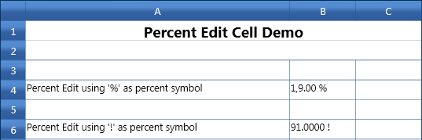{border="0"}[]{style="COLOR: #15428b; FONT-SIZE: 9pt"}

***[]{style="FONT-FAMILY: 'Trebuchet MS','sans-serif'; COLOR: #1f497d; FONT-SIZE: 9pt"}*** 

Figure 33: Percent Edit Cells

 

###### 4.1.1.2.1.11        RichTextBox CellType {#richtextbox-celltype style="tab-stops: 0pt"}

 

RichTextBox CellType is used to format the cells, where each character, word or a line can be given different formats. RichTextBox Cell Type also supports Printing, copy/paste operation, Importing from Excel and Exporting to Excel. 

RichTextBox CellType can be defined in Grid using the following code snippet.

To set a cell as RichTextBox Cell type:

+---------------------------------------------------------------------------------------------------------------------------------------------------------------------------------------------------------------------------------------------------------------------------------------------------------------------------------------------------+
| [              ]{style="FONT-FAMILY: 'Courier New'; COLOR: black"}[//Cell type as RichText and Cell Value as Paragraph Format]{style="FONT-FAMILY: 'Courier New'; COLOR: green"}[]{style="FONT-FAMILY: 'Courier New'; COLOR: black"}                                                                                                              |
|                                                                                                                                                                                                                                                                                                                                                   |
| [              ]{style="FONT-FAMILY: 'Courier New'; COLOR: black"}[this]{style="FONT-FAMILY: 'Courier New'; COLOR: blue"}[.grid.Model\[rowIndex, colIndex\].CellType = ]{style="FONT-FAMILY: 'Courier New'; COLOR: black"}[\"RichText\"]{style="FONT-FAMILY: 'Courier New'; COLOR: #a31515"}[;]{style="FONT-FAMILY: 'Courier New'; COLOR: black"} |
|                                                                                                                                                                                                                                                                                                                                                   |
| [              ]{style="FONT-FAMILY: 'Courier New'; COLOR: black"}[this]{style="FONT-FAMILY: 'Courier New'; COLOR: blue"}[.grid.Model\[rowIndex, colIndex\].CellValue = \_paragraph;]{style="FONT-FAMILY: 'Courier New'; COLOR: black"}                                                                                                           |
|                                                                                                                                                                                                                                                                                                                                                   |
| []{style="FONT-FAMILY: 'Courier New'"}                                                                                                                                                                                                                                                                                                            |
+---------------------------------------------------------------------------------------------------------------------------------------------------------------------------------------------------------------------------------------------------------------------------------------------------------------------------------------------------+

 

The Cell value of RichTextBox must be Paragraph as given in the following code snippet:

+---------------------------------------------------------------------------------------------------------------------------------------------------------------------------------------------------------------------------------------------------------------------------------------------------------------------------------------------------------------------------------------------------------------------------------------+
| []{style="FONT-FAMILY: 'Courier New'; COLOR: black"}                                                                                                                                                                                                                                                                                                                                                                                  |
|                                                                                                                                                                                                                                                                                                                                                                                                                                       |
| [              ]{style="FONT-FAMILY: 'Courier New'; COLOR: black"}[// Paragraph Format is supported for Rich Text Cell Type.]{style="FONT-FAMILY: 'Courier New'; COLOR: green"}[]{style="FONT-FAMILY: 'Courier New'; COLOR: black"}                                                                                                                                                                                                   |
|                                                                                                                                                                                                                                                                                                                                                                                                                                       |
| []{style="FONT-FAMILY: 'Courier New'; COLOR: black"}                                                                                                                                                                                                                                                                                                                                                                                  |
|                                                                                                                                                                                                                                                                                                                                                                                                                                       |
| [              ]{style="FONT-FAMILY: 'Courier New'; COLOR: black"}[Paragraph]{style="FONT-FAMILY: 'Courier New'; COLOR: #2b91af"}[ \_paragraph = ]{style="FONT-FAMILY: 'Courier New'; COLOR: black"}[new]{style="FONT-FAMILY: 'Courier New'; COLOR: blue"}[ ]{style="FONT-FAMILY: 'Courier New'; COLOR: black"}[Paragraph]{style="FONT-FAMILY: 'Courier New'; COLOR: #2b91af"}[();]{style="FONT-FAMILY: 'Courier New'; COLOR: black"} |
|                                                                                                                                                                                                                                                                                                                                                                                                                                       |
| []{style="FONT-FAMILY: 'Courier New'; COLOR: black"}                                                                                                                                                                                                                                                                                                                                                                                  |
|                                                                                                                                                                                                                                                                                                                                                                                                                                       |
| [              ]{style="FONT-FAMILY: 'Courier New'; COLOR: black"}[Run]{style="FONT-FAMILY: 'Courier New'; COLOR: #2b91af"}[ \_run1 = ]{style="FONT-FAMILY: 'Courier New'; COLOR: black"}[new]{style="FONT-FAMILY: 'Courier New'; COLOR: blue"}[ ]{style="FONT-FAMILY: 'Courier New'; COLOR: black"}[Run]{style="FONT-FAMILY: 'Courier New'; COLOR: #2b91af"}[();]{style="FONT-FAMILY: 'Courier New'; COLOR: black"}                  |
|                                                                                                                                                                                                                                                                                                                                                                                                                                       |
| [              \_run1.Text = ]{style="FONT-FAMILY: 'Courier New'; COLOR: black"}[\"This is RichText box Cell Type\"]{style="FONT-FAMILY: 'Courier New'; COLOR: #a31515"}[;]{style="FONT-FAMILY: 'Courier New'; COLOR: black"}                                                                                                                                                                                                         |
|                                                                                                                                                                                                                                                                                                                                                                                                                                       |
| [              \_run1.TextDecorations = ]{style="FONT-FAMILY: 'Courier New'; COLOR: black"}[TextDecorations]{style="FONT-FAMILY: 'Courier New'; COLOR: #2b91af"}[.Underline;]{style="FONT-FAMILY: 'Courier New'; COLOR: black"}                                                                                                                                                                                                       |
|                                                                                                                                                                                                                                                                                                                                                                                                                                       |
| []{style="FONT-FAMILY: 'Courier New'; COLOR: black"}                                                                                                                                                                                                                                                                                                                                                                                  |
|                                                                                                                                                                                                                                                                                                                                                                                                                                       |
| [              ]{style="FONT-FAMILY: 'Courier New'; COLOR: black"}[Run]{style="FONT-FAMILY: 'Courier New'; COLOR: #2b91af"}[ \_run2 = ]{style="FONT-FAMILY: 'Courier New'; COLOR: black"}[new]{style="FONT-FAMILY: 'Courier New'; COLOR: blue"}[ ]{style="FONT-FAMILY: 'Courier New'; COLOR: black"}[Run]{style="FONT-FAMILY: 'Courier New'; COLOR: #2b91af"}[();]{style="FONT-FAMILY: 'Courier New'; COLOR: black"}                  |
|                                                                                                                                                                                                                                                                                                                                                                                                                                       |
| [              \_run2.Text = ]{style="FONT-FAMILY: 'Courier New'; COLOR: black"}[\"Various formatting can be done in Single Cell.\"]{style="FONT-FAMILY: 'Courier New'; COLOR: #a31515"}[;]{style="FONT-FAMILY: 'Courier New'; COLOR: black"}                                                                                                                                                                                         |
|                                                                                                                                                                                                                                                                                                                                                                                                                                       |
| [              \_run1.FontWeight = ]{style="FONT-FAMILY: 'Courier New'; COLOR: black"}[FontWeights]{style="FONT-FAMILY: 'Courier New'; COLOR: #2b91af"}[.Bold;]{style="FONT-FAMILY: 'Courier New'; COLOR: black"}                                                                                                                                                                                                                     |
|                                                                                                                                                                                                                                                                                                                                                                                                                                       |
| [              \_run2.Foreground = ]{style="FONT-FAMILY: 'Courier New'; COLOR: black"}[Brushes]{style="FONT-FAMILY: 'Courier New'; COLOR: #2b91af"}[.Green;]{style="FONT-FAMILY: 'Courier New'; COLOR: black"}                                                                                                                                                                                                                        |
|                                                                                                                                                                                                                                                                                                                                                                                                                                       |
| []{style="FONT-FAMILY: 'Courier New'; COLOR: black"}                                                                                                                                                                                                                                                                                                                                                                                  |
|                                                                                                                                                                                                                                                                                                                                                                                                                                       |
| [              ]{style="FONT-FAMILY: 'Courier New'; COLOR: black"}[Run]{style="FONT-FAMILY: 'Courier New'; COLOR: #2b91af"}[ \_run3 = ]{style="FONT-FAMILY: 'Courier New'; COLOR: black"}[new]{style="FONT-FAMILY: 'Courier New'; COLOR: blue"}[ ]{style="FONT-FAMILY: 'Courier New'; COLOR: black"}[Run]{style="FONT-FAMILY: 'Courier New'; COLOR: #2b91af"}[();]{style="FONT-FAMILY: 'Courier New'; COLOR: black"}                  |
|                                                                                                                                                                                                                                                                                                                                                                                                                                       |
| [              \_run3.Text = ]{style="FONT-FAMILY: 'Courier New'; COLOR: black"}[\"Rich Text cell type also supports Images\"]{style="FONT-FAMILY: 'Courier New'; COLOR: #a31515"}[;]{style="FONT-FAMILY: 'Courier New'; COLOR: black"}                                                                                                                                                                                               |
|                                                                                                                                                                                                                                                                                                                                                                                                                                       |
| [              \_run3.FontSize = 16;]{style="FONT-FAMILY: 'Courier New'; COLOR: black"}                                                                                                                                                                                                                                                                                                                                               |
|                                                                                                                                                                                                                                                                                                                                                                                                                                       |
| [              \_run3.FontStyle = ]{style="FONT-FAMILY: 'Courier New'; COLOR: black"}[FontStyles]{style="FONT-FAMILY: 'Courier New'; COLOR: #2b91af"}[.Italic;]{style="FONT-FAMILY: 'Courier New'; COLOR: black"}                                                                                                                                                                                                                     |
|                                                                                                                                                                                                                                                                                                                                                                                                                                       |
| []{style="FONT-FAMILY: 'Courier New'; COLOR: black"}                                                                                                                                                                                                                                                                                                                                                                                  |
|                                                                                                                                                                                                                                                                                                                                                                                                                                       |
| [              \_paragraph.Inlines.Add(\_run1);]{style="FONT-FAMILY: 'Courier New'; COLOR: black"}                                                                                                                                                                                                                                                                                                                                    |
|                                                                                                                                                                                                                                                                                                                                                                                                                                       |
| [              \_paragraph.Inlines.Add(\_run2);]{style="FONT-FAMILY: 'Courier New'; COLOR: black"}                                                                                                                                                                                                                                                                                                                                    |
|                                                                                                                                                                                                                                                                                                                                                                                                                                       |
| [              \_paragraph.Inlines.Add(\_run3);]{style="FONT-FAMILY: 'Courier New'; COLOR: black"}                                                                                                                                                                                                                                                                                                                                    |
|                                                                                                                                                                                                                                                                                                                                                                                                                                       |
| []{style="FONT-FAMILY: 'Courier New'; COLOR: black"}                                                                                                                                                                                                                                                                                                                                                                                  |
|                                                                                                                                                                                                                                                                                                                                                                                                                                       |
| [              ]{style="FONT-FAMILY: 'Courier New'; COLOR: black"}                                                                                                                                                                                                                                                                                                                                                                    |
|                                                                                                                                                                                                                                                                                                                                                                                                                                       |
| [              ]{style="FONT-FAMILY: 'Courier New'; COLOR: black"}[//Cell type as RichText and Cell Value as Paragraph Format.]{style="FONT-FAMILY: 'Courier New'; COLOR: green"}[]{style="FONT-FAMILY: 'Courier New'; COLOR: black"}                                                                                                                                                                                                 |
|                                                                                                                                                                                                                                                                                                                                                                                                                                       |
| [              ]{style="FONT-FAMILY: 'Courier New'; COLOR: black"}[this]{style="FONT-FAMILY: 'Courier New'; COLOR: blue"}[.grid.Model\[rowIndex, colIndex\].CellType = ]{style="FONT-FAMILY: 'Courier New'; COLOR: black"}[\"RichText\"]{style="FONT-FAMILY: 'Courier New'; COLOR: #a31515"}[;]{style="FONT-FAMILY: 'Courier New'; COLOR: black"}                                                                                     |
|                                                                                                                                                                                                                                                                                                                                                                                                                                       |
| [              ]{style="FONT-FAMILY: 'Courier New'; COLOR: black"}[this]{style="FONT-FAMILY: 'Courier New'; COLOR: blue"}[.grid.Model\[rowIndex, colIndex\].CellValue = \_ paragraph;]{style="FONT-FAMILY: 'Courier New'; COLOR: black"}                                                                                                                                                                                              |
|                                                                                                                                                                                                                                                                                                                                                                                                                                       |
| []{style="FONT-FAMILY: 'Courier New'"}                                                                                                                                                                                                                                                                                                                                                                                                |
+---------------------------------------------------------------------------------------------------------------------------------------------------------------------------------------------------------------------------------------------------------------------------------------------------------------------------------------------------------------------------------------------------------------------------------------+

 

 

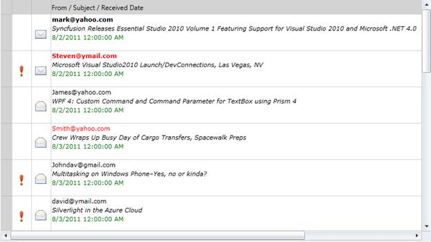{border="0"}

Figure 34: RichTextBox CellType

 

 

 

###### 4.1.1.2.1.12        UpDownEdit Cells {#updownedit-cells style="tab-stops: 0pt"}

**[]{style="COLOR: #15428b; FONT-SIZE: 14pt"}** 

UpDownEdit cell enables you to increase or decrease the cell value with a pair of arrow buttons in the cell. The following table consists of GridStyleInfo properties that are used to customize these cells.

[]{style="FONT-FAMILY: 'Trebuchet MS','sans-serif'; COLOR: #15428b; FONT-SIZE: 9pt"} 

Table 10:UpDownEdit Cell Type Property Table

  ---------- ----------------------------------------------------------------------------------- -------- ------------------ ------------------------------------------------
  Property   Description                                                                         Type     Value It Accepts   Property Syntax
  CellType   Set to "UpDownEdit".                                                                Normal   String             grid.Model\[6, 2\].CellType = \"UpDownEdit\";
  MaxValue   Sets the upper limit in the range of applicable values.                             Normal   Double             grid.Model\[6, 2\].UpDownEdit.MaxValue = 1000;
  MinValue   Sets the lower limit in the range of applicable values.                             Normal   Double             grid.Model\[6, 2\].UpDownEdit.MinValue = 500;
  Step       Sets the unit value to be increased /decreased when the spin buttons are clicked.   Normal   Double             grid.Model\[6, 2\].UpDownEdit.Step = 50;
  ---------- ----------------------------------------------------------------------------------- -------- ------------------ ------------------------------------------------

 

Creating UpDownEdit cell

The following code illustrates the creation of three different Up and Down controls in grid cells.

[]{style="FONT-FAMILY: 'Trebuchet MS','sans-serif'; COLOR: #15428b; FONT-SIZE: 9pt"} 

+-------------------------------------------------------------------------------------------------------------------------------------------------+
| **[\[C#\]]{style="FONT-FAMILY: 'Courier New'"}**                                                                                                |
|                                                                                                                                                 |
| [            grid.Model\[6, 2\].CellType = [\"UpDownEdit\"]{style="COLOR: #a31515"};]{style="FONT-FAMILY: 'Courier New'"}                       |
|                                                                                                                                                 |
| [            grid.Model\[6, 2\].UpDownEdit.MinValue = 500;]{style="FONT-FAMILY: 'Courier New'"}                                                 |
|                                                                                                                                                 |
| [            grid.Model\[6, 2\].UpDownEdit.MaxValue = 1000;]{style="FONT-FAMILY: 'Courier New'"}                                                |
|                                                                                                                                                 |
| [            grid.Model\[6, 2\].UpDownEdit.Step = 50;]{style="FONT-FAMILY: 'Courier New'"}                                                      |
|                                                                                                                                                 |
| [            grid.Model\[6, 2\].HorizontalAlignment = [HorizontalAlignment]{style="COLOR: #2b91af"}.Right;]{style="FONT-FAMILY: 'Courier New'"} |
|                                                                                                                                                 |
| []{style="FONT-FAMILY: 'Courier New'"}                                                                                                          |
|                                                                                                                                                 |
| [            grid.Model\[8, 2\].CellType = [\"UpDownEdit\"]{style="COLOR: #a31515"};]{style="FONT-FAMILY: 'Courier New'"}                       |
|                                                                                                                                                 |
| [            grid.Model\[8, 2\].UpDownEdit.MinValue = 5;]{style="FONT-FAMILY: 'Courier New'"}                                                   |
|                                                                                                                                                 |
| [            grid.Model\[8, 2\].UpDownEdit.MaxValue = 100;]{style="FONT-FAMILY: 'Courier New'"}                                                 |
|                                                                                                                                                 |
| [            grid.Model\[8, 2\].UpDownEdit.Step = 5;]{style="FONT-FAMILY: 'Courier New'"}                                                       |
|                                                                                                                                                 |
| [            grid.Model\[8, 2\].HorizontalAlignment = [HorizontalAlignment]{style="COLOR: #2b91af"}.Right;]{style="FONT-FAMILY: 'Courier New'"} |
|                                                                                                                                                 |
| []{style="FONT-FAMILY: 'Courier New'"}                                                                                                          |
|                                                                                                                                                 |
| [            grid.Model\[4, 2\].CellType = [\"UpDownEdit\"]{style="COLOR: #a31515"};]{style="FONT-FAMILY: 'Courier New'"}                       |
|                                                                                                                                                 |
| [            grid.Model\[4, 2\].UpDownEdit.MinValue = 10;]{style="FONT-FAMILY: 'Courier New'"}                                                  |
|                                                                                                                                                 |
| [            grid.Model\[4, 2\].UpDownEdit.MaxValue = 18;]{style="FONT-FAMILY: 'Courier New'"}                                                  |
|                                                                                                                                                 |
| [            grid.Model\[4, 2\].UpDownEdit.Step = 2;]{style="FONT-FAMILY: 'Courier New'"}                                                       |
|                                                                                                                                                 |
| [            grid.Model\[4, 2\].HorizontalAlignment = [HorizontalAlignment]{style="COLOR: #2b91af"}.Right;]{style="FONT-FAMILY: 'Courier New'"} |
+-------------------------------------------------------------------------------------------------------------------------------------------------+

[]{style="COLOR: #15428b; FONT-SIZE: 9pt"} 

When the code runs, the following output displays:

[]{style="FONT-FAMILY: 'Trebuchet MS','sans-serif'; COLOR: #15428b; FONT-SIZE: 9pt"} 

 

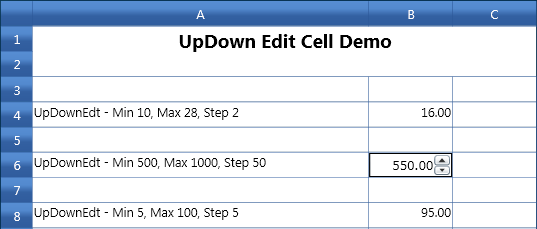{border="0"}

***[]{style="FONT-FAMILY: 'Trebuchet MS','sans-serif'; COLOR: #1f497d; FONT-SIZE: 9pt"}*** 

Figure 35: UpDown Edit cells

 

 

###### []{#_Currency_Cells}4.1.1.2.1.13        Currency Cells {#currency-cells style="tab-stops: 0pt"}

[]{style="COLOR: #15428b; FONT-SIZE: 9pt"} 

Currency cell is useful to represent monetary values to achieve accuracy in calculations. This stripes the currency sign in the cell and attempts to parse only the number from the input.

The following table consists of GridStyleInfo properties that are used to customize these cells:

[]{style="FONT-FAMILY: 'Trebuchet MS','sans-serif'; COLOR: #15428b; FONT-SIZE: 9pt"} 

Table 11:Currency Cell Type Property Table

+-------------------------+---------------------------------------------------------------------+-------------+------------------+-------------------------------------------------------------------------------------------------------+
| Property                | Description                                                         | Type        | Value It Accepts | Property Syntax                                                                                       |
+=========================+=====================================================================+=============+==================+=======================================================================================================+
| CellType                | Set to "CurrencyEdit".                                              | Normal      | string           | grid.Model\[6, 2\].CellType = \"CurrencyEdit\";                                                       |
+-------------------------+---------------------------------------------------------------------+-------------+------------------+-------------------------------------------------------------------------------------------------------+
| CurrencyDecimalDigits   | Sets the number of decimal places in currency value.                | Normal      | Int              | grid.Model\[6, 2\].NumberFormat = new NumberFormatInfo{                                               |
|                         |                                                                     |             |                  |                                                                                                       |
|                         |                                                                     |             |                  | CurrencyDecimalDigits = 2               };                                                            |
+-------------------------+---------------------------------------------------------------------+-------------+------------------+-------------------------------------------------------------------------------------------------------+
| CurrencyNegativePattern | Sets the format pattern for negative currency values.               | Normal      | Int              | grid.Model\[6, 2\].NumberFormat = new NumberFormatInfo{                                               |
|                         |                                                                     |             |                  |                                                                                                       |
|                         |                                                                     |             |                  | CurrencyNegativePattern = 11 };                                                                       |
+-------------------------+---------------------------------------------------------------------+-------------+------------------+-------------------------------------------------------------------------------------------------------+
| CurrencyPositivePattern | Sets the format pattern for positive currency values.               | Normal      | Int              | grid.Model\[6, 2\].NumberFormat = new NumberFormatInfo{                                               |
|                         |                                                                     |             |                  |                                                                                                       |
|                         |                                                                     |             |                  | CurrencyPositivePattern = 1 };                                                                        |
+-------------------------+---------------------------------------------------------------------+-------------+------------------+-------------------------------------------------------------------------------------------------------+
| CurrencySymbol          | Sets the string to use as currency symbol.                          | Normal      | String           | grid.Model\[6, 2\].NumberFormat = new NumberFormatInfo{CurrencySymbol = \"\$\"};                      |
+-------------------------+---------------------------------------------------------------------+-------------+------------------+-------------------------------------------------------------------------------------------------------+
| CurrencyGroupSizes      | Sets the number of digits in each group to the left of the decimal. | Normal      | int\[\]          | grid.Model\[6, 2\].NumberFormat = new NumberFormatInfo{CurrencyGroupSizes = new int\[\] { 2, 3, 4 }}; |
+-------------------------+---------------------------------------------------------------------+-------------+------------------+-------------------------------------------------------------------------------------------------------+

**[]{style="COLOR: #15428b; FONT-SIZE: 9pt"}** 

Creating a Currency Cell

[]{style="FONT-FAMILY: 'Trebuchet MS','sans-serif'; COLOR: #15428b; FONT-SIZE: 9pt"} 

Create a Currency Cell with a negative currency value and '\$' as the currency symbol. The negative values are automatically converted into positive values and displayed.

The following code illustrates this:

 

+-----------------------------------------------------------------------------------------------------------------------------------------------+
| **[\[C#\]]{style="FONT-FAMILY: 'Courier New'"}**                                                                                              |
|                                                                                                                                               |
| [grid.Model\[6, 2\].CellType = [\"CurrencyEdit\"]{style="COLOR: #a31515"};]{style="FONT-FAMILY: 'Courier New'"}                               |
|                                                                                                                                               |
| [grid.Model\[6, 2\].CurrencyEdit.MinValue = 5;]{style="FONT-FAMILY: 'Courier New'"}                                                           |
|                                                                                                                                               |
| [grid.Model\[6, 2\].CurrencyEdit.MaxValue = 1000;]{style="FONT-FAMILY: 'Courier New'"}                                                        |
|                                                                                                                                               |
| [grid.Model\[6, 2\].NumberFormat = [new]{style="COLOR: blue"} [NumberFormatInfo]{style="COLOR: #2b91af"}]{style="FONT-FAMILY: 'Courier New'"} |
|                                                                                                                                               |
| [            {]{style="FONT-FAMILY: 'Courier New'"}                                                                                           |
|                                                                                                                                               |
| [                CurrencyPositivePattern = 0,]{style="FONT-FAMILY: 'Courier New'"}                                                            |
|                                                                                                                                               |
| [                CurrencyDecimalDigits = 4,]{style="FONT-FAMILY: 'Courier New'"}                                                              |
|                                                                                                                                               |
| [                CurrencyNegativePattern = 0,]{style="FONT-FAMILY: 'Courier New'"}                                                            |
|                                                                                                                                               |
| [                CurrencySymbol = "\$",]{style="FONT-FAMILY: 'Courier New'"}                                                                  |
|                                                                                                                                               |
| [                CurrencyGroupSizes = new int\[\]{2, 3, 4}]{style="FONT-FAMILY: 'Courier New'"}                                               |
|                                                                                                                                               |
| [            };]{style="FONT-FAMILY: 'Courier New'"}                                                                                          |
|                                                                                                                                               |
| [grid.Model\[6, 2\].CellValue = **-4.0**;]{style="FONT-FAMILY: 'Courier New'"}                                                                |
|                                                                                                                                               |
| []{style="FONT-FAMILY: 'Courier New'"}                                                                                                        |
+-----------------------------------------------------------------------------------------------------------------------------------------------+

 

 Refer to [[CurrencyNegativePattern]{style="COLOR: windowtext; TEXT-DECORATION: none; text-underline: none"}](http://msdn.microsoft.com/en-us/library/system.globalization.numberformatinfo.currencynegativepattern.aspx) Codes from the following link:

[]{style="FONT-FAMILY: 'Trebuchet MS','sans-serif'; COLOR: #15428b; FONT-SIZE: 9pt"} 

When the code runs, the following output displays.

[]{style="COLOR: #15428b; FONT-SIZE: 9pt"} 

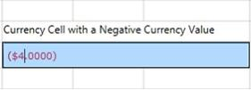{border="0"}

***[]{style="FONT-FAMILY: 'Trebuchet MS','sans-serif'; COLOR: #1f497d; FONT-SIZE: 9pt"}*** 

Figure 36: Currency Cell with Negative Value

***[]{style="COLOR: #15428b; FONT-SIZE: 9pt"}*** 

[]{style="COLOR: black; FONT-SIZE: 9pt"} 

Create a Currency Cell with a positive value with '\$' as the currency symbol and with a different positive pattern.

The following code illustrates this:

[]{style="COLOR: black; FONT-SIZE: 9pt"} 

+------------------------------------------------------------------------------------------------------------------------------------------------+
| **[\[C#\]]{style="FONT-FAMILY: 'Courier New'"}**                                                                                               |
|                                                                                                                                                |
| **[]{style="FONT-FAMILY: 'Courier New'"}**                                                                                                     |
|                                                                                                                                                |
| [grid.Model\[10, 2\].CellType = [\"CurrencyEdit\"]{style="COLOR: #a31515"};]{style="FONT-FAMILY: 'Courier New'"}                               |
|                                                                                                                                                |
| [grid.Model\[10, 2\].CurrencyEdit.MinValue = 5;]{style="FONT-FAMILY: 'Courier New'"}                                                           |
|                                                                                                                                                |
| [grid.Model\[10, 2\].CurrencyEdit.MaxValue = 1000;]{style="FONT-FAMILY: 'Courier New'"}                                                        |
|                                                                                                                                                |
| [grid.Model\[10, 2\].NumberFormat = [new]{style="COLOR: blue"} [NumberFormatInfo]{style="COLOR: #2b91af"}]{style="FONT-FAMILY: 'Courier New'"} |
|                                                                                                                                                |
| [            {]{style="FONT-FAMILY: 'Courier New'"}                                                                                            |
|                                                                                                                                                |
| [                CurrencyPositivePattern = 1,]{style="FONT-FAMILY: 'Courier New'"}                                                             |
|                                                                                                                                                |
| [                CurrencyDecimalDigits = 2,]{style="FONT-FAMILY: 'Courier New'"}                                                               |
|                                                                                                                                                |
| [                CurrencyNegativePattern = 11,]{style="FONT-FAMILY: 'Courier New'"}                                                            |
|                                                                                                                                                |
| [                CurrencySymbol = [\"\$\"]{style="COLOR: #a31515"},]{style="FONT-FAMILY: 'Courier New'"}                                       |
|                                                                                                                                                |
| [                CurrencyGroupSizes = [new]{style="COLOR: blue"} [int]{style="COLOR: blue"}\[\]{2, 3, 4}]{style="FONT-FAMILY: 'Courier New'"}  |
|                                                                                                                                                |
| [            };]{style="FONT-FAMILY: 'Courier New'"}                                                                                           |
|                                                                                                                                                |
| [grid.Model\[10, 2\].CellValue = 36.0;]{style="FONT-FAMILY: 'Courier New'"}                                                                    |
|                                                                                                                                                |
| []{style="FONT-FAMILY: 'Courier New'; COLOR: black"}                                                                                           |
+------------------------------------------------------------------------------------------------------------------------------------------------+

 

Refer to [[CurrencyPositivePattern]{style="COLOR: windowtext; TEXT-DECORATION: none; text-underline: none"}](http://msdn.microsoft.com/en-us/library/system.globalization.numberformatinfo.currencypositivepattern.aspx) Codes from the following link:

[]{style="FONT-FAMILY: 'Trebuchet MS','sans-serif'; COLOR: #15428b; FONT-SIZE: 9pt"} 

When the code runs, the following output displays:

 

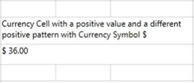{border="0"}

***[]{style="FONT-FAMILY: 'Trebuchet MS','sans-serif'; COLOR: #1f497d; FONT-SIZE: 9pt"}*** 

Figure 37: Currency Cell with Positive Value

 

**[]{style="COLOR: #1f497d"}** 

[]{#_DoubleEdit_Cells}[]{#_IntegerEdit_Cells}[]{#_Data_Template_Cells}[]{#_TextBlock_Cells}[]{#_UpDownEdit_Cells} 

[]{#related-topics}
::::::::
