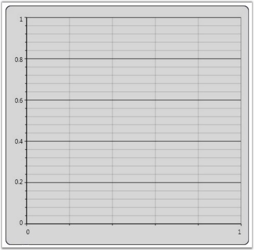

::: {style="DISPLAY: none"}
{#d2h_url_template}{#d2h_package_url style="WIDTH: 0px; DISPLAY: none; HEIGHT: 0px"}
:::

::: {.d2h_secondary_topic style="PADDING-BOTTOM: 10pt; MARGIN: 0pt; PADDING-LEFT: 0pt; PADDING-RIGHT: 0pt; PADDING-TOP: 0pt"}
##### Adding Chart Area {#adding-chart-area style="tab-stops: 0pt"}

Once you add the Chart control, the first thing to do is to add a Chart Area and and Chart Series. The following code example illustrates how to do this.

[]{style="FONT-FAMILY: 'Trebuchet MS','sans-serif'; COLOR: #15428b; FONT-SIZE: 9pt"} 

+-----------------------------------------------------------------------------------------------------------------------------------------------------------------------------------------------------------------------------------------------------------------------------------------------+
| **[\[XAML\]]{style="FONT-FAMILY: 'Courier New'"}**                                                                                                                                                                                                                                            |
|                                                                                                                                                                                                                                                                                               |
| []{style="FONT-FAMILY: 'Courier New'"}                                                                                                                                                                                                                                                        |
|                                                                                                                                                                                                                                                                                               |
| [\<]{style="FONT-FAMILY: 'Courier New'; COLOR: blue"}[sfchart]{style="FONT-FAMILY: 'Courier New'; COLOR: #a31515"}[:]{style="FONT-FAMILY: 'Courier New'; COLOR: blue"}[Chart]{style="FONT-FAMILY: 'Courier New'; COLOR: #a31515"}[\>]{style="FONT-FAMILY: 'Courier New'; COLOR: blue"}        |
|                                                                                                                                                                                                                                                                                               |
| [\<]{style="FONT-FAMILY: 'Courier New'; COLOR: blue"}[sfchart]{style="FONT-FAMILY: 'Courier New'; COLOR: #a31515"}[:]{style="FONT-FAMILY: 'Courier New'; COLOR: blue"}[ChartArea]{style="FONT-FAMILY: 'Courier New'; COLOR: #a31515"}[\>]{style="FONT-FAMILY: 'Courier New'; COLOR: blue"}    |
|                                                                                                                                                                                                                                                                                               |
| [\<]{style="FONT-FAMILY: 'Courier New'; COLOR: blue"}[sfchart]{style="FONT-FAMILY: 'Courier New'; COLOR: #a31515"}[:]{style="FONT-FAMILY: 'Courier New'; COLOR: blue"}[ChartSeries]{style="FONT-FAMILY: 'Courier New'; COLOR: #a31515"}[/\>]{style="FONT-FAMILY: 'Courier New'; COLOR: blue"} |
|                                                                                                                                                                                                                                                                                               |
| [\</]{style="FONT-FAMILY: 'Courier New'; COLOR: blue"}[sfchart]{style="FONT-FAMILY: 'Courier New'; COLOR: #a31515"}[:]{style="FONT-FAMILY: 'Courier New'; COLOR: blue"}[ChartArea]{style="FONT-FAMILY: 'Courier New'; COLOR: #a31515"}[\>]{style="FONT-FAMILY: 'Courier New'; COLOR: blue"}   |
|                                                                                                                                                                                                                                                                                               |
| [\</]{style="FONT-FAMILY: 'Courier New'; COLOR: blue"}[sfchart]{style="FONT-FAMILY: 'Courier New'; COLOR: #a31515"}[:]{style="FONT-FAMILY: 'Courier New'; COLOR: blue"}[Chart]{style="FONT-FAMILY: 'Courier New'; COLOR: #a31515"}[\>]{style="FONT-FAMILY: 'Courier New'; COLOR: blue"}       |
+-----------------------------------------------------------------------------------------------------------------------------------------------------------------------------------------------------------------------------------------------------------------------------------------------+

[]{style="FONT-FAMILY: 'Trebuchet MS','sans-serif'; COLOR: #15428b; FONT-SIZE: 9pt"} 

+--------------------------------------------------------------------------------------------------------------------------------------------------------------------------------------+
| **[\[C#\]]{style="FONT-FAMILY: 'Courier New'"}**                                                                                                                                     |
|                                                                                                                                                                                      |
| []{style="FONT-FAMILY: 'Courier New'"}                                                                                                                                               |
|                                                                                                                                                                                      |
| [ChartArea]{style="FONT-FAMILY: 'Courier New'; COLOR: #2b91af"}[ area = [new]{style="COLOR: blue"} [ChartArea]{style="COLOR: #2b91af"}();]{style="FONT-FAMILY: 'Courier New'"}       |
|                                                                                                                                                                                      |
| [Chart1.Areas.Add(area);]{style="FONT-FAMILY: 'Courier New'"}                                                                                                                        |
|                                                                                                                                                                                      |
| [ChartSeries]{style="FONT-FAMILY: 'Courier New'; COLOR: #2b91af"}[ series = [new]{style="COLOR: blue"} [ChartSeries]{style="COLOR: #2b91af"}();]{style="FONT-FAMILY: 'Courier New'"} |
|                                                                                                                                                                                      |
| [area.Series.Add(series);]{style="FONT-FAMILY: 'Courier New'"}                                                                                                                       |
+--------------------------------------------------------------------------------------------------------------------------------------------------------------------------------------+

[]{style="FONT-FAMILY: 'Trebuchet MS','sans-serif'; COLOR: #15428b; FONT-SIZE: 9pt"} 

{border="0"}

Figure 60: Chart Area added to the Chart Control

**[]{style="FONT-FAMILY: 'Trebuchet MS','sans-serif'; COLOR: #15428b; FONT-SIZE: 9pt"}** 

See Also

[[Multiple Areas]{.UGHyperlink}](ms-xhelp:///?Id=557f9901-85d9-4ff4-98b6-b9ba3d3ad482)[, ]{style="FONT-FAMILY: 'Trebuchet MS','sans-serif'; COLOR: #15428b; FONT-SIZE: 9pt"}[[Chart Area Layout Customization]{.UGHyperlink}](ms-xhelp:///?Id=a7967f1f-f6da-4b09-ac65-84ba40aa705d)[]{style="FONT-FAMILY: 'Trebuchet MS','sans-serif'; COLOR: #15428b; FONT-SIZE: 9pt"}

 

[]{#related-topics}
:::
