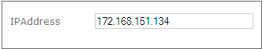
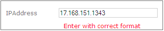

::: {style="DISPLAY: none"}
{#d2h_url_template}{#d2h_package_url style="WIDTH: 0px; DISPLAY: none; HEIGHT: 0px"}
:::

::::: {#nsbanner .d2h_main_nsbanner style="BORDER-BOTTOM: #999999 1px solid; POSITION: relative; PADDING-BOTTOM: 0px; BACKGROUND-COLOR: transparent; PADDING-LEFT: 0px; PADDING-RIGHT: 0px; DISPLAY: none; BORDER-TOP: #999999 1px solid; PADDING-TOP: 0px; LEFT: 0px"}
:::: {#TitleRow .d2h_main_titlerow style="PADDING-BOTTOM: 4px; BACKGROUND-COLOR: transparent; PADDING-LEFT: 22px; WIDTH: 100%; PADDING-RIGHT: 10px; DISPLAY: none; PADDING-TOP: 4px"}
::: {#ienav .d2h_main_ienav style="DISPLAY: none"}
{#D2HPrevious .D2HPreviousEnabled}  {#D2HNext .D2HNextEnabled}
:::
::::
:::::

::::: {#nstext .d2h_main_nstext style="PADDING-BOTTOM: 10px; BACKGROUND-COLOR: transparent; PADDING-LEFT: 22px; PADDING-RIGHT: 10px; HEIGHT: 100%; OVERFLOW: auto; PADDING-TOP: 5px" hasuserbackground="true" valign="bottom"}
::: {#d2h_breadcrumbs .d2h_breadcrumbs}
[Essential Studio User Guide Documentation](ms-xhelp:///?Id=12457748-09e3-4d74-a240-8e049cedf030){.d2h_breadcrumbsNormal}[ \> ]{.d2h_breadcrumbsLinkSeparator}[User Interface Edition](ms-xhelp:///?Id=c29296b7-531c-413b-a0ec-488ca1f7f669){.d2h_breadcrumbsNormal}[ \> ]{.d2h_breadcrumbsLinkSeparator}[Essential ASP.NET MVC](ms-xhelp:///?Id=4b14e7d1-65c4-4f67-b1aa-2c37709905a5){.d2h_breadcrumbsNormal}[ \> ]{.d2h_breadcrumbsLinkSeparator}[Essential Tools]{.d2h_breadcrumbsContentsOnly}[ \> ]{.d2h_breadcrumbsLinkSeparator}[Controls and Components](ms-xhelp:///?Id=f0af2fff-6f00-4ca4-85a6-54e41ac5dc96){.d2h_breadcrumbsNormal}[ \> ]{.d2h_breadcrumbsLinkSeparator}[Client-Side Validator](ms-xhelp:///?Id=e056d763-792d-4827-a0f0-5db760516c25){.d2h_breadcrumbsNormal}
:::

### Adding Client Side Validator to a MVC application {#adding-client-side-validator-to-a-mvc-application style="tab-stops: 0pt"}

Refer to the [Getting Started]{.UGHyperlink} section to know the pre-requisites before stepping in to add a client side validator control to a MVC application.

The following steps explain the addition of a client side validator to an application.

1.   In **View**, create an input field (which is to be validated) and invoke the validator helper with the id of the input field as the first argument.

**[]{style="FONT-FAMILY: 'Calibri','sans-serif'"}** 

+------------------------------------------------------------------------------------------------------------------------------------------------------------------------------------------------------------------------------+
| **[View\[aspx\]]{style="FONT-FAMILY: 'Courier New'"}**                                                                                                                                                                       |
|                                                                                                                                                                                                                              |
| **[]{style="FONT-FAMILY: 'Courier New'"}**                                                                                                                                                                                   |
|                                                                                                                                                                                                                              |
| [IPAddress         [\<%]{style="BACKGROUND: yellow"}[=]{style="COLOR: blue"}Html.TextBox([\"IPAddress\"]{style="COLOR: #a31515"})[%\>]{style="BACKGROUND: yellow"}]{style="FONT-FAMILY: 'Courier New'"}                      |
|                                                                                                                                                                                                                              |
| [                        [\<%]{style="BACKGROUND: yellow"}[=]{style="COLOR: blue"}Html.Syncfusion().Validator([\"IPAddress\"]{style="COLOR: #a31515"})[%\>]{style="BACKGROUND: yellow"}]{style="FONT-FAMILY: 'Courier New'"} |
+------------------------------------------------------------------------------------------------------------------------------------------------------------------------------------------------------------------------------+

**[]{style="FONT-FAMILY: 'Calibri','sans-serif'"}** 

**[]{style="FONT-FAMILY: 'Calibri','sans-serif'"}** 

+---------------------------------------------------------------------------------------------------------------------------------------------------------------------------------------------------------------+
| **[View\[cshtml\]]{style="FONT-FAMILY: 'Courier New'"}**                                                                                                                                                      |
|                                                                                                                                                                                                               |
| **[]{style="FONT-FAMILY: 'Courier New'"}**                                                                                                                                                                    |
|                                                                                                                                                                                                               |
| [IPAddress         [@]{style="BACKGROUND: yellow"}Html.TextBox([\"IPAddress\"]{style="COLOR: #a31515"})]{style="FONT-FAMILY: 'Courier New'"}                                                                  |
|                                                                                                                                                                                                               |
| [                        [\@{]{style="BACKGROUND: yellow"} Html.Syncfusion().Validator([\"IPAddress\"]{style="COLOR: #a31515"}).Render();[}]{style="BACKGROUND: yellow"}]{style="FONT-FAMILY: 'Courier New'"} |
|                                                                                                                                                                                                               |
| []{style="FONT-FAMILY: 'Courier New'; BACKGROUND: yellow"}                                                                                                                                                    |
+---------------------------------------------------------------------------------------------------------------------------------------------------------------------------------------------------------------+

**[]{style="FONT-FAMILY: 'Calibri','sans-serif'"}** 

**[]{style="FONT-FAMILY: 'Calibri','sans-serif'"}** 

**[]{style="FONT-FAMILY: 'Calibri','sans-serif'"}** 

2.   Build and run the application.

The following is the output when the input field passes the validation:

 

{border="0"}

Figure 101: Input field

 

 

The output when the input field passes the validation is shown in the following screenshot. The validation message will be thrown when the input field loses its focus.

 

{border="0"}

Figure 102: Input field with validation message

 

 

A sample which demonstrates a basic Client Side Validator control can be downloaded from the following link.

[[Client Side Validator]{.UGHyperlink}](http://files.syncfusion.com/Support/Tools_MVC/v8.3.0.20/Test_ClientsideValidator.zip)[]{.UGHyperlink}

::: {style="BORDER-BOTTOM: windowtext 1pt solid; BORDER-LEFT: medium none; PADDING-BOTTOM: 1pt; MARGIN-TOP: 9pt; PADDING-LEFT: 0pt; PADDING-RIGHT: 0pt; MARGIN-BOTTOM: 9pt; BORDER-TOP: windowtext 1pt solid; BORDER-RIGHT: medium none; PADDING-TOP: 1pt"}
 

{border="0"}Note: The version number for the assemblies has been set to 8.3.0.20 in the Web.config file of the attached sample. Change the version number to the appropriate version in the Web-2008.config or Web-2010.config files (available in root directory) and those will automatically be updated in the Web.config file.

 

 
:::

[]{#related-topics}
:::::
