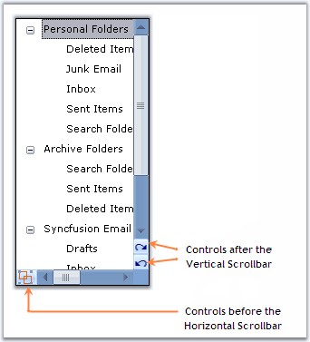

::: {style="DISPLAY: none"}
{#d2h_url_template}{#d2h_package_url style="WIDTH: 0px; DISPLAY: none; HEIGHT: 0px"}
:::

::: {.d2h_secondary_topic style="PADDING-BOTTOM: 10pt; MARGIN: 0pt; PADDING-LEFT: 0pt; PADDING-RIGHT: 0pt; PADDING-TOP: 0pt"}
##### Adding Controls to the ScrollBar {#adding-controls-to-the-scrollbar style="tab-stops: 0pt"}

[]{style="COLOR: #15428b"} 

There are two collection properties available for the ScrollersFrame which lets you add controls before or after the scrollbars. They are **ControlsAfter** and **ControlsBefore** properties.

[]{style="COLOR: #15428b"} 

+-----------------------------------------------------------------------------------------------------------------------------------------------------------------------------------------------------+
| **[\[C#\]]{style="FONT-FAMILY: 'Courier New'; COLOR: black"}**                                                                                                                                      |
|                                                                                                                                                                                                     |
| []{style="FONT-FAMILY: 'Courier New'; COLOR: blue"}                                                                                                                                                 |
|                                                                                                                                                                                                     |
| [//Adding controls to the scrolls through ControlsAfter or ControlsBefore]{style="FONT-FAMILY: 'Courier New'; COLOR: green"}                                                                        |
|                                                                                                                                                                                                     |
| [this]{style="FONT-FAMILY: 'Courier New'; COLOR: blue"}[.scrollersFrame2.HorizontalScroller.ControlsBefore.Add(buttonAdv3);]{style="FONT-FAMILY: 'Courier New'"}                                    |
|                                                                                                                                                                                                     |
| [this]{style="FONT-FAMILY: 'Courier New'; COLOR: blue"}[.scrollersFrame2.VerticalScroller.ControlsAfter.Add(buttonAdv1);]{style="FONT-FAMILY: 'Courier New'"}                                       |
|                                                                                                                                                                                                     |
| [this]{style="FONT-FAMILY: 'Courier New'; COLOR: blue"}[.scrollersFrame2.VerticalScroller.ControlsAfter.Add(buttonAdv2);]{style="FONT-FAMILY: 'Courier New'"}[]{style="FONT-FAMILY: 'Courier New'"} |
+-----------------------------------------------------------------------------------------------------------------------------------------------------------------------------------------------------+

[]{style="COLOR: #15428b"} 

+---------------------------------------------------------------------------------------------------------------------------------------------------------------+
| **[\[VB.NET\]]{style="FONT-FAMILY: 'Courier New'; COLOR: black"}**                                                                                            |
|                                                                                                                                                               |
| []{style="FONT-FAMILY: 'Courier New'; COLOR: black"}                                                                                                          |
|                                                                                                                                                               |
| [\'Adding controls to the scrolls through ControlsAfter or ControlsBefore ]{style="FONT-FAMILY: 'Courier New'; COLOR: green"}                                 |
|                                                                                                                                                               |
| [Me]{style="FONT-FAMILY: 'Courier New'; COLOR: blue"}[.scrollersFrame2.HorizontalScroller.ControlsBefore.Add(buttonAdv3)]{style="FONT-FAMILY: 'Courier New'"} |
|                                                                                                                                                               |
| [Me]{style="FONT-FAMILY: 'Courier New'; COLOR: blue"}[.scrollersFrame2.VerticalScroller.ControlsAfter.Add(buttonAdv1)]{style="FONT-FAMILY: 'Courier New'"}    |
|                                                                                                                                                               |
| [Me]{style="FONT-FAMILY: 'Courier New'; COLOR: blue"}[.scrollersFrame2.VerticalScroller.ControlsAfter.Add(buttonAdv2)]{style="FONT-FAMILY: 'Courier New'"}    |
+---------------------------------------------------------------------------------------------------------------------------------------------------------------+

**[]{style="COLOR: #15428b"}** 

The below images illustrates the controls that are added, before and after the scrolls.

[]{style="COLOR: #15428b"} 

{border="0"}

[]{style="COLOR: #15428b"} 

Figure 1413: Controls added before and after the ScrollBars

**[]{style="COLOR: #15428b"}** 

See Also

[]{style="COLOR: #15428b"} 

[[Visual Styles]{.UGHyperlink}](../../../../../../../../Documents%20and%20Settings/sylviap/Desktop/Tools%20-%20Part%202.docx#_Visual_Styles_1)[]{style="COLOR: black"}

 

 

[]{#related-topics}
:::
