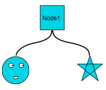
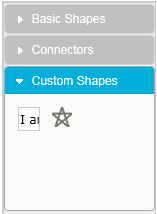

::: {style="DISPLAY: none"}
{#d2h_url_template}{#d2h_package_url style="WIDTH: 0px; DISPLAY: none; HEIGHT: 0px"}
:::

::::: {#nsbanner .d2h_main_nsbanner style="BORDER-BOTTOM: #999999 1px solid; POSITION: relative; PADDING-BOTTOM: 0px; BACKGROUND-COLOR: transparent; PADDING-LEFT: 0px; PADDING-RIGHT: 0px; DISPLAY: none; BORDER-TOP: #999999 1px solid; PADDING-TOP: 0px; LEFT: 0px"}
:::: {#TitleRow .d2h_main_titlerow style="PADDING-BOTTOM: 4px; BACKGROUND-COLOR: transparent; PADDING-LEFT: 22px; WIDTH: 100%; PADDING-RIGHT: 10px; DISPLAY: none; PADDING-TOP: 4px"}
::: {#ienav .d2h_main_ienav style="DISPLAY: none"}
{#D2HPrevious .D2HPreviousEnabled}  {#D2HNext .D2HNextEnabled}
:::
::::
:::::

:::: {#nstext .d2h_main_nstext style="PADDING-BOTTOM: 10px; BACKGROUND-COLOR: transparent; PADDING-LEFT: 22px; PADDING-RIGHT: 10px; HEIGHT: 100%; OVERFLOW: auto; PADDING-TOP: 5px" hasuserbackground="true" valign="bottom"}
::: {#d2h_breadcrumbs .d2h_breadcrumbs}
[Essential Studio User Guide Documentation](ms-xhelp:///?Id=12457748-09e3-4d74-a240-8e049cedf030){.d2h_breadcrumbsNormal}[ \> ]{.d2h_breadcrumbsLinkSeparator}[User Interface Edition](ms-xhelp:///?Id=c29296b7-531c-413b-a0ec-488ca1f7f669){.d2h_breadcrumbsNormal}[ \> ]{.d2h_breadcrumbsLinkSeparator}[Essential ASP.NET MVC](ms-xhelp:///?Id=4b14e7d1-65c4-4f67-b1aa-2c37709905a5){.d2h_breadcrumbsNormal}[ \> ]{.d2h_breadcrumbsLinkSeparator}[Essential Diagram]{.d2h_breadcrumbsContentsOnly}[ \> ]{.d2h_breadcrumbsLinkSeparator}[Concepts and Features](ms-xhelp:///?Id=04839cdf-94fc-4d24-9f6b-119fdbd7bbfb){.d2h_breadcrumbsNormal}[ \> ]{.d2h_breadcrumbsLinkSeparator}[Symbol Palette](ms-xhelp:///?Id=186ffc32-1736-4824-b89a-7f0ff3e22717){.d2h_breadcrumbsNormal}
:::

### Adding Custom Shapes {#adding-custom-shapes style="tab-stops: 0pt"}

This feature allows you to add your own custom shapes to the diagram page, the symbol palette, or both. If you want to add the shape to the diagram page, you will have to add a node to the diagram page and then specify its shape as **CustomShape**, from the list of shapes provided.

Once you do so, use the **ClientSideOnCustomShapeDrawing** event (which contains the name and the Canvas context of the node) to draw the shape you desire.

However, if you want to add a custom shape to the symbol palette, refer to the section on Adding Symbol Palette Group and Items.

 

Appearance and Structure

The following figure illustrates the appearance and structure of the custom shapes you can add using this feature in Essential Diagram for MVC.

 

{border="0"}

Figure 132: Custom Shapes Added to the Diagram Page

 

{border="0"}

Figure 133: Custom Shapes Added to the Symbol Palette

 

Where do I find the installed samples?

To view a sample:

1.   Open the Essential Diagram sample browser from the dashboard. (Refer to the Samples and Location chapter.)

2.   Navigate to **Getting Started \> SymbolPalette Customization Demo**.

 

More:

[ ]{#related-topics}

[{border="0" align="absMiddle"}Property and Event Tables](ms-xhelp:///?Id=1edc08f6-3093-453b-966a-8f7854158191){style="TEXT-DECORATION: none"}

[{border="0" align="absMiddle"}Adding custom Shapes to Symbol Palette](ms-xhelp:///?Id=916b4cc0-a58b-4453-be67-567a83f2c6b4){style="TEXT-DECORATION: none"}

[{border="0" align="absMiddle"}Adding Custom Shapes to the Diagram Page](ms-xhelp:///?Id=aa253494-b233-4567-a98f-ea5053c4d660){style="TEXT-DECORATION: none"}
::::
