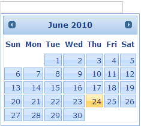

::: {style="DISPLAY: none"}
{#d2h_url_template}{#d2h_package_url style="WIDTH: 0px; DISPLAY: none; HEIGHT: 0px"}
:::

::::: {#nsbanner .d2h_main_nsbanner style="BORDER-BOTTOM: #999999 1px solid; POSITION: relative; PADDING-BOTTOM: 0px; BACKGROUND-COLOR: transparent; PADDING-LEFT: 0px; PADDING-RIGHT: 0px; DISPLAY: none; BORDER-TOP: #999999 1px solid; PADDING-TOP: 0px; LEFT: 0px"}
:::: {#TitleRow .d2h_main_titlerow style="PADDING-BOTTOM: 4px; BACKGROUND-COLOR: transparent; PADDING-LEFT: 22px; WIDTH: 100%; PADDING-RIGHT: 10px; DISPLAY: none; PADDING-TOP: 4px"}
::: {#ienav .d2h_main_ienav style="DISPLAY: none"}
{#D2HPrevious .D2HPreviousEnabled}  {#D2HNext .D2HNextEnabled}
:::
::::
:::::

:::: {#nstext .d2h_main_nstext style="PADDING-BOTTOM: 10px; BACKGROUND-COLOR: transparent; PADDING-LEFT: 22px; PADDING-RIGHT: 10px; HEIGHT: 100%; OVERFLOW: auto; PADDING-TOP: 5px" hasuserbackground="true" valign="bottom"}
::: {#d2h_breadcrumbs .d2h_breadcrumbs}
[Essential Studio User Guide Documentation](ms-xhelp:///?Id=12457748-09e3-4d74-a240-8e049cedf030){.d2h_breadcrumbsNormal}[ \> ]{.d2h_breadcrumbsLinkSeparator}[User Interface Edition](ms-xhelp:///?Id=c29296b7-531c-413b-a0ec-488ca1f7f669){.d2h_breadcrumbsNormal}[ \> ]{.d2h_breadcrumbsLinkSeparator}[Essential ASP.NET MVC](ms-xhelp:///?Id=4b14e7d1-65c4-4f67-b1aa-2c37709905a5){.d2h_breadcrumbsNormal}[ \> ]{.d2h_breadcrumbsLinkSeparator}[Essential Tools]{.d2h_breadcrumbsContentsOnly}[ \> ]{.d2h_breadcrumbsLinkSeparator}[Controls and Components](ms-xhelp:///?Id=f0af2fff-6f00-4ca4-85a6-54e41ac5dc96){.d2h_breadcrumbsNormal}[ \> ]{.d2h_breadcrumbsLinkSeparator}[Date Picker](ms-xhelp:///?Id=4b500e33-59f4-4b16-aaff-d790041a83ae){.d2h_breadcrumbsNormal}
:::

### Adding Date Picker to the MVC application {#adding-date-picker-to-the-mvc-application style="tab-stops: 0pt"}

 

Refer to the [[Getting Started]{style="COLOR: blue"}]{.underline} section to know the pre-requisites before stepping in to add a date picker control to the MVC application.

The following section explains the addition of a datepicket to an application.

1.   In **View**, invoke the date picker helper with control id as the first argument.

 

[]{style="FONT-FAMILY: 'Calibri','sans-serif'"} 

+-------------------------------------------------------------------------------------------------------------------------------------------------------------------------------------------------------------------------------------------------------------------+
| **[View\[aspx\]]{style="FONT-FAMILY: 'Courier New'"}**                                                                                                                                                                                                            |
|                                                                                                                                                                                                                                                                   |
| **[]{style="FONT-FAMILY: 'Courier New'"}**                                                                                                                                                                                                                        |
|                                                                                                                                                                                                                                                                   |
| [\<%]{style="FONT-FAMILY: 'Courier New'; BACKGROUND: yellow"}[=]{style="FONT-FAMILY: 'Courier New'; COLOR: blue"}[Html.Syncfusion().DatePicker([\"myDatePicker\"]{style="COLOR: #a31515"}) [%\>]{style="BACKGROUND: yellow"}]{style="FONT-FAMILY: 'Courier New'"} |
|                                                                                                                                                                                                                                                                   |
| []{style="FONT-FAMILY: 'Courier New'; BACKGROUND: yellow"}                                                                                                                                                                                                        |
+-------------------------------------------------------------------------------------------------------------------------------------------------------------------------------------------------------------------------------------------------------------------+

[]{style="FONT-FAMILY: Consolas; FONT-SIZE: 9.5pt"} 

+---------------------------------------------------------------------------------------------------------------------------------------------------------------------------------------------------------------------------------------------------------------------------+
| **[View\[cshtml\]]{style="FONT-FAMILY: 'Courier New'"}**                                                                                                                                                                                                                  |
|                                                                                                                                                                                                                                                                           |
| **[]{style="FONT-FAMILY: 'Courier New'"}**                                                                                                                                                                                                                                |
|                                                                                                                                                                                                                                                                           |
| [\@{]{style="FONT-FAMILY: 'Courier New'; BACKGROUND: yellow"}[ ]{style="FONT-FAMILY: 'Courier New'; COLOR: blue"}[Html.Syncfusion().DatePicker([\"myDatePicker\"]{style="COLOR: #a31515"}).Render(); [}]{style="BACKGROUND: yellow"}]{style="FONT-FAMILY: 'Courier New'"} |
+---------------------------------------------------------------------------------------------------------------------------------------------------------------------------------------------------------------------------------------------------------------------------+

[]{style="FONT-FAMILY: Consolas; FONT-SIZE: 9.5pt"} 

2.   Build and run the application.

The output is shown in the following screenshot.

 

{border="0"}

Figure 104: Date Picker

 

A sample, which demonstrates a basic Date Picker control can be downloaded from the following link.

[]{style="FONT-FAMILY: 'Calibri','sans-serif'; COLOR: black"} 

[[[[Date Picker ]{style="COLOR: blue"}]{.underline}](http://files.syncfusion.com/Support/Tools_MVC/v8.3.0.20/Test_DatePicker.zip)]{.UGHyperlink}

[[]{style="TEXT-DECORATION: none"}]{.UGHyperlink} 

{border="0"}Note: The version number for the assemblies has been set to 8.3.0.20 in the Web.config file of the attached sample. Change the version number to the appropriate version in the Web-2008.config or Web-2010.config files (available in root directory) and those will automatically be updated in the Web.config file.

 

 

[]{#related-topics}
::::
