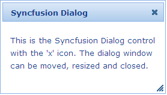

::: {style="DISPLAY: none"}
{#d2h_url_template}{#d2h_package_url style="WIDTH: 0px; DISPLAY: none; HEIGHT: 0px"}
:::

::::: {#nsbanner .d2h_main_nsbanner style="BORDER-BOTTOM: #999999 1px solid; POSITION: relative; PADDING-BOTTOM: 0px; BACKGROUND-COLOR: transparent; PADDING-LEFT: 0px; PADDING-RIGHT: 0px; DISPLAY: none; BORDER-TOP: #999999 1px solid; PADDING-TOP: 0px; LEFT: 0px"}
:::: {#TitleRow .d2h_main_titlerow style="PADDING-BOTTOM: 4px; BACKGROUND-COLOR: transparent; PADDING-LEFT: 22px; WIDTH: 100%; PADDING-RIGHT: 10px; DISPLAY: none; PADDING-TOP: 4px"}
::: {#ienav .d2h_main_ienav style="DISPLAY: none"}
{#D2HPrevious .D2HPreviousEnabled}  {#D2HNext .D2HNextEnabled}
:::
::::
:::::

:::::: {#nstext .d2h_main_nstext style="PADDING-BOTTOM: 10px; BACKGROUND-COLOR: transparent; PADDING-LEFT: 22px; PADDING-RIGHT: 10px; HEIGHT: 100%; OVERFLOW: auto; PADDING-TOP: 5px" hasuserbackground="true" valign="bottom"}
::: {#d2h_breadcrumbs .d2h_breadcrumbs}
[Essential Studio User Guide Documentation](ms-xhelp:///?Id=12457748-09e3-4d74-a240-8e049cedf030){.d2h_breadcrumbsNormal}[ \> ]{.d2h_breadcrumbsLinkSeparator}[User Interface Edition](ms-xhelp:///?Id=c29296b7-531c-413b-a0ec-488ca1f7f669){.d2h_breadcrumbsNormal}[ \> ]{.d2h_breadcrumbsLinkSeparator}[Essential ASP.NET MVC](ms-xhelp:///?Id=4b14e7d1-65c4-4f67-b1aa-2c37709905a5){.d2h_breadcrumbsNormal}[ \> ]{.d2h_breadcrumbsLinkSeparator}[Essential Tools]{.d2h_breadcrumbsContentsOnly}[ \> ]{.d2h_breadcrumbsLinkSeparator}[Controls and Components](ms-xhelp:///?Id=f0af2fff-6f00-4ca4-85a6-54e41ac5dc96){.d2h_breadcrumbsNormal}[ \> ]{.d2h_breadcrumbsLinkSeparator}[Dialog](ms-xhelp:///?Id=26ae36db-cad6-46f4-874d-c9ef689e1135){.d2h_breadcrumbsNormal}
:::

### Adding Dialog to the MVC application {#adding-dialog-to-the-mvc-application style="tab-stops: 0pt"}

Refer to the [Getting Started]{.UGHyperlink} section to know the pre-requisites before stepping in to add a dialog control to the MVC application.

 

Using Builder

The following steps explain the addition of a dialog to an application using Builder.

1.   In **View**, create the contents of the dialog and invoke the dialog helper with the Control ID as the first argument followed by the **TargetControlId** method with the ID of the dialog contents as argument.

 

+-----------------------------------------------------------------------------------------------------------------------------------------------------------------------------------------------------------------------------------------------------------------------------------------------------------------------------------------------------------------------------------------------------------------------------------------------------------------+
| **View\[aspx\]**                                                                                                                                                                                                                                                                                                                                                                                                                                                |
|                                                                                                                                                                                                                                                                                                                                                                                                                                                                 |
|                                                                                                                                                                                                                                                                                                                                                                                                                                                                 |
|                                                                                                                                                                                                                                                                                                                                                                                                                                                                 |
| [\<]{style="FONT-FAMILY: Consolas; COLOR: blue; FONT-SIZE: 9.5pt"}[div]{style="FONT-FAMILY: Consolas; COLOR: maroon; FONT-SIZE: 9.5pt"}[ [id]{style="COLOR: red"}[=\"dialogContents\"]{style="COLOR: blue"} [title]{style="COLOR: red"}[=\"Syncfusion Dialog\"]{style="COLOR: blue"} [style]{style="COLOR: red"}[=\"]{style="COLOR: blue"}[visibility]{style="COLOR: red"}[: hidden\"\>]{style="COLOR: blue"}]{style="FONT-FAMILY: Consolas; FONT-SIZE: 9.5pt"} |
|                                                                                                                                                                                                                                                                                                                                                                                                                                                                 |
| [This is the Syncfusion Dialog control with the \'x\' icon. The dialog    window can be moved, resized and closed.]{style="FONT-FAMILY: Consolas; FONT-SIZE: 9.5pt"}                                                                                                                                                                                                                                                                                            |
|                                                                                                                                                                                                                                                                                                                                                                                                                                                                 |
| [       [\</]{style="COLOR: blue"}[div]{style="COLOR: maroon"}[\>]{style="COLOR: blue"}]{style="FONT-FAMILY: Consolas; FONT-SIZE: 9.5pt"}                                                                                                                                                                                                                                                                                                                       |
|                                                                                                                                                                                                                                                                                                                                                                                                                                                                 |
| [       [\<%]{style="BACKGROUND: yellow"}[=]{style="COLOR: blue"}Html.Syncfusion().Dialog([\"myDialog\"]{style="COLOR: #a31515"})]{style="FONT-FAMILY: Consolas; FONT-SIZE: 9.5pt"}                                                                                                                                                                                                                                                                             |
|                                                                                                                                                                                                                                                                                                                                                                                                                                                                 |
| [.**TargetControlId([\"dialogContents\"]{style="COLOR: #a31515"})**[%\>]{style="BACKGROUND: yellow"}]{style="FONT-FAMILY: Consolas; FONT-SIZE: 9.5pt"}                                                                                                                                                                                                                                                                                                          |
|                                                                                                                                                                                                                                                                                                                                                                                                                                                                 |
| []{style="FONT-FAMILY: Consolas; FONT-SIZE: 9.5pt"}                                                                                                                                                                                                                                                                                                                                                                                                             |
+-----------------------------------------------------------------------------------------------------------------------------------------------------------------------------------------------------------------------------------------------------------------------------------------------------------------------------------------------------------------------------------------------------------------------------------------------------------------+

 

 

+-----------------------------------------------------------------------------------------------------------------------------------------------------------------------------------------------------------------------------------------------------------------------------------------------------------------------------------------------------------------------------------------------------------------------------------------------------------------+
| **View\[cshtml\]**                                                                                                                                                                                                                                                                                                                                                                                                                                              |
|                                                                                                                                                                                                                                                                                                                                                                                                                                                                 |
|                                                                                                                                                                                                                                                                                                                                                                                                                                                                 |
|                                                                                                                                                                                                                                                                                                                                                                                                                                                                 |
| [\<]{style="FONT-FAMILY: Consolas; COLOR: blue; FONT-SIZE: 9.5pt"}[div]{style="FONT-FAMILY: Consolas; COLOR: maroon; FONT-SIZE: 9.5pt"}[ [id]{style="COLOR: red"}[=\"dialogContents\"]{style="COLOR: blue"} [title]{style="COLOR: red"}[=\"Syncfusion Dialog\"]{style="COLOR: blue"} [style]{style="COLOR: red"}[=\"]{style="COLOR: blue"}[visibility]{style="COLOR: red"}[: hidden\"\>]{style="COLOR: blue"}]{style="FONT-FAMILY: Consolas; FONT-SIZE: 9.5pt"} |
|                                                                                                                                                                                                                                                                                                                                                                                                                                                                 |
| [This is the Syncfusion Dialog control with the \'x\' icon. The dialog    window can be moved, resized and closed.]{style="FONT-FAMILY: Consolas; FONT-SIZE: 9.5pt"}                                                                                                                                                                                                                                                                                            |
|                                                                                                                                                                                                                                                                                                                                                                                                                                                                 |
| [       [\</]{style="COLOR: blue"}[div]{style="COLOR: maroon"}[\>]{style="COLOR: blue"}]{style="FONT-FAMILY: Consolas; FONT-SIZE: 9.5pt"}                                                                                                                                                                                                                                                                                                                       |
|                                                                                                                                                                                                                                                                                                                                                                                                                                                                 |
| [       [\@{]{style="BACKGROUND: yellow"}[ ]{style="COLOR: blue"}Html.Syncfusion().Dialog([\"myDialog\"]{style="COLOR: #a31515"})]{style="FONT-FAMILY: Consolas; FONT-SIZE: 9.5pt"}                                                                                                                                                                                                                                                                             |
|                                                                                                                                                                                                                                                                                                                                                                                                                                                                 |
| [.**TargetControlId([\"dialogContents\"]{style="COLOR: #a31515"})**.Render();[}]{style="BACKGROUND: yellow"}]{style="FONT-FAMILY: Consolas; FONT-SIZE: 9.5pt"}                                                                                                                                                                                                                                                                                                  |
|                                                                                                                                                                                                                                                                                                                                                                                                                                                                 |
| []{style="FONT-FAMILY: Consolas; FONT-SIZE: 9.5pt"}                                                                                                                                                                                                                                                                                                                                                                                                             |
+-----------------------------------------------------------------------------------------------------------------------------------------------------------------------------------------------------------------------------------------------------------------------------------------------------------------------------------------------------------------------------------------------------------------------------------------------------------------+

**[]{style="FONT-FAMILY: 'Calibri','sans-serif'"}** 

::: {style="BORDER-BOTTOM: windowtext 1pt solid; BORDER-LEFT: medium none; PADDING-BOTTOM: 1pt; MARGIN-TOP: 9pt; PADDING-LEFT: 0pt; PADDING-RIGHT: 0pt; MARGIN-BOTTOM: 9pt; BORDER-TOP: windowtext 1pt solid; BORDER-RIGHT: medium none; PADDING-TOP: 1pt"}
{border="0"}Note: The style attribute visibility of the dialog content is set to hidden for better rendering on page load. The visibility will be reset internally once the resources related to the control gets loaded completely.
:::

2.   Build and run the application.

**[]{style="FONT-FAMILY: 'Calibri','sans-serif'; FONT-SIZE: 12pt"}** 

Using Properties Model

The following steps explain the addition of a dialog to an application using the Properties model.

1.   In the Controller, create an instance of the DialogModel, define the **TargetControlId** and pass the instance through **View Specific Data** to **View** as given below.**

*[[[]{style="TEXT-DECORATION: none"}]{style="FONT-FAMILY: 'Calibri','sans-serif'"}]{.underline}* 

*[[[]{style="TEXT-DECORATION: none"}]{style="FONT-FAMILY: 'Calibri','sans-serif'"}]{.underline}* 

+------------------------------------------------------------------------------------------------------------------------------------------------------------------------------------+
| **\[Controller\]**                                                                                                                                                                 |
|                                                                                                                                                                                    |
|                                                                                                                                                                                    |
|                                                                                                                                                                                    |
| [public]{style="FONT-FAMILY: Consolas; COLOR: blue; FONT-SIZE: 9.5pt"}[ [ActionResult]{style="COLOR: #2b91af"} Index()]{style="FONT-FAMILY: Consolas; FONT-SIZE: 9.5pt"}           |
|                                                                                                                                                                                    |
| [        {]{style="FONT-FAMILY: Consolas; FONT-SIZE: 9.5pt"}                                                                                                                       |
|                                                                                                                                                                                    |
| [            [//create an instance of DialogModel]{style="COLOR: green"}]{style="FONT-FAMILY: Consolas; FONT-SIZE: 9.5pt"}                                                         |
|                                                                                                                                                                                    |
| [            [DialogModel]{style="COLOR: #2b91af"} myModel = [new]{style="COLOR: blue"} [DialogModel]{style="COLOR: #2b91af"}();]{style="FONT-FAMILY: Consolas; FONT-SIZE: 9.5pt"} |
|                                                                                                                                                                                    |
| [            **myModel.TargetControlId = [\"dialogContents\"]{style="COLOR: #a31515"};**]{style="FONT-FAMILY: Consolas; FONT-SIZE: 9.5pt"}                                         |
|                                                                                                                                                                                    |
| []{style="FONT-FAMILY: Consolas; FONT-SIZE: 9.5pt"}                                                                                                                                |
|                                                                                                                                                                                    |
| [            [//pass the instance through view data to the view]{style="COLOR: green"}]{style="FONT-FAMILY: Consolas; FONT-SIZE: 9.5pt"}                                           |
|                                                                                                                                                                                    |
| [            ViewData\[[\"myDialog\"]{style="COLOR: #a31515"}\] = myModel;]{style="FONT-FAMILY: Consolas; FONT-SIZE: 9.5pt"}                                                       |
|                                                                                                                                                                                    |
| [            [return]{style="COLOR: blue"} View();]{style="FONT-FAMILY: Consolas; FONT-SIZE: 9.5pt"}                                                                               |
|                                                                                                                                                                                    |
| [        }]{style="FONT-FAMILY: Consolas; FONT-SIZE: 9.5pt"}                                                                                                                       |
|                                                                                                                                                                                    |
| []{style="FONT-FAMILY: Consolas; FONT-SIZE: 9.5pt"}                                                                                                                                |
+------------------------------------------------------------------------------------------------------------------------------------------------------------------------------------+

[]{style="FONT-FAMILY: Consolas; FONT-SIZE: 9.5pt"} 

2.   In **View**, create the dialog contents and invoke the dialog helper with the **View Data** key as the first argument.

[]{style="FONT-FAMILY: 'Calibri','sans-serif'"} 

+-----------------------------------------------------------------------------------------------------------------------------------------------------------------------------------------------------------------------------------------------------------------------------------------------------------------------------------------------------------------------------------------------------------------------------------------------------------------+
| **\[ASPXView\[aspx\]**                                                                                                                                                                                                                                                                                                                                                                                                                                          |
|                                                                                                                                                                                                                                                                                                                                                                                                                                                                 |
|                                                                                                                                                                                                                                                                                                                                                                                                                                                                 |
|                                                                                                                                                                                                                                                                                                                                                                                                                                                                 |
| [\<]{style="FONT-FAMILY: Consolas; COLOR: blue; FONT-SIZE: 9.5pt"}[div]{style="FONT-FAMILY: Consolas; COLOR: maroon; FONT-SIZE: 9.5pt"}[ [id]{style="COLOR: red"}[=\"dialogContents\"]{style="COLOR: blue"} [title]{style="COLOR: red"}[=\"Syncfusion Dialog\"]{style="COLOR: blue"} [style]{style="COLOR: red"}[=\"]{style="COLOR: blue"}[visibility]{style="COLOR: red"}[: hidden\"\>]{style="COLOR: blue"}]{style="FONT-FAMILY: Consolas; FONT-SIZE: 9.5pt"} |
|                                                                                                                                                                                                                                                                                                                                                                                                                                                                 |
| [This is the Syncfusion Dialog control with the \'x\' icon. The dialog    window can be moved, resized and closed.]{style="FONT-FAMILY: Consolas; FONT-SIZE: 9.5pt"}                                                                                                                                                                                                                                                                                            |
|                                                                                                                                                                                                                                                                                                                                                                                                                                                                 |
| [       [\</]{style="COLOR: blue"}[div]{style="COLOR: maroon"}[\>]{style="COLOR: blue"}]{style="FONT-FAMILY: Consolas; FONT-SIZE: 9.5pt"}                                                                                                                                                                                                                                                                                                                       |
|                                                                                                                                                                                                                                                                                                                                                                                                                                                                 |
| [\<%]{style="FONT-FAMILY: Consolas; BACKGROUND: yellow; FONT-SIZE: 9.5pt"}[=]{style="FONT-FAMILY: Consolas; COLOR: blue; FONT-SIZE: 9.5pt"}[Html.Syncfusion().Dialog([\"myDialog\"]{style="COLOR: #a31515"})[%\>]{style="BACKGROUND: yellow"}]{style="FONT-FAMILY: Consolas; FONT-SIZE: 9.5pt"}                                                                                                                                                                 |
|                                                                                                                                                                                                                                                                                                                                                                                                                                                                 |
| []{style="FONT-FAMILY: Consolas; FONT-SIZE: 9.5pt"}                                                                                                                                                                                                                                                                                                                                                                                                             |
+-----------------------------------------------------------------------------------------------------------------------------------------------------------------------------------------------------------------------------------------------------------------------------------------------------------------------------------------------------------------------------------------------------------------------------------------------------------------+

[]{style="FONT-FAMILY: Consolas; BACKGROUND: yellow; FONT-SIZE: 9.5pt"} 

[]{style="FONT-FAMILY: 'Calibri','sans-serif'"} 

+-----------------------------------------------------------------------------------------------------------------------------------------------------------------------------------------------------------------------------------------------------------------------------------------------------------------------------------------------------------------------------------------------------------------------------------------------------------------+
| **View\[cshtml\]**                                                                                                                                                                                                                                                                                                                                                                                                                                              |
|                                                                                                                                                                                                                                                                                                                                                                                                                                                                 |
|                                                                                                                                                                                                                                                                                                                                                                                                                                                                 |
|                                                                                                                                                                                                                                                                                                                                                                                                                                                                 |
| [\<]{style="FONT-FAMILY: Consolas; COLOR: blue; FONT-SIZE: 9.5pt"}[div]{style="FONT-FAMILY: Consolas; COLOR: maroon; FONT-SIZE: 9.5pt"}[ [id]{style="COLOR: red"}[=\"dialogContents\"]{style="COLOR: blue"} [title]{style="COLOR: red"}[=\"Syncfusion Dialog\"]{style="COLOR: blue"} [style]{style="COLOR: red"}[=\"]{style="COLOR: blue"}[visibility]{style="COLOR: red"}[: hidden\"\>]{style="COLOR: blue"}]{style="FONT-FAMILY: Consolas; FONT-SIZE: 9.5pt"} |
|                                                                                                                                                                                                                                                                                                                                                                                                                                                                 |
| [This is the Syncfusion Dialog control with the \'x\' icon. The dialog    window can be moved, resized and closed.]{style="FONT-FAMILY: Consolas; FONT-SIZE: 9.5pt"}                                                                                                                                                                                                                                                                                            |
|                                                                                                                                                                                                                                                                                                                                                                                                                                                                 |
| [       [\</]{style="COLOR: blue"}[div]{style="COLOR: maroon"}[\>]{style="COLOR: blue"}]{style="FONT-FAMILY: Consolas; FONT-SIZE: 9.5pt"}                                                                                                                                                                                                                                                                                                                       |
|                                                                                                                                                                                                                                                                                                                                                                                                                                                                 |
| [\@{]{style="FONT-FAMILY: Consolas; BACKGROUND: yellow; FONT-SIZE: 9.5pt"}[ ]{style="FONT-FAMILY: Consolas; COLOR: blue; FONT-SIZE: 9.5pt"}[Html.Syncfusion().Dialog([\"myDialog\"]{style="COLOR: #a31515"}).Render();[}]{style="BACKGROUND: yellow"}]{style="FONT-FAMILY: Consolas; FONT-SIZE: 9.5pt"}                                                                                                                                                         |
|                                                                                                                                                                                                                                                                                                                                                                                                                                                                 |
| []{style="FONT-FAMILY: Consolas; FONT-SIZE: 9.5pt"}                                                                                                                                                                                                                                                                                                                                                                                                             |
+-----------------------------------------------------------------------------------------------------------------------------------------------------------------------------------------------------------------------------------------------------------------------------------------------------------------------------------------------------------------------------------------------------------------------------------------------------------------+

[]{style="FONT-FAMILY: Consolas; BACKGROUND: yellow; FONT-SIZE: 9.5pt"} 

3.   Build and run the application.

The output is shown in the following screenshot.

 

{border="0"}

Figure 116: Dialog

[]{style="FONT-FAMILY: 'Calibri','sans-serif'; COLOR: black"} 

A sample that demonstrates a basic Dialog control can be downloaded from the following link.

[]{style="FONT-FAMILY: 'Calibri','sans-serif'; COLOR: black"} 

[[Dialog]{.UGHyperlink}](http://files.syncfusion.com/Support/Tools_MVC/v8.3.0.20/Test_Dialog.zip)[ ]{.UGHyperlink}

[]{style="FONT-FAMILY: 'Calibri','sans-serif'; COLOR: black"} 

::: {style="BORDER-BOTTOM: windowtext 1pt solid; BORDER-LEFT: medium none; PADDING-BOTTOM: 1pt; MARGIN-TOP: 9pt; PADDING-LEFT: 0pt; PADDING-RIGHT: 0pt; MARGIN-BOTTOM: 9pt; BORDER-TOP: windowtext 1pt solid; BORDER-RIGHT: medium none; PADDING-TOP: 1pt"}
{border="0"}Note:The version number for the assemblies has been set to 8.3.0.20 in the Web.config file of the attached sample. Change the version number to the appropriate version in the Web-2008.config or Web-2010.config files (available in root directory) and those will automatically be updated in the Web.config file.
:::

[]{#related-topics}
::::::
