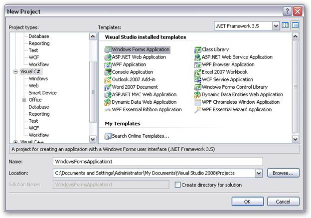
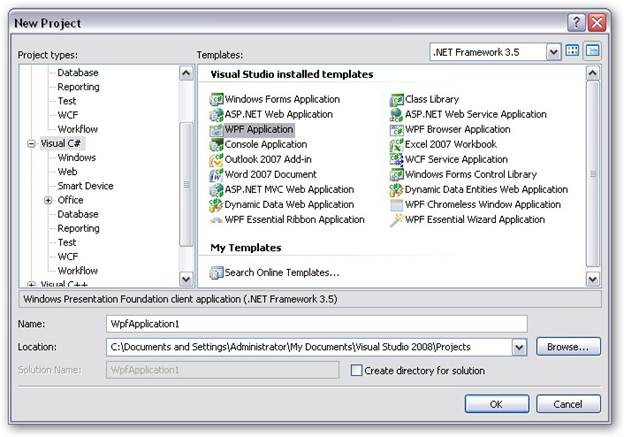

::: {style="DISPLAY: none"}
{#d2h_url_template}{#d2h_package_url style="WIDTH: 0px; DISPLAY: none; HEIGHT: 0px"}
:::

::::: {#nsbanner .d2h_main_nsbanner style="BORDER-BOTTOM: #999999 1px solid; POSITION: relative; PADDING-BOTTOM: 0px; BACKGROUND-COLOR: transparent; PADDING-LEFT: 0px; PADDING-RIGHT: 0px; DISPLAY: none; BORDER-TOP: #999999 1px solid; PADDING-TOP: 0px; LEFT: 0px"}
:::: {#TitleRow .d2h_main_titlerow style="PADDING-BOTTOM: 4px; BACKGROUND-COLOR: transparent; PADDING-LEFT: 22px; WIDTH: 100%; PADDING-RIGHT: 10px; DISPLAY: none; PADDING-TOP: 4px"}
::: {#ienav .d2h_main_ienav style="DISPLAY: none"}
{#D2HPrevious .D2HPreviousEnabled}  {#D2HNext .D2HNextEnabled}
:::
::::
:::::

:::: {#nstext .d2h_main_nstext style="PADDING-BOTTOM: 10px; BACKGROUND-COLOR: transparent; PADDING-LEFT: 22px; PADDING-RIGHT: 10px; HEIGHT: 100%; OVERFLOW: auto; PADDING-TOP: 5px" hasuserbackground="true" valign="bottom"}
::: {#d2h_breadcrumbs .d2h_breadcrumbs}
[Essential Studio User Guide Documentation](ms-xhelp:///?Id=12457748-09e3-4d74-a240-8e049cedf030){.d2h_breadcrumbsNormal}[ \> ]{.d2h_breadcrumbsLinkSeparator}[Reporting Edition](ms-xhelp:///?Id=027aa5b6-6676-4f93-ad23-c20e8c45792e){.d2h_breadcrumbsNormal}[ \> ]{.d2h_breadcrumbsLinkSeparator}[Essential DICOM](ms-xhelp:///?Id=e502a5fa-0df5-447e-9500-b10ae5f53ee5){.d2h_breadcrumbsNormal}[ \> ]{.d2h_breadcrumbsLinkSeparator}[Getting Started](ms-xhelp:///?Id=13d24a74-ef18-480a-ae42-1dc4ed5eec3c){.d2h_breadcrumbsNormal}
:::

## Adding DICOM to an Application {#adding-dicom-to-an-application style="tab-stops: 0pt"}

This section illustrates the step-by-step procedure to create the following platform applications:

[·      ]{style="FONT-FAMILY: Symbol"}Windows

[·      ]{style="FONT-FAMILY: Symbol"}WPF

 

Windows Application

1.   Open **Microsoft Visual Studio**. Go to **File** menu and click **New Project**. In the **New Project** dialog box, select **Windows Forms Application** template, name the project and click **OK**.

{border="0"}

Figure 6: New Project dialog box - Windows Forms Application

A windows application is created.

2.   Open the main form of the application in the designer.

3.   Add the **Syncfusion.Core** and **Syncfusion.DICOM.Base** reference to the project.

 

 

WPF Application

 

1.   Open **Microsoft Visual Studio**. Go to **File** menu and click **New Project**. In the **New Project** dialog box, select **WPF Application** template, name the project and click **OK**.

{border="0"}

Figure 7: New Project dialog box-WPF Application

 

A new WPF application is created.

2.   Open the main form of the application in the designer.

3.   Add the **Syncfusion.Core** and **Syncfusion.DICOM.Base** reference to the project.

 

 

[]{#related-topics}
::::
