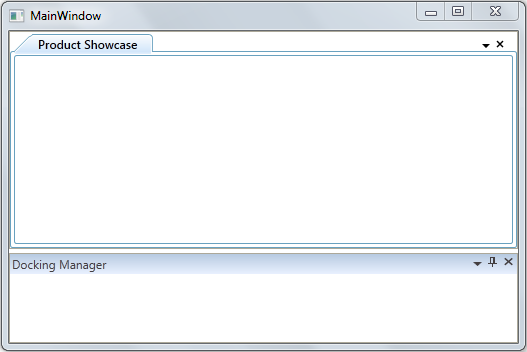

::: {style="DISPLAY: none"}
{#d2h_url_template}{#d2h_package_url style="WIDTH: 0px; DISPLAY: none; HEIGHT: 0px"}
:::

::: {.d2h_secondary_topic style="PADDING-BOTTOM: 10pt; MARGIN: 0pt; PADDING-LEFT: 0pt; PADDING-RIGHT: 0pt; PADDING-TOP: 0pt"}
##### Adding DockFillDocumentMode to an Application {#adding-dockfilldocumentmode-to-an-application style="tab-stops: 0pt"}

Users can decide whether the docked windows should be auto-hidden as per default behavior or be visible when **DockFill** is enabled and tabbed documents are present using the **DockFillDocumentMode** property. To make the docked and tabbed documents visible when **DockFill** is **True**, set this property to **DockFillDocumentMode.Normal**. To make the docked windows auto-hide while tabbed documents are visible when **DockFill** is **True**, set this property to **DockFillDocumentMode.Fill**. By default the value of the **DockFillDocumentMode** property is set to **DockFillDocumentMode.Fill**.

 

The following code snippet shows how to set values for the **DockFillDocumentMode** property:[ ]{style="FONT-FAMILY: 'Times New Roman','serif'; FONT-SIZE: 12pt"}

 

+-----------------------------------------------------------------------------------------------------------------------------------------------------------------------------------------------------------------------------------------------------------------------------------------------------------------------------------------------------------------------------------------------------------------------------------------------------------------------------------+
| **[\[XAML\]]{style="FONT-FAMILY: 'Courier New'"}**                                                                                                                                                                                                                                                                                                                                                                                                                                |
|                                                                                                                                                                                                                                                                                                                                                                                                                                                                                   |
|                                                                                                                                                                                                                                                                                                                                                                                                                                                                                   |
|                                                                                                                                                                                                                                                                                                                                                                                                                                                                                   |
| [\<]{style="FONT-FAMILY: 'Courier New'; COLOR: blue"}[syncfusion]{style="FONT-FAMILY: 'Courier New'; COLOR: #a31515"}[:]{style="FONT-FAMILY: 'Courier New'; COLOR: blue"}[DockingManager ]{style="FONT-FAMILY: 'Courier New'; COLOR: #a31515"}[x]{style="FONT-FAMILY: 'Courier New'; COLOR: red"}[:]{style="FONT-FAMILY: 'Courier New'; COLOR: blue"}[Name]{style="FONT-FAMILY: 'Courier New'; COLOR: red"}[=\"dockingManager\"]{style="FONT-FAMILY: 'Courier New'; COLOR: blue"} |
|                                                                                                                                                                                                                                                                                                                                                                                                                                                                                   |
| [DockFillDocumentMode]{style="FONT-FAMILY: 'Courier New'; COLOR: red"}[=\"Normal\" ]{style="FONT-FAMILY: 'Courier New'; COLOR: blue"}[UseDocumentContainer]{style="FONT-FAMILY: 'Courier New'; COLOR: red"}[=\"true\" \>]{style="FONT-FAMILY: 'Courier New'; COLOR: blue"}                                                                                                                                                                                                        |
|                                                                                                                                                                                                                                                                                                                                                                                                                                                                                   |
| [\<!\-- Product Showcase Window \--\>]{style="FONT-FAMILY: 'Courier New'; COLOR: green"}                                                                                                                                                                                                                                                                                                                                                                                          |
|                                                                                                                                                                                                                                                                                                                                                                                                                                                                                   |
| [\<]{style="FONT-FAMILY: 'Courier New'; COLOR: blue"}[ListBox]{style="FONT-FAMILY: 'Courier New'; COLOR: #a31515"}[ BorderThickness]{style="FONT-FAMILY: 'Courier New'; COLOR: red"}[=\"0\"]{style="FONT-FAMILY: 'Courier New'; COLOR: blue"}[ [Name]{style="COLOR: red"}[=\"Parent1\"]{style="COLOR: blue"} ]{style="FONT-FAMILY: 'Courier New'"}                                                                                                                                |
|                                                                                                                                                                                                                                                                                                                                                                                                                                                                                   |
| [syncfusion:DockingManager.State]{style="FONT-FAMILY: 'Courier New'; COLOR: red"}=\"[Document]{style="FONT-FAMILY: 'Courier New'; COLOR: blue"}\"                                                                                                                                                                                                                                                                                                                                 |
|                                                                                                                                                                                                                                                                                                                                                                                                                                                                                   |
| [syncfusion:DockingManager.DesiredHeightInDockedMode]{style="FONT-FAMILY: 'Courier New'; COLOR: red"}=\"[100]{style="FONT-FAMILY: 'Courier New'; COLOR: blue"}\"                                                                                                                                                                                                                                                                                                                  |
|                                                                                                                                                                                                                                                                                                                                                                                                                                                                                   |
| [syncfusion]{style="FONT-FAMILY: 'Courier New'; COLOR: red"}[:]{style="FONT-FAMILY: 'Courier New'; COLOR: blue"}[DockingManager.Header]{style="FONT-FAMILY: 'Courier New'; COLOR: red"}[=\"Product Showcase\" \>]{style="FONT-FAMILY: 'Courier New'; COLOR: blue"}                                                                                                                                                                                                                |
|                                                                                                                                                                                                                                                                                                                                                                                                                                                                                   |
| [\</]{style="FONT-FAMILY: 'Courier New'; COLOR: blue"}[ListBox]{style="FONT-FAMILY: 'Courier New'; COLOR: #a31515"}[\>]{style="FONT-FAMILY: 'Courier New'; COLOR: blue"}                                                                                                                                                                                                                                                                                                          |
|                                                                                                                                                                                                                                                                                                                                                                                                                                                                                   |
| [\<!\-- Docking Manager Window\--\>]{style="FONT-FAMILY: 'Courier New'; COLOR: green"}                                                                                                                                                                                                                                                                                                                                                                                            |
|                                                                                                                                                                                                                                                                                                                                                                                                                                                                                   |
| [\<]{style="FONT-FAMILY: 'Courier New'; COLOR: blue"}[ListBox]{style="FONT-FAMILY: 'Courier New'; COLOR: #a31515"}[ BorderThickness]{style="FONT-FAMILY: 'Courier New'; COLOR: red"}[=\"0\"]{style="FONT-FAMILY: 'Courier New'; COLOR: blue"}[ ]{style="FONT-FAMILY: 'Courier New'"}                                                                                                                                                                                              |
|                                                                                                                                                                                                                                                                                                                                                                                                                                                                                   |
| [syncfusion]{style="FONT-FAMILY: 'Courier New'; COLOR: red"}[:]{style="FONT-FAMILY: 'Courier New'; COLOR: blue"}[DockingManager.SideInDockedMode]{style="FONT-FAMILY: 'Courier New'; COLOR: red"}[=\"Bottom\"]{style="FONT-FAMILY: 'Courier New'; COLOR: blue"}[ ]{style="FONT-FAMILY: 'Courier New'"}                                                                                                                                                                            |
|                                                                                                                                                                                                                                                                                                                                                                                                                                                                                   |
| [syncfusion]{style="FONT-FAMILY: 'Courier New'; COLOR: red"}[:]{style="FONT-FAMILY: 'Courier New'; COLOR: blue"}[DockingManager.Header]{style="FONT-FAMILY: 'Courier New'; COLOR: red"}[=\"Docking Manager\" \>]{style="FONT-FAMILY: 'Courier New'; COLOR: blue"}                                                                                                                                                                                                                 |
|                                                                                                                                                                                                                                                                                                                                                                                                                                                                                   |
| [\</]{style="FONT-FAMILY: 'Courier New'; COLOR: blue"}[ListBox]{style="FONT-FAMILY: 'Courier New'; COLOR: #a31515"}[\>]{style="FONT-FAMILY: 'Courier New'; COLOR: blue"}                                                                                                                                                                                                                                                                                                          |
|                                                                                                                                                                                                                                                                                                                                                                                                                                                                                   |
| [\</]{style="FONT-FAMILY: 'Courier New'; COLOR: blue"}[syncfusion]{style="FONT-FAMILY: 'Courier New'; COLOR: #a31515"}[:]{style="FONT-FAMILY: 'Courier New'; COLOR: blue"}[DockingManager]{style="FONT-FAMILY: 'Courier New'; COLOR: #a31515"}[ \>]{style="FONT-FAMILY: 'Courier New'; COLOR: blue"}                                                                                                                                                                              |
|                                                                                                                                                                                                                                                                                                                                                                                                                                                                                   |
| []{style="FONT-FAMILY: 'Courier New'"}                                                                                                                                                                                                                                                                                                                                                                                                                                            |
+-----------------------------------------------------------------------------------------------------------------------------------------------------------------------------------------------------------------------------------------------------------------------------------------------------------------------------------------------------------------------------------------------------------------------------------------------------------------------------------+

 

 

+--------------------------------------------------------------------------------------------------------------------------------------------------------------------------------------------------------------------------------------------------------------------------------------------------------------------------------------------------------------------------------+
| **[\[C#\]]{style="FONT-FAMILY: 'Courier New'"}**                                                                                                                                                                                                                                                                                                                               |
|                                                                                                                                                                                                                                                                                                                                                                                |
| []{style="FONT-FAMILY: 'Courier New'; COLOR: blue"}                                                                                                                                                                                                                                                                                                                            |
|                                                                                                                                                                                                                                                                                                                                                                                |
| [this]{style="FONT-FAMILY: 'Courier New'; COLOR: blue"}[.dockingManager.DockFillDocumentMode =]{style="FONT-FAMILY: 'Courier New'"}[DockFillDocumentMode]{style="FONT-FAMILY: Consolas; COLOR: #2b91af; FONT-SIZE: 9.5pt"}[.Normal]{style="FONT-FAMILY: Consolas; FONT-SIZE: 9.5pt"}[;]{style="FONT-FAMILY: 'Courier New'"}[]{style="FONT-FAMILY: Consolas; FONT-SIZE: 9.5pt"} |
+--------------------------------------------------------------------------------------------------------------------------------------------------------------------------------------------------------------------------------------------------------------------------------------------------------------------------------------------------------------------------------+

 

 

 

 

{border="0"}

Figure 362: DockFillDocumentMode = "Normal" (when DockFill is set to True)

[     ]{style="FONT-FAMILY: 'Times New Roman','serif'; FONT-SIZE: 12pt"}

[]{#related-topics}
:::
