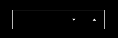

::: {style="DISPLAY: none"}
{#d2h_url_template}{#d2h_package_url style="WIDTH: 0px; DISPLAY: none; HEIGHT: 0px"}
:::

::: {.d2h_secondary_topic style="PADDING-BOTTOM: 10pt; MARGIN: 0pt; PADDING-LEFT: 0pt; PADDING-RIGHT: 0pt; PADDING-TOP: 0pt"}
#### Adding DomainUpDown to the Application []{style="FONT-SIZE: 10pt"} {#adding-domainupdown-to-the-application style="tab-stops: 0pt"}

 

To [[create a Windows Phone application and deploy Essential Tools]{.UGHyperlink}](ms-xhelp:///?Id=09734a55-89d7-4174-884a-f6b1811a0889) for Windows Phone, refer to section [[3 Getting Started]{.UGHyperlink}](ms-xhelp:///?Id=69a3ad9d-15da-416d-ab28-b7fa302757d4). This section covers how to add DomainUpDown control to this application.

 

The *DomainUpDown* control can be added to the application by using either XAML or procedural code. The following code snippet can be used to add the DomainUpDown control to the application.

 

+-------------------------------------------------------------------------------------------------------------------------------------------------------------------------------------------------------------------------------------------------------------------------------------------------------------------------------------------------------------------------------------------------------------------------------------------------------------------------------------+
| **[\[XAML\]]{style="FONT-FAMILY: 'Courier New'; COLOR: black"}**                                                                                                                                                                                                                                                                                                                                                                                                                    |
|                                                                                                                                                                                                                                                                                                                                                                                                                                                                                     |
| []{style="FONT-FAMILY: 'Courier New'; COLOR: black"}                                                                                                                                                                                                                                                                                                                                                                                                                                |
|                                                                                                                                                                                                                                                                                                                                                                                                                                                                                     |
| [\<]{style="FONT-FAMILY: 'Courier New'; COLOR: blue"}[syncfusion]{style="FONT-FAMILY: 'Courier New'; COLOR: #a31515"}[:]{style="FONT-FAMILY: 'Courier New'; COLOR: blue"}[ DomainUpDown]{style="FONT-FAMILY: 'Courier New'; COLOR: #a31515"}[ x]{style="FONT-FAMILY: 'Courier New'; COLOR: red"}[:]{style="FONT-FAMILY: 'Courier New'; COLOR: blue"}[Name]{style="FONT-FAMILY: 'Courier New'; COLOR: red"}[=\"DomainUpDown1\" /\>]{style="FONT-FAMILY: 'Courier New'; COLOR: blue"} |
+-------------------------------------------------------------------------------------------------------------------------------------------------------------------------------------------------------------------------------------------------------------------------------------------------------------------------------------------------------------------------------------------------------------------------------------------------------------------------------------+

 

+-----------------------------------------------------------------------------------------------------------------------------------------------------------------------------------------------+
| **[\[C#\]]{style="FONT-FAMILY: 'Courier New'; COLOR: black"}**                                                                                                                                |
|                                                                                                                                                                                               |
| []{style="FONT-FAMILY: 'Courier New'"}                                                                                                                                                        |
|                                                                                                                                                                                               |
| [DomainUpDown]{style="FONT-FAMILY: 'Courier New'; COLOR: #2b91af"}[ domainUpDown1 = [new]{style="COLOR: blue"} [DomainUpDown]{style="COLOR: #2b91af"}();]{style="FONT-FAMILY: 'Courier New'"} |
|                                                                                                                                                                                               |
| [domainUpDown1.Name = [\"DomainUpDown1\"]{style="COLOR: #a31515"};]{style="FONT-FAMILY: 'Courier New'"}                                                                                       |
+-----------------------------------------------------------------------------------------------------------------------------------------------------------------------------------------------+

 

 

{border="0"}

Figure 22: DomainUpDown Control

 

 

[]{#related-topics}
:::
