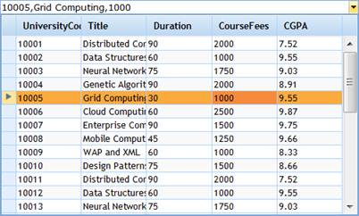

::: {style="DISPLAY: none"}
{#d2h_url_template}{#d2h_package_url style="WIDTH: 0px; DISPLAY: none; HEIGHT: 0px"}
:::

::::: {#nsbanner .d2h_main_nsbanner style="BORDER-BOTTOM: #999999 1px solid; POSITION: relative; PADDING-BOTTOM: 0px; BACKGROUND-COLOR: transparent; PADDING-LEFT: 0px; PADDING-RIGHT: 0px; DISPLAY: none; BORDER-TOP: #999999 1px solid; PADDING-TOP: 0px; LEFT: 0px"}
:::: {#TitleRow .d2h_main_titlerow style="PADDING-BOTTOM: 4px; BACKGROUND-COLOR: transparent; PADDING-LEFT: 22px; WIDTH: 100%; PADDING-RIGHT: 10px; DISPLAY: none; PADDING-TOP: 4px"}
::: {#ienav .d2h_main_ienav style="DISPLAY: none"}
{#D2HPrevious .D2HPreviousEnabled}  {#D2HNext .D2HNextEnabled}
:::
::::
:::::

::::: {#nstext .d2h_main_nstext style="PADDING-BOTTOM: 10px; BACKGROUND-COLOR: transparent; PADDING-LEFT: 22px; PADDING-RIGHT: 10px; HEIGHT: 100%; OVERFLOW: auto; PADDING-TOP: 5px" hasuserbackground="true" valign="bottom"}
::: {#d2h_breadcrumbs .d2h_breadcrumbs}
[Essential Studio User Guide Documentation](ms-xhelp:///?Id=12457748-09e3-4d74-a240-8e049cedf030){.d2h_breadcrumbsNormal}[ \> ]{.d2h_breadcrumbsLinkSeparator}[User Interface Edition](ms-xhelp:///?Id=c29296b7-531c-413b-a0ec-488ca1f7f669){.d2h_breadcrumbsNormal}[ \> ]{.d2h_breadcrumbsLinkSeparator}[Essential ASP.NET MVC](ms-xhelp:///?Id=4b14e7d1-65c4-4f67-b1aa-2c37709905a5){.d2h_breadcrumbsNormal}[ \> ]{.d2h_breadcrumbsLinkSeparator}[Essential Grid]{.d2h_breadcrumbsContentsOnly}[ \> ]{.d2h_breadcrumbsLinkSeparator}[Getting Started](ms-xhelp:///?Id=c7ed3902-b25b-4170-be58-1d3d0b57748a){.d2h_breadcrumbsNormal}[ \> ]{.d2h_breadcrumbsLinkSeparator}[Feature Summary](ms-xhelp:///?Id=1923e679-441a-44e0-9bca-e0e50988a857){.d2h_breadcrumbsNormal}[ \> ]{.d2h_breadcrumbsLinkSeparator}[Concepts and Features](ms-xhelp:///?Id=4a1657fa-4756-42b9-9153-aebf5dcfc503){.d2h_breadcrumbsNormal}[ \> ]{.d2h_breadcrumbsLinkSeparator}[MultiColumnDropDown](ms-xhelp:///?Id=cf0e6254-8964-4a67-b141-e26bc6e4f04a){.d2h_breadcrumbsNormal}
:::

### Adding Essential Grid to an Application {#adding-essential-grid-to-an-application style="tab-stops: 0pt"}

 

To know how to create an ASP.NET MVC application and add Essential Grid to the application, refer to the [Getting Started]{.underline} section.

 

This section guides you on creating a multicolumn drop-down which includes the following steps.

1.   Create a MultiColumnDropDown control in the view and set the data source using the **Datasource()** method.

 

+--------------------------------------------------------------------------------------------------------------------------------------------------------------------------------------------------------------------------------------------------------------------------------------+
| **[View \[ASPX\][]{style="BACKGROUND: yellow"}]{style="FONT-FAMILY: 'Courier New'"}**                                                                                                                                                                                                |
|                                                                                                                                                                                                                                                                                      |
| [\<%]{style="FONT-FAMILY: 'Courier New'; BACKGROUND: yellow"}[=]{style="FONT-FAMILY: 'Courier New'; COLOR: blue"}[Html.Syncfusion().MultiColumnDropDown\<[Student]{style="COLOR: #2b91af"}\>([\"MultiColumnDropdown\"]{style="COLOR: #a31515"})]{style="FONT-FAMILY: 'Courier New'"} |
|                                                                                                                                                                                                                                                                                      |
| [        .Datasource(([IEnumerable]{style="COLOR: #2b91af"}) ViewData\[[\"data\"]{style="COLOR: #a31515"}\])]{style="FONT-FAMILY: 'Courier New'"}                                                                                                                                    |
|                                                                                                                                                                                                                                                                                      |
| [        .DisplayExpression([new]{style="COLOR: blue"} [int]{style="COLOR: blue"}\[\] {2, 3, 5})]{style="FONT-FAMILY: 'Courier New'"}                                                                                                                                                |
|                                                                                                                                                                                                                                                                                      |
| [        .Width(500)]{style="FONT-FAMILY: 'Courier New'"}                                                                                                                                                                                                                            |
|                                                                                                                                                                                                                                                                                      |
| [       .Text([\"\--Select\--\"]{style="COLOR: #a31515"})]{style="FONT-FAMILY: 'Courier New'"}                                                                                                                                                                                       |
|                                                                                                                                                                                                                                                                                      |
| [    [%\>]{style="BACKGROUND: yellow"}]{style="FONT-FAMILY: 'Courier New'"}                                                                                                                                                                                                          |
+--------------------------------------------------------------------------------------------------------------------------------------------------------------------------------------------------------------------------------------------------------------------------------------+

[]{style="FONT-FAMILY: Consolas; BACKGROUND: yellow; FONT-SIZE: 9.5pt"} 

 

 

+----------------------------------------------------------------------------------------------------------------------------------------------------------------------------------------------------------------------------------------------------------------------------------------------------------------------------------------------------------------------------------------------------------+
| **[View \[cshtml\][]{style="BACKGROUND: yellow"}]{style="FONT-FAMILY: 'Courier New'"}**                                                                                                                                                                                                                                                                                                                  |
|                                                                                                                                                                                                                                                                                                                                                                                                          |
| [@(]{style="FONT-FAMILY: Consolas; BACKGROUND: yellow; FONT-SIZE: 9.5pt"}[new]{style="FONT-FAMILY: Consolas; COLOR: blue; FONT-SIZE: 9.5pt"}[ [HtmlString]{style="COLOR: #2b91af"}(]{style="FONT-FAMILY: Consolas; FONT-SIZE: 9.5pt"}[Html.Syncfusion().MultiColumnDropDown\<[Student]{style="COLOR: #2b91af"}\>([\"MultiColumnDropdown\"]{style="COLOR: #a31515"})]{style="FONT-FAMILY: 'Courier New'"} |
|                                                                                                                                                                                                                                                                                                                                                                                                          |
| [        .Datasource(([IEnumerable]{style="COLOR: #2b91af"}) ViewData\[[\"data\"]{style="COLOR: #a31515"}\])]{style="FONT-FAMILY: 'Courier New'"}                                                                                                                                                                                                                                                        |
|                                                                                                                                                                                                                                                                                                                                                                                                          |
| [        .DisplayExpression([new]{style="COLOR: blue"} [int]{style="COLOR: blue"}\[\] {2, 3, 5})]{style="FONT-FAMILY: 'Courier New'"}                                                                                                                                                                                                                                                                    |
|                                                                                                                                                                                                                                                                                                                                                                                                          |
| [        .Width(500)]{style="FONT-FAMILY: 'Courier New'"}                                                                                                                                                                                                                                                                                                                                                |
|                                                                                                                                                                                                                                                                                                                                                                                                          |
| [       .Text([\"\--Select\--\"]{style="COLOR: #a31515"})]{style="FONT-FAMILY: 'Courier New'"}                                                                                                                                                                                                                                                                                                           |
|                                                                                                                                                                                                                                                                                                                                                                                                          |
| [.ToString())[)]{style="BACKGROUND: yellow"}]{style="FONT-FAMILY: Consolas; FONT-SIZE: 9.5pt"}                                                                                                                                                                                                                                                                                                           |
|                                                                                                                                                                                                                                                                                                                                                                                                          |
| []{style="FONT-FAMILY: 'Courier New'"}                                                                                                                                                                                                                                                                                                                                                                   |
+----------------------------------------------------------------------------------------------------------------------------------------------------------------------------------------------------------------------------------------------------------------------------------------------------------------------------------------------------------------------------------------------------------+

[]{style="FONT-FAMILY: Consolas; BACKGROUND: yellow; FONT-SIZE: 9.5pt"} 

2.   Set its data source in **ViewData** and render the view.

 

+-------------------------------------------------------------------------------------------------------------------------------------------------------------------------------------------------------------------------------------------------+
| []{style="FONT-FAMILY: 'Courier New'"}                                                                                                                                                                                                          |
|                                                                                                                                                                                                                                                 |
| [        [///]{style="COLOR: gray"}[ ]{style="COLOR: green"}[\<summary\>]{style="COLOR: gray"}]{style="FONT-FAMILY: 'Courier New'"}                                                                                                             |
|                                                                                                                                                                                                                                                 |
| [        [///]{style="COLOR: gray"}[ Used for rendering the multicolumn drop-down initially.]{style="COLOR: green"}]{style="FONT-FAMILY: 'Courier New'"}                                                                                        |
|                                                                                                                                                                                                                                                 |
| [        [///]{style="COLOR: gray"}[ ]{style="COLOR: green"}[\</summary\>]{style="COLOR: gray"}]{style="FONT-FAMILY: 'Courier New'"}                                                                                                            |
|                                                                                                                                                                                                                                                 |
| [        [///]{style="COLOR: gray"}[ ]{style="COLOR: green"}[\<returns\>]{style="COLOR: gray"}[Veiw page; it displays the multicolumn drop-down.]{style="COLOR: green"}[\</returns\>]{style="COLOR: gray"}]{style="FONT-FAMILY: 'Courier New'"} |
|                                                                                                                                                                                                                                                 |
| [        [public]{style="COLOR: blue"} [ActionResult]{style="COLOR: #2b91af"} Index()]{style="FONT-FAMILY: 'Courier New'"}                                                                                                                      |
|                                                                                                                                                                                                                                                 |
| [        { ]{style="FONT-FAMILY: 'Courier New'"}                                                                                                                                                                                                |
|                                                                                                                                                                                                                                                 |
| [            ]{style="FONT-FAMILY: 'Courier New'"}                                                                                                                                                                                              |
|                                                                                                                                                                                                                                                 |
| [            ViewData\[[\"data\"]{style="COLOR: #a31515"}\] = [new]{style="COLOR: blue"} [StudentDataContext]{style="COLOR: #2b91af"}().JSONStudent.Skip(0).Take(30).ToList();]{style="FONT-FAMILY: 'Courier New'"}                             |
|                                                                                                                                                                                                                                                 |
| [            [return]{style="COLOR: blue"} View();]{style="FONT-FAMILY: 'Courier New'"}                                                                                                                                                         |
|                                                                                                                                                                                                                                                 |
| [        }]{style="FONT-FAMILY: 'Courier New'"}                                                                                                                                                                                                 |
+-------------------------------------------------------------------------------------------------------------------------------------------------------------------------------------------------------------------------------------------------+

 

Run the application. The multicolumn drop-down  will appear as shown below.

 

 

{border="0"}

Figure 302: MultiColumnDropDown Control

 

A sample that demonstrates a basic MultiColumnDropdown control can be downloaded from the following link.

 

[[http://help.syncfusion.com/Support/grid_mvc/v8.3.0.20/UG/MvcMultiColumnDropdownSample.zip]{.UGHyperlink}](http://help.syncfusion.com/Support/grid_mvc/v8.3.0.20/UG/MvcMultiColumnDropdownSample.zip)[]{.UGHyperlink}

 

 

::: {style="BORDER-BOTTOM: windowtext 1pt solid; BORDER-LEFT: medium none; PADDING-BOTTOM: 1pt; MARGIN-TOP: 9pt; PADDING-LEFT: 0pt; PADDING-RIGHT: 0pt; MARGIN-BOTTOM: 9pt; BORDER-TOP: windowtext 1pt solid; BORDER-RIGHT: medium none; PADDING-TOP: 1pt"}
{border="0"}Note: The version number for the assemblies has been set to 8.3.0.20 in the Web.config file of the attached sample. Please change the version number to the appropriate version in the Web-2008.config or Web-2010.config files (available in root directory) and those will automatically be updated in the Web.config file.
:::

 

[]{#related-topics}
:::::
