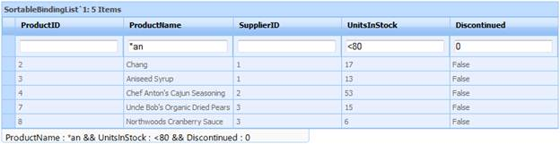

::: {style="DISPLAY: none"}
{#d2h_url_template}{#d2h_package_url style="WIDTH: 0px; DISPLAY: none; HEIGHT: 0px"}
:::

::: {.d2h_secondary_topic style="PADDING-BOTTOM: 10pt; MARGIN: 0pt; PADDING-LEFT: 0pt; PADDING-RIGHT: 0pt; PADDING-TOP: 0pt"}
#### Adding FilterBar to a ASP.NET Grid {#adding-filterbar-to-a-asp.net-grid style="tab-stops: 0pt"}

The [properties](http://sharepoint2.syncfusion.com/workspace/Lists/Relese%20Related%20Content%20Tasks/Attachments/4048/UG%20for%20FilterBar%20in%20ASP.NET_Final.docx#_Properties) used in the previous sections can be used in code (as shown in the following snippets) to implement Expression filters in ASP.NET Grid.

**Using ASPX code:**

+--------------------------------------------------------------------------------------------------------------------------------------------------------------------------------------------------------------------------------------------------------------------------------------------------------------------------------------------------------------------------------------------------------------------------------------------------------------------------------------------------------------------------------------------------------------------------------------------------------------------------------------------------------------------+
| [\[ASPX\]]{style="FONT-FAMILY: 'Courier New'; COLOR: blue"}                                                                                                                                                                                                                                                                                                                                                                                                                                                                                                                                                                                                        |
|                                                                                                                                                                                                                                                                                                                                                                                                                                                                                                                                                                                                                                                                    |
| []{style="FONT-FAMILY: 'Courier New'; COLOR: blue"}                                                                                                                                                                                                                                                                                                                                                                                                                                                                                                                                                                                                                |
|                                                                                                                                                                                                                                                                                                                                                                                                                                                                                                                                                                                                                                                                    |
| [\<]{style="FONT-FAMILY: 'Courier New'; COLOR: blue"}[TableDescriptor]{style="FONT-FAMILY: 'Courier New'; COLOR: maroon"}[ [AllowFilter]{style="COLOR: red"}[=\"True\" /\>]{style="COLOR: blue"}]{style="FONT-FAMILY: 'Courier New'"}                                                                                                                                                                                                                                                                                                                                                                                                                              |
|                                                                                                                                                                                                                                                                                                                                                                                                                                                                                                                                                                                                                                                                    |
| [\<]{style="FONT-FAMILY: 'Courier New'; COLOR: blue"}[TopLevelGroupOptions]{style="FONT-FAMILY: 'Courier New'; COLOR: maroon"}[ [ShowFilterBar]{style="COLOR: red"}[=\"true\"]{style="COLOR: blue"} [AllowExpressionFilter]{style="COLOR: red"}[=\"true\"]{style="COLOR: blue"} [ShowFilterBarTextCell]{style="COLOR: red"}[=\"true\"]{style="COLOR: blue"} [AllowActiveFilteringMode]{style="COLOR: red"}[=\"true\"]{style="COLOR: blue"} [ShowFilterStatusMessage]{style="COLOR: red"}[=\"true\"]{style="COLOR: blue"} [FilterStatusBarWidth]{style="COLOR: red"}[=\"450\"]{style="COLOR: blue"} [/\>]{style="COLOR: blue"}]{style="FONT-FAMILY: 'Courier New'"} |
|                                                                                                                                                                                                                                                                                                                                                                                                                                                                                                                                                                                                                                                                    |
| []{style="FONT-FAMILY: 'Courier New'"}                                                                                                                                                                                                                                                                                                                                                                                                                                                                                                                                                                                                                             |
+--------------------------------------------------------------------------------------------------------------------------------------------------------------------------------------------------------------------------------------------------------------------------------------------------------------------------------------------------------------------------------------------------------------------------------------------------------------------------------------------------------------------------------------------------------------------------------------------------------------------------------------------------------------------+

[]{style="FONT-FAMILY: 'Calibri','sans-serif'; FONT-SIZE: 11pt"} 

**Using C# and VB code:**

+------------------------------------------------------------------------------------------------------------------------------------------------------------------------------------------------------+
| [\[C#\]]{style="FONT-FAMILY: 'Courier New'; COLOR: blue"}                                                                                                                                            |
|                                                                                                                                                                                                      |
| [this]{style="FONT-FAMILY: 'Courier New'; COLOR: blue"}[.GridGroupingControl1.TableDescriptor.AllowFilter = [true]{style="COLOR: blue"};]{style="FONT-FAMILY: 'Courier New'"}                        |
|                                                                                                                                                                                                      |
| [this]{style="FONT-FAMILY: 'Courier New'; COLOR: blue"}[.GridGroupingControl1.TableDescriptor.TopLevelGroupOptions.ShowFilterBar = [true]{style="COLOR: blue"};]{style="FONT-FAMILY: 'Courier New'"} |
|                                                                                                                                                                                                      |
| [        [this]{style="COLOR: blue"}.GridGroupingControl1.TableDescriptor.TopLevelGroupOptions.ShowFilterBarTextCell = [true]{style="COLOR: blue"};]{style="FONT-FAMILY: 'Courier New'"}             |
|                                                                                                                                                                                                      |
| [        [this]{style="COLOR: blue"}.GridGroupingControl1.TableDescriptor.TopLevelGroupOptions.AllowExpressionFilter = [true]{style="COLOR: blue"};]{style="FONT-FAMILY: 'Courier New'"}             |
|                                                                                                                                                                                                      |
| [        [this]{style="COLOR: blue"}.GridGroupingControl1.TableDescriptor.TopLevelGroupOptions.AllowActiveFilteringMode = [true]{style="COLOR: blue"};]{style="FONT-FAMILY: 'Courier New'"}          |
|                                                                                                                                                                                                      |
| [        [this]{style="COLOR: blue"}.GridGroupingControl1.TableDescriptor.TopLevelGroupOptions.ShowFilterStatusMessage = [true]{style="COLOR: blue"};]{style="FONT-FAMILY: 'Courier New'"}           |
|                                                                                                                                                                                                      |
| [        [this]{style="COLOR: blue"}.GridGroupingControl1.TableDescriptor.TopLevelGroupOptions.FilterStatusBarWidth = 450;]{style="FONT-FAMILY: 'Courier New'"}                                      |
|                                                                                                                                                                                                      |
| []{style="FONT-FAMILY: 'Courier New'"}                                                                                                                                                               |
+------------------------------------------------------------------------------------------------------------------------------------------------------------------------------------------------------+

[]{style="FONT-FAMILY: 'Calibri','sans-serif'; FONT-SIZE: 11pt"} 

 

+---------------------------------------------------------------------------------------------------------------------------------------------------------------------------------------------------+
| [\[VB\]]{style="FONT-FAMILY: 'Courier New'; COLOR: blue"}                                                                                                                                         |
|                                                                                                                                                                                                   |
| []{style="FONT-FAMILY: 'Courier New'; COLOR: blue"}                                                                                                                                               |
|                                                                                                                                                                                                   |
| [Me]{style="FONT-FAMILY: 'Courier New'; COLOR: blue"}[.GridGroupingControl1.TableDescriptor.AllowFilter = [True]{style="COLOR: blue"}]{style="FONT-FAMILY: 'Courier New'"}                        |
|                                                                                                                                                                                                   |
| [Me]{style="FONT-FAMILY: 'Courier New'; COLOR: blue"}[.GridGroupingControl1.TableDescriptor.TopLevelGroupOptions.ShowFilterBar = [True]{style="COLOR: blue"}]{style="FONT-FAMILY: 'Courier New'"} |
|                                                                                                                                                                                                   |
| [        [Me]{style="COLOR: blue"}.GridGroupingControl1.TableDescriptor.TopLevelGroupOptions.ShowFilterBarTextCell = [True]{style="COLOR: blue"}]{style="FONT-FAMILY: 'Courier New'"}             |
|                                                                                                                                                                                                   |
| [        [Me]{style="COLOR: blue"}.GridGroupingControl1.TableDescriptor.TopLevelGroupOptions.AllowExpressionFilter = [True]{style="COLOR: blue"}]{style="FONT-FAMILY: 'Courier New'"}             |
|                                                                                                                                                                                                   |
| [        [Me]{style="COLOR: blue"}.GridGroupingControl1.TableDescriptor.TopLevelGroupOptions.AllowActiveFilteringMode = [True]{style="COLOR: blue"}]{style="FONT-FAMILY: 'Courier New'"}          |
|                                                                                                                                                                                                   |
| [        [Me]{style="COLOR: blue"}.GridGroupingControl1.TableDescriptor.TopLevelGroupOptions.ShowFilterStatusMessage = [True]{style="COLOR: blue"}]{style="FONT-FAMILY: 'Courier New'"}           |
|                                                                                                                                                                                                   |
| [Me]{style="FONT-FAMILY: 'Courier New'; COLOR: blue"}[.GridGroupingControl1.TableDescriptor.TopLevelGroupOptions.FilterStatusBarWidth = 450]{style="FONT-FAMILY: 'Courier New'"}                  |
|                                                                                                                                                                                                   |
| []{style="FONT-FAMILY: 'Courier New'"}                                                                                                                                                            |
|                                                                                                                                                                                                   |
| []{style="FONT-FAMILY: 'Courier New'"}                                                                                                                                                            |
+---------------------------------------------------------------------------------------------------------------------------------------------------------------------------------------------------+

[]{style="FONT-FAMILY: 'Calibri','sans-serif'; FONT-SIZE: 11pt"} 

 

Build and run the application. The following output will be displayed:

 

{border="0"}

Figure 85: Expression filter in FilterBar ASP.NET

[]{#related-topics}
:::
