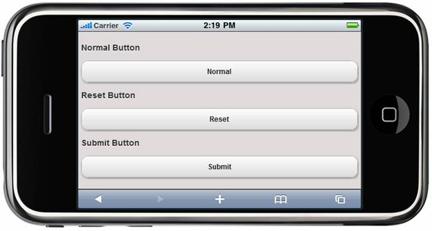

::: {style="DISPLAY: none"}
{#d2h_url_template} {#d2h_package_url style="WIDTH: 0px; DISPLAY: none; HEIGHT: 0px"}
:::

::: {.d2h_secondary_topic style="PADDING-BOTTOM: 10pt; MARGIN: 0pt; PADDING-LEFT: 0pt; PADDING-RIGHT: 0pt; PADDING-TOP: 0pt"}
#### Adding Form Button Control to a Mobile MVC Application {#adding-form-button-control-to-a-mobile-mvc-application style="tab-stops: 0pt"}

In the [Getting Started]{.UGHyperlink} section, we discussed how to [create a Mobile MVC application]{.UGHyperlink} and [add the Tools package to the application]{.UGHyperlink}. This section guides you to add a form button to an application.

 

1.   In the **view**, invoke the **Button** helper with the control ID as the first argument followed by the **AutoFormat** method with the desired theme as its argument.

 

+---------------------------------------------------------------------------------------------------------------------------------------------------------------------------------------------------------------------------------------------------------------------------------------------------------------------------------------------------------------------+
| **[\[ASPX\]]{style="FONT-FAMILY: 'Courier New'"}**                                                                                                                                                                                                                                                                                                                  |
|                                                                                                                                                                                                                                                                                                                                                                     |
| [    ]{style="FONT-FAMILY: 'Courier New'"} [\<]{style="FONT-FAMILY: 'Courier New'; COLOR: blue"} [h3]{style="FONT-FAMILY: 'Courier New'; COLOR: maroon"} [\>]{style="FONT-FAMILY: 'Courier New'; COLOR: blue"} [Normal Button [\</]{style="COLOR: blue"}[h3]{style="COLOR: maroon"}[\>]{style="COLOR: blue"}]{style="FONT-FAMILY: 'Courier New'"}                   |
|                                                                                                                                                                                                                                                                                                                                                                     |
| []{style="FONT-FAMILY: 'Courier New'"}                                                                                                                                                                                                                                                                                                                              |
|                                                                                                                                                                                                                                                                                                                                                                     |
| [    [\<%]{style="BACKGROUND: yellow"}[=]{style="COLOR: blue"} Html.MobSyncfusion().Button([\"button\"]{style="COLOR: #a31515"}).ButtonType([MobButtonType]{style="COLOR: #2b91af"}.Button).Text([\"Normal\"]{style="COLOR: #a31515"}).AutoFormat([MobSkins]{style="COLOR: #2b91af"}.Spinach)[%\>]{style="BACKGROUND: yellow"}]{style="FONT-FAMILY: 'Courier New'"} |
|                                                                                                                                                                                                                                                                                                                                                                     |
| []{style="FONT-FAMILY: 'Courier New'"}                                                                                                                                                                                                                                                                                                                              |
|                                                                                                                                                                                                                                                                                                                                                                     |
| [    [\<]{style="COLOR: blue"}[h3]{style="COLOR: maroon"}[\>]{style="COLOR: blue"}Reset Button[\</]{style="COLOR: blue"}[h3]{style="COLOR: maroon"}[\>]{style="COLOR: blue"}]{style="FONT-FAMILY: 'Courier New'"}                                                                                                                                                   |
|                                                                                                                                                                                                                                                                                                                                                                     |
| []{style="FONT-FAMILY: 'Courier New'"}                                                                                                                                                                                                                                                                                                                              |
|                                                                                                                                                                                                                                                                                                                                                                     |
| [    [\<%]{style="BACKGROUND: yellow"}[=]{style="COLOR: blue"} Html.MobSyncfusion().Button([\"reset\"]{style="COLOR: #a31515"}).ButtonType([MobButtonType]{style="COLOR: #2b91af"}.Reset).Text([\"Reset\"]{style="COLOR: #a31515"}).AutoFormat([MobSkins]{style="COLOR: #2b91af"}.Spinach)[%\>]{style="BACKGROUND: yellow"}]{style="FONT-FAMILY: 'Courier New'"}    |
|                                                                                                                                                                                                                                                                                                                                                                     |
| []{style="FONT-FAMILY: 'Courier New'"}                                                                                                                                                                                                                                                                                                                              |
|                                                                                                                                                                                                                                                                                                                                                                     |
| [    [\<]{style="COLOR: blue"}[h3]{style="COLOR: maroon"}[\>]{style="COLOR: blue"}Submit Button[\</]{style="COLOR: blue"}[h3]{style="COLOR: maroon"}[\>]{style="COLOR: blue"}]{style="FONT-FAMILY: 'Courier New'"}                                                                                                                                                  |
|                                                                                                                                                                                                                                                                                                                                                                     |
| []{style="FONT-FAMILY: 'Courier New'"}                                                                                                                                                                                                                                                                                                                              |
|                                                                                                                                                                                                                                                                                                                                                                     |
| [    [\<%]{style="BACKGROUND: yellow"}[=]{style="COLOR: blue"} Html.MobSyncfusion().Button([\"submit\"]{style="COLOR: #a31515"}).ButtonType([MobButtonType]{style="COLOR: #2b91af"}.Submit).Text([\"Submit\"]{style="COLOR: #a31515"}).AutoFormat([MobSkins]{style="COLOR: #2b91af"}.Spinach)[%\>]{style="BACKGROUND: yellow"}]{style="FONT-FAMILY: 'Courier New'"} |
|                                                                                                                                                                                                                                                                                                                                                                     |
| **[]{style="FONT-FAMILY: 'Courier New'"}**                                                                                                                                                                                                                                                                                                                          |
|                                                                                                                                                                                                                                                                                                                                                                     |
| **[\[Razor\]]{style="FONT-FAMILY: 'Courier New'"}**                                                                                                                                                                                                                                                                                                                 |
|                                                                                                                                                                                                                                                                                                                                                                     |
| [    ]{style="FONT-FAMILY: 'Courier New'; COLOR: blue"} [\<]{style="FONT-FAMILY: 'Courier New'; COLOR: blue"} [h3]{style="FONT-FAMILY: 'Courier New'; COLOR: maroon"} [\>]{style="FONT-FAMILY: 'Courier New'; COLOR: blue"} [Normal Button [\</]{style="COLOR: blue"}[h3]{style="COLOR: maroon"}[\>]{style="COLOR: blue"}]{style="FONT-FAMILY: 'Courier New'"}      |
|                                                                                                                                                                                                                                                                                                                                                                     |
| []{style="FONT-FAMILY: 'Courier New'"}                                                                                                                                                                                                                                                                                                                              |
|                                                                                                                                                                                                                                                                                                                                                                     |
| [    [\@{]{style="BACKGROUND: yellow"} Html.MobSyncfusion().Button([\"button\"]{style="COLOR: #a31515"}).ButtonType([MobButtonType]{style="COLOR: #2b91af"}.Button).Text([\"Normal\"]{style="COLOR: #a31515"}).AutoFormat([MobSkins]{style="COLOR: #2b91af"}.Spinach).Render(); [}]{style="BACKGROUND: yellow"}]{style="FONT-FAMILY: 'Courier New'"}                |
|                                                                                                                                                                                                                                                                                                                                                                     |
| []{style="FONT-FAMILY: 'Courier New'"}                                                                                                                                                                                                                                                                                                                              |
|                                                                                                                                                                                                                                                                                                                                                                     |
| [    [\<]{style="COLOR: blue"}[h3]{style="COLOR: maroon"}[\>]{style="COLOR: blue"}Reset Button[\</]{style="COLOR: blue"}[h3]{style="COLOR: maroon"}[\>]{style="COLOR: blue"}]{style="FONT-FAMILY: 'Courier New'"}                                                                                                                                                   |
|                                                                                                                                                                                                                                                                                                                                                                     |
| []{style="FONT-FAMILY: 'Courier New'"}                                                                                                                                                                                                                                                                                                                              |
|                                                                                                                                                                                                                                                                                                                                                                     |
| [    [\@{]{style="BACKGROUND: yellow"} Html.MobSyncfusion().Button([\"reset\"]{style="COLOR: #a31515"}).ButtonType([MobButtonType]{style="COLOR: #2b91af"}.Reset).Text([\"Reset\"]{style="COLOR: #a31515"}).AutoFormat([MobSkins]{style="COLOR: #2b91af"}.Spinach).Render(); [}]{style="BACKGROUND: yellow"}]{style="FONT-FAMILY: 'Courier New'"}                   |
|                                                                                                                                                                                                                                                                                                                                                                     |
| []{style="FONT-FAMILY: 'Courier New'"}                                                                                                                                                                                                                                                                                                                              |
|                                                                                                                                                                                                                                                                                                                                                                     |
| [    [\<]{style="COLOR: blue"}[h3]{style="COLOR: maroon"}[\>]{style="COLOR: blue"}Submit Button[\</]{style="COLOR: blue"}[h3]{style="COLOR: maroon"}[\>]{style="COLOR: blue"}]{style="FONT-FAMILY: 'Courier New'"}                                                                                                                                                  |
|                                                                                                                                                                                                                                                                                                                                                                     |
| []{style="FONT-FAMILY: 'Courier New'"}                                                                                                                                                                                                                                                                                                                              |
|                                                                                                                                                                                                                                                                                                                                                                     |
| [    [\@{]{style="BACKGROUND: yellow"} Html.MobSyncfusion().Button([\"submit\"]{style="COLOR: #a31515"}).ButtonType([MobButtonType]{style="COLOR: #2b91af"}.Submit).Text([\"Submit\"]{style="COLOR: #a31515"}).AutoFormat([MobSkins]{style="COLOR: #2b91af"}.Spinach).Render(); [}]{style="BACKGROUND: yellow"}]{style="FONT-FAMILY: 'Courier New'"}                |
|                                                                                                                                                                                                                                                                                                                                                                     |
|                                                                                                                                                                                                                                                                                                                                                                     |
+---------------------------------------------------------------------------------------------------------------------------------------------------------------------------------------------------------------------------------------------------------------------------------------------------------------------------------------------------------------------+

 

2.   Build and run the application.

 

The output is shown in the following screenshot.

 

{border="0"}

[Figure ]{style="COLOR: black"}209[:Button---Sample]{style="COLOR: black"}

 

A sample which demonstrates a basic Form Button control can be downloaded from the following links.

\
[ASPX Sample](../../../../../../../thivyak/Desktop/FormButton%20-%20ASPX.zip)

\
[Razor Sample](../../../../../../../thivyak/Desktop/FormButton%20-%20Razor.zip)

 

{border="0"}Note: The version number for the assemblies has been set to 10.104.0.43 in the **Web.config** file of the attached sample. Change the version number to the appropriate version in the **Web-2008.config** or **Web-2010.config** files (available in the root directory) and they will automatically be updated in the **Web.config** file.

[]{#related-topics}
:::
