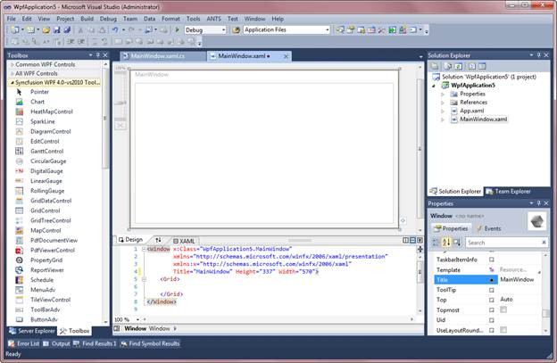
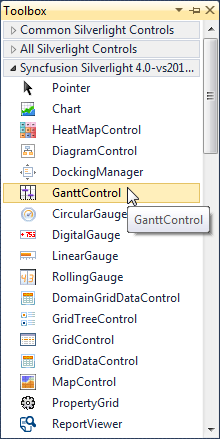
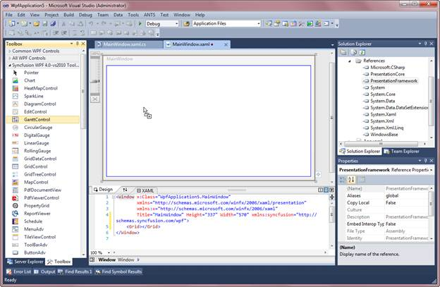
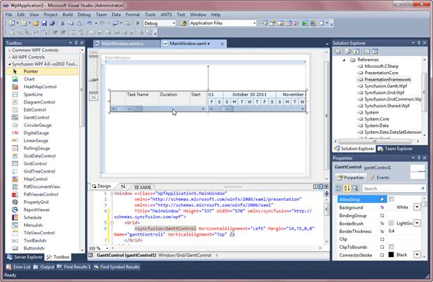

::: {style="DISPLAY: none"}
{#d2h_url_template}{#d2h_package_url style="WIDTH: 0px; DISPLAY: none; HEIGHT: 0px"}
:::

::::: {#nsbanner .d2h_main_nsbanner style="BORDER-BOTTOM: #999999 1px solid; POSITION: relative; PADDING-BOTTOM: 0px; BACKGROUND-COLOR: transparent; PADDING-LEFT: 0px; PADDING-RIGHT: 0px; DISPLAY: none; BORDER-TOP: #999999 1px solid; PADDING-TOP: 0px; LEFT: 0px"}
:::: {#TitleRow .d2h_main_titlerow style="PADDING-BOTTOM: 4px; BACKGROUND-COLOR: transparent; PADDING-LEFT: 22px; WIDTH: 100%; PADDING-RIGHT: 10px; DISPLAY: none; PADDING-TOP: 4px"}
::: {#ienav .d2h_main_ienav style="DISPLAY: none"}
{#D2HPrevious .D2HPreviousEnabled}  {#D2HNext .D2HNextEnabled}
:::
::::
:::::

:::: {#nstext .d2h_main_nstext style="PADDING-BOTTOM: 10px; BACKGROUND-COLOR: transparent; PADDING-LEFT: 22px; PADDING-RIGHT: 10px; HEIGHT: 100%; OVERFLOW: auto; PADDING-TOP: 5px" hasuserbackground="true" valign="bottom"}
::: {#d2h_breadcrumbs .d2h_breadcrumbs}
[Essential Studio User Guide Documentation](ms-xhelp:///?Id=12457748-09e3-4d74-a240-8e049cedf030){.d2h_breadcrumbsNormal}[ \> ]{.d2h_breadcrumbsLinkSeparator}[User Interface Edition](ms-xhelp:///?Id=c29296b7-531c-413b-a0ec-488ca1f7f669){.d2h_breadcrumbsNormal}[ \> ]{.d2h_breadcrumbsLinkSeparator}[Essential WPF](ms-xhelp:///?Id=7f4f82c5-151c-4262-94d0-75c4626c77bc){.d2h_breadcrumbsNormal}[ \> ]{.d2h_breadcrumbsLinkSeparator}[Essential Gantt]{.d2h_breadcrumbsContentsOnly}[ \> ]{.d2h_breadcrumbsLinkSeparator}[Getting Started](ms-xhelp:///?Id=dfba425a-3965-409a-9493-f0160f0ccf9e){.d2h_breadcrumbsNormal}[ \> ]{.d2h_breadcrumbsLinkSeparator}[Adding GanttControl to an Application](ms-xhelp:///?Id=f5b6068a-b21e-4c2f-a388-f08ac96e6f4b){.d2h_breadcrumbsNormal}
:::

### Adding GanttControl through Designer {#adding-ganttcontrol-through-designer style="tab-stops: 0pt"}

The following are the steps to create Gantt control through designer.

1.   Open the XAML page of the application.

 

{border="0"}

Figure 12: XAML Page

 

2.   Select **GanttControl** from ToolBox

 

[{border="0"}]{style="FONT-SIZE: 8pt"}

Figure 13: ToolBox

 

3.   Drag-and-drop the **GanttControl** to Designer View

{border="0"}

Figure 14: Dragged Gantt Control

 

4.   Gantt control is added to the window. Assembly reference will also be added to **Project** file.

{border="0"}

Figure 15: Added Gantt

 

5.   Now you can customize the properties of Gantt control in the Properties Window.

[]{style="FONT-FAMILY: 'Arial','sans-serif'"} 

[]{#related-topics}
::::
