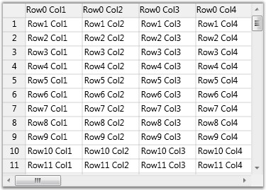

::: {style="DISPLAY: none"}
{#d2h_url_template}{#d2h_package_url style="WIDTH: 0px; DISPLAY: none; HEIGHT: 0px"}
:::

::::: {#nsbanner .d2h_main_nsbanner style="BORDER-BOTTOM: #999999 1px solid; POSITION: relative; PADDING-BOTTOM: 0px; BACKGROUND-COLOR: transparent; PADDING-LEFT: 0px; PADDING-RIGHT: 0px; DISPLAY: none; BORDER-TOP: #999999 1px solid; PADDING-TOP: 0px; LEFT: 0px"}
:::: {#TitleRow .d2h_main_titlerow style="PADDING-BOTTOM: 4px; BACKGROUND-COLOR: transparent; PADDING-LEFT: 22px; WIDTH: 100%; PADDING-RIGHT: 10px; DISPLAY: none; PADDING-TOP: 4px"}
::: {#ienav .d2h_main_ienav style="DISPLAY: none"}
{#D2HPrevious .D2HPreviousEnabled}  {#D2HNext .D2HNextEnabled}
:::
::::
:::::

:::: {#nstext .d2h_main_nstext style="PADDING-BOTTOM: 10px; BACKGROUND-COLOR: transparent; PADDING-LEFT: 22px; PADDING-RIGHT: 10px; HEIGHT: 100%; OVERFLOW: auto; PADDING-TOP: 5px" hasuserbackground="true" valign="bottom"}
::: {#d2h_breadcrumbs .d2h_breadcrumbs}
[Essential Studio User Guide Documentation](ms-xhelp:///?Id=12457748-09e3-4d74-a240-8e049cedf030){.d2h_breadcrumbsNormal}[ \> ]{.d2h_breadcrumbsLinkSeparator}[User Interface Edition](ms-xhelp:///?Id=c29296b7-531c-413b-a0ec-488ca1f7f669){.d2h_breadcrumbsNormal}[ \> ]{.d2h_breadcrumbsLinkSeparator}[Essential WPF](ms-xhelp:///?Id=7f4f82c5-151c-4262-94d0-75c4626c77bc){.d2h_breadcrumbsNormal}[ \> ]{.d2h_breadcrumbsLinkSeparator}[Essential Grid]{.d2h_breadcrumbsContentsOnly}[ \> ]{.d2h_breadcrumbsLinkSeparator}[Getting Started](ms-xhelp:///?Id=99894a49-7527-4c40-8048-00676aa25151){.d2h_breadcrumbsNormal}
:::

## Adding Grid Control to the Application {#adding-grid-control-to-the-application style="tab-stops: 0pt"}

Now that we have [[created a WPF application]{.UGHyperlink}](ms-xhelp:///?Id=fc1fdcb2-b7ba-4e8b-8d11-9876bb8f2b10) and we have seen the basic steps to be followed before adding our Grid controls.

**[]{style="COLOR: #15428b"}** 

In this section, we will see how to add a Grid control to the WPF application and load random data.

Step-by-step Procedure to Create a Grid Control and Load it with Sample Data.

 

1.   Host the grid inside a ScrollViewer element. Set the HorizontalScrollBarVisibility and VerticalScrollBarVisibility property values as follows:

 

+--------------------------------------------------------------------------------------------------------------------------------------------------------------------------------------------------------------------------------------------------------------------------------------------------------------------------------------------------------------------------------------------------------------------------------------------------------------------------------------------------------------------------------------------------------------------------------------------------------------------------------------------------------+
| [\[XAML\]]{style="FONT-FAMILY: 'Courier New'; COLOR: black"}                                                                                                                                                                                                                                                                                                                                                                                                                                                                                                                                                                                           |
|                                                                                                                                                                                                                                                                                                                                                                                                                                                                                                                                                                                                                                                        |
| []{style="FONT-FAMILY: 'Courier New'; COLOR: green"}                                                                                                                                                                                                                                                                                                                                                                                                                                                                                                                                                                                                   |
|                                                                                                                                                                                                                                                                                                                                                                                                                                                                                                                                                                                                                                                        |
| [\<]{style="FONT-FAMILY: 'Courier New'; COLOR: blue"}[ScrollViewer ]{style="FONT-FAMILY: 'Courier New'; COLOR: #a31515"}[CanContentScroll]{style="FONT-FAMILY: 'Courier New'; COLOR: red"}[=\"True\"]{style="FONT-FAMILY: 'Courier New'; COLOR: blue"}[ ]{style="FONT-FAMILY: 'Courier New'; COLOR: black"}[HorizontalScrollBarVisibility]{style="FONT-FAMILY: 'Courier New'; COLOR: red"}[=\"Auto\"]{style="FONT-FAMILY: 'Courier New'; COLOR: blue"}[ ]{style="FONT-FAMILY: 'Courier New'; COLOR: black"}[VerticalScrollBarVisibility]{style="FONT-FAMILY: 'Courier New'; COLOR: red"}[=\"Auto\"\>]{style="FONT-FAMILY: 'Courier New'; COLOR: blue"} |
|                                                                                                                                                                                                                                                                                                                                                                                                                                                                                                                                                                                                                                                        |
| [\<]{style="FONT-FAMILY: 'Courier New'; COLOR: blue"}[syncfusion:GridControl]{style="FONT-FAMILY: 'Courier New'; COLOR: #a31515"}[ ]{style="FONT-FAMILY: 'Courier New'; COLOR: black"}[x:Name]{style="FONT-FAMILY: 'Courier New'; COLOR: red"}[=\"grid\"/\>]{style="FONT-FAMILY: 'Courier New'; COLOR: blue"}                                                                                                                                                                                                                                                                                                                                          |
|                                                                                                                                                                                                                                                                                                                                                                                                                                                                                                                                                                                                                                                        |
| [\</]{style="FONT-FAMILY: 'Courier New'; COLOR: blue"}[ScrollViewer]{style="FONT-FAMILY: 'Courier New'; COLOR: #a31515"}[\>]{style="FONT-FAMILY: 'Courier New'; COLOR: blue"}                                                                                                                                                                                                                                                                                                                                                                                                                                                                          |
+--------------------------------------------------------------------------------------------------------------------------------------------------------------------------------------------------------------------------------------------------------------------------------------------------------------------------------------------------------------------------------------------------------------------------------------------------------------------------------------------------------------------------------------------------------------------------------------------------------------------------------------------------------+

[]{style="COLOR: black; FONT-SIZE: 8pt"} 

2.   Load random data into the Grid as follows:

 

+------------------------------------------------------------------------------------------------------------------------------------------------------------------------------------------------------------------------------------------------------------------------------------------------------------------------------------------------------------------------------------------------------------------------------------------------------------------------------+
| [\[C#\]]{style="FONT-FAMILY: 'Courier New'; COLOR: black"}                                                                                                                                                                                                                                                                                                                                                                                                                   |
|                                                                                                                                                                                                                                                                                                                                                                                                                                                                              |
| []{style="FONT-FAMILY: 'Courier New'; COLOR: green"}                                                                                                                                                                                                                                                                                                                                                                                                                         |
|                                                                                                                                                                                                                                                                                                                                                                                                                                                                              |
| [this]{style="FONT-FAMILY: 'Courier New'; COLOR: blue"}[.grid.AllowDragColumns = ]{style="FONT-FAMILY: 'Courier New'; COLOR: black"}[true]{style="FONT-FAMILY: 'Courier New'; COLOR: blue"}[;]{style="FONT-FAMILY: 'Courier New'; COLOR: black"}                                                                                                                                                                                                                             |
|                                                                                                                                                                                                                                                                                                                                                                                                                                                                              |
| [this]{style="FONT-FAMILY: 'Courier New'; COLOR: blue"}[.grid.Model.RowCount = 100;]{style="FONT-FAMILY: 'Courier New'; COLOR: black"}                                                                                                                                                                                                                                                                                                                                       |
|                                                                                                                                                                                                                                                                                                                                                                                                                                                                              |
| [this]{style="FONT-FAMILY: 'Courier New'; COLOR: blue"}[.grid.Model.ColumnCount = 20;]{style="FONT-FAMILY: 'Courier New'; COLOR: black"}                                                                                                                                                                                                                                                                                                                                     |
|                                                                                                                                                                                                                                                                                                                                                                                                                                                                              |
| [for]{style="FONT-FAMILY: 'Courier New'; COLOR: blue"}[ (]{style="FONT-FAMILY: 'Courier New'; COLOR: black"}[int]{style="FONT-FAMILY: 'Courier New'; COLOR: blue"}[ i = 0; i \< 100; i++)]{style="FONT-FAMILY: 'Courier New'; COLOR: black"}                                                                                                                                                                                                                                 |
|                                                                                                                                                                                                                                                                                                                                                                                                                                                                              |
| [{]{style="FONT-FAMILY: 'Courier New'; COLOR: black"}                                                                                                                                                                                                                                                                                                                                                                                                                        |
|                                                                                                                                                                                                                                                                                                                                                                                                                                                                              |
| [  ]{style="FONT-FAMILY: 'Courier New'; COLOR: black"}[for]{style="FONT-FAMILY: 'Courier New'; COLOR: blue"}[ (]{style="FONT-FAMILY: 'Courier New'; COLOR: black"}[int]{style="FONT-FAMILY: 'Courier New'; COLOR: blue"}[ j = 1; j \< 20; j++) ]{style="FONT-FAMILY: 'Courier New'; COLOR: black"}                                                                                                                                                                           |
|                                                                                                                                                                                                                                                                                                                                                                                                                                                                              |
| [  {]{style="FONT-FAMILY: 'Courier New'; COLOR: black"}                                                                                                                                                                                                                                                                                                                                                                                                                      |
|                                                                                                                                                                                                                                                                                                                                                                                                                                                                              |
| [    ]{style="FONT-FAMILY: 'Courier New'; COLOR: black"}[this]{style="FONT-FAMILY: 'Courier New'; COLOR: blue"}[.grid.Model\[i, j\].CellValue = ]{style="FONT-FAMILY: 'Courier New'; COLOR: black"}[string]{style="FONT-FAMILY: 'Courier New'; COLOR: blue"}[.Format(]{style="FONT-FAMILY: 'Courier New'; COLOR: black"}[\"Row{0} Col{1}\"]{style="FONT-FAMILY: 'Courier New'; COLOR: #a31515"}[, i, j);                 ]{style="FONT-FAMILY: 'Courier New'; COLOR: black"} |
|                                                                                                                                                                                                                                                                                                                                                                                                                                                                              |
| [  ]{style="FONT-FAMILY: 'Courier New'; COLOR: blue"}[}]{style="FONT-FAMILY: 'Courier New'; COLOR: black"}                                                                                                                                                                                                                                                                                                                                                                   |
|                                                                                                                                                                                                                                                                                                                                                                                                                                                                              |
| [}]{style="FONT-FAMILY: 'Courier New'; COLOR: black"}                                                                                                                                                                                                                                                                                                                                                                                                                        |
+------------------------------------------------------------------------------------------------------------------------------------------------------------------------------------------------------------------------------------------------------------------------------------------------------------------------------------------------------------------------------------------------------------------------------------------------------------------------------+

[]{style="COLOR: black; FONT-SIZE: 8pt"} 

3.   Run the application. Here is the output:

 

{border="0"}

Figure 6:  Output - Simple Grid

[]{style="COLOR: #15428b"} 

The preceding image shows a basic Grid control loaded with random data.

[]{#related-topics}
::::
