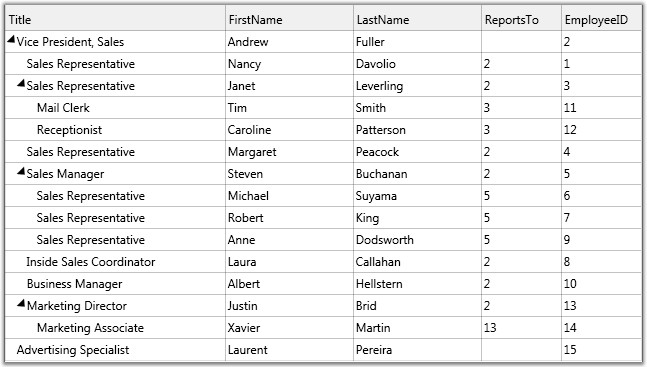

::: {style="DISPLAY: none"}
{#d2h_url_template}{#d2h_package_url style="WIDTH: 0px; DISPLAY: none; HEIGHT: 0px"}
:::

::::: {#nsbanner .d2h_main_nsbanner style="BORDER-BOTTOM: #999999 1px solid; POSITION: relative; PADDING-BOTTOM: 0px; BACKGROUND-COLOR: transparent; PADDING-LEFT: 0px; PADDING-RIGHT: 0px; DISPLAY: none; BORDER-TOP: #999999 1px solid; PADDING-TOP: 0px; LEFT: 0px"}
:::: {#TitleRow .d2h_main_titlerow style="PADDING-BOTTOM: 4px; BACKGROUND-COLOR: transparent; PADDING-LEFT: 22px; WIDTH: 100%; PADDING-RIGHT: 10px; DISPLAY: none; PADDING-TOP: 4px"}
::: {#ienav .d2h_main_ienav style="DISPLAY: none"}
{#D2HPrevious .D2HPreviousEnabled}  {#D2HNext .D2HNextEnabled}
:::
::::
:::::

::::: {#nstext .d2h_main_nstext style="PADDING-BOTTOM: 10px; BACKGROUND-COLOR: transparent; PADDING-LEFT: 22px; PADDING-RIGHT: 10px; HEIGHT: 100%; OVERFLOW: auto; PADDING-TOP: 5px" hasuserbackground="true" valign="bottom"}
::: {#d2h_breadcrumbs .d2h_breadcrumbs}
[Essential Studio User Guide Documentation](ms-xhelp:///?Id=12457748-09e3-4d74-a240-8e049cedf030){.d2h_breadcrumbsNormal}[ \> ]{.d2h_breadcrumbsLinkSeparator}[User Interface Edition](ms-xhelp:///?Id=c29296b7-531c-413b-a0ec-488ca1f7f669){.d2h_breadcrumbsNormal}[ \> ]{.d2h_breadcrumbsLinkSeparator}[Essential WPF](ms-xhelp:///?Id=7f4f82c5-151c-4262-94d0-75c4626c77bc){.d2h_breadcrumbsNormal}[ \> ]{.d2h_breadcrumbsLinkSeparator}[Essential Grid]{.d2h_breadcrumbsContentsOnly}[ \> ]{.d2h_breadcrumbsLinkSeparator}[Getting Started](ms-xhelp:///?Id=99894a49-7527-4c40-8048-00676aa25151){.d2h_breadcrumbsNormal}
:::

## Adding GridTree Control to the Application {#adding-gridtree-control-to-the-application style="tab-stops: 0pt"}

[]{#p12}[]{style="COLOR: #15428b"} 

Now that we have [[created a WPF application]{.UGHyperlink}](ms-xhelp:///?Id=137e357f-58c1-463b-9fb1-c42a058a7844) and we have seen the basic steps to be followed before adding our Grid controls.

 

In this section, we will see how to add a GridTree control to the WPF application and load data from the database. This grid requires the RequestTreeItems event to be handled in order to populate the data, where in the ParentItem property must be set to provide children.

**[]{style="COLOR: #15428b"}** 

RequestTreeItems Event

This event is handled to populate the GridTree control with child items for the corresponding parent items. This event will return a list of objects belonging to a particular node.

**[]{style="COLOR: #15428b"}** 

Step-by-step Procedure to Create a GridTree Control and Load it with Sample Data

The following steps will add a GridData control and load it with Northwind Customers table.

 

1.   Setup a data source. Here the data source is a Northwind Table:

**[]{style="COLOR: #15428b"}** 

{border="0"}

Figure 9:  Northwind Customers table

The preceding screen shot shows a sample data from the Northwind Customers table.

::: {style="BORDER-BOTTOM: windowtext 1pt solid; BORDER-LEFT: medium none; PADDING-BOTTOM: 1pt; MARGIN-TOP: 9pt; PADDING-LEFT: 0pt; PADDING-RIGHT: 0pt; MARGIN-BOTTOM: 9pt; BORDER-TOP: windowtext 1pt solid; BORDER-RIGHT: medium none; PADDING-TOP: 1pt"}
 

{border="0"}Note:  This table is available in your sample installation path:
:::

[]{style="COLOR: #15428b"} 

\...\\My Documents\\Syncfusion\\EssentialStudio\\\<Installed Version\>\\Common\\Data

[]{style="COLOR: #15428b"} 

2.   Connect to the data source using the below code.

 

+-----------------------------------------------------------------------------------------------------------------------------------------------------------------------------------------------------------------------------------------------------------------------------------------------------------+
| [\[C#\]]{style="FONT-FAMILY: 'Courier New'; COLOR: black"}                                                                                                                                                                                                                                                |
|                                                                                                                                                                                                                                                                                                           |
| []{style="FONT-FAMILY: 'Courier New'; COLOR: blue"}                                                                                                                                                                                                                                                       |
|                                                                                                                                                                                                                                                                                                           |
| [string]{style="FONT-FAMILY: 'Courier New'; COLOR: blue"}[ connectionString = [string]{style="COLOR: blue"}.Format([@\"Data Source = {0}\"]{style="COLOR: #a31515"}, [LayoutControl]{style="COLOR: #2b91af"}.FindFile([\"Northwind.sdf\"]{style="COLOR: #a31515"}));]{style="FONT-FAMILY: 'Courier New'"} |
|                                                                                                                                                                                                                                                                                                           |
| [Northwind]{style="FONT-FAMILY: 'Courier New'; COLOR: #2b91af"}[ nw = [new]{style="COLOR: blue"} [Northwind]{style="COLOR: #2b91af"}(connectionString);]{style="FONT-FAMILY: 'Courier New'"}                                                                                                              |
+-----------------------------------------------------------------------------------------------------------------------------------------------------------------------------------------------------------------------------------------------------------------------------------------------------------+

[]{style="COLOR: #15428b"} 

3.   Create a GridTree control and map the RequestTreeItems event as follows:

 

+------------------------------------------------------------------------------------------------------------------------------------------------------------------------------------------------------------------------------------------------------------------------------------------------------------------------------------------------------------------------------------------------------------------------------------------------------------------------------------------------------------------------------------------------------------------------------------------------------------------------------------------------------------------------------------------------------+
| [\[XAML\]]{style="FONT-FAMILY: 'Courier New'; COLOR: black"}                                                                                                                                                                                                                                                                                                                                                                                                                                                                                                                                                                                                                                         |
|                                                                                                                                                                                                                                                                                                                                                                                                                                                                                                                                                                                                                                                                                                      |
| []{style="FONT-FAMILY: 'Courier New'; COLOR: blue"}                                                                                                                                                                                                                                                                                                                                                                                                                                                                                                                                                                                                                                                  |
|                                                                                                                                                                                                                                                                                                                                                                                                                                                                                                                                                                                                                                                                                                      |
| [\<]{style="FONT-FAMILY: 'Courier New'; COLOR: blue"}[syncfusion]{style="FONT-FAMILY: 'Courier New'; COLOR: #a31515"}[:]{style="FONT-FAMILY: 'Courier New'; COLOR: blue"}[GridTreeControl]{style="FONT-FAMILY: 'Courier New'; COLOR: #a31515"}[ Name]{style="FONT-FAMILY: 'Courier New'; COLOR: red"}[=\"treeGrid\"]{style="FONT-FAMILY: 'Courier New'; COLOR: blue"}[ RequestTreeItems]{style="FONT-FAMILY: 'Courier New'; COLOR: red"}[=\"treeGrid_RequestTreeItems\"]{style="FONT-FAMILY: 'Courier New'; COLOR: blue"}[ EnableNodeSelection]{style="FONT-FAMILY: 'Courier New'; COLOR: red"}[=\"False\"]{style="FONT-FAMILY: 'Courier New'; COLOR: blue"}[  ]{style="FONT-FAMILY: 'Courier New'"} |
|                                                                                                                                                                                                                                                                                                                                                                                                                                                                                                                                                                                                                                                                                                      |
| [                                    [ PercentSizingBehavior]{style="COLOR: red"}[=\"SizeUntouchedColumns\" \>]{style="COLOR: blue"}[    ]{style="COLOR: #a31515"}]{style="FONT-FAMILY: 'Courier New'"}                                                                                                                                                                                                                                                                                                                                                                                                                                                                                              |
|                                                                                                                                                                                                                                                                                                                                                                                                                                                                                                                                                                                                                                                                                                      |
| [\<]{style="FONT-FAMILY: 'Courier New'; COLOR: blue"}[syncfusion]{style="FONT-FAMILY: 'Courier New'; COLOR: #a31515"}[:]{style="FONT-FAMILY: 'Courier New'; COLOR: blue"}[GridTreeControl.Columns]{style="FONT-FAMILY: 'Courier New'; COLOR: #a31515"}[\>]{style="FONT-FAMILY: 'Courier New'; COLOR: blue"}                                                                                                                                                                                                                                                                                                                                                                                          |
|                                                                                                                                                                                                                                                                                                                                                                                                                                                                                                                                                                                                                                                                                                      |
| [\<]{style="FONT-FAMILY: 'Courier New'; COLOR: blue"}[syncfusion]{style="FONT-FAMILY: 'Courier New'; COLOR: #a31515"}[:]{style="FONT-FAMILY: 'Courier New'; COLOR: blue"}[GridTreeColumn]{style="FONT-FAMILY: 'Courier New'; COLOR: #a31515"}[ MappingName]{style="FONT-FAMILY: 'Courier New'; COLOR: red"}[=\"Title\"]{style="FONT-FAMILY: 'Courier New'; COLOR: blue"}[ [ Width]{style="COLOR: red"}[=\"180\"/\>]{style="COLOR: blue"}]{style="FONT-FAMILY: 'Courier New'"}                                                                                                                                                                                                                        |
|                                                                                                                                                                                                                                                                                                                                                                                                                                                                                                                                                                                                                                                                                                      |
| [\<]{style="FONT-FAMILY: 'Courier New'; COLOR: blue"}[syncfusion]{style="FONT-FAMILY: 'Courier New'; COLOR: #a31515"}[:]{style="FONT-FAMILY: 'Courier New'; COLOR: blue"}[GridTreeColumn]{style="FONT-FAMILY: 'Courier New'; COLOR: #a31515"}[ MappingName]{style="FONT-FAMILY: 'Courier New'; COLOR: red"}[=\"FirstName\"]{style="FONT-FAMILY: 'Courier New'; COLOR: blue"}[ PercentWidth]{style="FONT-FAMILY: 'Courier New'; COLOR: red"}[=\"1\"/\>]{style="FONT-FAMILY: 'Courier New'; COLOR: blue"}                                                                                                                                                                                              |
|                                                                                                                                                                                                                                                                                                                                                                                                                                                                                                                                                                                                                                                                                                      |
| [\<]{style="FONT-FAMILY: 'Courier New'; COLOR: blue"}[syncfusion]{style="FONT-FAMILY: 'Courier New'; COLOR: #a31515"}[:]{style="FONT-FAMILY: 'Courier New'; COLOR: blue"}[GridTreeColumn]{style="FONT-FAMILY: 'Courier New'; COLOR: #a31515"}[ MappingName]{style="FONT-FAMILY: 'Courier New'; COLOR: red"}[=\"LastName\"]{style="FONT-FAMILY: 'Courier New'; COLOR: blue"}[ PercentWidth]{style="FONT-FAMILY: 'Courier New'; COLOR: red"}[=\"1\"/\>]{style="FONT-FAMILY: 'Courier New'; COLOR: blue"}                                                                                                                                                                                               |
|                                                                                                                                                                                                                                                                                                                                                                                                                                                                                                                                                                                                                                                                                                      |
| [\<]{style="FONT-FAMILY: 'Courier New'; COLOR: blue"}[syncfusion]{style="FONT-FAMILY: 'Courier New'; COLOR: #a31515"}[:]{style="FONT-FAMILY: 'Courier New'; COLOR: blue"}[GridTreeColumn]{style="FONT-FAMILY: 'Courier New'; COLOR: #a31515"}[ MappingName]{style="FONT-FAMILY: 'Courier New'; COLOR: red"}[=\"ReportsTo\" /\>]{style="FONT-FAMILY: 'Courier New'; COLOR: blue"}                                                                                                                                                                                                                                                                                                                     |
|                                                                                                                                                                                                                                                                                                                                                                                                                                                                                                                                                                                                                                                                                                      |
| [\<]{style="FONT-FAMILY: 'Courier New'; COLOR: blue"}[syncfusion]{style="FONT-FAMILY: 'Courier New'; COLOR: #a31515"}[:]{style="FONT-FAMILY: 'Courier New'; COLOR: blue"}[GridTreeColumn]{style="FONT-FAMILY: 'Courier New'; COLOR: #a31515"}[ MappingName]{style="FONT-FAMILY: 'Courier New'; COLOR: red"}[=\"EmployeeID\" /\>]{style="FONT-FAMILY: 'Courier New'; COLOR: blue"}                                                                                                                                                                                                                                                                                                                    |
|                                                                                                                                                                                                                                                                                                                                                                                                                                                                                                                                                                                                                                                                                                      |
| [\</]{style="FONT-FAMILY: 'Courier New'; COLOR: blue"}[syncfusion]{style="FONT-FAMILY: 'Courier New'; COLOR: #a31515"}[:]{style="FONT-FAMILY: 'Courier New'; COLOR: blue"}[GridTreeControl.Columns]{style="FONT-FAMILY: 'Courier New'; COLOR: #a31515"}[\>]{style="FONT-FAMILY: 'Courier New'; COLOR: blue"}[ ]{style="FONT-FAMILY: 'Courier New'; COLOR: #a31515"}                                                                                                                                                                                                                                                                                                                                  |
|                                                                                                                                                                                                                                                                                                                                                                                                                                                                                                                                                                                                                                                                                                      |
| [\</]{style="FONT-FAMILY: 'Courier New'; COLOR: blue"}[syncfusion]{style="FONT-FAMILY: 'Courier New'; COLOR: #a31515"}[:]{style="FONT-FAMILY: 'Courier New'; COLOR: blue"}[GridTreeControl]{style="FONT-FAMILY: 'Courier New'; COLOR: #a31515"}[\>]{style="FONT-FAMILY: 'Courier New'; COLOR: blue"}                                                                                                                                                                                                                                                                                                                                                                                                 |
+------------------------------------------------------------------------------------------------------------------------------------------------------------------------------------------------------------------------------------------------------------------------------------------------------------------------------------------------------------------------------------------------------------------------------------------------------------------------------------------------------------------------------------------------------------------------------------------------------------------------------------------------------------------------------------------------------+

[]{style="COLOR: #15428b"} 

4.   Handle RequestTreeItems event to populate the grid.

 

+----------------------------------------------------------------------------------------------------------------------------------------------------------------------------------------------------------------------------------------------------------------+
| [\[C#\]]{style="FONT-FAMILY: 'Courier New'; COLOR: black"}                                                                                                                                                                                                     |
|                                                                                                                                                                                                                                                                |
| []{style="FONT-FAMILY: 'Courier New'; COLOR: blue"}                                                                                                                                                                                                            |
|                                                                                                                                                                                                                                                                |
| [private]{style="FONT-FAMILY: 'Courier New'; COLOR: blue"}[ [void]{style="COLOR: blue"} treeGrid_RequestTreeItems([object]{style="COLOR: blue"} sender, [GridTreeRequestTreeItemsEventArgs]{style="COLOR: #2b91af"} args)]{style="FONT-FAMILY: 'Courier New'"} |
|                                                                                                                                                                                                                                                                |
| [        {]{style="FONT-FAMILY: 'Courier New'"}                                                                                                                                                                                                                |
|                                                                                                                                                                                                                                                                |
| [            [//When ParentItem is null, you need to set args.ChildList to be the root items\...]{style="COLOR: green"}]{style="FONT-FAMILY: 'Courier New'"}                                                                                                   |
|                                                                                                                                                                                                                                                                |
| [            [if]{style="COLOR: blue"} (args.ParentItem == [null]{style="COLOR: blue"})]{style="FONT-FAMILY: 'Courier New'"}                                                                                                                                   |
|                                                                                                                                                                                                                                                                |
| [            {]{style="FONT-FAMILY: 'Courier New'"}                                                                                                                                                                                                            |
|                                                                                                                                                                                                                                                                |
| [                [//get the root list - get all employees who have no boss ]{style="COLOR: green"}]{style="FONT-FAMILY: 'Courier New'"}                                                                                                                        |
|                                                                                                                                                                                                                                                                |
| [                args.ChildList = nw.Employees.Where(employee =\> (!employee.ReportsTo.HasValue)); [//get all employees who has no boss)]{style="COLOR: green"}]{style="FONT-FAMILY: 'Courier New'"}                                                           |
|                                                                                                                                                                                                                                                                |
| [               ]{style="FONT-FAMILY: 'Courier New'"}                                                                                                                                                                                                          |
|                                                                                                                                                                                                                                                                |
| [            }]{style="FONT-FAMILY: 'Courier New'"}                                                                                                                                                                                                            |
|                                                                                                                                                                                                                                                                |
| [            [else]{style="COLOR: blue"} [//if ParentItem not null, then set args.ChildList to the child items for the given ParentItem.]{style="COLOR: green"}]{style="FONT-FAMILY: 'Courier New'"}                                                           |
|                                                                                                                                                                                                                                                                |
| [            {   [//get the children of the parent object]{style="COLOR: green"}]{style="FONT-FAMILY: 'Courier New'"}                                                                                                                                          |
|                                                                                                                                                                                                                                                                |
| [                [Employees]{style="COLOR: #2b91af"} emp = args.ParentItem [as]{style="COLOR: blue"} [Employees]{style="COLOR: #2b91af"};]{style="FONT-FAMILY: 'Courier New'"}                                                                                 |
|                                                                                                                                                                                                                                                                |
| [                [if]{style="COLOR: blue"} (emp != [null]{style="COLOR: blue"})]{style="FONT-FAMILY: 'Courier New'"}                                                                                                                                           |
|                                                                                                                                                                                                                                                                |
| [                {]{style="FONT-FAMILY: 'Courier New'"}                                                                                                                                                                                                        |
|                                                                                                                                                                                                                                                                |
| [                    [//get all employees that report to the parent employee]{style="COLOR: green"}]{style="FONT-FAMILY: 'Courier New'"}                                                                                                                       |
|                                                                                                                                                                                                                                                                |
| [                    args.ChildList = nw.Employees.Where(employee =\> employee.ReportsTo == emp.EmployeeID);]{style="FONT-FAMILY: 'Courier New'"}                                                                                                              |
|                                                                                                                                                                                                                                                                |
| [                }]{style="FONT-FAMILY: 'Courier New'"}                                                                                                                                                                                                        |
|                                                                                                                                                                                                                                                                |
| [            }]{style="FONT-FAMILY: 'Courier New'"}                                                                                                                                                                                                            |
|                                                                                                                                                                                                                                                                |
| [        }]{style="FONT-FAMILY: 'Courier New'"}                                                                                                                                                                                                                |
+----------------------------------------------------------------------------------------------------------------------------------------------------------------------------------------------------------------------------------------------------------------+

[]{style="COLOR: #15428b"} 

5.   Run the application.

 

{border="0"}

Figure 10: Output---Simple GridTree Control

[]{style="COLOR: #15428b"} 

The preceding screen shot shows a basic GridTree control loaded with Northwind Customer table data by handing RequestTreeItems event.

[]{#related-topics}
:::::
