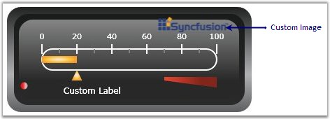

::: {style="DISPLAY: none"}
{#d2h_url_template}{#d2h_package_url style="WIDTH: 0px; DISPLAY: none; HEIGHT: 0px"}
:::

::: {.d2h_secondary_topic style="PADDING-BOTTOM: 10pt; MARGIN: 0pt; PADDING-LEFT: 0pt; PADDING-RIGHT: 0pt; PADDING-TOP: 0pt"}
##### Adding Images to the Linear Gauge {#adding-images-to-the-linear-gauge style="tab-stops: 0pt"}

[]{style="FONT-FAMILY: 'Trebuchet MS','sans-serif'; COLOR: #15428b; FONT-SIZE: 9pt"} 

Essential Gauge Silverlight provides support to add images to the Linear Gauge. The following properties enable to customize an image added to the Linear Gauge.

[]{style="FONT-FAMILY: 'Trebuchet MS','sans-serif'; COLOR: #15428b; FONT-SIZE: 9pt"} 

[·      ]{style="FONT-FAMILY: Symbol"}**ImageWidth**: specifies the width of the image

[·      ]{style="FONT-FAMILY: Symbol"}**ImageHeight**: specifies the height of the image

[·      ]{style="FONT-FAMILY: Symbol"}**ImageSource**: specifies the source for the image

[]{style="FONT-FAMILY: 'Trebuchet MS','sans-serif'; COLOR: #15428b; FONT-SIZE: 9pt"} 

The following code example illustrates how to set these properties.

[]{style="FONT-FAMILY: 'Trebuchet MS','sans-serif'; COLOR: #15428b; FONT-SIZE: 9pt"} 

+----------------------------------------------------------------------------------------------------------------------------------------------------------------------------------------------------------------------------------------------------------------------------------------------------------------------------------------------------------------------------------------------------------------------------------------------------------------------------------------------------------------------------------------------------------------------------------------------------------------------------------------------------------------------------------------------------------------------------------------------------------------------------------------------------------------------------------------------------------------------------------------+
| **[\[XAML\]]{style="FONT-FAMILY: 'Courier New'; COLOR: black"}**                                                                                                                                                                                                                                                                                                                                                                                                                                                                                                                                                                                                                                                                                                                                                                                                                       |
|                                                                                                                                                                                                                                                                                                                                                                                                                                                                                                                                                                                                                                                                                                                                                                                                                                                                                        |
| []{style="FONT-FAMILY: 'Courier New'; COLOR: black; FONT-SIZE: 9pt"}                                                                                                                                                                                                                                                                                                                                                                                                                                                                                                                                                                                                                                                                                                                                                                                                                   |
|                                                                                                                                                                                                                                                                                                                                                                                                                                                                                                                                                                                                                                                                                                                                                                                                                                                                                        |
| [\<]{style="FONT-FAMILY: 'Courier New'; COLOR: blue; FONT-SIZE: 9pt"}[syncfusion]{style="FONT-FAMILY: 'Courier New'; COLOR: #a31515; FONT-SIZE: 9pt"}[:]{style="FONT-FAMILY: 'Courier New'; COLOR: blue; FONT-SIZE: 9pt"}[LinearGauge.Images]{style="FONT-FAMILY: 'Courier New'; COLOR: #a31515; FONT-SIZE: 9pt"}[\>]{style="FONT-FAMILY: 'Courier New'; COLOR: blue; FONT-SIZE: 9pt"}                                                                                                                                                                                                                                                                                                                                                                                                                                                                                                 |
|                                                                                                                                                                                                                                                                                                                                                                                                                                                                                                                                                                                                                                                                                                                                                                                                                                                                                        |
| [    ]{style="FONT-FAMILY: 'Courier New'; COLOR: #a31515; FONT-SIZE: 9pt"}[\<]{style="FONT-FAMILY: 'Courier New'; COLOR: blue; FONT-SIZE: 9pt"}[syncfusion]{style="FONT-FAMILY: 'Courier New'; COLOR: #a31515; FONT-SIZE: 9pt"}[:]{style="FONT-FAMILY: 'Courier New'; COLOR: blue; FONT-SIZE: 9pt"}[GaugeImage]{style="FONT-FAMILY: 'Courier New'; COLOR: #a31515; FONT-SIZE: 9pt"}[ ImageSource]{style="FONT-FAMILY: 'Courier New'; COLOR: red; FONT-SIZE: 9pt"}[=\"Image/synclogo.png\"]{style="FONT-FAMILY: 'Courier New'; COLOR: blue; FONT-SIZE: 9pt"}[ [Location]{style="COLOR: red"}[=\"20,25\"]{style="COLOR: blue"}[ ImageHeight]{style="COLOR: red"}[=\"30\"]{style="COLOR: blue"}[ ImageWidth]{style="COLOR: red"}[=\"110\"]{style="COLOR: blue"}[ ResizeMode]{style="COLOR: red"}[=\"None\" /\>]{style="COLOR: blue"}]{style="FONT-FAMILY: 'Courier New'; FONT-SIZE: 9pt"} |
|                                                                                                                                                                                                                                                                                                                                                                                                                                                                                                                                                                                                                                                                                                                                                                                                                                                                                        |
| [\</]{style="FONT-FAMILY: 'Courier New'; COLOR: blue; FONT-SIZE: 9pt"}[syncfusion]{style="FONT-FAMILY: 'Courier New'; COLOR: #a31515; FONT-SIZE: 9pt"}[:]{style="FONT-FAMILY: 'Courier New'; COLOR: blue; FONT-SIZE: 9pt"}[LinearGauge.Images]{style="FONT-FAMILY: 'Courier New'; COLOR: #a31515; FONT-SIZE: 9pt"}[\>]{style="FONT-FAMILY: 'Courier New'; COLOR: blue; FONT-SIZE: 9pt"}                                                                                                                                                                                                                                                                                                                                                                                                                                                                                                |
+----------------------------------------------------------------------------------------------------------------------------------------------------------------------------------------------------------------------------------------------------------------------------------------------------------------------------------------------------------------------------------------------------------------------------------------------------------------------------------------------------------------------------------------------------------------------------------------------------------------------------------------------------------------------------------------------------------------------------------------------------------------------------------------------------------------------------------------------------------------------------------------+

[]{style="FONT-FAMILY: 'Trebuchet MS','sans-serif'; COLOR: #15428b; FONT-SIZE: 9pt"} 

+-----------------------------------------------------------------------------------------------------------------------------------------------------------------------------------------------------------------------------------------------------------------------------------------------+
| **[\[C#\]]{style="FONT-FAMILY: 'Courier New'; COLOR: black"}**                                                                                                                                                                                                                                |
|                                                                                                                                                                                                                                                                                               |
| []{style="FONT-FAMILY: 'Courier New'; COLOR: black; FONT-SIZE: 9pt"}                                                                                                                                                                                                                          |
|                                                                                                                                                                                                                                                                                               |
| [GaugeImage]{style="FONT-FAMILY: 'Courier New'; COLOR: #2b91af; FONT-SIZE: 9pt"}[ gaugeImage = [new]{style="COLOR: blue"} [GaugeImage]{style="COLOR: #2b91af"}();]{style="FONT-FAMILY: 'Courier New'; FONT-SIZE: 9pt"}                                                                        |
|                                                                                                                                                                                                                                                                                               |
| [Uri]{style="FONT-FAMILY: 'Courier New'; COLOR: #2b91af; FONT-SIZE: 9pt"}[ uri = [new]{style="COLOR: blue"} [Uri]{style="COLOR: #2b91af"}([\"Image/synclogo.png\"]{style="COLOR: #a31515"}, [UriKind]{style="COLOR: #2b91af"}.Relative);]{style="FONT-FAMILY: 'Courier New'; FONT-SIZE: 9pt"} |
|                                                                                                                                                                                                                                                                                               |
| [gaugeImage.ImageSource = [new]{style="COLOR: blue"} BitmapImage(uri);]{style="FONT-FAMILY: 'Courier New'; FONT-SIZE: 9pt"}                                                                                                                                                                   |
|                                                                                                                                                                                                                                                                                               |
| [gaugeImage.ImageWidth = 80;]{style="FONT-FAMILY: 'Courier New'; FONT-SIZE: 9pt"}                                                                                                                                                                                                             |
|                                                                                                                                                                                                                                                                                               |
| [gaugeImage.ImageHeight = 20;]{style="FONT-FAMILY: 'Courier New'; FONT-SIZE: 9pt"}                                                                                                                                                                                                            |
|                                                                                                                                                                                                                                                                                               |
| [gaugeImage.Location = [new]{style="COLOR: blue"} [Point]{style="COLOR: #2b91af"}(15, 20);]{style="FONT-FAMILY: 'Courier New'; FONT-SIZE: 9pt"}                                                                                                                                               |
|                                                                                                                                                                                                                                                                                               |
| [lineargauge.Images.Add(gaugeImage);]{style="FONT-FAMILY: 'Courier New'; FONT-SIZE: 9pt"}                                                                                                                                                                                                     |
+-----------------------------------------------------------------------------------------------------------------------------------------------------------------------------------------------------------------------------------------------------------------------------------------------+

[]{style="FONT-FAMILY: 'Trebuchet MS','sans-serif'; COLOR: #15428b; FONT-SIZE: 9pt"} 

{border="0"}

[]{style="FONT-FAMILY: 'Trebuchet MS','sans-serif'; COLOR: #15428b; FONT-SIZE: 9pt"} 

Figure 91: Custom Image added to the Linear Gauge

 

[]{#p89} 

 

[]{#related-topics}
:::
