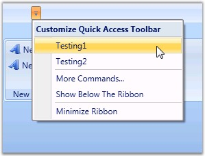

::: {style="DISPLAY: none"}
{#d2h_url_template}{#d2h_package_url style="WIDTH: 0px; DISPLAY: none; HEIGHT: 0px"}
:::

::: {.d2h_secondary_topic style="PADDING-BOTTOM: 10pt; MARGIN: 0pt; PADDING-LEFT: 0pt; PADDING-RIGHT: 0pt; PADDING-TOP: 0pt"}
#### Adding Items to Drop-Down Menu of the Quick Access Toolbar {#adding-items-to-drop-down-menu-of-the-quick-access-toolbar style="tab-stops: 0pt"}

[]{style="FONT-FAMILY: 'Trebuchet MS','sans-serif'; COLOR: #15428b; FONT-SIZE: 9pt"} 

You can add items to the drop-down menu of the Quick Access Toolbar by using the QATMenuItems property of the the QuickAccessToolbar. The following code example illustrates how to add items to the drop-down menu of the Quick Access Toolbar by using this property.

[]{style="FONT-FAMILY: 'Trebuchet MS','sans-serif'; COLOR: #15428b; FONT-SIZE: 9pt"} 

+-------------------------------------------------------------------------------------------------------------------------------------------------------------------------------------------------------------------------------------------------------------------------------------------------------------------------------------------------------------------------------------------------------------------------------------------------------------------------------------------------------------------------------------------------------+
| **[\[XAML\]]{style="FONT-FAMILY: 'Courier New'; COLOR: black"}**                                                                                                                                                                                                                                                                                                                                                                                                                                                                                      |
|                                                                                                                                                                                                                                                                                                                                                                                                                                                                                                                                                       |
| []{style="FONT-FAMILY: 'Courier New'; COLOR: black; FONT-SIZE: 9pt"}                                                                                                                                                                                                                                                                                                                                                                                                                                                                                  |
|                                                                                                                                                                                                                                                                                                                                                                                                                                                                                                                                                       |
| [\<]{style="FONT-FAMILY: 'Courier New'; COLOR: blue; FONT-SIZE: 9pt"}[syncfusion]{style="FONT-FAMILY: 'Courier New'; COLOR: #a31515; FONT-SIZE: 9pt"}[:]{style="FONT-FAMILY: 'Courier New'; COLOR: blue; FONT-SIZE: 9pt"}[Ribbon.QuickAccessToolBar]{style="FONT-FAMILY: 'Courier New'; COLOR: #a31515; FONT-SIZE: 9pt"}[\>]{style="FONT-FAMILY: 'Courier New'; COLOR: blue; FONT-SIZE: 9pt"}                                                                                                                                                         |
|                                                                                                                                                                                                                                                                                                                                                                                                                                                                                                                                                       |
| [\<]{style="FONT-FAMILY: 'Courier New'; COLOR: blue; FONT-SIZE: 9pt"}[syncfusion]{style="FONT-FAMILY: 'Courier New'; COLOR: #a31515; FONT-SIZE: 9pt"}[:]{style="FONT-FAMILY: 'Courier New'; COLOR: blue; FONT-SIZE: 9pt"}[QuickAccessToolBar]{style="FONT-FAMILY: 'Courier New'; COLOR: #a31515; FONT-SIZE: 9pt"}[\>]{style="FONT-FAMILY: 'Courier New'; COLOR: blue; FONT-SIZE: 9pt"}                                                                                                                                                                |
|                                                                                                                                                                                                                                                                                                                                                                                                                                                                                                                                                       |
| [    ]{style="FONT-FAMILY: 'Courier New'; COLOR: #a31515; FONT-SIZE: 9pt"}[\<]{style="FONT-FAMILY: 'Courier New'; COLOR: blue; FONT-SIZE: 9pt"}[syncfusion]{style="FONT-FAMILY: 'Courier New'; COLOR: #a31515; FONT-SIZE: 9pt"}[:]{style="FONT-FAMILY: 'Courier New'; COLOR: blue; FONT-SIZE: 9pt"}[QuickAccessToolBar.QATMenuItems]{style="FONT-FAMILY: 'Courier New'; COLOR: #a31515; FONT-SIZE: 9pt"}[\>]{style="FONT-FAMILY: 'Courier New'; COLOR: blue; FONT-SIZE: 9pt"}                                                                         |
|                                                                                                                                                                                                                                                                                                                                                                                                                                                                                                                                                       |
| [        ]{style="FONT-FAMILY: 'Courier New'; COLOR: #a31515; FONT-SIZE: 9pt"}[\<]{style="FONT-FAMILY: 'Courier New'; COLOR: blue; FONT-SIZE: 9pt"}[syncfusion]{style="FONT-FAMILY: 'Courier New'; COLOR: #a31515; FONT-SIZE: 9pt"}[:]{style="FONT-FAMILY: 'Courier New'; COLOR: blue; FONT-SIZE: 9pt"}[RibbonButton]{style="FONT-FAMILY: 'Courier New'; COLOR: #a31515; FONT-SIZE: 9pt"}[ Label]{style="FONT-FAMILY: 'Courier New'; COLOR: red; FONT-SIZE: 9pt"}[=\"Testing1\" /\>]{style="FONT-FAMILY: 'Courier New'; COLOR: blue; FONT-SIZE: 9pt"} |
|                                                                                                                                                                                                                                                                                                                                                                                                                                                                                                                                                       |
| [        ]{style="FONT-FAMILY: 'Courier New'; COLOR: #a31515; FONT-SIZE: 9pt"}[\<]{style="FONT-FAMILY: 'Courier New'; COLOR: blue; FONT-SIZE: 9pt"}[syncfusion]{style="FONT-FAMILY: 'Courier New'; COLOR: #a31515; FONT-SIZE: 9pt"}[:]{style="FONT-FAMILY: 'Courier New'; COLOR: blue; FONT-SIZE: 9pt"}[RibbonButton]{style="FONT-FAMILY: 'Courier New'; COLOR: #a31515; FONT-SIZE: 9pt"}[ Label]{style="FONT-FAMILY: 'Courier New'; COLOR: red; FONT-SIZE: 9pt"}[=\"Testing2\" /\>]{style="FONT-FAMILY: 'Courier New'; COLOR: blue; FONT-SIZE: 9pt"} |
|                                                                                                                                                                                                                                                                                                                                                                                                                                                                                                                                                       |
| [    ]{style="FONT-FAMILY: 'Courier New'; COLOR: #a31515; FONT-SIZE: 9pt"}[\</]{style="FONT-FAMILY: 'Courier New'; COLOR: blue; FONT-SIZE: 9pt"}[syncfusion]{style="FONT-FAMILY: 'Courier New'; COLOR: #a31515; FONT-SIZE: 9pt"}[:]{style="FONT-FAMILY: 'Courier New'; COLOR: blue; FONT-SIZE: 9pt"}[QuickAccessToolBar.QATMenuItems]{style="FONT-FAMILY: 'Courier New'; COLOR: #a31515; FONT-SIZE: 9pt"}[\>]{style="FONT-FAMILY: 'Courier New'; COLOR: blue; FONT-SIZE: 9pt"}                                                                        |
|                                                                                                                                                                                                                                                                                                                                                                                                                                                                                                                                                       |
| [\</]{style="FONT-FAMILY: 'Courier New'; COLOR: blue; FONT-SIZE: 9pt"}[syncfusion]{style="FONT-FAMILY: 'Courier New'; COLOR: #a31515; FONT-SIZE: 9pt"}[:]{style="FONT-FAMILY: 'Courier New'; COLOR: blue; FONT-SIZE: 9pt"}[QuickAccessToolBar]{style="FONT-FAMILY: 'Courier New'; COLOR: #a31515; FONT-SIZE: 9pt"}[\>]{style="FONT-FAMILY: 'Courier New'; COLOR: blue; FONT-SIZE: 9pt"}                                                                                                                                                               |
+-------------------------------------------------------------------------------------------------------------------------------------------------------------------------------------------------------------------------------------------------------------------------------------------------------------------------------------------------------------------------------------------------------------------------------------------------------------------------------------------------------------------------------------------------------+

[]{style="FONT-FAMILY: 'Trebuchet MS','sans-serif'; COLOR: #15428b; FONT-SIZE: 9pt"} 

You can also dynamically add items to the drop-down menu of the Quick Access Toolbar by using the Add method of the the QATMenuItems. The following code example illustrates how to add items to the drop-down menu of the Quick Access Toolbar by using this method.

[]{style="FONT-FAMILY: 'Trebuchet MS','sans-serif'; COLOR: #15428b; FONT-SIZE: 9pt"} 

+-------------------------------------------------------------------------------------------------------------------------------------------------------------------------------------------------------------------------+
| **[\[C#\]]{style="FONT-FAMILY: 'Courier New'; COLOR: black"}**                                                                                                                                                          |
|                                                                                                                                                                                                                         |
| []{style="FONT-FAMILY: 'Trebuchet MS','sans-serif'; COLOR: #15428b; FONT-SIZE: 9pt"}                                                                                                                                    |
|                                                                                                                                                                                                                         |
| [RibbonButton]{style="FONT-FAMILY: 'Courier New'; COLOR: #2b91af; FONT-SIZE: 9pt"}[ button1 = [new]{style="COLOR: blue"} [RibbonButton]{style="COLOR: #2b91af"}();]{style="FONT-FAMILY: 'Courier New'; FONT-SIZE: 9pt"} |
|                                                                                                                                                                                                                         |
| [button1.Label = [\"Testing1\"]{style="COLOR: #a31515"};]{style="FONT-FAMILY: 'Courier New'; FONT-SIZE: 9pt"}                                                                                                           |
|                                                                                                                                                                                                                         |
| []{style="FONT-FAMILY: 'Courier New'; FONT-SIZE: 9pt"}                                                                                                                                                                  |
|                                                                                                                                                                                                                         |
| [RibbonButton]{style="FONT-FAMILY: 'Courier New'; COLOR: #2b91af; FONT-SIZE: 9pt"}[ button2 = [new]{style="COLOR: blue"} [RibbonButton]{style="COLOR: #2b91af"}();]{style="FONT-FAMILY: 'Courier New'; FONT-SIZE: 9pt"} |
|                                                                                                                                                                                                                         |
| [button2.Label = [\"Testing2\"]{style="COLOR: #a31515"};]{style="FONT-FAMILY: 'Courier New'; FONT-SIZE: 9pt"}                                                                                                           |
|                                                                                                                                                                                                                         |
| []{style="FONT-FAMILY: 'Courier New'; FONT-SIZE: 9pt"}                                                                                                                                                                  |
|                                                                                                                                                                                                                         |
| [this]{style="FONT-FAMILY: 'Courier New'; COLOR: blue; FONT-SIZE: 9pt"}[.ribbon1.QuickAccessToolBar.QATMenuItems.Add(button1);]{style="FONT-FAMILY: 'Courier New'; FONT-SIZE: 9pt"}                                     |
|                                                                                                                                                                                                                         |
| [this]{style="FONT-FAMILY: 'Courier New'; COLOR: blue; FONT-SIZE: 9pt"}[.ribbon1.QuickAccessToolBar.QATMenuItems.Add(button2);]{style="FONT-FAMILY: 'Courier New'; FONT-SIZE: 9pt"}                                     |
+-------------------------------------------------------------------------------------------------------------------------------------------------------------------------------------------------------------------------+

[]{style="FONT-FAMILY: 'Trebuchet MS','sans-serif'; COLOR: #15428b; FONT-SIZE: 9pt"} 

{border="0"}

[]{style="FONT-FAMILY: 'Trebuchet MS','sans-serif'; COLOR: #15428b; FONT-SIZE: 9pt"} 

Figure 847: Items Added to the Drop-Down Menu of the Quick Access Toolbar

[]{style="FONT-FAMILY: 'Trebuchet MS','sans-serif'; COLOR: #15428b; FONT-SIZE: 9pt"} 

See Also

[]{style="FONT-FAMILY: 'Trebuchet MS','sans-serif'; COLOR: #15428b; FONT-SIZE: 9pt"} 

[[Quick Access Toolbar]{.UGHyperlink}](ms-xhelp:///?Id=5d1d7bac-b474-45bc-a5e0-868ecf74a7d7)[]{.UGHyperlink}

 

[]{#p446} 

[]{#related-topics}
:::
