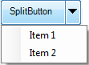
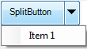

::: {style="DISPLAY: none"}
{#d2h_url_template}{#d2h_package_url style="WIDTH: 0px; DISPLAY: none; HEIGHT: 0px"}
:::

::: {.d2h_secondary_topic style="PADDING-BOTTOM: 10pt; MARGIN: 0pt; PADDING-LEFT: 0pt; PADDING-RIGHT: 0pt; PADDING-TOP: 0pt"}
#### Adding Item to Drop-down {#adding-item-to-drop-down style="tab-stops: 0pt"}

 

This feature enables you to add items to the SplitButton drop-down list.

[]{style="COLOR: #c00000"} 

You can add item using the *DropDownItems* property. The following code illustrates how to add items to the drop-down list:

 

+-----------------------------------------------------------------------------------------------------------------------------------------------------+
| [\[C#\]]{style="FONT-FAMILY: 'Times New Roman','serif'; FONT-SIZE: 12pt"}                                                                           |
|                                                                                                                                                     |
| [            [this]{style="COLOR: blue"}.splitButton1.DropDownItems.Add([\"Item 1\"]{style="COLOR: #a31515"});]{style="FONT-FAMILY: 'Courier New'"} |
|                                                                                                                                                     |
| [            [this]{style="COLOR: blue"}.splitButton1.DropDownItems.Add([\"Item 2\"]{style="COLOR: #a31515"});]{style="FONT-FAMILY: 'Courier New'"} |
|                                                                                                                                                     |
| [            ]{style="FONT-FAMILY: 'Courier New'"}                                                                                                  |
+-----------------------------------------------------------------------------------------------------------------------------------------------------+

 

+-------------------------------------------------------------------------------------------------------------------------------------------------+
| [\[VB\]]{style="FONT-FAMILY: 'Times New Roman','serif'; FONT-SIZE: 12pt"}                                                                       |
|                                                                                                                                                 |
| [           [Me]{style="COLOR: blue"}.splitButton1.DropDownItems.Add([\"Item 1\"]{style="COLOR: darkred"})]{style="FONT-FAMILY: 'Courier New'"} |
|                                                                                                                                                 |
| [           [Me]{style="COLOR: blue"}.splitButton1.DropDownItems.Add([\"Item 2\"]{style="COLOR: darkred"})]{style="FONT-FAMILY: 'Courier New'"} |
|                                                                                                                                                 |
| [                  ]{style="FONT-FAMILY: 'Courier New'"}                                                                                        |
+-------------------------------------------------------------------------------------------------------------------------------------------------+

 

{border="0"}

Figure 1491: Item Added

 

 

 

Removing Item from Drop-Down List

You can also remove the added items if required. The following code illustrates how to remove items form drop-down list:

 

+-----------------------------------------------------------------------------------------------------------------------+
| C#                                                                                                                    |
|                                                                                                                       |
| [            [this]{style="COLOR: blue"}.splitButton1.DropDownItems.RemoveAt(1);]{style="FONT-FAMILY: 'Courier New'"} |
+-----------------------------------------------------------------------------------------------------------------------+

 

+---------------------------------------------------------------------------------------------------------------------+
| VB                                                                                                                  |
|                                                                                                                     |
| [            [Me]{style="COLOR: blue"}.splitButton1.DropDownItems.RemoveAt(1);]{style="FONT-FAMILY: 'Courier New'"} |
+---------------------------------------------------------------------------------------------------------------------+

 

{border="0"}

Figure 1492: Item Removed

 

 

[]{#related-topics}
:::
