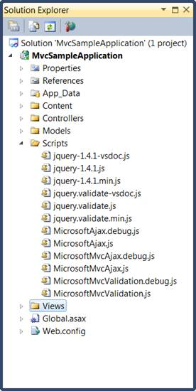

::: {style="DISPLAY: none"}
{#d2h_url_template}{#d2h_package_url style="WIDTH: 0px; DISPLAY: none; HEIGHT: 0px"}
:::

::::: {#nsbanner .d2h_main_nsbanner style="BORDER-BOTTOM: #999999 1px solid; POSITION: relative; PADDING-BOTTOM: 0px; BACKGROUND-COLOR: transparent; PADDING-LEFT: 0px; PADDING-RIGHT: 0px; DISPLAY: none; BORDER-TOP: #999999 1px solid; PADDING-TOP: 0px; LEFT: 0px"}
:::: {#TitleRow .d2h_main_titlerow style="PADDING-BOTTOM: 4px; BACKGROUND-COLOR: transparent; PADDING-LEFT: 22px; WIDTH: 100%; PADDING-RIGHT: 10px; DISPLAY: none; PADDING-TOP: 4px"}
::: {#ienav .d2h_main_ienav style="DISPLAY: none"}
{#D2HPrevious .D2HPreviousEnabled}  {#D2HNext .D2HNextEnabled}
:::
::::
:::::

:::: {#nstext .d2h_main_nstext style="PADDING-BOTTOM: 10px; BACKGROUND-COLOR: transparent; PADDING-LEFT: 22px; PADDING-RIGHT: 10px; HEIGHT: 100%; OVERFLOW: auto; PADDING-TOP: 5px" hasuserbackground="true" valign="bottom"}
::: {#d2h_breadcrumbs .d2h_breadcrumbs}
[Essential Studio User Guide Documentation](ms-xhelp:///?Id=12457748-09e3-4d74-a240-8e049cedf030){.d2h_breadcrumbsNormal}[ \> ]{.d2h_breadcrumbsLinkSeparator}[User Interface Edition](ms-xhelp:///?Id=c29296b7-531c-413b-a0ec-488ca1f7f669){.d2h_breadcrumbsNormal}[ \> ]{.d2h_breadcrumbsLinkSeparator}[Essential ASP.NET MVC](ms-xhelp:///?Id=4b14e7d1-65c4-4f67-b1aa-2c37709905a5){.d2h_breadcrumbsNormal}[ \> ]{.d2h_breadcrumbsLinkSeparator}[Essential Tools]{.d2h_breadcrumbsContentsOnly}[ \> ]{.d2h_breadcrumbsLinkSeparator}[Getting Started](ms-xhelp:///?Id=719c055e-a029-45a1-90f0-c5c2b8bae2a4){.d2h_breadcrumbsNormal}[ \> ]{.d2h_breadcrumbsLinkSeparator}[Adding Essential Tools to the Application](ms-xhelp:///?Id=6fc95279-2c42-4398-a914-ba2016500be0){.d2h_breadcrumbsNormal}
:::

### Adding Java Scripts {#adding-java-scripts style="tab-stops: 0pt"}

To add Java scripts:

5.   On the ***Solution Explorer***, double-click ***Views*** folder, double-click the shared folder, and then double-click ***Site.Master*** file.

{border="0"}

Figure 41: Site.Master file displayed under the Shared Folder

[]{style="FONT-FAMILY: 'Calibri','sans-serif'"} 

The **Site.Master** page appears as shown in the following screenshot.

{border="0"}

Figure 42: Site.Master Page

6.   On the ***Solution Explorer****,* click ***Javascripts*** folder. The lists of scripts available are displayed.

{border="0"}

Figure 43: List of scripts displayed under the Javascripts Folder

7.   Import the following javascript files onto the Site.Master page.

[·      ]{style="FONT-FAMILY: Symbol"}jquery-1.4.1.min.js

[·    ]{style="FONT-FAMILY: Symbol; FONT-SIZE: 12pt"}MicrosoftAjax.js[]{style="FONT-FAMILY: 'Times New Roman','serif'; FONT-SIZE: 12pt"}

[]{style="FONT-FAMILY: 'Times New Roman','serif'; FONT-SIZE: 12pt"} 

+--------------------------------------------------------------------------------------------------------------------------------------------------------------------------------------------------------------------------------------------------------------------------------------------------------------------------------------------------------------------------------------------------------------------------------------------------------------------------------------------------------------------------------------------------------------+
| **[\[Site.Master\] ]{style="FONT-FAMILY: 'Calibri','sans-serif'"}**                                                                                                                                                                                                                                                                                                                                                                                                                                                                                          |
|                                                                                                                                                                                                                                                                                                                                                                                                                                                                                                                                                              |
| [\<]{style="FONT-FAMILY: Consolas; COLOR: blue; FONT-SIZE: 9.5pt"}[head]{style="FONT-FAMILY: Consolas; COLOR: maroon; FONT-SIZE: 9.5pt"}[ [runat]{style="COLOR: red"}[=\"server\"\>]{style="COLOR: blue"}]{style="FONT-FAMILY: Consolas; FONT-SIZE: 9.5pt"}                                                                                                                                                                                                                                                                                                  |
|                                                                                                                                                                                                                                                                                                                                                                                                                                                                                                                                                              |
| [............]{style="FONT-FAMILY: Consolas; FONT-SIZE: 9.5pt"}                                                                                                                                                                                                                                                                                                                                                                                                                                                                                              |
|                                                                                                                                                                                                                                                                                                                                                                                                                                                                                                                                                              |
| [............]{style="FONT-FAMILY: Consolas; FONT-SIZE: 9.5pt"}                                                                                                                                                                                                                                                                                                                                                                                                                                                                                              |
|                                                                                                                                                                                                                                                                                                                                                                                                                                                                                                                                                              |
| []{style="FONT-FAMILY: Consolas; FONT-SIZE: 9.5pt"}                                                                                                                                                                                                                                                                                                                                                                                                                                                                                                          |
|                                                                                                                                                                                                                                                                                                                                                                                                                                                                                                                                                              |
| [\<]{style="FONT-FAMILY: Consolas; COLOR: blue; FONT-SIZE: 9.5pt"}[script]{style="FONT-FAMILY: Consolas; COLOR: maroon; FONT-SIZE: 9.5pt"}[ [src]{style="COLOR: red"}[=\"]{style="COLOR: blue"}[\<%]{style="BACKGROUND: yellow"}[=]{style="COLOR: blue"} Url.Content(\"\~/Javascripts/jquery-1.4.1.min.js\") [%\>]{style="BACKGROUND: yellow"}[\"]{style="COLOR: blue"} [type]{style="COLOR: red"}[=\"text/javascript\"\>\</]{style="COLOR: blue"}[script]{style="COLOR: maroon"}[\>]{style="COLOR: blue"}]{style="FONT-FAMILY: Consolas; FONT-SIZE: 9.5pt"} |
|                                                                                                                                                                                                                                                                                                                                                                                                                                                                                                                                                              |
| [\<]{style="FONT-FAMILY: Consolas; COLOR: blue; FONT-SIZE: 9.5pt"}[script]{style="FONT-FAMILY: Consolas; COLOR: maroon; FONT-SIZE: 9.5pt"}[ [src]{style="COLOR: red"}[=\"]{style="COLOR: blue"}[\<%]{style="BACKGROUND: yellow"}[=]{style="COLOR: blue"} Url.Content(\"\~/Javascripts/MicrosoftAjax.js\") [%\>]{style="BACKGROUND: yellow"}[\"]{style="COLOR: blue"} [type]{style="COLOR: red"}[=\"text/javascript\"\>\</]{style="COLOR: blue"}[script]{style="COLOR: maroon"}[\>]{style="COLOR: blue"}]{style="FONT-FAMILY: Consolas; FONT-SIZE: 9.5pt"}    |
|                                                                                                                                                                                                                                                                                                                                                                                                                                                                                                                                                              |
| [     ]{style="FONT-FAMILY: Consolas; FONT-SIZE: 9.5pt"}                                                                                                                                                                                                                                                                                                                                                                                                                                                                                                     |
|                                                                                                                                                                                                                                                                                                                                                                                                                                                                                                                                                              |
| [\</]{style="FONT-FAMILY: Consolas; COLOR: blue; FONT-SIZE: 9.5pt"}[head]{style="FONT-FAMILY: Consolas; COLOR: maroon; FONT-SIZE: 9.5pt"}[\>]{style="FONT-FAMILY: Consolas; COLOR: blue; FONT-SIZE: 9.5pt"}                                                                                                                                                                                                                                                                                                                                                  |
+--------------------------------------------------------------------------------------------------------------------------------------------------------------------------------------------------------------------------------------------------------------------------------------------------------------------------------------------------------------------------------------------------------------------------------------------------------------------------------------------------------------------------------------------------------------+

[]{#related-topics}
::::
