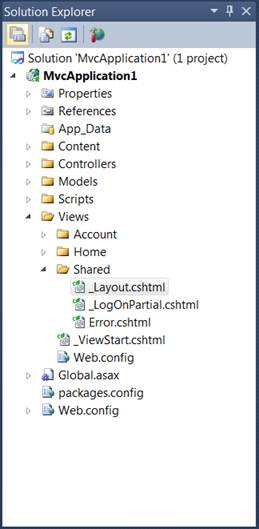
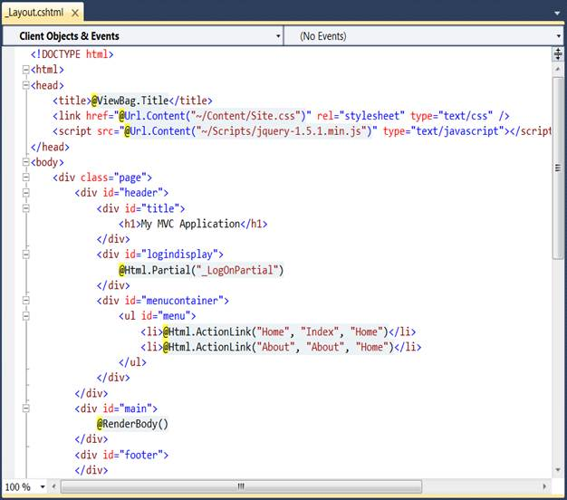

::: {style="DISPLAY: none"}
{#d2h_url_template}{#d2h_package_url style="WIDTH: 0px; DISPLAY: none; HEIGHT: 0px"}
:::

::::: {#nsbanner .d2h_main_nsbanner style="BORDER-BOTTOM: #999999 1px solid; POSITION: relative; PADDING-BOTTOM: 0px; BACKGROUND-COLOR: transparent; PADDING-LEFT: 0px; PADDING-RIGHT: 0px; DISPLAY: none; BORDER-TOP: #999999 1px solid; PADDING-TOP: 0px; LEFT: 0px"}
:::: {#TitleRow .d2h_main_titlerow style="PADDING-BOTTOM: 4px; BACKGROUND-COLOR: transparent; PADDING-LEFT: 22px; WIDTH: 100%; PADDING-RIGHT: 10px; DISPLAY: none; PADDING-TOP: 4px"}
::: {#ienav .d2h_main_ienav style="DISPLAY: none"}
{#D2HPrevious .D2HPreviousEnabled}  {#D2HNext .D2HNextEnabled}
:::
::::
:::::

:::: {#nstext .d2h_main_nstext style="PADDING-BOTTOM: 10px; BACKGROUND-COLOR: transparent; PADDING-LEFT: 22px; PADDING-RIGHT: 10px; HEIGHT: 100%; OVERFLOW: auto; PADDING-TOP: 5px" hasuserbackground="true" valign="bottom"}
::: {#d2h_breadcrumbs .d2h_breadcrumbs}
[Essential Studio User Guide Documentation](ms-xhelp:///?Id=12457748-09e3-4d74-a240-8e049cedf030){.d2h_breadcrumbsNormal}[ \> ]{.d2h_breadcrumbsLinkSeparator}[User Interface Edition](ms-xhelp:///?Id=c29296b7-531c-413b-a0ec-488ca1f7f669){.d2h_breadcrumbsNormal}[ \> ]{.d2h_breadcrumbsLinkSeparator}[Essential Mobile MVC](ms-xhelp:///?Id=74df42e3-5434-4590-9be6-3ae2f911cbbc){.d2h_breadcrumbsNormal}[ \> ]{.d2h_breadcrumbsLinkSeparator}[Essential Grid]{.d2h_breadcrumbsContentsOnly}[ \> ]{.d2h_breadcrumbsLinkSeparator}[Getting Started](ms-xhelp:///?Id=397f4d98-2e34-4dc5-8b77-1d56a317b150){.d2h_breadcrumbsNormal}[ \> ]{.d2h_breadcrumbsLinkSeparator}[Adding Essential Mobile Grid to the Razor Application](ms-xhelp:///?Id=e84cebdb-8c9e-4c07-a1be-3f559be3b842){.d2h_breadcrumbsNormal}
:::

### [Addi]{.ughyperlink}ng JavaScripts {#adding-javascripts style="tab-stops: 0pt"}

To add JavaScripts:

1.  On the **Solution Explorer**, double-click the **Views** folder, double-click the **Shared** folder, and then double-click the **\_Layout.cshtml** file.

 

{border="0"}

Figure 28: \_Layout.cshtml File Displayed under the Shared Folder

 The **\_Layout.cshtml** page appears as shown in the following screenshot.

{border="0"}

Figure 29: Site.Master Page

2.  On the **Solution Explorer***,* click the **Scripts** folder. The lists of scripts available are displayed.

{border="0"}

Figure 30: List of Scripts Displayed under the Scripts Folder

3.  Import the following javascript files onto the Site.Master page.

[•   ]{style="FONT-FAMILY: 'Verdana','sans-serif'; FONT-SIZE: 10pt"}[jquery-1.5.1.min.js]{style="FONT-FAMILY: 'Arial','sans-serif'; FONT-SIZE: 10pt"}

[•   ]{style="FONT-FAMILY: 'Verdana','sans-serif'; FONT-SIZE: 10pt"}[MicrosoftAjax.js]{style="FONT-FAMILY: 'Arial','sans-serif'; FONT-SIZE: 10pt"}

 

+---------------------------------------------------------------------------------------------------------------------------------------------------------------------------------------------------------------------------------------------------------------------------------------------------------------------------------------------------------------------------------------------------------------------------------------------------+
| **[\[Razor\] ]{style="FONT-FAMILY: 'Courier New'"}**                                                                                                                                                                                                                                                                                                                                                                                              |
|                                                                                                                                                                                                                                                                                                                                                                                                                                                   |
| [\<]{style="FONT-FAMILY: 'Courier New'; COLOR: blue"}[head]{style="FONT-FAMILY: 'Courier New'; COLOR: maroon"}[ [runat]{style="COLOR: red"}[=\"server\"\>]{style="COLOR: blue"}]{style="FONT-FAMILY: 'Courier New'"}                                                                                                                                                                                                                              |
|                                                                                                                                                                                                                                                                                                                                                                                                                                                   |
| [............]{style="FONT-FAMILY: 'Courier New'"}                                                                                                                                                                                                                                                                                                                                                                                                |
|                                                                                                                                                                                                                                                                                                                                                                                                                                                   |
| [............]{style="FONT-FAMILY: 'Courier New'"}                                                                                                                                                                                                                                                                                                                                                                                                |
|                                                                                                                                                                                                                                                                                                                                                                                                                                                   |
|                                                                                                                                                                                                                                                                                                                                                                                                                                                   |
|                                                                                                                                                                                                                                                                                                                                                                                                                                                   |
| [    [\<]{style="COLOR: blue"}[script]{style="COLOR: maroon"} [src]{style="COLOR: red"}[=\"]{style="COLOR: blue"}[@]{style="BACKGROUND: yellow"}[Url.Content(]{style="COLOR: blue"}[\"\~/Scripts/jquery-1.5.1.min.js\"]{style="COLOR: #a31515"}[)\"]{style="COLOR: blue"} [type]{style="COLOR: red"}[=\"text/javascript\"\>\</]{style="COLOR: blue"}[script]{style="COLOR: maroon"}[\>]{style="COLOR: blue"}]{style="FONT-FAMILY: 'Courier New'"} |
|                                                                                                                                                                                                                                                                                                                                                                                                                                                   |
| [    ]{style="FONT-FAMILY: 'Courier New'"}                                                                                                                                                                                                                                                                                                                                                                                                        |
|                                                                                                                                                                                                                                                                                                                                                                                                                                                   |
| [     ]{style="FONT-FAMILY: 'Courier New'"}                                                                                                                                                                                                                                                                                                                                                                                                       |
|                                                                                                                                                                                                                                                                                                                                                                                                                                                   |
| [\</]{style="FONT-FAMILY: 'Courier New'; COLOR: blue"}[head]{style="FONT-FAMILY: 'Courier New'; COLOR: maroon"}[\>]{style="FONT-FAMILY: 'Courier New'; COLOR: blue"}[]{style="FONT-SIZE: 12pt"}                                                                                                                                                                                                                                                   |
+---------------------------------------------------------------------------------------------------------------------------------------------------------------------------------------------------------------------------------------------------------------------------------------------------------------------------------------------------------------------------------------------------------------------------------------------------+

[]{#related-topics}
::::
