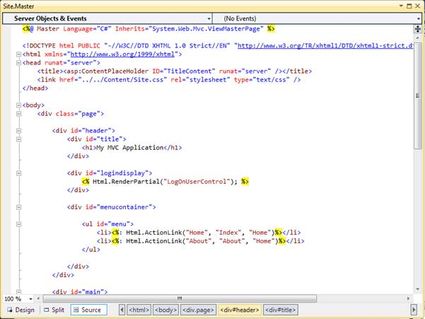
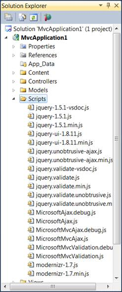

::: {style="DISPLAY: none"}
{#d2h_url_template} {#d2h_package_url style="WIDTH: 0px; DISPLAY: none; HEIGHT: 0px"}
:::

::::: {#nsbanner .d2h_main_nsbanner style="BORDER-BOTTOM: #999999 1px solid; POSITION: relative; PADDING-BOTTOM: 0px; BACKGROUND-COLOR: transparent; PADDING-LEFT: 0px; PADDING-RIGHT: 0px; DISPLAY: none; BORDER-TOP: #999999 1px solid; PADDING-TOP: 0px; LEFT: 0px"}
:::: {#TitleRow .d2h_main_titlerow style="PADDING-BOTTOM: 4px; BACKGROUND-COLOR: transparent; PADDING-LEFT: 22px; WIDTH: 100%; PADDING-RIGHT: 10px; DISPLAY: none; PADDING-TOP: 4px"}
::: {#ienav .d2h_main_ienav style="DISPLAY: none"}
{#D2HPrevious .D2HPreviousEnabled}  {#D2HNext .D2HNextEnabled}
:::
::::
:::::

:::: {#nstext .d2h_main_nstext style="PADDING-BOTTOM: 10px; BACKGROUND-COLOR: transparent; PADDING-LEFT: 22px; PADDING-RIGHT: 10px; HEIGHT: 100%; OVERFLOW: auto; PADDING-TOP: 5px" hasuserbackground="true" valign="bottom"}
::: {#d2h_breadcrumbs .d2h_breadcrumbs}
[Essential Studio User Guide Documentation](ms-xhelp:///?Id=12457748-09e3-4d74-a240-8e049cedf030){.d2h_breadcrumbsNormal} [ \> ]{.d2h_breadcrumbsLinkSeparator} [User Interface Edition](ms-xhelp:///?Id=c29296b7-531c-413b-a0ec-488ca1f7f669){.d2h_breadcrumbsNormal} [ \> ]{.d2h_breadcrumbsLinkSeparator} [Essential Mobile MVC](ms-xhelp:///?Id=74df42e3-5434-4590-9be6-3ae2f911cbbc){.d2h_breadcrumbsNormal} [ \> ]{.d2h_breadcrumbsLinkSeparator} [Essential Tools]{.d2h_breadcrumbsContentsOnly} [ \> ]{.d2h_breadcrumbsLinkSeparator} [Getting Started](ms-xhelp:///?Id=07dff027-c96d-450f-9a9b-6037f838f4da){.d2h_breadcrumbsNormal} [ \> ]{.d2h_breadcrumbsLinkSeparator} [Adding Essential Mobile Tools to the MVC3 ASPX Application](ms-xhelp:///?Id=f561904f-bd17-40a3-a1b6-498ed5d46c43){.d2h_breadcrumbsNormal}
:::

### Adding Java Scripts {#adding-java-scripts style="tab-stops: 0pt"}

To add Java scripts:

1.   On the ***Solution Explorer***, double-click ***Views*** folder, double-click the shared folder, and then double-click ***Site.Master*** file.

{border="0"}

Figure 18: Site.Master file displayed under the Shared Folder

[]{style="FONT-FAMILY: 'Calibri','sans-serif'"} 

The **Site.Master** page appears as shown in the following screenshot.

{border="0"} []{style="LINE-HEIGHT: 115%; FONT-FAMILY: 'Calibri','sans-serif'; FONT-SIZE: 11pt"}

Figure 19: Site.Master Page

2.   On the ***Solution Explorer****,* click ***Javascripts*** folder. The lists of scripts available are displayed.

[{border="0"}]{.underline}

Figure 20: List of scripts displayed under the Javascripts Folder

3.   Import the following javascript files onto the Site.Master page.

[·      ]{style="FONT-FAMILY: Symbol"}jquery-1.5.1.min.js

[·    ]{style="FONT-FAMILY: Symbol; FONT-SIZE: 12pt"}MicrosoftAjax.js[]{style="FONT-FAMILY: 'Times New Roman','serif'; FONT-SIZE: 12pt"}

[]{style="FONT-FAMILY: 'Times New Roman','serif'; FONT-SIZE: 12pt"} 

+---------------------------------------------------------------------------------------------------------------------------------------------------------------------------------------------------------------------------------------------------------------------------------------------------------------------------------------------------------------------------------------------------------------------------------------------------------------------------------------------------------------------------+
| **[\[ASPX\] ]{style="FONT-FAMILY: 'Courier New'"}**                                                                                                                                                                                                                                                                                                                                                                                                                                                                       |
|                                                                                                                                                                                                                                                                                                                                                                                                                                                                                                                           |
| [\<]{style="FONT-FAMILY: 'Courier New'; COLOR: blue"} [head]{style="FONT-FAMILY: 'Courier New'; COLOR: maroon"} [ [runat]{style="COLOR: red"} [=\"server\"\>]{style="COLOR: blue"} ]{style="FONT-FAMILY: 'Courier New'"}                                                                                                                                                                                                                                                                                                  |
|                                                                                                                                                                                                                                                                                                                                                                                                                                                                                                                           |
| [............]{style="FONT-FAMILY: 'Courier New'"}                                                                                                                                                                                                                                                                                                                                                                                                                                                                        |
|                                                                                                                                                                                                                                                                                                                                                                                                                                                                                                                           |
| [............]{style="FONT-FAMILY: 'Courier New'"}                                                                                                                                                                                                                                                                                                                                                                                                                                                                        |
|                                                                                                                                                                                                                                                                                                                                                                                                                                                                                                                           |
| []{style="FONT-FAMILY: 'Courier New'"}                                                                                                                                                                                                                                                                                                                                                                                                                                                                                    |
|                                                                                                                                                                                                                                                                                                                                                                                                                                                                                                                           |
| [\<]{style="FONT-FAMILY: 'Courier New'; COLOR: blue"} [script]{style="FONT-FAMILY: 'Courier New'; COLOR: maroon"} [ [src]{style="COLOR: red"} [=\"]{style="COLOR: blue"} [\<%]{style="BACKGROUND: yellow"} [=]{style="COLOR: blue"} Url.Content(\"\~/Javascripts/jquery-1.5.1.min.js\") [%\>]{style="BACKGROUND: yellow"}[\"]{style="COLOR: blue"}[type]{style="COLOR: red"}[=\"text/javascript\"\>\</]{style="COLOR: blue"}[script]{style="COLOR: maroon"}[\>]{style="COLOR: blue"}]{style="FONT-FAMILY: 'Courier New'"} |
|                                                                                                                                                                                                                                                                                                                                                                                                                                                                                                                           |
| [     ]{style="FONT-FAMILY: 'Courier New'"}                                                                                                                                                                                                                                                                                                                                                                                                                                                                               |
|                                                                                                                                                                                                                                                                                                                                                                                                                                                                                                                           |
| [\</]{style="FONT-FAMILY: 'Courier New'; COLOR: blue"} [head]{style="FONT-FAMILY: 'Courier New'; COLOR: maroon"} [\>]{style="FONT-FAMILY: 'Courier New'; COLOR: blue"}                                                                                                                                                                                                                                                                                                                                                    |
+---------------------------------------------------------------------------------------------------------------------------------------------------------------------------------------------------------------------------------------------------------------------------------------------------------------------------------------------------------------------------------------------------------------------------------------------------------------------------------------------------------------------------+

[]{#related-topics}
::::
