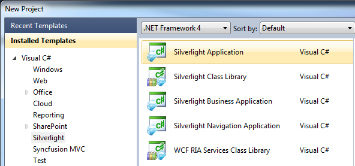
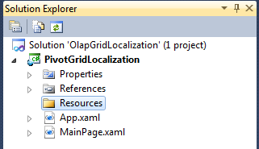
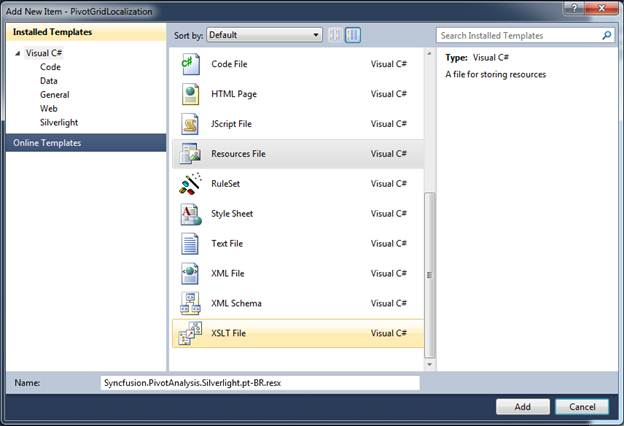
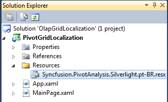
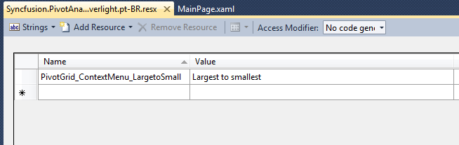
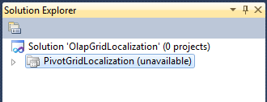
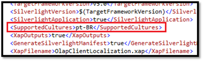
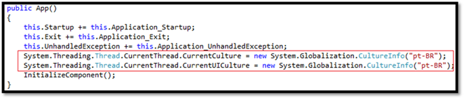

::: {style="DISPLAY: none"}
{#d2h_url_template}{#d2h_package_url style="WIDTH: 0px; DISPLAY: none; HEIGHT: 0px"}
:::

::::: {#nsbanner .d2h_main_nsbanner style="BORDER-BOTTOM: #999999 1px solid; POSITION: relative; PADDING-BOTTOM: 0px; BACKGROUND-COLOR: transparent; PADDING-LEFT: 0px; PADDING-RIGHT: 0px; DISPLAY: none; BORDER-TOP: #999999 1px solid; PADDING-TOP: 0px; LEFT: 0px"}
:::: {#TitleRow .d2h_main_titlerow style="PADDING-BOTTOM: 4px; BACKGROUND-COLOR: transparent; PADDING-LEFT: 22px; WIDTH: 100%; PADDING-RIGHT: 10px; DISPLAY: none; PADDING-TOP: 4px"}
::: {#ienav .d2h_main_ienav style="DISPLAY: none"}
{#D2HPrevious .D2HPreviousEnabled}  {#D2HNext .D2HNextEnabled}
:::
::::
:::::

:::: {#nstext .d2h_main_nstext style="PADDING-BOTTOM: 10px; BACKGROUND-COLOR: transparent; PADDING-LEFT: 22px; PADDING-RIGHT: 10px; HEIGHT: 100%; OVERFLOW: auto; PADDING-TOP: 5px" hasuserbackground="true" valign="bottom"}
### Adding Localization [[feature]{style="FONT-SIZE: 20pt"}]{.Heading1Char} to an application {#adding-localization-feature-to-an-application style="tab-stops: 0pt"}

To add localization in an application, follow the steps given below:

1.  Create a Silverlight application.

{border="0"}

Figure 43 New Project Dialog Window

2.  Add a folder into the Silverlight project and name it as "Resources".

{border="0"}

Figure 44 Solution Explorer with "Resources" Folder

3.  Right-click on the Resources folder and select Add -\> New Item from the context menu. From the dialog shown, select the Resource File and name it as given below:

"**Syncfusion.PivotAnalysis.Silverlight.\<cultureCode\>.resx"**

For an instance, the file name for the Portuguese-Brazil culture can be: **Syncfusion.PivotAnalysis.Silverlight.pt-BR.resx**

Refer to the following link for culture code:

[[http://msdn.microsoft.com/en-us/library/system.globalization.cultureinfo(v=vs.71).aspx]{style="FONT-FAMILY: 'Arial','sans-serif'"}](http://msdn.microsoft.com/en-us/library/system.globalization.cultureinfo(v=vs.71).aspx)

{border="0"}

Figure 45 Add New Item Dialog Window

Now, the Syncfusion.PivotAnalysis.Silverlight.pt-BR.resx file is added to the Silverlight project.

{border="0"}

Figure 46 Solution Explorer with Resource File

4.  Open the resource file, fill the name and translate the value according to your locale with respect to the above table.

{border="0"}

Figure 47 Resource Editor Window

 

To switch the application between different languages, specify the supported culture in the Silverlight project file.

5.  In order to specify the supported culture in the Silverlight project file, unload the project by right-clicking over the Silverlight project and select the "**Unload Project**" from the context menu.

The project is unloaded from the solution as shown below:

{border="0"}

Figure 48 Solution Explorer with Unloaded Project

 

6.  Right-click on the Silverlight project file and select the Edit project from the context menu. This brings the metadata of the Silverlight project.

7.  Look for the \<SupportedCultures\> tag within the \<PropertyGroup\> tag and add the culture code inside the \<SupportedCultures\> tag.

For multiple cultures, add each culture code within the same tag separated by a semicolon (;).

{border="0"}

Figure 49 Metadata of Silverlight Project

8.  Save the \*.csproj file.  Right-click and select the "**Reload Project**" to reload the unloaded project.

9.   Add the following code inside the App constructor to set the current culture:

{border="0"}

Figure 50 App Constructor

 

+-------------------------------------------------------------------------------------------------------------------------------------------------------------------------------------------------------------------------------------------------------------------------------+
| **[\[C#\]]{style="FONT-FAMILY: 'Courier New'"}**                                                                                                                                                                                                                              |
|                                                                                                                                                                                                                                                                               |
| [            System.Threading.[Thread]{style="COLOR: #2b91af"}.CurrentThread.CurrentCulture = [new]{style="COLOR: blue"} System.Globalization.[CultureInfo]{style="COLOR: #2b91af"}([\"pt-BR\"]{style="COLOR: #a31515"});]{style="FONT-FAMILY: Consolas; FONT-SIZE: 9.5pt"}   |
|                                                                                                                                                                                                                                                                               |
| [            System.Threading.[Thread]{style="COLOR: #2b91af"}.CurrentThread.CurrentUICulture = [new]{style="COLOR: blue"} System.Globalization.[CultureInfo]{style="COLOR: #2b91af"}([\"pt-BR\"]{style="COLOR: #a31515"});]{style="FONT-FAMILY: Consolas; FONT-SIZE: 9.5pt"} |
+-------------------------------------------------------------------------------------------------------------------------------------------------------------------------------------------------------------------------------------------------------------------------------+

::: {style="BORDER-BOTTOM: windowtext 1pt solid; BORDER-LEFT: medium none; PADDING-BOTTOM: 1pt; MARGIN-TOP: 9pt; PADDING-LEFT: 0pt; PADDING-RIGHT: 0pt; MARGIN-BOTTOM: 9pt; BORDER-TOP: windowtext 1pt solid; BORDER-RIGHT: medium none; PADDING-TOP: 1pt"}
Note: The bidirectional support can be utilized through setting the FlowDirection property.
:::

+---------------------------------------------------------------------------------------------------------------------------------------------------------------------------------------------------------------------+
| **[\[C#\]]{style="FONT-FAMILY: 'Courier New'"}**                                                                                                                                                                    |
|                                                                                                                                                                                                                     |
| [            [if]{style="COLOR: blue"} (Threading.[Thread]{style="COLOR: #2b91af"}.CurrentThread.CurrentUICulture.ToString() == [\"ar\"]{style="COLOR: #a31515"})]{style="FONT-FAMILY: Consolas; FONT-SIZE: 9.5pt"} |
|                                                                                                                                                                                                                     |
| [            {]{style="FONT-FAMILY: Consolas; FONT-SIZE: 9.5pt"}                                                                                                                                                    |
|                                                                                                                                                                                                                     |
| [                [this]{style="COLOR: blue"}.pivotGrid.FlowDirection = System.Windows.[FlowDirection]{style="COLOR: #2b91af"}.RightToLeft;]{style="FONT-FAMILY: Consolas; FONT-SIZE: 9.5pt"}                        |
|                                                                                                                                                                                                                     |
| [            }]{style="FONT-FAMILY: Consolas; FONT-SIZE: 9.5pt"}                                                                                                                                                    |
+---------------------------------------------------------------------------------------------------------------------------------------------------------------------------------------------------------------------+

 

[]{#related-topics}
::::
