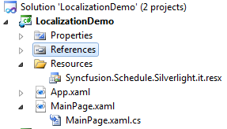
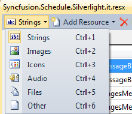
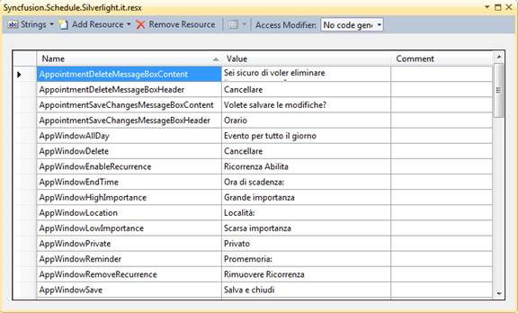

::: {style="DISPLAY: none"}
{#d2h_url_template}{#d2h_package_url style="WIDTH: 0px; DISPLAY: none; HEIGHT: 0px"}
:::

::: {.d2h_secondary_topic style="PADDING-BOTTOM: 10pt; MARGIN: 0pt; PADDING-LEFT: 0pt; PADDING-RIGHT: 0pt; PADDING-TOP: 0pt"}
#### Adding Localization to an Application {#adding-localization-to-an-application style="tab-stops: 0pt"}

The following steps explain the implementation of Localization in applications.

 

Creating an Application

Create a Silverlight application and add Schedule to it.

**[]{style="FONT-FAMILY: 'Trebuchet MS','sans-serif'; COLOR: #15428b; FONT-SIZE: 9pt"}** 

Creating a Resource file

Following are the steps to create a resource file,

1.   Create a folder named "Resources" in the application.

2.   Create a resource file (Resx file) and name it "Syncfusion.Schedule.Silverlight.\<*your culture info name*\>.resx" e.g. Syncfusion.Schedule.Silverlight.it.resx.

Use the above mentioned naming convention, as it is mandatory. The following screenshot explains creating a Resource file.

**[]{style="FONT-FAMILY: 'Trebuchet MS','sans-serif'; COLOR: #15428b; FONT-SIZE: 9pt"}** 

{border="0"}

Figure 38: Adding Resources file to the Application

 

Select the String option in the Resource file. This is explained in the following screenshot.

[]{style="FONT-FAMILY: 'Trebuchet MS','sans-serif'; COLOR: #15428b; FONT-SIZE: 9pt"} 

{border="0"}

Figure 39: Adding string resources to the resx file.

 

Enter the Name and Value in the Resource file.

The names used in Grid are given in the [[[Property]{style="COLOR: blue"}]{.underline}](ms-xhelp:///?Id=e557578e-d465-4aed-a1d3-3293f6d64804) table. The following screenshot explains the same.

 

{border="0"}

Figure 40: Screenshot of the filled String Resources (Language: Italian)

 

Setting the Culture Information in the Application

Set the culture information in the application before the InitializeComponent() method is called. Now,  application is set to UK English Culture info. The following code snippet explains how to set a culture to a WPF application.

***[]{style="FONT-FAMILY: 'Trebuchet MS','sans-serif'; COLOR: #15428b; FONT-SIZE: 9pt"}*** 

+-----------------------------------------------------------------------------------------------------------------------------------------------------------------------------------------------------------------------------------------+
| **\[C#\]**                                                                                                                                                                                                                              |
|                                                                                                                                                                                                                                         |
| **[]{style="FONT-SIZE: 9.5pt"}**                                                                                                                                                                                                        |
|                                                                                                                                                                                                                                         |
| **[ ]{style="FONT-SIZE: 9.5pt"}**[public]{style="COLOR: blue; FONT-SIZE: 9.5pt"}[ MainPage()]{style="FONT-SIZE: 9.5pt"}                                                                                                                 |
|                                                                                                                                                                                                                                         |
| [{]{style="FONT-SIZE: 9.5pt"}                                                                                                                                                                                                           |
|                                                                                                                                                                                                                                         |
| [System.Threading.[Thread]{style="COLOR: #2b91af"}.CurrentThread.CurrentUICulture = [new]{style="COLOR: blue"} System.Globalization.[CultureInfo]{style="COLOR: #2b91af"}([\"Ja\"]{style="COLOR: #a31515"});]{style="FONT-SIZE: 9.5pt"} |
|                                                                                                                                                                                                                                         |
| []{style="FONT-SIZE: 9.5pt"}                                                                                                                                                                                                            |
|                                                                                                                                                                                                                                         |
| [InitializeComponent();]{style="FONT-SIZE: 9.5pt"}                                                                                                                                                                                      |
|                                                                                                                                                                                                                                         |
| [}]{style="FONT-SIZE: 9.5pt"}                                                                                                                                                                                                           |
|                                                                                                                                                                                                                                         |
|                                                                                                                                                                                                                                         |
+-----------------------------------------------------------------------------------------------------------------------------------------------------------------------------------------------------------------------------------------+

 

Or

 

+---------------------------------------------------------------------------------------------------------------------------------------------------------------------------------------------------------------------------------------------+
| **CS (App.xaml.cs)**                                                                                                                                                                                                                        |
|                                                                                                                                                                                                                                             |
|                                                                                                                                                                                                                                             |
|                                                                                                                                                                                                                                             |
| **[private]{style="COLOR: blue; FONT-SIZE: 9.5pt"}[ [void]{style="COLOR: blue"} Application_Startup([object]{style="COLOR: blue"} sender, [StartupEventArgs]{style="COLOR: #2b91af"} e)]{style="FONT-SIZE: 9.5pt"}**                        |
|                                                                                                                                                                                                                                             |
| **[{]{style="FONT-SIZE: 9.5pt"}**                                                                                                                                                                                                           |
|                                                                                                                                                                                                                                             |
| **[System.Threading.[Thread]{style="COLOR: #2b91af"}.CurrentThread.CurrentUICulture = [new]{style="COLOR: blue"} System.Globalization.[CultureInfo]{style="COLOR: #2b91af"}([\"Ja\"]{style="COLOR: #a31515"});]{style="FONT-SIZE: 9.5pt"}** |
|                                                                                                                                                                                                                                             |
| **[this]{style="COLOR: blue; FONT-SIZE: 9.5pt"}[.RootVisual = [new]{style="COLOR: blue"} [MainPage]{style="COLOR: #2b91af"}();]{style="FONT-SIZE: 9.5pt"}**                                                                                 |
|                                                                                                                                                                                                                                             |
| **[}]{style="FONT-SIZE: 9.5pt"}**                                                                                                                                                                                                           |
+---------------------------------------------------------------------------------------------------------------------------------------------------------------------------------------------------------------------------------------------+

 

[]{#related-topics}
:::
