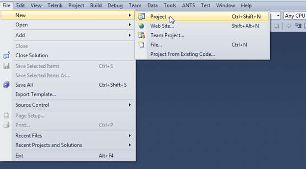
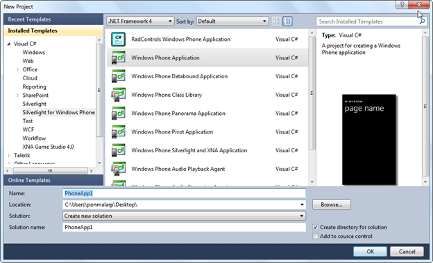
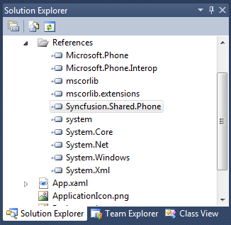

::: {style="DISPLAY: none"}
{#d2h_url_template}{#d2h_package_url style="WIDTH: 0px; DISPLAY: none; HEIGHT: 0px"}
:::

::: {.d2h_secondary_topic style="PADDING-BOTTOM: 10pt; MARGIN: 0pt; PADDING-LEFT: 0pt; PADDING-RIGHT: 0pt; PADDING-TOP: 0pt"}
#### Adding MaskEditTextBox to an Application {#adding-maskedittextbox-to-an-application style="TEXT-JUSTIFY: inter-ideograph; TEXT-ALIGN: justify; tab-stops: 0pt"}

Steps to create the MaskEditTextBox by using Visual Studio in C# are as follows:

1.  [Open Visual Studio. On the **File** menu click **New** \> **Project**. This opens the **New Project** dialog box.]{style="FONT-FAMILY: 'Arial','sans-serif'"}

{border="0"}

Fig 142: New Project Creation

2.   Select **Windows Phone Application** in the **New Project** dialog window and type the name of the project in the name field. Click **OK**.

{border="0"}

Fig 143: Select Windows Phone Application

3.   Add the following reference with the sample project.

[·      ]{style="FONT-FAMILY: Symbol"}Syncfusion.Shared.Phone.dll

{border="0"}

Fig 144: Solution Explorer

 

4.   Add MaskEditTextBox to your application.

 

+----------------------------------------------------------------------------------------------------------------------------------------------------------------------------------------------------------------------------------+
| **[\[C#\]]{style="FONT-FAMILY: Consolas; FONT-SIZE: 9.5pt"}**                                                                                                                                                                    |
|                                                                                                                                                                                                                                  |
| []{style="FONT-FAMILY: Consolas; COLOR: #2b91af; FONT-SIZE: 9.5pt"}                                                                                                                                                              |
|                                                                                                                                                                                                                                  |
| [MaskEditTextBox]{style="FONT-FAMILY: Consolas; COLOR: #2b91af; FONT-SIZE: 9.5pt"}[ maskedittextbox1 = [new]{style="COLOR: blue"} [MaskEditTextBox]{style="COLOR: #2b91af"}();]{style="FONT-FAMILY: Consolas; FONT-SIZE: 9.5pt"} |
|                                                                                                                                                                                                                                  |
| [maskedittextbox1.Height = 75;]{style="FONT-FAMILY: Consolas; FONT-SIZE: 9.5pt"}                                                                                                                                                 |
|                                                                                                                                                                                                                                  |
| [maskedittextbox1.Mask = [\"00/00/0000\"]{style="COLOR: #a31515"};]{style="FONT-FAMILY: Consolas; FONT-SIZE: 9.5pt"}                                                                                                             |
+----------------------------------------------------------------------------------------------------------------------------------------------------------------------------------------------------------------------------------+

 

+---------------------------------------------------------------------------------------------------------------------------------------------------------------------------------------------------------------------------------------------------------------------------------------------------------------------------------------------------------------------------------------------------------------------------------------------------------------------------------------------------------------------------------------------------------------------------------------------------------------------------------------------------------------------------------------------------------------------------------------------------------------------------------------------------------------------------------------------------------------------------------------------+
| **[\[XAML:\]]{style="FONT-FAMILY: Consolas; FONT-SIZE: 9.5pt"}**                                                                                                                                                                                                                                                                                                                                                                                                                                                                                                                                                                                                                                                                                                                                                                                                                            |
|                                                                                                                                                                                                                                                                                                                                                                                                                                                                                                                                                                                                                                                                                                                                                                                                                                                                                             |
| []{style="FONT-FAMILY: Consolas; COLOR: #2b91af; FONT-SIZE: 9.5pt"}                                                                                                                                                                                                                                                                                                                                                                                                                                                                                                                                                                                                                                                                                                                                                                                                                         |
|                                                                                                                                                                                                                                                                                                                                                                                                                                                                                                                                                                                                                                                                                                                                                                                                                                                                                             |
| [\<]{style="FONT-FAMILY: Consolas; COLOR: blue; FONT-SIZE: 9.5pt"}[syncfusion]{style="FONT-FAMILY: Consolas; COLOR: #a31515; FONT-SIZE: 9.5pt"}[:]{style="FONT-FAMILY: Consolas; COLOR: blue; FONT-SIZE: 9.5pt"}[MaskEditTextBox]{style="FONT-FAMILY: Consolas; COLOR: #a31515; FONT-SIZE: 9.5pt"}[ Height]{style="FONT-FAMILY: Consolas; COLOR: red; FONT-SIZE: 9.5pt"}[=\"75\" ]{style="FONT-FAMILY: Consolas; COLOR: blue; FONT-SIZE: 9.5pt"}[Mask]{style="FONT-FAMILY: Consolas; COLOR: red; FONT-SIZE: 9.5pt"}[=\"00/00/0000\"]{style="FONT-FAMILY: Consolas; COLOR: blue; FONT-SIZE: 9.5pt"}[ x]{style="FONT-FAMILY: Consolas; COLOR: red; FONT-SIZE: 9.5pt"}[:]{style="FONT-FAMILY: Consolas; COLOR: blue; FONT-SIZE: 9.5pt"}[Name]{style="FONT-FAMILY: Consolas; COLOR: red; FONT-SIZE: 9.5pt"}[=\"maskedittxt1\"/\>]{style="FONT-FAMILY: Consolas; COLOR: blue; FONT-SIZE: 9.5pt"} |
|                                                                                                                                                                                                                                                                                                                                                                                                                                                                                                                                                                                                                                                                                                                                                                                                                                                                                             |
| []{style="FONT-FAMILY: Consolas; COLOR: #2b91af; FONT-SIZE: 9.5pt"}                                                                                                                                                                                                                                                                                                                                                                                                                                                                                                                                                                                                                                                                                                                                                                                                                         |
+---------------------------------------------------------------------------------------------------------------------------------------------------------------------------------------------------------------------------------------------------------------------------------------------------------------------------------------------------------------------------------------------------------------------------------------------------------------------------------------------------------------------------------------------------------------------------------------------------------------------------------------------------------------------------------------------------------------------------------------------------------------------------------------------------------------------------------------------------------------------------------------------+

 

{border="0"}

Fig 145: MaskEditTextBox

 

[]{#related-topics}
:::
