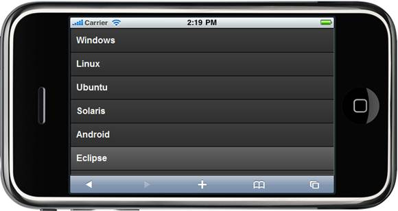

::: {style="DISPLAY: none"}
{#d2h_url_template} {#d2h_package_url style="WIDTH: 0px; DISPLAY: none; HEIGHT: 0px"}
:::

::::: {#nsbanner .d2h_main_nsbanner style="BORDER-BOTTOM: #999999 1px solid; POSITION: relative; PADDING-BOTTOM: 0px; BACKGROUND-COLOR: transparent; PADDING-LEFT: 0px; PADDING-RIGHT: 0px; DISPLAY: none; BORDER-TOP: #999999 1px solid; PADDING-TOP: 0px; LEFT: 0px"}
:::: {#TitleRow .d2h_main_titlerow style="PADDING-BOTTOM: 4px; BACKGROUND-COLOR: transparent; PADDING-LEFT: 22px; WIDTH: 100%; PADDING-RIGHT: 10px; DISPLAY: none; PADDING-TOP: 4px"}
::: {#ienav .d2h_main_ienav style="DISPLAY: none"}
{#D2HPrevious .D2HPreviousEnabled}  {#D2HNext .D2HNextEnabled}
:::
::::
:::::

:::: {#nstext .d2h_main_nstext style="PADDING-BOTTOM: 10px; BACKGROUND-COLOR: transparent; PADDING-LEFT: 22px; PADDING-RIGHT: 10px; HEIGHT: 100%; OVERFLOW: auto; PADDING-TOP: 5px" hasuserbackground="true" valign="bottom"}
::: {#d2h_breadcrumbs .d2h_breadcrumbs}
[Essential Studio User Guide Documentation](ms-xhelp:///?Id=12457748-09e3-4d74-a240-8e049cedf030){.d2h_breadcrumbsNormal} [ \> ]{.d2h_breadcrumbsLinkSeparator} [User Interface Edition](ms-xhelp:///?Id=c29296b7-531c-413b-a0ec-488ca1f7f669){.d2h_breadcrumbsNormal} [ \> ]{.d2h_breadcrumbsLinkSeparator} [Essential Mobile MVC](ms-xhelp:///?Id=74df42e3-5434-4590-9be6-3ae2f911cbbc){.d2h_breadcrumbsNormal} [ \> ]{.d2h_breadcrumbsLinkSeparator} [Essential Tools]{.d2h_breadcrumbsContentsOnly} [ \> ]{.d2h_breadcrumbsLinkSeparator} [Controls and Components](ms-xhelp:///?Id=143afae1-3f83-4d32-9bfa-92ed7022a696){.d2h_breadcrumbsNormal} [ \> ]{.d2h_breadcrumbsLinkSeparator} [Menu](ms-xhelp:///?Id=14cf5753-5155-49dd-9551-bbc33fd0e239){.d2h_breadcrumbsNormal}
:::

### Adding Menu to the Mobile MVC application {#adding-menu-to-the-mobile-mvc-application style="tab-stops: 0pt"}

In the [Getting Started]{.UGHyperlink} section, we discussed how to [create an Mobile MVC application]{.UGHyperlink} and [add Tools package to the application]{.UGHyperlink}. This section guides you to add Menu control to an application.

1.   In **View**, Invoke the menu helper with the menu ID as the first argument.

+--------------------------------------------------------------------------------------------------------------------------------------------------------------------------------------------------------------------------------------------------------------------+
| **[\[ASPX\]]{style="FONT-FAMILY: 'Courier New'"}**                                                                                                                                                                                                                 |
|                                                                                                                                                                                                                                                                    |
| [  ]{style="FONT-FAMILY: 'Courier New'"} [\<%]{style="FONT-FAMILY: 'Courier New'; BACKGROUND: yellow"} [=]{style="FONT-FAMILY: 'Courier New'; COLOR: blue"} [ Html.MobSyncfusion().Menu([\"mobTab\"]{style="COLOR: #a31515"})]{style="FONT-FAMILY: 'Courier New'"} |
|                                                                                                                                                                                                                                                                    |
| [           .Items(items =\>]{style="FONT-FAMILY: 'Courier New'"}                                                                                                                                                                                                  |
|                                                                                                                                                                                                                                                                    |
| [           {]{style="FONT-FAMILY: 'Courier New'"}                                                                                                                                                                                                                 |
|                                                                                                                                                                                                                                                                    |
| [               items.Add()]{style="FONT-FAMILY: 'Courier New'"}                                                                                                                                                                                                   |
|                                                                                                                                                                                                                                                                    |
| [                   .Text([\"Windows\"]{style="COLOR: #a31515"});]{style="FONT-FAMILY: 'Courier New'"}                                                                                                                                                             |
|                                                                                                                                                                                                                                                                    |
| [               items.Add()]{style="FONT-FAMILY: 'Courier New'"}                                                                                                                                                                                                   |
|                                                                                                                                                                                                                                                                    |
| [                   .Text([\"Linux\"]{style="COLOR: #a31515"});]{style="FONT-FAMILY: 'Courier New'"}                                                                                                                                                               |
|                                                                                                                                                                                                                                                                    |
| [               items.Add()]{style="FONT-FAMILY: 'Courier New'"}                                                                                                                                                                                                   |
|                                                                                                                                                                                                                                                                    |
| [                   .Text([\"Ubuntu\"]{style="COLOR: #a31515"});]{style="FONT-FAMILY: 'Courier New'"}                                                                                                                                                              |
|                                                                                                                                                                                                                                                                    |
| [               items.Add()]{style="FONT-FAMILY: 'Courier New'"}                                                                                                                                                                                                   |
|                                                                                                                                                                                                                                                                    |
| [                   .Text([\"Solaris\"]{style="COLOR: #a31515"});]{style="FONT-FAMILY: 'Courier New'"}                                                                                                                                                             |
|                                                                                                                                                                                                                                                                    |
| [               items.Add()]{style="FONT-FAMILY: 'Courier New'"}                                                                                                                                                                                                   |
|                                                                                                                                                                                                                                                                    |
| [                   .Text([\"Android\"]{style="COLOR: #a31515"});]{style="FONT-FAMILY: 'Courier New'"}                                                                                                                                                             |
|                                                                                                                                                                                                                                                                    |
| [               items.Add()]{style="FONT-FAMILY: 'Courier New'"}                                                                                                                                                                                                   |
|                                                                                                                                                                                                                                                                    |
| [                   .Text([\"Eclipse\"]{style="COLOR: #a31515"});]{style="FONT-FAMILY: 'Courier New'"}                                                                                                                                                             |
|                                                                                                                                                                                                                                                                    |
| [               items.Add()]{style="FONT-FAMILY: 'Courier New'"}                                                                                                                                                                                                   |
|                                                                                                                                                                                                                                                                    |
| [                   .Text([\"Unix\"]{style="COLOR: #a31515"});]{style="FONT-FAMILY: 'Courier New'"}                                                                                                                                                                |
|                                                                                                                                                                                                                                                                    |
| [           })]{style="FONT-FAMILY: 'Courier New'"}                                                                                                                                                                                                                |
|                                                                                                                                                                                                                                                                    |
| [     ]{style="FONT-FAMILY: 'Courier New'"}                                                                                                                                                                                                                        |
|                                                                                                                                                                                                                                                                    |
| [    [%\>]{style="BACKGROUND: yellow"}]{style="FONT-FAMILY: 'Courier New'"}                                                                                                                                                                                        |
|                                                                                                                                                                                                                                                                    |
| []{style="FONT-FAMILY: 'Courier New'"}                                                                                                                                                                                                                             |
+--------------------------------------------------------------------------------------------------------------------------------------------------------------------------------------------------------------------------------------------------------------------+

 

+------------------------------------------------------------------------------------------------------------------------------------------------------+
| **[\[Razor\]]{style="FONT-FAMILY: 'Courier New'"}**                                                                                                  |
|                                                                                                                                                      |
| [    [\@{]{style="BACKGROUND: yellow"}]{style="FONT-FAMILY: 'Courier New'"}                                                                          |
|                                                                                                                                                      |
| [        ]{style="FONT-FAMILY: 'Courier New'"} [Html.MobSyncfusion().Menu([\"mobTab\"]{style="COLOR: #a31515"})]{style="FONT-FAMILY: 'Courier New'"} |
|                                                                                                                                                      |
| [           .Items(items =\>]{style="FONT-FAMILY: 'Courier New'"}                                                                                    |
|                                                                                                                                                      |
| [           {]{style="FONT-FAMILY: 'Courier New'"}                                                                                                   |
|                                                                                                                                                      |
| [               items.Add()]{style="FONT-FAMILY: 'Courier New'"}                                                                                     |
|                                                                                                                                                      |
| [                   .Text([\"Windows\"]{style="COLOR: #a31515"});]{style="FONT-FAMILY: 'Courier New'"}                                               |
|                                                                                                                                                      |
| [               items.Add()]{style="FONT-FAMILY: 'Courier New'"}                                                                                     |
|                                                                                                                                                      |
| [                   .Text([\"Linux\"]{style="COLOR: #a31515"});]{style="FONT-FAMILY: 'Courier New'"}                                                 |
|                                                                                                                                                      |
| [               items.Add()]{style="FONT-FAMILY: 'Courier New'"}                                                                                     |
|                                                                                                                                                      |
| [                   .Text([\"Ubuntu\"]{style="COLOR: #a31515"});]{style="FONT-FAMILY: 'Courier New'"}                                                |
|                                                                                                                                                      |
| [               items.Add()]{style="FONT-FAMILY: 'Courier New'"}                                                                                     |
|                                                                                                                                                      |
| [                   .Text([\"Solaris\"]{style="COLOR: #a31515"});]{style="FONT-FAMILY: 'Courier New'"}                                               |
|                                                                                                                                                      |
| [               items.Add()]{style="FONT-FAMILY: 'Courier New'"}                                                                                     |
|                                                                                                                                                      |
| [                   .Text([\"Android\"]{style="COLOR: #a31515"});]{style="FONT-FAMILY: 'Courier New'"}                                               |
|                                                                                                                                                      |
| [               items.Add()]{style="FONT-FAMILY: 'Courier New'"}                                                                                     |
|                                                                                                                                                      |
| [                   .Text([\"Eclipse\"]{style="COLOR: #a31515"});]{style="FONT-FAMILY: 'Courier New'"}                                               |
|                                                                                                                                                      |
| [               items.Add()]{style="FONT-FAMILY: 'Courier New'"}                                                                                     |
|                                                                                                                                                      |
| [                   .Text([\"Unix\"]{style="COLOR: #a31515"});]{style="FONT-FAMILY: 'Courier New'"}                                                  |
|                                                                                                                                                      |
| [           })]{style="FONT-FAMILY: 'Courier New'"}                                                                                                  |
|                                                                                                                                                      |
| [                .Render();]{style="FONT-FAMILY: 'Courier New'"}                                                                                     |
|                                                                                                                                                      |
| [    [}]{style="BACKGROUND: yellow"}]{style="FONT-FAMILY: 'Courier New'"}                                                                            |
|                                                                                                                                                      |
| []{style="FONT-FAMILY: 'Courier New'"}                                                                                                               |
+------------------------------------------------------------------------------------------------------------------------------------------------------+

 

 

2.   Run the application.

The output is shown in the following screenshot:

{border="0"}

Figure 74: Menu

A sample which demonstrates a basic Menu control can be downloaded from the following link:

[]{style="FONT-FAMILY: 'Calibri','sans-serif'; COLOR: black"} 

[ ]{.UGHyperlink} [[Menu]{.UGHyperlink}](http://files.syncfusion.com/Support/Tools_MVC/v8.3.0.20/Test_Menu.zip) [ -- ASPX ]{.UGHyperlink} [[Application]{.UGHyperlink}](http://files2.syncfusion.com/Support/ToolsMobileMVC/9.4.0.62/Menu/ASPXApplication.zip) []{.UGHyperlink}

[ []{style="TEXT-DECORATION: none"} ]{.UGHyperlink} 

[ ]{.UGHyperlink} [[Menu]{.UGHyperlink}](http://files.syncfusion.com/Support/Tools_MVC/v8.3.0.20/Test_Menu.zip) [ -- Razor ]{.UGHyperlink} [[Application]{.UGHyperlink}](http://files2.syncfusion.com/Support/ToolsMobileMVC/9.4.0.62/Menu/RazorApplication.zip) []{.UGHyperlink}

[]{#related-topics}
::::
